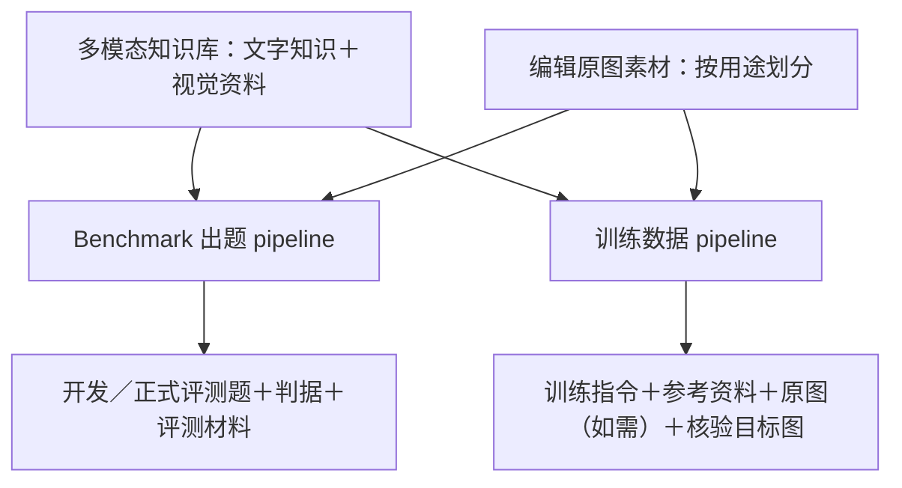

# Curation 模块：知识核心集设计约定

版本：v1.31，2026-09-18。适用模块：`curation/`。依据：用户在本任务中确认的研究方向。本文约束知识策展及其可用性验证，不是现有实现已满足全部要求的声明。

**最新工作范围（2026-09-18）**：用户暂停知识 prompt 的持续优化，确认“多模态知识库 → benchmark 出题与训练数据两条并行 pipeline”，本窗口仅核对既有代码／prompt、整理材料与交接上下文，换窗口后继续。最新决定见第86节，代码入口、真实数据契约、未实施修改及继续顺序见 `curation/KNOWLEDGE_PIPELINE_HANDOFF.md` 顶部。下方各历史批次的“继续运行”及预算不能自动恢复本轮模型实验。V4出题原则继续以第20节及第86节为准。

**本轮研究执行授权（2026-09-10，最新用户指令）**：持续工作至形成有初步验证的出题方法结论，助手可设计和审核小批题目、调用子代理、从数据集中抽样、使用本地 vLLM/BAGEL 并在结束后恢复图片标注。用户另行明确授权小批调用 modelhub 的 OpenRouter 模型及 Gemini（Nano Banana 2）；此授权覆盖下文此前未授权付费接口的限制，仅限本轮必要的小批验证，记录请求数、实际模型与费用，不自动扩为全量调用。首轮计划最多 24 个 Gemini 请求，无自动付费重试；若需调整小批规模先说明实验依据。原始题库、图片和人工标签仍只读。

本轮后续小批安排：首轮实际 18 次 Gemini 请求。因大多数候选未通过显式目标可绘制检查，转向 4 道粗粒度颜色知识题；为保持每题 3 次重复，另安排最多 12 次 Gemini 请求（累计 30），已向用户说明实验依据，仍在用户授权的小批验证范围。该安排不构成自动扩量授权。

**后续提高知识难度实验（用户最新要求）**：继续寻找 Gemini 原题也存在缺口、可靠知识支持后两模型均能完成的题族。先检查标准版本／实验体系限定的知识，保持画面简单；比较两模型相同原题和相同知识编译描述。首批4题、每条件2次，新增16个Gemini请求；有正信号后预计8个请求复验，所有请求和失败保留，不据此挑选正式测试集。助手继续负责审核，可使用已授权的本地GPU让位与恢复流程。知识编译器如果漏表达关键后果，应在出图前修正并保存旧输出，不能把选中来源编号当作正确利用知识。

## 0. 模块职责与交付边界

当前任务是在建设 **curation 模块**。核心交付是经过策展的知识单元及其来源、适用条件、视觉蕴含、关联图片材料和审核状态，供下游出题复用。

- **curation 负责**：来源消歧与核验、知识提取和筛选、视觉蕴含检查、图片关联与缺口识别、人工与助手复核、候选版本及核心集导出。
- **curation 内的试题草案**：仅用于检查知识是否能在明确前提下产生可观察约束，作为策展校准工具。不得把“完成正式题库或生成评测”替代当前模块交付，也不要求每条核心知识独自满足正式题的难度。
- **benchmark/t2i 与 benchmark/edit 负责**：消费策展材料，组织正式题目的前提、场景、知识组合、难度，以及生成与评测。本文涉及这些内容时是在说明下游需求和交接边界，不取代下游模块自己的设计约定。
- **交付至少说明**：概念及知识内容、来源、适用条件、视觉蕴含及依据、材料支持范围与缺口、原始/修订版本、人工/助手审核身份和状态。暂时无法验证的项明确标为待处理，不伪造完整性。

本轮优先验证“哪些知识值得保留、有什么材料依据、人工怎么确认”。只有为解决具体策展疑问而需要试题或试生成时，才开展小批验证，不以凑题量作为进度。

## 1. 研究目标

建立一个小规模、来源可靠、可复用的知识核心集，供下游设计能考查**概念及相关世界知识如何在给定前提下蕴含视觉结果**的文生图与图像编辑题。

核心问题是：**模型需要调用哪条知识，才能画出题面没有直接描述、但在给定情境下应当成立的内容？**

不能把“能画出来”“能写出判据”“没有逐字告诉答案”单独作为知识考查价值的证明。一般空间排列、照抄文字、指定位置增删对象可以是任务的一部分，但不能自动算成概念知识推理。

知识可以属于概念本身，也可以是概念与环境、其他对象之间的关系或适用于该概念的规律；不要求每条知识都是某个概念独有的。

## 2. 两层资产，分别评价

| 层次 | 内容 | 评价重点 |
| --- | --- | --- |
| 知识核心集 | 概念、可独立核验的知识、适用条件、来源、视觉后果及相应材料 | 事实可靠、条件准确、视觉后果有依据、具有可复用价值 |
| 评测题 | 从核心知识出发，组织前提、场景、组合、推理与视觉判据 | 知识依赖明确、判据不误伤合法画法、难度与研究目标相符 |

单条知识可以简单；复杂度在题目层构建。但“知识是真的”不能直接等同于“适合核心集”，更不能等同于“当前题目有效”。缺材料或缺题目设计时可以保留候选，不能为了收录硬凑题。

六类知识内容：特征与结构、属性与状态、关系与组织、过程与变化、功能与机制、规则与约定。它们回答“知识描述什么”。29 个知识领域回答“知识属于哪个主题或学科”。两者独立组织覆盖面，不保证条目的重要性、题目质量或难度。初轮不为凑齐分类而降低质量；材料缺口也不能自动解释为领域没有知识。

## 3. 候选知识必须经过的检查

1. **来源与身份**：来源确实讨论当前概念；引文存在只是必要条件，还要核对原文是否支持完整陈述。清洗页、模型摘要、旧图片评分不是事实认证。
2. **条件与量词**：保留通常、许多、部分、阶段、地域、版本等限制。不要把统计倾向改成每个实例必须成立的规则。
3. **视觉后果**：指出知识会约束画面的哪个具体部分。后果也需要依据，不允许在“画面设想”中暗自补入未核实的知识。
4. **概念知识依赖**：明确需要调用的事实，避免仅说“需要空间理解”“有混淆点”。通用绘图或装配能力占主导的候选应降低本轮优先级，而非伪装成知识推理。
5. **可复用价值**：说明它有望支持哪类情境或任务，而不是只为当前一张图定制。暂时没有适合图片，不等于知识错误；只有图像外观相符，也不等于知识已获证明。

图片可以展示结构、状态或机制示意，但普通外观照片不能证明化学成分、精确物理量、不可见内部结构或因果机制。已知生成图与来源未核实图应注明身份，不能充当独立事实依据。

## 4. 前提与推理：沿用原 T2I 设计

原有设计见 [T2I 出题 prompt](../benchmark/t2i/prompts/synthesize_prompt_gen_v6.0.md)。沿用其原则：**前提是题面在概念名之外锁定的条件；前提可以解锁推导，也会把推导的前段吸收为已知。**

必须区分：

- 知识适用条件：事实在哪个范围内成立。
- 题目前提：本题选择哪个情境，让知识产生可检验的约束。
- 剩余知识推理：扣除题面已给定内容后，模型仍需调用什么新事实。
- 视觉结论：这些事实最终约束画面什么内容。

每道候选题都要能写清：

> 题面已知 → 需要调用的知识及来源 → 尚未明说的视觉结果。

推理中的每条事实都要独立成立；同一事实换词复述、把阶段词拆成数步，不算多跳。不得通过模糊必要条件制造难度，例如把确定阶段随意改成“放置一段时间”，却仍要求唯一变化结果。

**概念或条件替换检查**：改变概念、阶段或环境时，预期视觉结果是否相应变化？能否说明变化由哪条知识决定？这是识别通用操作题的诊断手段，不是要求知识只能适用于一个概念的硬门槛。

## 5. 难度与组合

基础诊断题用来验证单个知识蕴含及判据；正式评测题再引入自然发生的知识联系、前提与组合。基础题可以保留，但不能被称为已经满足正式题难度。

提高难度时必须说明新增的是：

- 新的独立知识与推理；
- 跨对象或跨条件的一致性约束；
- 或仅是数量、布局、保留对象等执行负担。

三者不能混算。添加背景、更多对象、镜像或复杂保留要求，不自动提升概念知识深度。组合须自然、知识链条有依据，不能为多跳或跨域计数硬凑。

## 6. 出题与审核的最小交付

给用户审核时必须同时提供：

| 必需内容 | 要回答的问题 |
| --- | --- |
| 概念与知识依据 | 具体依赖哪条事实？原文及条件是什么？ |
| 给生成模型的题面 | 模型实际会收到什么？编辑题还必须展示原图及目标位置。 |
| 前提与剩余推理 | 已告诉模型什么？还需要它自己知道什么？ |
| 逐项视觉判据 | 能从哪个部位观察？如何区分符合与冲突？ |
| 合理变化与例外 | 哪些不同画法仍合法，不能按单张参考图误判？ |
| 失败边界 | 哪种结果是知识表现冲突、指令失败或无法观察？ |
| 当前状态 | 已核实什么、缺什么、是否生成过、是否经人工认可？ |

不得再让用户只看孤立的知识句子，同时批准事实、考点价值和题目质量。界面应分别呈现这三个判断；在实现完成前，旧的单一 accept/reject 不可被追认成三个维度都经过审核。

逐条判据记录“符合／明确冲突／无法观察”，并注明画面依据；指令执行单独记录。清楚画错与遮挡看不见不能混淆。单幅输出不能直接证明模型内部是否掌握知识。

## 7. 已确认的校准案例

| 案例 | 处理原则 |
| --- | --- |
| 伏特加背景知识 | 没画出原料或蒸馏装置，不代表普通伏特加图片错误。知识和情境需先对应；不能因存在例外就自动否定全部出题潜力。 |
| 指定添加 Adobe/Google 等文字的字体编辑题 | 答案已逐字给出，主要是文字与指令执行，不作为当前知识考查代表。 |
| 贯穿、夹紧、两板均已指定的螺栓题 | 不是完全没有结构知识，但现有两题主要验证基础装配表达，知识蕴含不足以担当本轮主试题；暂缓生成。 |
| 指定自溶阶段的鸡腿菇题 | 保留为基础诊断候选。自溶已作为前提，不能再计作推理；剩余考查具体阶段表现。不能未经试验声称难度已足够。 |
| 地区字体字形差异 | 必须固定经验证的字符、版本及地区。不能从“可能不同”推出任意字符都必须不同。 |

这些例子用来校准选择标准，不构成对原始知识记录的自动改写。新的事实、前提或判据改变后应生成新版本，不能使旧人工标签自动生效。

## 8. 人工、助手与数据边界

- 人工记录保留原作者与原意；助手复核、模型建议单独标识，绝不冒充人工标签或自动进入金标准。
- 用户当前只有一人。优先让助手核对材料、准备少量完整案例，再让用户判断具体方案与争议，避免把探索成本变成大量重复手工打标。
- 此前用“缺前提和判据”作出的 reject，不能解释成事实已被证伪；“ok”“有混淆点”也不能推定事实和出题判据均已核验。
- 核心集入选必须有可追溯的审核依据。AI 复核不能替代必需的人工通过；不因模型输出通过格式校验就称它为可信知识。
- 原始图片、原始模型输出和人工记录不因方案修订而被静默覆盖。变更知识时重新核验关联材料；保留批次、版本和对应关系。
- 现阶段沿用用户已授权的本地 Qwen 接口；4001 为付费端口，未经明确确认不得使用。文生图/编辑模型选择及费用另行明确，不能把文本模型授权当作付费生成授权。

## 9. 当前阶段与下一步

当前实现仍有缺口：提取结果偏百科陈述；知识依赖筛选不足；旧审核入口混合多个判断；三道试验题尚不能代表目标评测能力。本文记录的是修正方向，不能以文档存在代替实现与验证。

接下来按以下顺序推进：

**2026-09-10 后续确认**：用户已确认先从两套已有 benchmark200 的模型输出开展 RAG 开发诊断，当前优先级按第 12 节执行。下列知识卡流程仍适用，卡片选材进一步与实际失败及训练需求衔接。

1. 暂缓现有三题的生成，暂缓让用户继续按旧标准批量审核。
2. 从已有候选重新筛选少量知识蕴含明确、来源充分的知识单元，不为凑数量坚持螺栓题。
3. 为候选补齐条件→知识→视觉结果的依据链，形成可审核的知识卡。必要时用基础诊断题或自然组合草案检查边界；试题仅服务策展，不为每条强制凑题。
4. 用户先审阅少量完整知识卡，校准事实依据、策展价值、图片支持三个判断。若仍有需要通过生成解决的具体疑问，再审阅题意并按预算授权小批试生成，保留全部结果。
5. 在看结果前固定题面与判据；如需修订则记新版本。验证合理画法不被误伤、错误能够定位后，再决定入集和扩量。

## 10. 后续工作如何遵循本文

开始 curation 模块的提取、筛选、审核界面及用于策展校准的试题或试跑修改前，先读本文。交付时说明依赖哪条知识、哪些条件已在题面、还剩什么推理、尚未解决什么。

常规实现和已授权范围内的修正可直接推进。若要改变研究目标、降低知识依赖要求、把执行负担当知识难度、取消人工与助手的区分，或绕过来源/例外检查，必须先把具体变化及影响向用户讲清楚并确认，不能默默改变标准。

用户后续明确指令优先于本文。方向发生变化时同步更新本文，避免另起互相矛盾的设计说明。数据存储、代码布局等仓库规则仍由根目录 AGENTS.md 管理。

## 11. 图片材料预标注（2026-09-10，用户授权全量）

入口：`curation/image_preannotate.py`。这是与知识审核并行的机器材料索引，不代替知识核心集或人工标签。

- 第一阶段不提供概念名、旧 caption 或旧分数，只生成可见内容描述、表现形式、视角/展示标签、主要可读文字、可观察性问题及不确定项。按图片 SHA 去重。
- 第二阶段看图核对清单关联概念，逐对记录 consistent / suspected_mismatch / uncertain 和依据；这是机器匹配建议，不映射到旧 identity 布尔标签。多义概念和细粒度身份不确定时保留未知。
- 当前输入为 `datasets/demiwtg/meta/images.jsonl` 的冻结快照，仅处理清单关联图片；后续新增清单数据需另建快照。`blobs/` 里的未关联文件不被默认为本轮范围。
- 结果、原始响应、失败原因、重试次数和协议版本独立存于 `state/curation/image_preannotation_v1/`；不覆盖 images.jsonl、旧评分或人工审核文件。目录名沿用任务批次名，具体 prompt/schema 版本以其中 protocol.json 为准。
- 使用本地 8000 的 qwen3.8-27b。图像按 EXIF 方向处理、最长边缩至 1536，透明背景合成白色，动态文件只看第一帧；输入缩放和非穷尽 OCR 限制须随结果说明。
- 200 张小批完成后已授权继续全量。首版小批与修订版隔离；只在协议一致时复用结果。模型预标注仍可能误读小字、过度推断姿态或误分视角，不能直接用作精确事实与 OCR 金标准。
- 队列去重后按图处理；描述和概念匹配独立提交。缺文件和损坏文件单列；失败不算成功。持续接口/输出错误触发停止派发，避免盲目重试。原始响应保留供排查。

从仓库根目录用含 Pillow/httpx 的 Python 环境执行（本机 `../env/bin/python`）：

```bash
../env/bin/python -m curation.image_preannotate status
../env/bin/python -m curation.image_preannotate run --concurrency 12
../env/bin/python -m curation.image_preannotate export --output state/curation/image_preannotation_v1/annotations.jsonl
```

`run` 默认处理全部剩余任务，支持断点续跑。创建批次目录下的 `STOP` 文件即可停止派发，已在途请求完成后退出；移除 STOP 后再运行可继续。单写入进程锁避免重复启动。`status` 与进度文件可查看完成、待处理、失败和缺图数量。导出结果是机器建议，不能因导出就转为人工通过。

### 长期运行与模型选择（2026-09-10）

用户授权助手选择本地模型并启动全量、配置失败恢复。本轮继续使用已完成 200 张试跑的 Qwen3.8-27B：三个候选权重尚未完整，未完成横向实测，因此该选择是当前可用性和已有验证的决策，不是质量排行榜结论。之后的模型对比必须另建批次，不能让当前协议混入其他模型输出。

守护入口为 `curation/run_image_pipeline.sh`，内部运行 `curation/image_supervisor.py`。启动器和守护器分别持锁；守护器接管精确匹配的当前本地模型服务和本批次标注进程。服务退出后按原模型路径重启，接口就绪且模型名称一致后重启标注；异常重启退避最多 30 分钟。服务持续 20 分钟无法访问、标注持续 30 分钟无进展时先终止，宽限后强制退出，再恢复。正常结束不反复重启。单图最多 3 次尝试，缺图、坏图和耗尽重试的错误独立保留，队列处理完不等于所有图片标注成功。

`state/curation/image_preannotation_v1/supervisor.json` 是守护状态；`progress.json` 是任务进度；`supervisor.log`、`worker.log`、`server.log` 分别供故障排查。创建批次下 `STOP` 可停派发并让守护退出，服务保留。移除 STOP 后用 `bash curation/run_image_pipeline.sh` 重启，后台启动应将日志重定向并脱离终端。本方案支持进程崩溃恢复，不保证整机重启后自启动。4001 仍禁止调用；原始图片、权威清单、人工标签保持只读。

## 12. 与 ImageRAG 模型研究衔接（2026-09-10，用户确认）

用户的最终目标是建设知识依赖明确的 benchmark，并研究以知识为输入、微调 BAGEL 的 ImageRAG 类模型；统一编码器架构是拟研究方向，期待明显提升并缩小与闭源强模型的差距。本文不把该目标写成已经验证的架构优势或性能承诺。

- 知识库、训练集和评测集分别承担可靠供给、训练知识利用、检验独立泛化的职责。知识核心集是研究材料基础，策展价值应结合模型失败分析和对照实验，不要求用户凭直觉预测训练收益。
- 必须区分：任务依赖知识、模型缺乏该知识、模型能把输入知识落实为画面。文字计划包含正确答案而输出画错，是需要检查知识到视觉转化的证据，不能自动判为检索缺失；文字计划本身也不证明知识完整掌握。
- 保留已有两套 benchmark200、生成结果与评分。选取少量成功、失败和争议案例，核对原题、原图、输出与评分理由；定向样本不得报告成全题库知识依赖率。新增知识专项判断属于事后开发分析，不改写原始评分。
- 开发诊断比较原题、人工核验的文字知识、可靠图像知识（材料和接口满足时）及显式视觉目标；原题在同配置下重跑，随机种子成对、保留全部输出。人工选材的 oracle 条件不等于实际检索；措辞、长度、重复强调、编辑规划长度等混杂因素需明确。
- 图像参考必须有与知识相对应的支持范围。不得把闭源模型的本题输出、目标答案图或近重复图作为检索成功的证据。源图编辑接口不能未经核验就视为参考图知识接口；图像材料不足时单列缺口。
- 可观察知识结果、目标/左右绑定、其他指令执行、图像质量分别记录。符合、明确冲突、无法观察分开；实际材料成分、性能或内部因果不能仅凭外观认证。正式评测可报告知识项、可观察完成率和联合成功率，不能靠通用均分掩盖关键失败。
- 已用于选模型、调方法和反复分析的题作为开发数据。未来独立测试集按概念、来源及近重复关系隔离，冻结前约定准入标准，不能按本方法是否提升来选择测试题。区分已见概念的新情境与未见概念；外部知识访问条件必须与闭源对照明确对齐。
- 本轮入口 `curation/rag_diagnostic.py` 与 `curation/rag_diagnostic.ipynb`，运行数据在 `state/curation/rag_diagnostic_v1/`。这是服务策展的小批开发诊断，不是新正式题库，也不构成人工核心集准入。模型试跑不自动授权付费调用或中断其他无关运行任务。

### 审核委托与差距归因（2026-09-10，用户进一步确认）

用户将当前逐图审阅、案例筛选与开发判断委托助手，不再要求用户逐张查看才能继续实验。助手应完成来源核验、图像检查和争议记录，报告有证据的结论；记录仍明确标为助手审核，不能改称人工标签。此委托允许开发策展和诊断继续推进，不将既有候选自动转为人工通过的核心知识。

理想研究目标是使 BAGEL 与闭源强模型的差距主要来自本方案针对的知识获取及知识利用能力，包括长尾知识；加入方案后缩小乃至消除该差距。这是待验证的研究假设，不能事先宣称差距只有知识因素。

- 开发阶段优先寻找：基础绘制与编辑执行可完成，隐含知识条件下出现稳定差距，补入核验知识或参考图后关键视觉结果改善的案例。显式视觉目标对照用于定位绘制瓶颈，不作为正式知识题。
- 补充正确知识、无关但长度相近的材料、无材料等对照，检验收益是否来自相关知识；图像参考需跨场景复用，避免用答案图或近重复图把任务变成复制。
- 分别比较 BAGEL、BAGEL 加知识、微调 BAGEL 不加知识及微调 BAGEL 加知识，区分训练收益和检索收益。闭源模型原题成绩用于衡量最终差距；在接口允许时增加相同证据条件的闭源对照，以区分额外信息与模型利用能力。
- 开发案例允许按诊断价值选择；正式独立测试集依据预先冻结的知识依赖、来源可靠性和可观察性标准构造，不能只保留本方案有效或闭源模型失败的题。长尾程度需有可说明的依据，不能仅从 BAGEL 失败推定。

### GPU 使用优先级（同日用户补充授权，执行约定）

图片预标注的目的，是在人工讨论与核验期间利用空闲 GPU 提前整理材料；它不是不可中断的优先任务。用户明确授权：当前研究实验需要 GPU 时，助手可以自行暂停该预标注及其 Qwen 服务，用完后恢复后台利用，无需再次询问同一资源切换。保留已有标注、断点与模型协议，不能把“取消运行”解释为删除结果或切换标注模型。

本次通过 `curation/rag_diagnostic_session.py` 等待在途标注落盘、退出原服务，再在两张卡上各运行一份 BAGEL 分片；条件、题面及配对随机种子不因并行而改变。生成完成或失败后恢复原 Qwen 启动参数、守护与标注断点；状态在诊断批次 `session.json`。此授权仅适用于该后台预标注的让位和恢复，不扩展到付费接口或其他用户任务。

## 13. 知识型出题的开发方法（本轮实测后的约定）

**先验证知识是否能成为可绘制的视觉约束，再增加题目复杂度。** 开发阶段寻找的不是“BAGEL 得分低的题”，而是“题面未给出答案、来源能推出明确视觉结果、该结果可画、不同知识条件能被区分”的题族。简单知识属性可以作为诊断层；不能因此宣称已经覆盖长尾知识、多跳推理、图像编辑或正式 benchmark 难度。

### 构造与诊断顺序

1. 先写来源支持的条件—知识—可见后果，注明量词和合法变化。选择能在正常视角、照明下观察的关键属性；不凭普通外观认证成分、身份来源或机制。
2. 构造两个尽量相同的场景，只替换概念、阶段或适用条件，使正确视觉结果应随知识改变。题面只给身份与必要条件，不直接写目标颜色、结构或文字答案。两题可以共享同一份多条件资料，检验选择和绑定。
3. 在观察生成结果前冻结题面、来源、判据、例外与种子。分别记录知识符合／冲突／无法观察、目标存在及构图执行；报告两条件同时正确，避免默认画法偶然命中其中一道。
4. 先比较原题与显式视觉目标。后者用于检查当前生成器能否画出知识要求；连显式目标也失败的题保留为绘制瓶颈样本，不宣称仅补检索即可解决。检查合理推理配置，不能把单一非默认设置当整个模型能力。
5. 再比较正确资料、无资料或同长度场景扩写，以及知识到视觉描述的转换。直接拼接资料与经过编译的 caption 是不同方法。自动编译必须保存原始请求、返回和最终绘图输入；人工修改另记版本。空资料编译器允许调用自身知识，是改写／规划对照。
6. 正信号用新情境、新种子和改变资料顺序复验。故意错配的材料可用于测试输出是否受输入知识控制，但必须独立标为负控制，不能进入可信知识库；跟随错误材料不能计作事实正确。

当前开发实例包括：APA 标准代表 Araucana／Marans 蛋壳颜色，干净 LiCl／NaCl 焰色，典型完整干燥袋熊粪便的块状外形；完整腰果外接结构、海鹦季节外观等也保留失败和不确定结果。具体题面、原文支持范围与全部图片由实验 notebook 和对应 run 消费，不以本段概述代替逐题证据。两种蛋属于一个知识家族，两种盐属于另一个，不能计作四种独立能力。

### 训练与正式评测的边界

- 开发题允许按诊断价值选择；正式测试先冻结知识范围、来源质量、条件完整性、可观察性和执行负担标准，再按范围采样。不能观察本方案是否提升或闭源模型是否失败后决定纳入。若设置“可绘制知识”子集，公开预定的筛选模型、配置、判据及筛除记录，并另报完整范围结果。
- 已经用于调提示、选配置、设计编译器的所有本轮题目均为开发数据；新背景和新随机种子仍属于已见概念的新情境。训练／测试按概念或规则家族、来源及图片近重复分组；只换措辞不能当知识泛化。
- 训练样本应保留原始隐含知识题、适用材料、证据选择与视觉约束、目标图的对应关系；需检查图是否真的实现约束。不能只把答案 caption 当训练输入，否则主要训练到显式指令执行。测试原题、目标图、答案 caption 和近重复目标图不进入训练或检索库。推理时允许从预先约定知识库获得未训练概念的真实资料，与泄漏本题答案区分。
- 以 BAGEL、BAGEL＋资料、规划／编译器＋BAGEL、微调 BAGEL 无资料、微调 BAGEL 有资料作为分开的对照；后两项需要实际训练才能报告。闭源原题与同资料条件另列。文字编译已能解决的题仍有诊断价值，但不能单独证明统一编码器或图像 RAG 的必要性；后续应检验有明确图片支持范围、文字难以充分表达的视觉知识。
- 报告知识项、可观察率、联合任务成功及画面质量；少量种子和助手匿名审图只提供开发证据，不宣称统计上追平闭源 SOTA。知识是否长尾另需依据，不能从 BAGEL 失败推定。

### 本轮支持范围与查看入口

完整入口：[知识型出题验证 notebook](knowledge_color_probe.ipynb)。运行数据分别位于 `state/curation/knowledge_probe_v1`、`bagel_parameter_probe_v1`、`knowledge_color_probe_v1`、`knowledge_compiler_probe_v1`，全部失败、原始输出和助手审核保留。

颜色两题族首次检查中，每题 3 个种子，原题和直接资料拼接均未取得题对同时符合；显式视觉 caption 两族均 3/3。新情境复验使用固定 Qwen 编译器和每题 2 个新种子：BAGEL 原题知识符合 1/8，空资料编译 1/8，正确资料编译 7/8，错配资料 0/8；这些组的知识＋构图联合结果相同。正确资料有一张红橙边界分歧，保守主评分不计符合；另一位助手认为符合，敏感性结果为 8/8。不能隐藏该分歧或将其当稳定总体准确率。

该结果支持继续沿“明确的知识条件对＋可绘制检查＋资料转换”构造开发题。它仅验证 oracle 文字资料经 Qwen 编译后改善未微调 BAGEL；没有真实检索、图像知识或训练。空资料编译未主动补颜色，尚不是经过优化的最强无检索规划基线。错配资料使 7/8 输出呈现互换颜色，另外 1 张含混，既是输入影响证据，也说明错误资料会被传播。

本轮共生成 182 个 BAGEL 输出和 30 个 Gemini 输出；付费模型为 `openrouter/google/gemini-3.1-flash-image`，接口回报合计约 $2.02，无自动付费重试。新情境复验没有新增闭源调用；首批颜色 Gemini 原题知识 11/12，与 BAGEL 显式 caption 的 12/12 不同信息条件，不能用于宣称超过闭源 SOTA。本次研究的结论与方法已经形成，后续正式测试和模型训练属于新的实验阶段。


## 14. 专用规则与条件特异性：提高知识难度的小批验证

本轮额外完成 24 个 BAGEL 输出、28 个 Gemini 输出（首轮主对照16、直接资料4、新条件复验8），以及10次本地Qwen文本请求。Gemini实际模型为 `openrouter/google/gemini-3.1-flash-image`，接口回报本轮合计 $1.8841465，无自动付费重试。该数量独立于第13节上一轮的182/30。全部52张输出经过匿名助手审核；非人工金标准。入口为 [提高知识难度 notebook](knowledge_harder_probe.ipynb)，数据在 `state/curation/knowledge_harder_probe_v1/` 和 `state/curation/knowledge_harder_transfer_v1/`。

### 可复用的出题方式

选择有明确来源、版本或实验体系的专用规则，使日常默认画法不能替代查证；构造同场景的物态、组成或阶段条件对，共享多条件资料，只改变决定正确视觉属性的前提。题面给出适用体系和必要条件，不给规则表中的阈值、映射或目标颜色。把画面保持为一个可观察目标，避免用复杂布局增加执行负担。先冻结来源、全部条件和判据，再跑原题与知识条件；保留易题、失败和执行错误。新条目或新条件用于开发复验，不能冒充独立来源/规则家族测试。

本批知识输入链为：核验后的共享文字事实 → Qwen选择事实编号 → 确定性题族模板填入该事实颜色 → 保留完整原题。BAGEL和Gemini在对应组收到完全相同的最终文字。首轮NASA自由caption两次仍漏颜色，因此在任何出图前统一采用模板，旧编译输出保留；不能把本批称为自由caption编译成功。该链证明知识支持的视觉展开可行，尚未证明BAGEL原生读取资料、真实检索、图像知识、微调或统一编码器的收益。Gemini另有直接共享资料的4张小检查，与主条件分开。

### 实测结果与边界

首轮NASA GSFC-STD-8006A (2024) 气氧/液氧两题，关键颜色两模型原题均0/4、知识后均4/4；Gemini直接资料2/2。论文Cu-XO空白/半胱氨酸响应两题，BAGEL由0/4到4/4，Gemini由3/4到4/4；半胱氨酸原题Gemini已2/2，不能声称全部题都同样难。四题合计的知识＋构图成功，BAGEL知识条件3/8，Gemini6/8；额外色带、双瓶、文字等错误保留。原冻结科学来源字段有未使用Ala的陈旧描述，已在审图前以 `rubric_clarifications.json` 明确纠正；实际题目与生成从未使用Ala。ESI只核验到可读文本，不声称检查了源照片。

随后以同标准氩氧混合物18%/21%氧的新条目复验：两模型原题知识均1/4、知识条件均4/4。BAGEL联合任务由0/4到3/4，Gemini由1/4到4/4。18%条件两模型原题均0/2、知识后知识与构图均2/2；21%中BAGEL仍有一张附加文字/色条，不能宣称整题稳定追平。复验在出图前允许普通支架和端件，仍禁止附加警示标记；首轮严格禁止其他物体的原判据与原分数不变，两个版本的联合率不能直接混算。

结果支持继续用“专用规则＋相近条件对＋简单可见后果”开发题目，未证明所有模型差距只有知识，也未证明总体追平闭源SOTA。标准特异性不自动等于统计上长尾；未来扩展应覆盖独立规则家族与有图像支持的结构知识。正式测试依第13节预先冻结范围，不按本方法收益或Gemini失败筛选；训练需保留原题、资料、选择依据和经核验目标图，不能只训练答案caption。实验结束已恢复原Qwen服务和图片标注，恢复后完成数从39,927继续增加到40,013，记录由复验 `findings.json` 保存。


## 15. 从全库扩题与29域供给（2026-09-12，用户要求）

**范围澄清（同日用户纠正，见第16节）**：本节两条路线是探索期的选材入口，不是最终benchmark的范围限制；以下290题为当时的探索规模建议，新版benchmark200按第16节规划。

用户将候选范围扩展到全部现有概念、图片与docs，并要求寻找可规模化的方法，尽量均衡覆盖29个领域；允许研究额外数据来源，正在下载Wikipedia/Wikidata/Commons。此前27条试点不再限制本轮选材范围。具体方法与材料审查由 [全库供给 notebook](supply_audit.ipynb) 消费 `state/curation/supply_audit_v1/`，只读现有权威资产，不改旧人工记录。

新增并行方向为**长尾视觉概念**：名称所指物体的外形、部件和结构也是可考的知识，不强求每题多跳。概念名/子类型＋新情境应留下必须知道的形态要求；参考资料提供真实的识别结构，目标图要求迁移到另一个情境。若任务主要复刻某个指定实例，应另标实例参考生成，不把复制成功算成世界知识推理。仅模型生成失败不能证明概念长尾；需区分别名/语言、身份、形态、安装关系与执行错误。

### 供给盘点与领域纪律

2026-09-12本机清单盘点：385292概念，2899895图片清单行，304190概念有图关联；清单行不是独立有效图片数。来源docs共10023行，关联283概念；现有净版4326页关联272概念；另有52980条未核验摘要草稿。摘要可用于找候选，不能代替原文依据。正在下载但未接入的外部库不在这些数值内。

29域按权威树统计可交叉挂载，不能把分域数相加为独立总量。实际发现空心砖挂人物与人体/好人等噪声；出题应在运行批次内另记经审核的主考领域与原挂载，不修改taxonomy来凑本轮配额。一个题族只计一个主域，交叉关联另标。声音等抽象域只考有明确来源的可见后果；不可视化的核心内容记录覆盖缺口，不用任意配图强行满足29域。

### 扩量顺序

1. 两条路线并行：长尾外形/部件，以及条件/规则/状态。每域先分层筛候选并检查实体消歧，去除近重复与假概念；不能只取旧高分图片或只取已有模型失败案例。
2. 每个候选形成证据包：概念及别名、来源段落、支持范围、参考图片身份、可见部件/状态、合理变体、缺口。外形知识可从有身份依据的图像起步，不强制先有长篇百科；但单张标题错配图不够。
3. 使用无资料、文字资料、参考图、图文资料对照，另做别名/语言与显式可见目标诊断。参考图保持跨情境；干扰参考仅作为负控制，不进入可信知识库。两模型对应条件资料一致。
4. 规划每域20概念作为第一轮筛选预算（580候选，尚未据此跑完），争取每域5个独立知识单元、每单元2个自然情境（目标290题，不是已完成量）。不足域补材料，不降低准入标准。更换背景或重复种子不算新增知识单元。
5. 知识/形态正确、安装与构图、其他执行及质量分开评估。材料通过率、可绘制率、知识收益分别统计，不把检索不到和画不出混成同一种失败。
6. 开发成功用于改方法，正式测试仍须按独立概念/型号家族、来源及近重复关系划分，不能以本方案提升或Gemini失败决定准入。可检索未训练概念的真实资料，不得检索本题目标图、答案caption及近重复目标。

本轮已得到215个唯一概念供给包，其中99个有净版docs和至少两条图片关联，116个无净版docs；这是未核验样本，不是合格题数量。首两条关联图片共430个文件引用，其中292个在本地存在；不能外推为全库缺图率或图片身份正确率。

### 外部数据扩展

优先完成当前Wiki链路，保留QID、别名、页面修订、章节/段落、引用、图片图注及其章节对应、Commons文件身份与来源许可。Wikidata的限定符、引用和rank应保留，不能把丢失条件的简化关系当完整事实。只保留主图或把整个条目正文绑定所有图片会丢失出题所需的支持关系。

WIT/WikiWeb2M可补章节—图片关联，但与Wiki高度重叠，不能当作全部新增概念；优先小样本与元数据。长尾商品先查ABO元数据；文化器物、历史、工程和自然标本可补Smithsonian；生物变异再用iNaturalist，形态图版按需用BHL，3D部件按需用PartNet。下载入口、实际许可/访问边界与适配性在运行报告列明，不在此授权无边界全量下载。

海竿报警铃作为用户提出的开发案例：已找到旧edit e164及库内套装商品图。旧Gemini输出可见双铃及夹持结构，明显缺口为尺度/安装位置，不能直接断言不认识物体。该例应拆成物体形态与安装关系两个诊断；普通产品图支持外形，不自动支持安装位置或真实使用效果。

本次实际读原文并查看11张本地图，形成猪鼻龟、金银花、莜面栲栳栳、金蟾四张完整卡；前三项可进入基础诊断，金蟾因肢体不可完整观察及传统变体/来源缺口暂缓严格计分。四卡均未新增生成，不能把材料可用性当成模型难度或RAG收益，详见供给报告 `reviewed_cards.json`。


## 16. 图文知识获取与应用 benchmark200（2026-09-12，用户采纳的目标）

**已确认的研究定义**：建设图文知识获取与应用benchmark，覆盖直接知识应用及有依据的条件、关系和组合推理；执行与画质单独报告。训练数据保留原题、源资料、必要的选择/应用关系和核验过的目标图，不能全部退化成写明答案的caption。该定义是用户最初意图的恢复，不是新增目标。长尾形态和条件化知识只是材料入口，不能限制最终题型。六类知识内容和29域继续独立组织。

用户希望再做一版benchmark200。以下为助手落实该目标的**执行规格提案**；数值配比不是用户已确认的硬约束。当前待澄清的是数量口径：两轨各200（共用知识单元）、两轨合计200，或先T2I200。数量相关的最终抽样、冻结和批量调用在口径明确后进行，材料审查、schema及出题规则准备不受影响。旧两套benchmark200、原题、输出和分数不覆盖。

### 200题的分布提案

每个200题集合的主域目标为26域各7题、3域各6题；具体较少的3域在模型输出前固定，且不按资料方便程度决定。知识应用分布初始目标：直接应用60、条件选择60、关系/过程应用50、多知识组合30。此分布用于防止再次退化成纯识别或纯复杂场景，不强制每域凑齐四档。知识内容六类允许多标签，主应用层次单选；证据形态分文字主导、图像主导、图文互补并单独检查覆盖，不能因有一张无关图就算图像知识题。旧L1/L2/L3的前提数、跨域数、跳数和弱点乘积不作为本版准入门槛。

主域以实际知识语义审核；原taxonomy挂载留作出处，错误挂载不直接控制配额。合理多义/变体应锁定必要范围；资料不支持唯一像素图并不等于无效，只要求知识判据具有可核验的合法集合。不能为6/7题配额牺牲证据或可观察性。

### 每题必需材料与对象角色

1. 题目身份：qid、知识单元/概念/规则家族ID、主域、六类内容标签、应用层次、资料形态和来源批次。
2. 原题：给模型的实际原始任务；编辑题另外绑定原图及可见目标锚点。不把答案描述混入原题。
3. 源知识：原文、位置、URL/版本、图注、文件与内容哈希、可靠性、适用条件及合法变体。旧摘要和机器预标注只能提供线索。
4. 资料角色：retrieval_reference为可检索源资料，edit_source为原场景，evaluation_evidence为判分材料，training_target为训练目标；不能靠输入顺序暗示角色或把目标图放进资料库。
5. 应用依据：已知条件、必须选择/组合的事实、被约束的可见结果；只记必要关系，不要求长篇自由思维链。将显式指令与隐含知识判据分开。
6. 评分：逐题知识/应用项、源依据、可观察部位、容许变化及不可观察条件；编辑目标与保持项另记，质量另记。
7. 数据隔离：开发/训练/正式测试按概念、型号家族、规则及来源近重复分组。参考材料可提供未训练知识，但不得包含本题答案caption、目标图或近重复目标。评测无需唯一标准答案图，核验材料与可接受结果范围才是判分依据。
8. 审核：材料核验、题面核验、资料充分性、泄漏检查、图像可判性分别记录；助手受托审核不改名成人工金标准。

### 实施阶段与交付闸门

A. **规格与协议**：固定数量口径和材料契约；新批次与旧benchmark隔离；明确原始任务、资料条件和判据的关系。当前本机供给结果可复用，远程43.160.250.196对应COS中的持续Wiki下载不是开工依赖；后续按缺口接入，不能称本机统计覆盖远程全部资产。

B. **材料池**：每域先筛约20个概念，得到约580个候选预算，先查证据和概念身份，再设计题；补的是具体资料缺口，不是无限扩概念。先呈现每域一个完整案例或明确缺口，判断该域的合适题型。已研究的报警铃、NASA规则和四张库内卡属于开发材料，不能直接转成未见正式测试。

C. **开发校准**：从与正式测试分开的材料中先挑12个开发案例，覆盖四类应用层次与三类证据形态，数量自然不足时显式记录。冻结该批题面和判据后做无资料、文字、图像、图文对照；两模型同资料，原始记录全保留。必要时增加显式视觉目标定位理解/转换与绘制瓶颈。该批用于检查出题和判分方法，不按某题是否RAG提升确定正式准入。正式测试不做“试生成后只留可提升题”的筛法。

D. **正式题编制**：用校准后的规则从独立材料池组织200题（或经用户选择的双轨集合），助手逐题核验来源、条件、判据和编辑原图。推理复杂度逐步增加但不堆无关执行义务。因事实错误或不可判而修订须保留版本；冻结后发现无效题公开记录原因，不按模型输赢替换。

E. **运行与报告**：先冻结原题、参考资料库、检索预算、oracle资料及评分协议，再开始正式评测。核心比较为BAGEL/Gemini各自无资料与相同核验资料；实际检索单列并保存检索结果、关联正确率及支持覆盖，不能将手选资料称真实检索。文字/图像/图文消融至少在预先分层的子集执行，成本预算按题数×模型×条件×重复数计算，重复次数和子集在出结果前固定。图库参考接口需区分原图与多张参考图；现有单图编辑runner不能直接宣称完成此支持。

评分同时报告知识/应用通过、可观察率、执行/编辑保持、质量、知识与执行联合通过；按主域/应用层次/资料形态分层，不让大类或通用美感均分掩盖知识结果。判官接收独立核验的评分证据，不能只依赖判官自己的长尾知识。检索到正确资料而生成失败、资料未召回与原题已成功分别统计；这些是行为诊断，不是对模型内部原因的确定证明。

F. **训练数据**：在正式测试的隔离家族之外构造原题、源资料、应用关系、核验目标图的训练记录；困难目标图可以通过多种来源准备，但生成图不充当事实依据。不因已有闭源输出就直接作为合格目标。模型阶段分别比较未微调/微调与无资料/有资料，防止把训练和检索增益混为一谈。

### 历史流程需修改的具体部位

- `benchmark/t2i/eval_synthesize.py` 当前v6自述输入为概念名与路径、知识由出题模型供给；新版需加入证据包及源ID校验，不能仅替换prompt而仍运行旧跳数门槛。
- `benchmark/t2i/prompts/synthesize_prompt_gen_v6.0.md` 与编辑v6.1的严谨前提/像素核验原则可复用；新协议应允许来源可靠、范围明确的需查证知识，去掉强制复杂度配额，保留不可出题原因。
- 新版评分需加入逐题核验资料与知识/应用判据，同时保留现有通用执行/质量维度。旧判官仅凭世界知识推断隐含要求的方式不足以评长尾专项。
- 新批次运行器需绑定多图角色、顺序、哈希、资料与问题版本；保留实际模型输入/输出/失败。先在开发集验证接口，再扩量。

本节落盘的是目标与具体执行规格，**不代表580候选、12开发验证或200正式题已经完成**；当前没有因此启动新的全量生成或付费调用。

## 17. 第3版20题开发校准（2026-09-13，用户交接与补充）

> **最新执行口径见第19节。** 本节的出题经验继续适用；评分重建、以K＋执行联合通过作为主成绩等早期提案已被用户后续决定替代。新版保留旧评分协议，知识诊断独立附加。

本次用户明确数量为20题，独立保存于 `state/curation/knowledge_application_v1/version3_20/`，不覆盖旧12题与 `expansion20_v1`。继续覆盖直接、条件、关系／过程与组合知识；这是开发校准，不启动全量100题或自动形成正式测试。研究目标仍是改善BAGEL的图文知识获取与应用，尚未证明差距只来自知识。

- **取消优先复用现成编辑原图的约束**：先确定知识考点，再准备主体突出、目标区域大、一次核心改变的简单原图；合成图只作为场景，不充当事实。知识复杂性与画面／编辑执行复杂性独立记录。
- **参考图逐张绑定知识支持**：明确判据、区域、支持限制与文字互补。只属于同概念而不支持考点的图片不输入。材料必须跨场景／条件使用，不提供本题目标图或近重复答案图。
- 有实质图片证据的题比较无资料／文字／图片／图文；适量纯文字规则和物理题不强塞图片。预先选择小子集增加显式正确视觉要求，诊断资料选择／转换与绘制瓶颈；该行为差异不能断言模型内部原因。使用实际模型名称、请求数、费用与失败记录，不付费自动重试。
- **用户明确要求最终细项打分**：每张输出下展示判据全文、通过／冲突／不可观察及具体理由；知识、每条执行／保持项、画质分开。通过计数不把不可观察等同知识错误。完整知识通过、知识＋执行联合通过分别报告，不用局部知识项替代身份与整题要求。
- 本批画质细分清晰度／可读性、伪影控制、视觉连贯性三个1–5分项，各附理由；按照片／示意图对应表现形式评价。它们不与知识项混成一个总分。评分由助手受托完成，不称人工金标准。
- 交付仅完整case notebook：首行突出taxonomy path和概念，保留独立分类维度；展示中英文题面、原图、完整中文知识译文及实际英文输入、全部参考图、来源位置／短引／URL／版本、应用关系、判据例外缺口、所有输出和细项分数、完整实际prompt与图像角色顺序路径及请求记录。不再展示重复的旧“知识挖掘分类”。
- 开发结果与修订原因全部保留；正式测试不得按BAGEL提升或Gemini失败筛选。训练保留原题＋资料＋必要选择／应用关系＋核验目标，按概念／规则家族、来源与近重复隔离。

本节记录本批已确认的设计与评分要求，**不表示本批已生成、已评分或方法已达到研究预期**；实际完成状态以该批冻结记录与case notebook为准。

## 18. 评分整合与出题经验（2026-09-13，旧12题／新增20题复盘）

> **最新执行口径见第19节。** 本节的出题经验继续适用；评分重建、以K＋执行联合通过作为主成绩等早期提案已被用户后续决定替代。新版保留旧评分协议，知识诊断独立附加。

用户要求结合bench200与知识case的评分，区分知识相关错误、非知识执行问题和题目自身问题，并沉淀经验供后续会话使用。本节为研究边界与评分设计要求，不是已实现的新评分器；完整schema、逐项落档和聚合仍须物化核验。不追改旧批冻结题目、请求、结果或分数；第17节及其他正在工作的批次若已冻结，采用独立版本补充审核，不静默更换口径。

### 评分应如何整合

保留bench200的完整任务验收，接入来源明确的知识判据。T2I参考 `benchmark/t2i/prompts/judge_prompt_gen_v6.0_V2.md` 的对齐十轴、质量与美感；编辑参考 `benchmark/edit/prompts/judge_prompt_edit_qib_v2.2.md` 的分型任务完成、保持及视觉／物理评价。历史轮次以保存的实际判官prompt为准。T2I的2档与编辑2档定义并不完全相同，不能仅因同为0/1/2就合并；编辑旧official还有后两维不高于第一维的钳制，必须保留原始独立维度供诊断，不把钳后分误称独立质量。当前case的1–5画质不线性换算为QIB。

- 每条要求注明全文、绑定对象／区域、适用条件、来源、容许变化，以及属于知识应用、显式执行还是编辑保持；另映射bench200对应维度。同一可见缺陷可以有多种诊断标签，但不能在新总分中重复累加扣分。保持项允许必要连带变化、非关键轻微差异，不把“看起来重绘”或非像素一致直接当失败。
- 概念／子类型身份必须纳入完整验收，不能只有颜色、花纹等局部K项。旧马来貘出现条斑符合但动物像牛犊的情况，说明局部K全部通过不等于知识完整正确。
- 知识判据通过、任务完成／保持、画质分别保留原始判断，再报告知识专项通过及知识＋执行联合通过；质量／美感是否设门槛须另行明确，不默认藏进布尔总分。
- 判官使用独立核验的评分证据与合法范围；有无资料组采用相同标准，不能把本次检索内容或生成模型得到的资料当作唯一答案。来源支持增强不能破坏旧评分的可见证据、合法变体和避免重复扣分原则。

### 不可观察不能混成一种失败

`unobservable`只描述知识项未能从输出验证，不能单独决定题目有效性、任务成功或模型内部原因。逐项追加原因和证据，区分：

1. **模型未展示必需考点**：题目有效且明确要求该部位清晰可见，输出遮挡、裁切、模糊或过小。知识项未验证；展示／执行要求按具体证据判未完成，完整任务不能通过，不能从有效题分母删除。没有可见反证时，不凭遮挡推断隐藏结构知识错误。
2. **题目没有保证可观察**：合法视角、既有遮挡、原图尺度或保持要求允许核心考点看不清。属于题目设计缺口，不能要求模型猜测未写明的展示义务。核心无法评价时成对复审题目，不只剔除某模型失败结果；保留无效原因和修订版本，不按输赢筛题。
3. **审核证据不足**：预览缩小、判官无法分辨或证据不充分。先复看原生分辨率／对应局部，再独立复核；仍不能判断则保留未知／待审，不能猜测通过或冲突，也不能自动认定题目无效。
4. **不适用**另列：题面允许某对象不出现，相关条件并未触发，不应混记为“应展示但看不清”。正式核心考点应尽量避免因合法构图而完全不适用。

观察状态与原因归属分开记录。输出与知识冲突，只能称“知识判据冲突”；不能仅凭该图断言模型不懂知识。简单原图、显式正确视觉要求、无／文／图／图文对照帮助定位行为瓶颈，但不能确定内部因果。用户希望的“知识问题／非知识执行／题目问题”是分析框架，不是强迫每个失败只选一个互斥原因。

### 已发现的题目缺陷与下一版预防办法

| 经验 | 具体依据 | 出题前应做的检查 |
|---|---|---|
| 原图分辨率大，不等于考点大 | 新竖琴题考完整七弦组，但目标在多人场景中很小；题面还要求保持手、琴弦和房间 | 先定考点再选／准备原图，原生输出尺度检查关键区域；取消优先复用归档图约束；不靠评图放大创造不存在的细节 |
| 判据不能增加题面未承担的展示义务 | 竖琴判据需要可数七弦组，题面未确保；与明确要求断面清楚可见的绞胎题不同 | 将必要视角、展示部位与可读性写入题面，但不泄漏知识答案；审核合法画法是否仍可避开核心考点 |
| 指定展示却没画出来，不能只标未知 | 绞胎题要求内外面与新鲜断面均清楚可见；旧猪鼻龟题要求完整尾和四肢 | 建立对应的逐项展示／执行检查；知识未知与任务失败可同时记录 |
| 参考图同概念不等于支持知识 | 完整绞胎碗表面不能证明胎芯；报警铃产品图不能证明安装关系 | 每张图绑定来源、知识条目、可见区域、支持边界；只支持部分知识则注明文字补足，不相关实例图不输入 |
| 局部知识正确不等于对象正确 | 马来貘条斑正确而身份错误 | 加入身份／必要结构验收；身份与局部特征关联错误按规则归属，不以局部K概括整题正确 |
| 无关保持要求可能盖过知识 | 复杂原图中手、投影、多对象保持，以及参考图覆盖原场景的行为 | 简单原图、主体突出、一次核心改变；仍保留必要保持验收。知识可复杂，不用复杂画面代替知识难度 |
| 前提、资料、判据、翻译可能漂移 | 深衣中文残留旧blue说明；部分中文知识只显示摘要 | 冻结前交叉核对实际请求、完整中文译文、知识来源、例外与判据；展示修正不改既有请求，勘误显式保留 |
| 标签不能替代供给质量与实验覆盖 | 新20题7题图文、13题文字，且无组合应用题 | 预先盘点真正有图像信息贡献的知识、应用层次和领域缺口；不以配图数量或标签数量冒称覆盖 |

旧12题BAGEL全部局部K通过数1→5/12，新20题2→3/20；旧编辑0→3/6，新编辑2→2/10。前者此处为图文对照，后者混合文字／图文，且题目、审核不同；这是开发观察，不是图片复杂度的因果证据，不是整题完整答对率。来源、输入与任务构造均须核验，不能把“完成实验”表述成“已达到成功方法”。

下一版冻结前：逐题检查来源可靠性、概念身份、资料充分性、题面适用条件、核心可观察性、执行负担与评分完整性；缺口明确记录。开发可修订方法，正式测试不得按知识增益或Gemini失败筛选。对外仍只交付完整case notebook；本节承载跨会话经验，不另建重复的过程总结HTML或手册。


## 19. 新版出题与评分的最终分工（2026-09-13，用户明确确认）

> 后续V4已确认约束见第20节。尤其是原图政策：V4不用生成图作编辑原图或知识参考；本节允许合成原图的旧决定不再适用于V4。主评分分工继续有效。

**本节是第17、18节之后的最新决定，相关冲突以本节为准。** 出题经验用于另一个会话继续准备独立新版；不要求出题会话先制定统一评分协议。当前不再推进替代旧协议的评分重建，`scoring_protocol_draft_v1`仅保留为未采纳的历史讨论草案，不能用作正式评分或冻结前置要求。

### 研究目标与主成绩

评分标准不变，改变的是选题的能力侧重：增加有可靠来源、需要调用知识才能正确完成的T2I／编辑任务，减少无关的复杂构图、多操作和编辑保持负担。目标是知识增强能够改善原评分标准下的实际任务表现，使BAGEL与闭源强模型的差距缩小；不是只提高局部知识项，也不保证两者差距只来自知识。

- **主评分保留旧协议**：T2I使用现行v6.0 V2对齐／质量／美感细则及原聚合规则；编辑按所选操作类型使用现行QIB v2.2细则及原官方聚合规则（包括既定钳制）。入口分别为 `benchmark/t2i/prompts/judge_prompt_gen_v6.0_V2.md`、`benchmark/edit/prompts/judge_prompt_edit_qib_v2.2.md`，编辑编排见 `benchmark/edit/prompts/codex_score_prompt_edit_v2.md`。运行前绑定实际协议版本与哈希；历史比较以各批保存的实际判官输入为准，不因当前文件更新就重解释旧成绩。
- 不放宽执行、保持与质量标准，不另造一个混合知识总分，也不以“全部K通过”或“K＋E＋P全通过率”取代旧任务主成绩。T2I原本分三线报告，不凭空增加一个原协议没有的官方总分。
- 主评分判官继续按旧协议接收输入与执行盲评。知识证据、诊断解释与另一条件结果不偷偷加入旧主判官输入；需看来源的知识诊断独立运行与保存。这样保持主成绩协议一致，而非只保留旧维度名称却改变实际评分条件。
- 比较BAGEL原始模型、加入方案后的BAGEL和实际指定的闭源强模型；模型与资料条件明确列出，闭源有／无资料分别比较。采用相同任务标准检验收益，开发与正式测试分离，不按BAGEL改善或Gemini失败事后筛正式题。

### 新版编辑类型范围

**新版出题排除 `extract`（提取）和 `compose`（组合编辑）。** 不再为覆盖9种编辑类型安排题目。这是本轮新版选题约束，不删除旧题、旧标签、旧评分器中这两类，也不重写已经冻结的批次。

- 优先选 `replace`（替换）、`adjust`（属性／状态调整）、`add`（添加）。
- `action`（动作）、`remove`（移除）、`style`（风格）、`background`（背景）仅在有明确知识考点、可靠资料且可观察时使用，不凑配额。
- **排除组合编辑不等于排除组合知识。** 同一个单一编辑操作仍可需要条件、关系和多知识组合；继续覆盖direct／conditional／relational／compositional知识应用，不把研究范围缩回长尾实体或仅三类知识。
- T2I仍是同等重要的研究轨道；以上操作类型限制仅针对编辑。

### 独立知识诊断记录

知识诊断是能力分析，不是额外奖励分。国旗形态或液面关系画对，本来就应改善旧协议的任务对齐；诊断同时记录该事实，但不向主分重复加分。知识改善而任务主分未改善，必须如实报告，不能宣称方案已转化为整体收益。

每条诊断保留：判据全文、来源与适用条件、绑定对象／可见区域、容许变化、结果（满足／未满足／未能验证／不适用）、图中证据和不能确认的原因。概念身份与知识的应用前提不能遗漏；只符合局部花纹不代表目标身份正确。观察到“知识要求画错”不能直接推断模型内部不懂。

分别标明知识要求未满足、非知识任务执行／保持问题、题目自身缺陷、审核不确定；这些是证据支持的分析标签，可以并存，不强迫互斥内部因果解释。`unobservable`细分输出展示失败、题目未保证可观察、前提未实现和审核证据不足。题面明确要求展示而模型未展示，不因知识不可判就免除主评分中的执行要求；原题有效性和旧主分处置按旧协议执行，诊断不回写或暗改主分。题目缺陷跨模型／条件统一复审，冻结记录不覆盖。

资料检索正确率、来源选择和应用条件是否匹配，若实际记录并评价，才称过程诊断；仅从最终图得到的知识符合情况称输出能力诊断。正确资料、文字／图片／图文对照与预定显式视觉要求子集可帮助分析瓶颈，不自动证明内部原因或训练收益。

### 给下一出题会话的执行摘要

先按知识考点准备简单、清晰且目标区域足够大的原图，取消优先复用归档图约束；合成原图只作为编辑场景，不作为事实证据。参考图必须支持具体知识，逐张写明区域、支持范围与文字互补，不能只放同概念实例图。保证核心考点在合法画法中可观察，明确必要视角／展示但不泄漏知识答案。保留完整来源、条件、例外、原图授权范围和诊断条目，排除提取与组合编辑。主评测沿用旧协议，知识诊断单独附加；全部结果和失败保留，新批独立版本，不覆盖旧数据。交付继续只看完整case notebook，不另建重复总结手册。


**独立知识诊断实现（当前会话，2026-09-13）**：代码 `curation/knowledge_application_v1/knowledge_diagnostics.py`，追加视觉观察入口 `knowledge_diagnostic_reaudit.py`；运行记录独立位于 `state/curation/knowledge_application_v1/knowledge_diagnostics_v1/`，阅读入口为该目录的 `diagnostic_cases_zh.ipynb`。已将旧12题96个输出与新20题80个输出的旧审核转换为带来源／输入／输出哈希的诊断记录；机械转换明确标为未重新审核，不算新判断。另对静水力学、绞胎瓷、童子军3题的两模型主对照共12张输出实际复看，单独保存新诊断与旧记录引用；模型／条件及旧审核可见，不称盲审或独立裁决。显示知识判据全文、可见证据、未验证原因及非计分执行／保持观察，不自动确定内部原因或题目无效。原主评分器、判官prompt及聚合不改；当前诊断未关联bench200正式主分，也未将旧case的execution_pass／quality冒充正式成绩。写入幂等且拒绝覆盖异内容记录，修订另存；校验来源、条目完整性、输出哈希和知识前提，不允许诊断产生official_total。该实现目前接入两批旧schema；其他新批需按实际schema显式适配，不能假称已经接入或已经全量重评。


## 20. V4出题思路：逐维度审核中的已确认决定（2026-09-13）

### 版本与状态

本轮重设计命名为 **V4**。V3专指已完成的 `state/curation/knowledge_application_v1/version3_20/`，其中题目、请求、输出与评分不覆盖。这里是V4设计记录，不是已经完成的新题库、正式测试或新评分协议。用户要求先逐一深入review维度，再采样和出题；上述维度review现已完成：已采纳编辑类型、V4双重目标、场景复杂度来源、知识领域／taxonomy与概念、六类知识内容、知识应用方式、资料形态及直接删除组合类型、前提类别两个维度的决定。实际pipeline适配、候选采样和新题生成尚未完成。不默认继承V3的20题规模或模型请求预算，不启动新生成。

### 研究意图与材料路径（已确认）

- **V4有两个并重的研究目标**：构建对闭源强模型仍有挑战的图文知识获取与应用benchmark，检验其能力边界；研究基于BAGEL微调、统一编码器架构的知识增强方案，改善原任务评分下的表现，争取缩小乃至超越指定闭源模型的表现。即使BAGEL方案没有达到满分或未取得预期收益，benchmark仍应具有评价强模型知识应用的独立价值。不以当前BAGEL能完成的范围限定题库。
- 需要足够的知识挑战，避免整批对强模型过易而出现天花板效应；挑战可以来自知识获取、条件选择、关系绑定、跨场景应用及必要的推理组合，不靠堆跳数或画面要求制造难度。闭源未满分不保证BAGEL有资料或微调后能超过；任务差距也不保证全部来自知识。
- 开发阶段可据结果校准挑战程度，保留不同知识挑战的候选及失败记录；正式测试按预定范围与规则家族采样，不只保留某个闭源失败或本方案改善的题。BAGEL有资料对闭源无资料反映系统优势；同资料比较更直接检验资料利用表现，信息条件必须分开报告。
- 回到第一版的思路：题面留下必须调用的知识，资料提供事实或视觉信息，模型选择并应用，产生清楚可观察的结果。继承这种知识应用关系，不复用旧概念名单、成功题筛选或局部判据替代完整身份的做法。
- 参考第二版的维度作为review底稿，不直接继承其标签赋值、复杂度配额和出题实现。减少无关执行负担，保留直接、条件、关系及多知识组合应用；不缩窄为长尾实体识别或颜色映射。
- **V4不用生成图作为编辑原图或知识参考图。** 从有明确来源、经过核验的现成图片中取材；不以重新生成的场景或自制示意底图补齐材料缺口。此限制针对输入材料，不是禁止后续被评测模型产出图像。
- 从新的概念数据广泛重新采样，同时充分挖掘历史与新增材料，经curation完成来源消歧、知识提取、条件与视觉后果核验、图像支持核验，再构题。不能先手选熟悉概念，再补资料和taxonomy定位，冒称广泛采样。知识库条目、候选知识、合格试题分别保留审核状态。
- 当前 `curation/pipeline.py` 的旧prepare依赖旧concepts／clean pages与本地已有图片，尚不能据运行此入口就声称已覆盖新QID／corpus及COS材料；后续需核验并适配实际数据入口，记录抽样范围、种子、排除及材料缺口，图片按需取。
- 没有合适编辑原图的知识可以保留为材料候选、考虑合适T2I形式或暂缓，不靠合成图补足；T2I与编辑均为重要轨道。

### 评分边界（保持不动）

沿用第19节：T2I v6.0 V2三线及原聚合，编辑QIB v2.2及原官方聚合（包括钳制）；实际运行绑定协议版本及哈希。知识诊断独立保存，不计入主分，不向旧主判官额外提供来源、诊断或另一条件输出。当前不重建评分协议，也不把V3的K／执行／1–5画质记录改名为旧协议正式主分。

### 第一项：编辑类型（用户已采纳）

类型描述操作形式，不代表知识类别或难度。先核验知识与可用原图，再确定合适类型；不预分9类配额，不为类型覆盖硬凑题。

| 类型 | V4取舍 | 原因与边界 |
|---|---|---|
| adjust | 主要候选 | 利用现有主体表达知识决定的属性／状态。仍需检查实际结构、姿态和连带变化负担；单一目标不等于容易执行，实质替换不硬标adjust。 |
| replace | 主要候选 | 支持直接形态和阶段／条件知识；新对象应在原槽位清楚可见，核验完整必要身份，不以局部颜色花纹代替替换成功。 |
| add | 主要候选 | 保留功能、关系和新生结构等知识应用；位置有清楚锚点、关系可观察，避免复杂手部和多对象连锁变化。“只加一个”不是简单的充分条件。 |
| action | 有合适知识与原图时采用，不凑配额 | 行为与正确用法可以依赖知识；精细手指、多关节协作、工具接触与同步投影暂不作为主要选题方向，不因此删除整个动作知识范围。 |
| remove | 降低优先级，不凑配额 | 普通删除主要考定位与补全；必须说明知识对变化的必要作用、结果可判性，不能推测原图不可见的隐藏内容。 |
| background | 降低优先级，不凑配额 | 知识确实作用于背景且前景保持合理时才适用；天气、介质和照明变化可能要求前景联动，不能构造类型冲突或变相整图重建。 |
| style | 降低优先级，不凑配额 | 文化和风格知识仍有价值，但全图迁移、合法变体及实例模仿使归因困难；须有来源支持的具体特征，不凭“像某风格”入选。 |
| extract | 排除新版出题 | 主要依赖定位、分割、边缘及可见部分保持，当前知识应用收益难以凸显。旧类型和旧记录不删。 |
| compose | 排除新版出题 | 两目标两操作主动增加绑定、执行和保持负担；仍允许多条知识共同决定一次操作。旧类型和旧记录不删。 |

显式正确要求仍失败只能支持当前模型／配置下存在执行瓶颈，不能证明微调不可改善的天然上限；不得据此永久排除知识类别。开发诊断用于修订方法，正式测试不按BAGEL是否改善或闭源是否失败事后筛选。

### 第二项：场景复杂度来源（用户已采纳）

本维度不再用于要求题目变复杂，而用于检查场景提供的知识适用条件、必要表达及额外执行负担。场景简单不等于知识简单；允许闭源强模型也有挑战的选择、应用和组合任务。

**具体原则**：只让模型完成表达知识考点所必需的绘制和编辑。不要额外要求它处理与考点无关的人物、物件、复杂背景、精细文字或多处同步变化。知识本身要求的形态、位置、接触和状态关系仍须完整实现，不能为了让模型容易通过而省略。

是否“无关”由删去该要求后是否仍能完整考查原知识判断，不由BAGEL是否容易失败判断。考手势，手指关系必要，复杂背景和额外手影可通过选材避免；考驻波，边界对应的节点、波腹和曲线形态必要，复杂图表布局并非必要；考断面结构，断面清楚可见必要，不能只检查表面花纹。

| 原有项目 | V4用途与边界 |
|---|---|
| 实体密度 | 取消主动堆密度与覆盖配额；保留知识关系必需的对象，不要求只准一个物体。 |
| 细节密度 | 取消主动堆细节；保留图片知识所需的身份特征、部件和纹样，突出考点，不按特征数量机械设门槛。 |
| 纵深层次 | 不主动要求前中后景各带约束；允许自然背景存在，核心目标遮挡或过小则换材料。 |
| 多人物编排 | 不作为当前主动出题要求；人物、文化、社会领域知识并不因此删除。 |
| 过程时刻 | 保留阶段／过程知识；无需强制多主体瞬时动作与后果同框，时刻和可见状态须有来源支持。 |
| 环境作用 | 保留知识适用所需的环境条件，不扩成多对象全场景联动；实际必要后果仍正常验收。 |
| 视点剖示 | 保留保证考点可观察的视角／暴露要求；优先现成材料清楚呈现的部位，不额外强求复杂剖切和多视图拼接。 |
| 规约场景 | 保留标准、版本、文化语境等适用条件；单个知识考点不扩成完整仪式或多人规制复现。 |
| 交互链 | 有知识必要性时采用；不主动叠加连续交互，因果知识可以用有依据的结果状态表达，不必每一步都同框演出。 |
| 多实例对比 | 有必要时采用，核验角色绑定与可比性；也可用分开条件题作开发对照，同一家族不冒充独立知识来源。 |
| 光照时段 | 作为天文、光学或状态知识必要条件时保留；不为氛围或复杂影子额外加要求。 |
| 动态要素 | 知识需要流动、运动关系时保留；不额外强求运动模糊、飞溅细节或同步形变。 |

上述取舍取消的是主动增加场景复杂度的要求，不删除对应知识、不修改旧枚举，也不允许忽略题面已有或知识必然要求的关系。主评分不放宽，通过选题和场景选择减少额外负担。

**驻波案例的讨论修正**：保留为V4知识候选方向，不因涉及必要空间表达或单次显式正确要求诊断失败而排除。边界、模态和位移分布到节点／波腹／曲线的转换本身可属于研究目标；不因此直接纳入旧题或复用V3生成底图。重新取材仍须遵守非生成输入、来源可靠、题面明确及合理画法可判的要求。

显式目标诊断用于解释、分层和开发方法，不作为“当前BAGEL给答案必须会画”的硬性准入门槛。失败不证明微调不可改善；同样，闭源失败不是单独准入依据。

每题在本维度回答：①哪些场景条件使知识适用；②哪些对象、部位、关系是表达知识必需的；③哪些额外要求可删而不损失考点；④剩余要求是否有可靠依据、允许合理画法并能清楚评分。标签数量、人物／对象数和推理跳数不直接充当难度分数。

### 第三项：知识领域／taxonomy与概念（用户已采纳，含材料质量与价值补充）

本组维度用于扩大采样范围、组织材料和检查覆盖，不直接制造或计量难度。不能先凭熟悉程度选概念，再补资料和库内定位，冒称广泛采样。

1. **29个知识领域全部保留为候选范围。** 在知识条目和任务层筛选，不因某些机械、手势或其他具体题失败而删除整个领域。保留人物、艺术、社会制度、物理等领域的探索机会，不把范围收窄为动物、植物或颜色规则。
2. **探索机会均等，成题数量不强行相等。** 各领域都应获得实质的材料检索、知识提取和审核机会，长期追求广泛且较均衡的覆盖；单个小批不强制29域齐全或等量成题。能否出题很大程度取决于相关材料的丰富度、可靠性和具体考点的证据完整性。概念图片可能错误、不完整或只支持部分知识，不能因为目录里有图片、配额未满就强行出题。分别记录尚未充分探索、来源不足、图片身份不明／错误、知识支持不足、缺可用原图、难以构成可判任务等原因，不能统称领域不适合。
3. **下一轮必须充分挖掘历史和新增材料。** 新概念广泛发现与历史材料复用不矛盾：新QID／corpus／Commons／Wikidata材料、旧概念与docs／图片、旧benchmark归档中的可用来源都应检查；有明确来源的外部补充仍可用于填补具体证据缺口。不能只查少数熟悉名称、只取已下载本地图片，或发现第一张图不合适就停止找材料；应检查可用关联页面、同概念其他图、不同视角／状态及可靠补充来源。按需获取图片，不全量搬运。数据量大不自动意味着质量高，现有规模和可用率需读取实际数据，不沿用历史快照冒称当前状态。保留搜索范围、筛选与缺口记录，使“材料不足”有实际探索依据；不要求无限搜索或为凑题降低标准。
4. **保留真实taxonomy定位，未挂载的新概念不直接排除。** 路径帮助消歧和组织覆盖，不是事实证据或难度依据。原始挂载保留；新概念可独立记录待核验领域归属，不伪称已挂载、不静默改权威资产，也不把旧taxonomy当作新概念唯一准入入口。
5. **概念包括实体与非实体，名称只是材料入口。** 经来源提取形态、阶段、功能、关系或规约等知识，再判断可构造的任务；不将物种一律变成识别题、器械一律变成内部结构题。一个概念可以产出零条、一条或多条合格知识，不强制“一概念一题”。
6. **冷僻不代表难度，也不代表价值。** 新采集不等于模型陌生，名字冷僻不等于知识应用困难；冷僻知识也可能复用价值低，不因罕见而优先入选。常见概念在特定版本、条件、关系下同样可能有挑战。不凭BAGEL失败认定长尾，不把冷门与争议／资料不足混为一谈。选材应评价知识能否支持有意义的概念／功能／过程／规约表达、是否可复用，以及获取、选择和应用上有什么挑战；不因小众就自动否定有可靠材料和明确研究价值的专业知识。
7. **以知识单元决定成题，保留真实多样性与隔离关系。** 流程为新概念候选→关联历史与新增来源→消歧与知识提取→条件／视觉后果／图片支持核验→任务候选。资料数量不能代替支持质量，图片标注和caption只是检索线索，不是身份或事实认证。知识／规则家族、来源及图片近重复关系分别记录；同一规则的不同条件可作对照，但换概念名、条件或措辞不自动成为独立家族，同概念的不同知识也不机械只留一条。

对有文字依据但图像资料不足的知识，保留材料缺口并继续有依据地补查；可在适合时作为纯文字支持候选，不能冒称已经具备高质量图片知识，亦不把整批悄悄退化为纯文字。没有合适编辑原图时，可考虑适合的T2I任务或暂缓。图片支持和资料形态的已确认要求见本节第八项，V4非生成输入要求继续有效。

### 第四项：六类知识内容（用户已采纳）

六类全部保留，回答“知识描述什么”；不排成易到难的等级，不要求每个概念凑齐六类，也不设小批成题等额配比。同类知识可支持直接、条件、关系和组合应用，挑战由具体获取、选择和应用要求形成。

| 知识内容 | 提取与成题要求 | 重点避免的偏差 |
|---|---|---|
| 特征与结构 | 区分来源支持的概念特征、实例偶然外观和题面展示要求；图片支持必要形态、部件、纹样，完整验收决定本题身份成立的特征，允许合法变体。 | 复制单张参考图；局部花纹正确代替完整身份；为身份验收穷举无关微小解剖细节；因结构难画而整体排除。 |
| 属性与状态 | 保留浓度、温度、版本、阶段、个体差异等适用条件，明确可见后果和合法范围。颜色映射可存在，但不占据整个类别或题库。 | 将条件性属性写成普遍事实；题面已泄漏属性仍称推断；从普通照片断言不可见成分或精确数值。 |
| 功能与机制 | 明确本题核验工作结果、必要连接还是内部机制本身；三者分别要求相应证据，允许知识所需结构与空间表达。 | 外观图充当内部机制证据；为考功能强行剖开全部内部；实际只观察到工作结果却宣称完整机制已验证。 |
| 过程与变化 | 核验变化条件、时刻及可见程度；区分阶段外观与阶段间变化知识，说明单图能验证哪部分过程。 | “过一段时间”却要求唯一结果；可能变化写成必然；过程词自动算推理；强制多阶段拼图或人为延长链条。 |
| 关系与组织 | 指出关系由什么知识决定、绑定哪些对象及如何观察；保留跨条件／场景应用，不以多对象和多连线代表知识深度。 | 普通指定摆放包装成知识关系；密集文字图的排版成功冒充知识应用；知道对象身份即当作关系正确。 |
| 规则与约定 | 核验来源地位、版本、地区／历史范围、例外及合法表现；区别规则语义与可以从图中核验的视觉要求。 | 为难倒闭源选无可靠依据的冷僻规定；把一套传统推广为唯一答案；引用规则就声称全部语义已视觉化；强制整套仪式或密集文本。 |

共同要求：按实际内容允许多选，不为标签数拆分同一事实；知识单元与题目分开，暂不能成题的可靠知识可保留候选；图片逐条绑定支持，概念图片多不代表其结构、机制、过程都有证据；不按知识类别预判模型天然上限，必要的知识到视觉转换属于研究对象。提取时逐类检查，充分寻找材料，最终按知识价值、证据质量和任务有效性决定，不凑配额。

**pipeline后续适配事项（尚未执行）**：现有DOC_PROMPT每次最多3条知识、只将same_concept页面用于当轮事实提取，可能遗漏丰富材料并使关系／机制／适用标准停留在待处理状态。应审查提取覆盖与相关来源的核验路径，不能直接取消来源消歧，也不能让固定上限或同名页面限制长期阻断有依据的跨概念知识。不得以手工挑熟悉题绕开该问题；具体实现需后续适配、核验，历史任务和结果不改。

### 第五项：知识应用方式（原称层次，用户已采纳）

保留direct／conditional／relational／compositional四类，理解为应用方式，不是四档难度，也不完全互斥。直接应用可能困难，组合应用可以画面简单；挑战由具体任务与开发证据校准，不按标签数、跳数或类别排序判定。

| 应用方式 | 定义与研究价值 | 成题边界 |
|---|---|---|
| direct（直接应用） | 题面点名概念或要求，相关知识决定未直接写出的视觉内容；包含实体与非实体的形态、部件、规约等，保留图像知识表达价值。 | 明确仅凭题面还缺什么知识；不凭名字冷僻入选，不强行加条件／推理链升级标签。显式特征全部给出属于执行诊断；目标图或近重复构图的复制不足以证明跨情境应用。 |
| conditional（条件选择与应用） | 根据阶段、版本、环境、状态等确定适用知识并实现结果，是形成知识挑战的重要方式。 | 指明条件如何影响适用知识；不能仅出现阶段词就称强选择。不同条件可映射同一结果，不强制条件对外观必不同。避免省略必要前提、泄漏答案、无关资料堆积；区分只提供所需事实与在多个相关事实中选择的资料条件。 |
| relational（关系应用） | 将有来源依据的关系绑定到当前对象、部件、位置或状态，可包括从参考情境到题目情境的迁移，不要求大量主体。 | 关系在画面存在不等于需要关系知识；普通明确摆放不包装成知识考点。说明依据、绑定对象及情境变化，保留必要接触／方向／位置，不附加无关背景关系。 |
| compositional（多知识组合应用） | 多个有依据的知识共同决定结果；可以连续推导，也可以多个约束共同成立，不要求长链。 | 同一事实拆句／拆K项不算组合；多个对象独立套知识标明为并列要求，不自动当深入组合。解释各知识为何必须共同使用，组合自然且资料充分，不设最低跳数、领域数或结论数，不按当前BAGEL能否完成限定范围。 |

驻波候选应拆清边界、物理量、指定模态和分布之间的知识依据；不能仅凭多个节点／波腹判据认定多条独立知识。四类不是靠K项数量定义，排除compose编辑不影响多知识共同决定单次编辑。

**记录方式（原则已采纳，字段实现待后续）**：展示一个主要应用方式，同时简短记录其他必要应用环节及组合依据。例如主要为条件选择，同时需将所选规则绑定到当前位置关系，并说明是否依赖独立知识共同决定结果。不新增难度分数，不用标签数量代替挑战，旧批application_level和评分不追改。

**批次构成**：四类都有充分候选探索机会，不平均分配，不为难倒闭源将全部题改成组合。按材料与任务质量成题，开发阶段检查是否过多直接复现、缺少选择／迁移、条件关系组合不足、表面组合实际只难在布局绘制、整体过易无法检验强模型边界；正式题不按模型输赢或本方案收益事后筛选。

### 第六、七项：直接删除组合类型与前提类别（用户明确决定）

**V4直接删除“组合类型”和“前提类别”两个维度。** 不设置combo_type／premise_types字段要求、菜单、内部分类清单、覆盖配额或类别／数量难度门槛；不换名保留为“知识关系类型”等新的分类维度。此前逐类整理组合菜单、保留前提类别为内部检查清单的建议均不采用。

题面仍以普通语言写清完成任务必需的条件，知识记录仍保留来源支持的适用范围和必要应用说明，避免歧义与答案泄漏；不再为这些内容分类、计数或增加条件来凑难度。关系知识与compositional多知识组合应用继续保留，不因删除两个维度而排除。

这是V4设计的删除决定，不覆盖旧批题目、历史字段或评分，不修改旧主评分协议。后续V4实现不得直接沿用旧出题模板对这两个字段的要求。

### 第八项：资料形态（用户已采纳）

保留文字／图片／图文，作为资料供给与实验记录，不作为难度菜单，不设三种形态等量配额。探索上重视图像知识，入选服从证据质量，实验检验图片的独立贡献与图文互补。

1. **文字资料**：用于规则、适用条件、阶段、机制与例外等；保留需要模型选择和应用的内容，整理／翻译／摘录保留来源与适用范围。不将全部资料改成针对本题的答案指令；显式视觉要求另作诊断，不代替原资料。可保留相关背景，不用无关篇幅制造难度。适合文字支持的知识不强行配图。
2. **图片资料**：以对考点有实质信息贡献为选图依据，同概念实例照不自动支持该知识。每图说明支持什么、在哪个区域、不能确认什么。允许多图分工或单图部分支持，不要求每张图证明整题；产品外观不能证明安装连接，表面不能证明断面，远景不能证明微小部件。
3. **图文资料**：充分挖掘条件文字＋形态图、过程文字＋阶段图、规则文字＋部位图等真实配合。文字加同概念照片不自动互补，也不预设图文优于文字；复制参考场景或错误绑定等失败如实保留。
4. **图片不必承载绝对无法文字表达的知识**：关键是是否直接、清楚提供相关结构、纹样、位置或状态信息。文字可描述同一信息，不否定图片价值；描述成本、精度和歧义可能不同。实际收益需对照验证，不能把策展支持判断当作已证明图像贡献。
5. **区分图片角色**：edit_source提供待修改场景，retrieval_reference提供额外知识，编辑原图不自动算知识图。两种输入均为有来源、核验过的现成非生成图片；可靠既有照片、插图、示意图按支持范围审核，不自行生成补缺。参考允许展示正确知识，但不提供本题目标图或近重复答案构图；展示正确特征本身不自动等于答案泄漏。
6. **材料不足的处理**：充分检查历史与新增材料、关联页面、不同视角／状态及可靠补充来源，保留探索和缺口记录。文字充分可保留文字题，图片部分支持须注明并由可靠材料补足，核心证据仍不足则暂缓；无编辑原图可考虑合适T2I或暂缓。不为图文配额塞无关图片，也不因文字易备而将整批悄悄退化为纯文字。
7. **供给形态与实验条件分开**：拥有图文材料不等于每次都输入图文；有实质图片贡献的候选适合无额外资料／文字／图片／图文对照，纯文字题不硬造图片条件。同题同标准比较，不能将不同题集的差异解释为图片效应。仅图片含原始内嵌文字／标签时如实记录；预选资料与实际检索实验分开称述，不冒称已运行检索。

每题清楚记录可用资料形态、各材料的实质支持范围，以及每次运行的实际文字／图片与角色。具体模型条件、数量和运行预算在后续实验安排中明确，本项不自动启动调用或扩量；旧主评分与独立知识诊断分工继续有效。

### 维度review完成后的状态

前述八项已逐项确认，其中第六、七项直接删除，其余按本节规定使用。下一阶段是实际出题流程与pipeline适配的核验，不新增重复设计维度。需将新旧数据入口、材料探索、知识核验、候选成题及记录方式落到可检查实现；目前尚未据此完成V4采样、生成或正式评测。旧模板中的复杂度和字段要求不能因文件仍存在就自动成为V4要求。


## 21. 新旧材料整合与长期概念知识库（2026-09-14，逐项讨论）

### 目标与实施边界

用户确认长期将新旧数据整合、清洗为完整概念知识库；当前入口整合应成为长期知识库的基础，不能仅做V4一次性拼接。统一身份与材料查询不要求抹除原始来源，新旧原页面、图片和历史记录仍保留可追溯性。知识库收录与benchmark适配分开：可靠、有价值但暂不适合图像出题的知识不能仅因此排除。现阶段逐项讨论数据契约，不启动全库迁移或V4采样。

### 第一项：统一概念身份（用户已采纳）

- 长期使用**内部稳定ID**作为概念关联主键；概念名用于展示与查找，QID作为重要外部身份映射。名称修订不改变概念身份，暂无QID的明确概念允许独立存在。具体ID格式、字段与迁移实现尚未确定。
- 身份依据充分才合并；可靠对应同一QID的新旧记录可统一身份，保留原记录出处。名字相同只产生核验候选，不自动合并；明确的同义／跨语言名称经核验后保留为别名。
- 大类、子类和具体对象分别保留，通过关系连接，不因有关联就合为同一概念。新概念无旧库对应、无taxonomy挂载不构成排除理由；taxonomy继续是独立分类视角。
- 外部身份对应保留依据、歧义与冲突；外部条目变化不静默改变内部身份。合并可追溯、可纠正，保留合并前记录与判断依据，支持发现错合后拆分。
- 本项只处理“是否同一概念”；材料丰富度、知识正确性与能否出题不作为身份合并依据。
- **当前数据契约仍未迁移**：AGENTS.md第1.5节中的概念名主键与现有消费者继续按原契约运行。本节记录用户批准的目标架构，不表示已新增ID或完成合库。实施迁移时需同步修订AGENTS.md契约、消费代码、历史名称兼容与一致性核验；不得静默改写权威记录。

### 第二项：概念、来源材料与知识陈述（用户已采纳）

- 分别保存概念身份、来源材料、知识陈述，通过关联连接，不把收集到材料等同于已有可靠知识。具体字段与存储方案尚未冻结，现有数据未迁移。
- 概念层保存稳定身份、名称、别名及外部ID；来源材料层保留原文、图片、图注、出处与版本；知识陈述层保存可核验事实、适用条件、例外、具体来源位置和审核状态。
- 同一材料可关联多个概念，不因关联多个概念重复复制；一条知识也可关联多个概念，关系、机制与规约不强行塞进单个概念简介。
- “图片与概念相关”和“图片支持某条知识”分别记录。相关图片只是材料候选；支持关系需独立核验，注明区域、支持内容和局限，允许部分支持，不将同概念图片自动视为知识证据。
- 查询概念时可查看原始材料与已核验知识；提取错误可追溯原文重新处理。benchmark试题作为下游使用这些资产，不混入通用知识陈述。

### 第三项：独立核验与审核状态（用户已采纳）

- 分别判断知识可靠性、图片支持情况与具体任务适配，不设笼统的“概念整体合格”标签。知识可靠不代表图片支持，图片相关不代表支持全部知识，暂不适合出题不代表知识无价值。
- 知识核验来源是否支持陈述、条件与例外是否完整、有无未解决冲突；图片支持核验身份、部位、视角及具体支持范围；任务适配核验知识依赖与可观察性，T2I／编辑可分别适配。
- 采用待核验、已核验、待补证／有争议、不接受的简明处理状态，具体编码尚未冻结。“已核验”须带依据和通过范围；缺证或争议保留缺口；不接受记录已确认的提取错误、身份错配等原因与历史，不把缺证等同证伪。
- 状态落在具体知识、图片支持关系或任务适配判断上，不因一项失败否定整张图或整个概念，也不由一条知识通过推定其他材料全部通过。
- 保存审核者、时间、依据与版本，区分机器候选、助手审核和人工审核，保留修订记录。处理与审核分工见第四项；机器判断不自动升级为人工金标准。

### 第四项：分批提取、分层抽查与成本控制（用户已采纳）

- 全库先统一身份定位和材料关联，使尚未提取或未核验的概念也可查、可探索；知识候选按批次提取，先小批校准再扩大，不以全库提取或审核完成作为V4前置条件。不强制每概念产出固定数量知识。
- 程序承担解析、哈希去重、字段和来源定位检查；本地模型批量提取可复用知识候选并初判图片支持，保留来源片段、条件、例外与原始输入输出，不直接将知识改写成试题答案指令。
- 明确知识后按知识寻找图片，同时允许图片中的形态、部件、连接和状态线索引导回查文字，避免图像探索完全受第一轮文字提取限制。可先用图注、页面位置和角色缩小图片候选，再实际看图，辅助信息不代替图像核验。
- 不由Codex逐条审核全库。批量结果按领域、来源、知识类型和材料丰富度分层抽查，同时覆盖接受、拒绝及未提取出知识的结果，检查错误与漏采。发现系统性问题修流程并重处理受影响批次；未逐项核验的记录仍是机器候选，抽查不能将整批升级为已核验。
- 准备进入V4的题目逐题深入核验实际使用的知识、参考图、编辑原图、适用条件、题面和可评分性。相同知识版本、来源和图片哈希的既有审核可复用；情境改变仍需检查新题适用性、答案泄漏和无关执行负担。可按同来源／知识家族批量审核，不要求每条独立启动Codex。
- Codex及明确标注的子代理核验属于AI审核，不是人工或天然独立复核；人工主要聚焦关键争议与代表性质量检查。保留既有人工核心集准入规则。模型一致或自信不能替代来源证据。
- 核验优先读取准确来源片段与相关图片，必要时展开上下文；记录版本与依赖，变更后复核受影响部分。模型选型、规模、预算与抽查比例尚未冻结；新增已下载模型不自动替换现有预标注服务或混合批次。

### 第五项：来源图注、补充caption与知识支持说明（用户已采纳）

- 来源图注指来源页面对图片的原有说明，保留原文、出处及版本；文件名、Commons描述、正文中的图片说明分别保留来源，不一律当作可靠事实。
- 补充图片描述（caption）描述实际可见的主体、部件、视角、状态与关系，用于检索、筛选和理解。依赖来源确定的物种等身份需标明依据，不能将文字知识伪装成仅凭像素观察的事实。
- 知识支持说明独立记录支持哪条知识、哪个区域体现、支持范围与不能证明什么，不与图注或caption混写。描述准确不等于图片支持关系已核验。
- 全库候选图复用已有图注和预标注，不全部重新生成caption；精选图核对既有描述，缺失、错误或过于笼统时补充，不必每图重写；实际作为知识参考的图片必须核验支持范围。
- 入库caption不默认输入生成模型。它可以帮助检索与审核；仅图片条件不附加补写caption，原图内嵌文字如实记录。运行时分别记录实际文字、图片和角色，避免将图文输入称为仅图片。

### 第六项：入口验证与提取校准批次（用户已采纳）

- 入口验证小批有意覆盖仅旧库有、仅新库有、新旧都有、身份歧义、图片仅远程存在等情况，核对身份整合、正文查找、图片获取和来源追溯。此批是功能验证，不冒称广泛随机采样，不自动成为V4题目。
- 知识提取校准批从统一候选范围按领域分层随机抽取，记录种子、范围与选择过程，用于检查知识提取质量、材料供给及处理成本；不等同于正式测试采样。
- 先给予概念探索机会，再核验材料充分性，不以本地图片存在、旧审核通过或模型熟悉为抽样前置条件。材料稀缺者保留抽中记录，探索后记录实际缺口。
- 分层控制探索机会，防止少数大域占满，不强求最终成题数量均衡，不为配额降低质量。未挂载概念有单独探索机会，不强行归域。
- 新旧记录先按已确认身份去重，避免同一概念因两份记录获得双倍抽样机会，再联合使用材料；新概念可利用历史材料，旧概念也可从新材料发现知识。未解决的身份对应保持不确定记录，不为去重强合并。
- 基础随机抽样与定向补充分别记录。非物体概念、连接关系、阶段差异等重要缺口可有针对性补充，明确补充依据，不伪装随机抽样；入口验证、随机校准与定向补充不混为正式出题采样。
- 数量、具体配比、预算与运行方案尚未冻结，结合入口盘点与小批成本确定；尚未启动全库迁移、提取或V4采样。

### 第七项：单概念材料探索与暂缓（用户已采纳）

- 先联合查看新旧正文、相关章节、图片、图注及角色的可用范围，检查身份歧义与重复；再选择有差异的材料阅读和看图，覆盖相关章节及不同部位、视角、状态、连接方式，不让近重复外观照占满探索。
- 围绕知识候选及其证据缺口深入，必要时查关联页面、其他语言版本和可靠外部来源。文字与图片相互引导：文字要求断面等特定证据时定向找图，图片中的结构或状态线索也可引导回查知识与适用条件。
- 不因第一张图不适合就认定材料不足；检查同概念其他图片与相关材料。允许先用图注、角色和去重结果缩小候选，不要求下载或看完所有图片。
- 一条知识支持充分后可结束当前候选的取证，不宣称整个概念已挖掘完整，其他知识方向保留待后续探索。
- 暂缓分别记录证据不足、获取受阻、本轮预算耗尽。缺证说明已查材料不能支持哪些要求；获取失败不等于无材料；预算耗尽保留未查线索，不等于知识无效。保留搜索范围、结果、缺口与停止原因。
- 各概念具有相同初始探索额度，再按明确证据缺口决定追加，记录理由；额度结合篇幅、图片数量与调用成本，经小批实测确定，尚未冻结数值。不能因预期某模型收益而追加或停止探索，不为凑题降低证据标准。

### 第八项：知识陈述粒度与上下文（用户已采纳）

- 以可以独立核验、保留必要条件的一项事实或关系为单位，不以整篇百科摘要代替知识条目，也不机械拆成失去意义的属性碎片。
- 能分别成立、分别核验的材质、安装位置、工作机制等通常分开保存，允许各自关联来源与图片、独立修订。
- 决定事实成立的条件与陈述一起保留，检索返回不得只给结论而漏掉阶段、适用范围或其他必要限定。
- 安装关系保留部件、连接方式及连接位置等必要结构；阶段对比、因果过程保留对应关系和必要整体结构，不为短句化而丢失关系与过程知识。
- 简洁知识陈述与原文片段、章节定位同时保留，便于查询、去重、核验条件、例外与解释。模型资料可组合多条相关知识和必要上下文，不强制碎片短句输入。
- 知识条目不是评分判据或题目答案；一条知识可支持多题，一题可应用多条知识，具体判据在构题阶段确定。

### 第九项：多材料提取中的冲突消解与一致输出（用户明确纠正范围并确认）

- 本项针对同一次提取所使用的多份输入材料及其产出，不是新旧材料特有问题，也不是另建全库一致性检查。不能将每份材料分别提取后直接堆叠为完成结果。
- 提取过程中比较相关陈述，处理重复、互补与矛盾；核对概念身份、适用条件、时间／版本和原文上下文，纠正误读或遗漏条件，有依据地消解输入材料之间的冲突，形成内部一致、可追溯的知识输出。
- 条件不同的陈述通过明确适用范围分别保留；同一条件下的矛盾需依据来源证据判断，必要时补充材料。不能靠多数票、任意择一、删除必要条件或编造折中结论获得表面一致。
- 本次确定知识输出不携带未解决的实质冲突。确实无法消解的部分单独保留原材料、候选说法和待解决记录，暂不作为确定知识输出；无关且证据充分的知识可继续产出。不覆盖原材料或抹除冲突处置依据。
- 一致性是必要检查，不等于事实已获人工核验，也不证明模型没有共同误读。提取完成绑定本批输入材料及版本，须保留来源支持、必要条件及冲突处置结果，不宣称整个概念已挖掘完整。

### 第十项：多材料联合提取编排（用户已采纳）

- 相关材料处于合理上下文范围时联合输入，比较、提取、消解冲突并输出带来源的一致知识；材料过长或过多时先按章节提取带原文定位的候选，再集中比较同一事实的不同说法，必要时回读原文，最后统一整合。
- 分段候选仅为工作记录，不直接作为完成知识条目；整合不能仅依赖压缩摘要，必须能访问原文及必要上下文，防止遗漏限定条件而制造或掩盖冲突。
- 流程包含输入去重与来源／版本整理、共同事实与差异识别、有依据的冲突消解、最终一致性和来源支持检查，保留决定性条件。需补证的部分沿第九项暂缓，不强造一致结论。
- 上述步骤是逻辑要求，不固定为四次模型调用。简单材料允许一次完成，长材料或实际冲突才增加步骤，具体上下文与成本配置经小批确定。

### 第十一项：小批提取验收与扩量依据（用户已采纳）

- 本项验收知识提取流程，不改benchmark主评分。分别检查来源忠实性、条件完整性、冲突消解质量、重要知识遗漏、来源追溯及实际处理成本，不以输出长度或知识条数直接衡量质量。
- 双向抽查：从输出回查原文，检查错误、夸大和条件遗漏；从原文检查输出，检查重要知识漏提和输入冲突是否得到处理。不能只抽查已有条目，使少提或回避复杂内容获得虚高评价。
- 冲突材料可定向加入校准，与随机材料分别报告；普通样本无冲突不能证明流程能消解冲突。
- 不先设综合分数或凭空确定阈值。逐项记录错误类型及数量；无依据结论、强行消解冲突等系统性问题须修流程，并用未参与调试的新材料复查。质量可接受后逐步扩量，运行中继续抽查。
- 模型比较使用同一批输入与相同任务要求，同时比较正确性、遗漏、输入输出token、耗时、失败与返工成本，再确定模型与编排。具体模型、质量阈值、规模与预算尚未冻结，不因本项确认启动服务切换或批量运行。

### 第十二项：运行记录、断点续跑与版本复用（用户已采纳）

- 每次运行固定实际输入（概念身份、材料及版本、原文片段、图片哈希）与处理配置（实际模型、提示词版本、生成参数、流程版本）；保存原始输出、整理知识、冲突处置、检查结果、耗时和token用量，无法取得的计量如实标记。
- 中断后仅补未完成任务，成功持久化的结果不重复调用；失败保留原因和各次尝试，重试设上限，不无限重跑。
- 换模型、修改提取提示词、加入材料等输入或处理变化另存新版本，不覆盖旧输出。模型比较绑定同一批输入分别运行，不混淆不同模型结果。
- 复用需核验依赖与适用范围：图片描述可复用，不代表对新知识的支持关系已通过；新增材料可复用未变的分段提取，但最终整合须重新检查潜在补充和冲突。审核复用遵守知识、材料版本与情境依赖。
- 调用成功、解析成功、队列处理完与知识提取完成分别记录；格式正确不代表来源、条件与一致性通过。未解决部分单独暂缓，不因程序跑完就宣称全部合格。
- 运行记录由续跑、复核和版本比较实际消费，用户主要查看具体材料、知识和依据，不要求阅读大量日志。存储遵循项目分区，不将运行记录写入原始数据真相区。

### 第十三项：采用demiflow执行底座，curation内编排（用户已采纳并授权下载安装）

- 参考采集机器的demiflow与demiwtg-data实际架构：依赖固定版本的demiflow提供通用执行能力，在curation内实现知识策展算子与流程编排，不复制采集业务策略或另造通用引擎。
- demiflow承担流式执行、并发、有界队列、异常处理、资源生命周期及可复用IO／调用机制；curation承担身份定位、材料汇集、多材料提取与冲突消解、图片支持核验、业务状态、预算、版本和审核规则。demiwtg-data的operators与flow入口组织方式可参考，其旧概念限制、采集配额和质量门不直接沿用。
- 多材料提取有明确汇集边界：冻结当前概念或知识主题的材料包再处理，过长时在任务内部拆分并整合，不将单篇材料输出自动当最终知识。
- 清单幂等落盘不等于模型调用不重复；curation在调用前核对由材料、模型、提示词和流程版本绑定的任务状态，结果持久化后才记完成。缺证、冲突、获取失败等保存业务记录，不仅使用引擎跳过计数。
- 当前用户授权从采集机器下载并安装demiflow、验证基础执行；不自动启动采集、批量模型调用、全库迁移或V4生成。远程源码及运行服务只读，安装版本保留提交与补丁来源。
- 本地源码依赖放项目外的同级demiflow目录；策展业务代码仍在curation，运行记录在state/curation。现有pipeline逐步适配，不宣称安装引擎即完成材料入口或知识提取流程。

**安装验证（2026-09-14）**：已从sg-master的`/home/ubuntu/demi/demiflow`复制源码至本机`/yzp/zhaozy/yangzepeng/0905/demiflow`，基于提交`a79c9c9852b6eda2038f34f7c352125000eeb26c`并保留远程`collect/net.py`未提交补丁（429退避与下载连接复用修复）。91个受版本管理文件逐一哈希核对一致；以非editable方式安装demiflow 0.1.0至实际公共环境`/yzp/zhaozy/yangzepeng/0905/env`，安装后的Python源码与快照一致。2项基础冒烟及24项流式执行／存储／续跑测试通过，pip依赖检查通过。安装来源、补丁和测试结果保存在`state/curation/demiflow_setup_v1/`。没有安装Ray或爬虫扩展，未修改远程服务、启动采集或模型任务；测试不代表curation业务链路或实时网络调用已验证。

后续待落实：材料准备流程的最小schema、适配与入口案例验收；尚未完成A阶段入口贯通或启动全库迁移、批量提取及V4采样。


## 22. 历史代码归档与V4材料编排落地（2026-09-14）

用户明确授权先归档curation历史代码，再开始V4编排。本节是当前实现状态，前文逐项确认时的“尚未运行”是当时状态；V4知识提取、正式采样与生成仍未开始。

- 历史88个文件按`archive/pre_v1`、`v1`、`v2`、`v3`、`shared`、`legacy_tools`归档。首轮12题以前的core_pilot_v1/v2/v3不混入三版benchmark编号。运行中的图片预标注、守护及公共图片工具保留；`common.py`承接其基础路径／安全文件定位／端点检查，避免依赖归档实验。
- 原始代码快照、旧新路径及前后哈希在`state/curation/archive_reorganization_v1/`，由`curation/archive/manage.py verify`消费验证。归档代码保留路径兼容与历史冻结校验；原始案例、模型请求、输出、来源、评分和运行notebook不移动不重写。
- V4代码独立位于`curation/v4/`：`flow.py`声明demiflow编排，`operators.py`实现来源检查／材料扫描／材料包汇集／图片字节核验／保存算子，`sources.py`只读适配新旧来源，`contracts.py`管理试运行ID／冻结输入／不可覆盖结果，`review.py`生成材料case notebook，`test_flow.py`检查关键契约。新代码不依赖archive。
- 支持`inventory`：登记来源文件存在性及样本schema，不宣称全量行数或数据质量；支持`prepare`：对显式工程验证概念扫描指定来源，准确记录每源行数预算与未覆盖范围，冻结材料记录、原文定位／哈希和运行代码快照；支持`review`：查看实际材料、关联方法、图片与缺口。
- 新Wiki缺QID的记录仅在明确语言与page_id匹配sitelink时关联，不用同名替代身份核验。新旧身份暂分开注册，不自动按名称合并；无旧挂载不排除新QID。图片核对本地／显式挂载根的字节哈希与解码；非本地者保留远程定位待取，不当无材料，不自动下载Commons页面充当图片。
- 来源阶段与材料包可断点复用；运行输入、预算、代码或demiflow版本变化须新run。结果不因队列完成升级为已核验知识；阶段输出中的source_identity_only是来源定位状态，不代表跨源身份核验通过。
- 当前仍有明确缺口：跨源概念对应审核与合并／拆分、COS取图、图片来源及知识支持审核、模型联合提取与冲突消解尚未接入。没有因材料入口已能执行而宣称整套知识库或A阶段全部完成。

**本次验证与阅读入口**：归档88文件及原始源码快照哈希校验通过，旧V1／V2／V3导入路径、根目录定位和整体统计读取通过；历史冻结规则仅在归档代码哈希匹配时接受原冻结值。公共预标注／旧核心流程32项、独立知识诊断9项、V4材料流程7项测试通过（合计48项）。V4最终入口清单位于`state/curation/v4/entry_inventory_v2/inventory.json`，检查37个入口的存在性和样本字段。显式工程验证5个概念、8个来源，每源最多扫描50,000行、每概念最多核验2张图片；不是随机采样或正式V4题目。已实际读取旧docs／清洗正文、本地图片哈希与解码、新QID／图片角色清单，以及Universe的缺QID页面通过英文page_id关联；远程图片保留not_local，不冒称COS已取图。材料case入口为`state/curation/v4/entry_validation_v2/materials_review_zh.ipynb`。同配置续跑8个来源任务、5个材料包全部复用，零重复扫描／验图。图片预标注服务PID保持原值且进度继续增长；本次未调用生成或知识提取模型。

## 23. 小批知识pipeline实现与逐过程审查（2026-09-14）

用户最新决定：notebook暂不做，先基于小批材料实现pipeline，再共同逐过程审查。本节更新第21、22节当时尚未接入提取的状态，不改变已确认研究目标、正式选题规则、旧主评分或独立知识诊断的边界。

**实现范围**：现有`flow prepare`负责只读来源定位、扫描和材料包；新增`pipeline.py`用demiflow编排以下六个算子。每阶段独立保存输入依赖及结果，允许`--through`停靠，`inspect`读取实际阶段记录，继续运行复用未变结果。

| 算子 | 实际工作 | 当前审查重点 |
| --- | --- | --- |
| identity | 本地模型检查身份元数据与有限材料预览，歧义拦截，未查看材料另记 | 同名异义能否发现；500字预览是否充分；不执行永久合并 |
| organize | 文本精确去重、来源整理、原文截取与定位、图片字节检查、缺口保留 | 来源质量、章节覆盖、图片探索；当前预算选择是工程初版 |
| extract | 多段原文联合提取陈述、条件、例外和逐字引用 | 忠实性、粒度、条件遗漏、漏提；不是直接改写试题答案 |
| consolidate | 同一模型回读输入及候选，复核差异和冲突、保存处置理由 | 不能把同模型再次同意当独立核验；未解争议不能升级确定知识 |
| evidence | 对实际图片补充可见描述，逐图逐知识记录区域、支持范围和局限 | 文字知识是否被误当像素事实；未实际看图不称支持 |
| export | 保存机器候选或阻塞记录，供下一步审核使用 | 不写入已核验核心集，不产生试题、主分或人工金标准 |

`knowledge_prompts.py`保存提示词；`knowledge_checks.py`检查结构、引用是否逐字存在、图片×知识覆盖；`local_model.py`保存实际完整请求、响应、token和耗时，调用前固定当前端点模型，预算受限。已发请求但无完整响应时阻塞，不能在续跑中静默重复调用。`material_fetch.py`提供显式配置COS根地址后的限字节、验哈希缓存下载；当前真实COS路由仍未验证，不把适配代码存在称为远程链路完成。原始材料不回写。

**首个工程小批**：`state/curation/v4/knowledge_pilot_materials_v1/`准备木兰、芦笙、Q1，共6个指定来源，每源最多扫描50,000行；`knowledge_pilot_v1/`保存模型阶段。选择目的是覆盖歧义阻塞、旧资料、新QID正文定位，不是分层随机校准或正式V4采样。芦笙的定向选择考虑了已有本地图片，以验证图像算子，不能把此条件沿用为正式概念抽样前置要求。本批最多2篇正文、每篇6,500字符、每概念13,000字符，每概念前2张图片，未查看部分保留。均为工程预算，不是长期知识粒度或材料充分性标准。

**已观察到的结果与缺口**：3个概念完成各阶段记录；木兰在身份阶段因人物／植物混杂阻塞，芦笙、Q1各产出6条机器候选。7次本地Qwen调用HTTP成功，实际36,325 token；同配置续跑复用18个阶段记录，零新增调用。11项离线测试通过。这里的“完成”仅指工程运行，不能解释为12条知识已正确或一致。

- 芦笙材料按现有排序与预算选中了旅游文化网页和百度百科，已有其他百科材料未入输入。清洗文本可读、引用能匹配，都不代表来源可靠或材料选得合适；当前按清洗状态与哈希顺序取前若干页，须在材料选择阶段review。
- 芦笙整合输出保留起源陈述，同时将相关历史差异列为未解冲突，并以“可能定义不同”解释。该机器结果尚未达到确定知识的冲突消解要求；不能仅凭格式和引文通过入库。后续应核对是否真正矛盾及必要适用范围，无法确定部分隔离。
- 第一批芦笙前2图不在本地，第4张本地图落在预算外，图片支持阶段如实未运行。追加同概念4图预算的独立工程分支`image_branch_materials_v1/`、`image_branch_v1/`，保留首批缺口。不能把前2图获取失败等同整个概念无图。
- 当前只取选中文档前段，不具备全文章节分块再整合、知识驱动找图、图片驱动回查文字、跨源身份合并／拆分或分层随机采样的完整实现；不能据此扩为全库清洗或宣称V4选材pipeline已全部完成。

**后续协作方式**：先审查身份，再审查材料选择与范围，随后逐项看提取、冲突处理和图片支持。每项直接展示少量实际输入、输出、处理依据及遗漏，不要求用户读原始JSON或notebook。确认后修改相应算子，变更提示词、输入或代码另开run，保留失败。暂不扩题、不更改评分。

运行入口：公共环境Python执行`-m curation.v4.pipeline run --input-run <材料run> --run <新run> --config <配置json> --through <阶段>`；检查用`status --run <run>`或`inspect --run <run> --stage <阶段> --case legacy:芦笙`。为记录本次用户授权的本地小批实现，AGENTS的V4入口说明同步加入pipeline职责；现有服务及权威概念名主键契约不改变。

**图片分支实际结果**：4图预算分支另用3次Qwen文字调用、21,702 token完成阶段落盘；第4张本地图被身份阶段依据元数据排除，前三图仍缺本地字节，故仍未发生图像模型调用。Codex随后实际打开第4图（sha256为`300dd9b9a23ef862440dc3e9d3e5b096c48a955b05fedffcfaf7930cac034ab9`），看到服饰场景，未见清楚可辨的芦笙，不能当乐器结构证据。该排除方向与实际图片相符，但模型身份阶段未收到图片，理由中的“图片仅展示”不应被解释为已看图；元数据判断与像素核验须区分。当前没有真实验证图片支持算子的模型输出，不宣称图文链路验收通过。两次运行累计10次本地调用、58,027 token，失败／遗漏保留，无付费调用，现有Qwen服务和图片预标注worker仍运行。下次从身份和材料选择算子开始共同review，不为获得成功输出继续换概念或扩量。


## 24. 上游概念知识整理与下游V4出题的明确分工（2026-09-14，用户确认）

当前优先审查并完善**概念知识整理pipeline**，之后再接独立的**V4出题pipeline**。整体关系为：新旧原始材料 → 概念身份与材料整理 → 多材料知识提取、冲突消解、图片支持核验 → 可追溯且带审核状态的知识资产 → V4候选探索与构题 → 题目核验冻结 → 模型实验、旧主评分与独立知识诊断。

- 当前代码位于`curation/v4/`是实现位置，不表示上游知识库只服务V4，亦不表示V4出题流程已经实现。对外称“概念知识整理pipeline”；`pipeline.py`仍为当前入口，暂不为名称再次搬代码。
- 上游面向长期完整概念知识库，不只收适合图像出题的事实，不将知识陈述改成答案指令。可靠且有价值、暂不能出题的知识可以保留。机器候选、助手审核、人工审核分别标记。
- 下游按第20节已确认目标和维度探索候选，决定考点与知识应用关系，寻找现成非生成的参考图／编辑原图，设计题面，核验知识依赖、必要视觉表达、可观察性与评分完整性，再冻结题目。第20节全部确认决定继续有效，不被上游工程预算、材料排序或提取模板替代。
- 不必等待全库整理完才进入V4；小批资产经所需核验即可使用。但不能将上游尚未解决的身份、来源或实质冲突直接作为确定知识出题。
- 下游发现缺条件、断面／连接图、其他视角等证据时，向上游发出具体补证需求；补材料后另存提取／核验版本，再检查下游适用性。两部分有反馈关系，不是只运行一次的单向链条。
- 第19节旧交接摘要中允许合成原图的历史表述已被第20节V4“编辑原图与知识参考图均不用生成图”明确取代；不能因读到旧段落恢复生成输入。第17、18节统一评分草案不作为执行依据；旧主评分保留，知识诊断独立。
- 当前下一步：从身份检查的实际输入、接受／排除依据、歧义处理及未检查范围开始与用户逐项review，再审材料选择、提取、冲突处理、图片支持；暂不做notebook、不扩量出题、不改评分。交接后读取实际状态，避免重装已完成的demiflow、再次归档代码或重跑成功调用。


## 25. 从采集原始数据到干净知识库的端到端边界（2026-09-14，用户明确纠正并授权归档）

**本节更新第22、23节小批实现的入口约定，并具体化第21、24节长期目标。** 用户要求本次编排不复用此前临时加工文件（例如clean_docs），输入为datasets中的采集原始数据，整体输出为干净的概念知识库。现有小批混用采集正文与历史清洗文本，只能作为历史工程诊断，不能当作新流程端到端验收。

- **输入边界**：只读datasets中的采集材料及其概念／页面／图片元数据、页面正文、结构化语料和图片字节。名称、QID和taxonomy辅助来源定位，taxonomy不决定概念准入。数据已由采集端转换为Markdown或Wiki章节时，如实记录保存格式，不把它冒称原始HTTP HTML；缺少原始结构、正文或版本信息作为获取／追溯缺口，不凭空恢复。仅处于datasets目录并不能使模型加工材料变成原始证据，适配时仍须辨别来源及字段性质。
- **不采用历史临时加工产物作为新流程入口**：包括历史clean_docs、概念拼接摘要及旧提取候选。旧实验只供比较、失败分析和追溯，不成为事实输入。该限制针对本次知识整理编排，不擅自改动其他仍运行任务或权威清单。
- **目标编排**：原始来源登记与快照 → 按格式解析、正文清洗、结构保留和去重 → 概念身份及材料关联 → 材料探索与章节组织 → 多材料联合知识提取 → 冲突处理与来源核验 → 图片支持核验 → 按审核状态保存知识库。清洗必须是流程内可独立检查、版本化、可续跑的算子，不能依赖预先手工生成的净文文件。逻辑步骤可按实际依赖编排，不要求每步一次模型调用。
- **清洗实现**：允许复制／改造历史清洗代码，也可复用成熟解析库；现役业务算子放curation内，由demiflow执行，不依赖archive代码运行。旧正则、长度门槛、散文筛选、来源排序均须重新核验，不自动成为新标准。保留章节、表格、图片／图注、引用、适用条件及质量提示；清洗结果与排除片段绑定原始版本和定位，不覆盖原始数据。
- **各层输入输出关系**：采集材料是来源层，清洗文本是其派生版本，身份预览和提取片段是对该版本的选取；不把同页原始版与清洗版当独立来源。知识与图片支持关系继续独立存储。新流程自身成功持久化的中间结果可按冻结依赖复用，这与复用历史临时产物不同。
- **输出边界**：整体交付是可查询、可追溯、保留条件及图片支持关系的干净知识库。机器候选、助手／人工审核、争议暂缓与不接受明确区分；确定知识不夹带未解决实质冲突，不能以清洗完成或导出候选代替知识库质量验收。上游仍收录可靠且有价值的非图像知识，V4出题和评分独立。
- **实施和验收**：继续使用现有小批中的真实失败材料，逐过程审查清洗前后、保留／排除依据、遗漏和定位；然后在新run中从datasets端到端验证。输入、提示词、代码变化另存版本；不重跑旧成功调用，不扩量、不做notebook、不开始V4出题。通过机械检查与实际质量审核后才能宣称完整链路验收。

**本次落地**：历史state/collect/docs_clean中的pages_clean.jsonl、concept_docs.jsonl、rejected.jsonl、clean_report.json共4件原字节移至state/curation/archive/legacy_processing/docs_clean_20260908/，逐文件SHA256一致。旧路径保留符号链接，仅用于归档实验及冻结记录读取；现役discover/prepare不再提供clean_docs，新知识运行拒绝含该类型的旧材料包，历史inspect/status仍可读。校验入口：在state/curation/archive/legacy_processing下执行`sha256sum -c docs_clean_20260908.sha256`。历史清洗脚本已在curation/archive/legacy_tools/，不重复迁移；其他历史实验、请求及评分不改写。本次完成约定、产物归档和入口退役，新的流程内清洗算子及最终知识库输出验收尚待实现，不能将现有extract→export视为已完成上述目标。


## 26. 逐算子交互notebook与流程内清洗初版（2026-09-14，用户授权）

用户要求恢复notebook，并将每个算子做成一个或多个cell，通过demiflow直接调用真实算子，支持limit100或固定种子抽样查看，以便逐算子调试；随后明确要求一并实现新的清洗算子。本节更新之前“notebook暂停”和第25节“清洗尚未实现”的当前状态，端到端输出质量验收仍未完成。

- 现役交互入口为curation/v4/knowledge_debug.ipynb，使用公共env的demiwtg内核。来源检查、身份记录扫描、材料扫描、材料包组装、保存、清洗、identity、organize、extract、consolidate、evidence、export分别设执行和查看cell。notebook_debug.py仅适配Jupyter事件循环、冻结配置、落盘和展示；实际执行仍经flow.execute的demiflow map_async，不另造执行引擎。
- 运行输出在state/curation/v4/operator_debug_clean_v2/。输入为datasets中的5个指定来源，对木兰、芦笙、Q1做定向工程调试，每源最多扫描50,000行，每概念图片检查预算2。显示limit和sample只作用于已产出记录，不改变处理预算和后续输入；默认显示最多100条，完整记录可展开。
- 新增cleaning.py及CleanMaterials算子，命令行pipeline在identity前执行clean，支持--through clean；旧clean_docs及archive代码不作为输入／运行依赖。输出cleaned_materials与cleaning_summary，保留原始bundle。identity读取清洗版本，organize片段绑定清洗版本、源哈希与原始块范围；大段来源映射留在磁盘，不随模型请求绕过片段预算。
- 清洗初版为确定性保守块处理：普通HTML按语义块解析（表格、列表、图注等），Markdown／文本／Wiki片段保留行级结构；排除明确整行导航、空行和少量布局模板。引用、图片链接、alt与图注线索保留；未知Wiki模板和混合HTML保留并标记。登录墙／反爬线索标记待审，不将剩余表单当作高质量正文。重复正文只记关联，原文不丢弃。
- 每块记录原文起止、原始片段、清洗文本、结构类型、保留／排除及依据，映射为whole_source_block。链接简化和HTML渲染后不冒称逐字符一一对应。Wiki偏移针对保存章节的明确序列化方式，原章节记录仍保留。清洗不执行事实纠错、身份裁决或语义摘要，未知噪声不强删。
- 现有初版不等于成熟的HTML正文抽取／完整Wiki渲染：复杂模板、嵌套或混合格式、导航残留与主体边界仍需逐页审查，后续可在相同契约下适配成熟库。cleaned_candidate只表示机械清洗候选，不代表材料可靠、内容完整或知识核验通过。
- notebook默认真实执行到清洗；RUN_MODEL_CELLS=False，用户可在新run中启用并逐cell调用已有本地Qwen算子。保存代码、配置或输入改变后另开RUN_NAME，源码改动后重启内核；单纯查看不调用模型。成功步骤复用；已保留请求但缺响应仍禁止静默重试。
- 本次不启动新出题或评分。后半段模型算子接线可调试，不将无模型调用的notebook执行当作完整图文链路或干净知识库验收。


**本次实际验证**：42个notebook cell在公共env的真实Jupyter内核执行完成；5个datasets来源、3个概念，物化150条材料记录，其中130条文档记录进入新清洗算子。130条文档的全部原文块范围及清洗文本范围逐一匹配。相同配置再次执行，来源检查、两次扫描、材料组装、保存和清洗6个步骤全部复用，模型请求数始终为0；模型步骤的cell保留，默认未执行。19项离线测试通过，覆盖原始来源接入、旧clean_docs拒绝、清洗误删防护、结构和定位、请求预算、知识阶段续跑及Jupyter适配调用真实demiflow。真实清洗仍见导航残留，未知Wiki模板保留待审，不以这些工程检查代替清洗质量或知识验收。


**notebook展示改进**：长字段改为HTML折叠全文，chars只控制折叠预览，chars=None直接完整显示；detail按字段保留正文换行。默认MODE=view_saved，从现有debug_steps读取并重新渲染，不触发算子、不写身份注册表、不调用模型，也不因展示代码变化要求重跑业务；实际执行设MODE=run并遵循新run冻结规则。


**算子展示命名约定（用户要求）**：notebook与当前流程说明的步骤名称采用“具体动作＋处理对象”，不使用“整理”“准备”“复核”等词单独代替处理内容。一个现有Python类包含多个动作时逐项列明；展示名不暗示尚未实现的语义判断。当前ScanSource两次分别称“按名称读取concepts.json中的概念信息，按QID读取语言页面ID”和“按概念名／QID／页面ID查找文档和图片”；CleanMaterials称“清除明确页面外壳，保留内容块及原文定位”；ResolveIdentity称“判定概念歧义，筛选可关联文档与图片元数据”；OrganizeMaterials称“去重文档与图片，按预算选取并截取正文，准备图片字节”。后者当前不评估来源权威性、不重新过滤概念无关文档、不按知识缺口选择章节；具体预算步骤在notebook逐项展示。ExtractKnowledge为“从多篇正文提取带引文的知识候选”，ConsolidateKnowledge为“对照原文修订候选，记录未解决冲突”，CheckImageSupport为“逐图逐知识判定支持范围”，ExportCandidates为“保存知识候选、图片支持关系与阻塞记录”。本次只更新展示说明，不重命名Python类、改变算子行为或重跑模型。


算子说明进一步按用户要求直接写实际数据内容，不用“登记记录”等抽象称呼。第2步具体为：按name读取concepts.json中的名称、别名、carriers及taxonomy；按qid读取qid_concepts.fat.jsonl.gz中的语言页面标题与page_id等原始字段。第3步具体为：按概念名／QID查找文档和图片，对缺QID的Wiki页面按语言＋page_id查找。输出变量和代码类型名可原样标注，但不能代替对文件、字段及操作的说明。


## 27. 同一条记录数据流覆盖小批与全量（2026-09-14，用户纠正并要求实现）

用户指出此前REQUESTS→扫描匹配→按概念汇集的编排仍是检索式流程，要求本轮小批直接使用全量处理逻辑，只在前面增加可选采样／ID过滤，不为全量再开发另一套主线。本节替代第22、23、26节旧查询式入口的现役地位；旧结果仅供历史检查。

**现役入口**：`python -m curation.v4.record_flow`及`curation/v4/knowledge_debug.ipynb`。输入是datasets中支持的采集文件流，不再循环按REQUESTS查材料。每条采集记录先获得绑定来源版本与位置的record_id，后续步骤按该ID关联，不按概念重复读取和清洗同一条记录。

1. read_records：JSONL／gzip逐行、concepts.json通过ijson流式解析，保存原始行内容、来源定位、读入范围和坏行；不按概念检索。可选每源读入上限是入口工程预算，未扫范围明确记为budget_limited。
2. index_concepts：顺序消费已读入概念信息，把名称／QID对应原始记录、语言页面ID对应QID写入磁盘表。它是材料关联和可选ID过滤的公共输入，不围绕某几个请求扫描；受第1步读入范围影响，范围外的概念映射不能假称已存在。
3. attach_concept_ids：逐条读取材料原有概念标签／QID，缺QID的Wiki页用语言＋page_id查映射；已有语义未裁定，多个QID映射保留歧义，无关联保留unassociated。
4. select_input：唯一小批选择算子，可选ID过滤及固定种子记录哈希采样。ID过滤命中任一概念即选择整条材料，保留全部原始关联；不只保留命中的ID。IDS=None、sample_rate=1允许全部输入；没有关联的材料在关闭过滤时同样流入。所有过滤决定保存，不当作知识排除结论。记录抽样不是按概念分层随机抽样。
5. read_documents：逐条读取选中文档正文或核对图片字节；不接收请求列表。多概念关联不会使同一条输入在此重复执行。读取失败和图片缺失仍保存状态。
6. clean_documents：逐条调用现役保守清洗逻辑，保留原文及块定位；先清洗，再按概念汇集。同页不同采集记录仍保留来源关系，当前不宣称所有相同正文版本已跨记录共用一次清洗。
7. group_materials：在磁盘保存概念—材料record_id关系；无关联或歧义映射保留但不进入普通概念窗口。知识阶段按概念游标分窗口读取，窗口大小控制内存，多余材料进入后续窗口，不在汇集阶段丢弃。
8. identity→organize→extract→consolidate→evidence→export：共用已有知识算子，各输入窗口逐条通过demiflow；无小批／全量分叉实现，无先构造全库案例列表的max_cases闸门。每次模型请求仍受明确调用预算，知识和图片核验限制继续有效。

**执行与存储**：demiflow承担逐条map_async、有界队列及资源关闭；record_flow的SQLite仅存业务记录、源内容、筛选决定、关联和阶段输出，不另造通用执行引擎。原始采集内容及定位在read_records中保存一次，中间输出通过record_id读取原始字段，避免每阶段复制原始行。记录级成功缓存用于跳过已处理项，阶段完成后直接复用；中断的读取阶段重新流式读取文件并跳过已存记录，不将读取进度误当全部输出已持久化。代码／源版本／处理配置变化另开run。

**notebook**：按实际算子分别设置执行与展示cell。显示从SQLite限量读取或有界蓄水池抽样，不将全量输出转成内存列表；view_saved从历史manifest读取实际参数，不执行算子或模型。此前查询式notebook完整副本保存在state/curation/v4/operator_debug_clean_v2/knowledge_debug_query_snapshot.ipynb，不覆盖其运行记录。旧flow.py与pipeline.py保留历史兼容和共享算子，不再作为新的主线入口。

**本轮工程输入**：state/curation/v4/record_stream_pilot_v1，仍用木兰、芦笙、Q1作为可选入口ID过滤，5个datasets来源，每源最多读50,000条，sample_rate=1，窗口大小32。关闭ID过滤、关闭读入上限及选择全部支持文件即走相同下游代码；本次不自动启动全量和模型调用。图片检查现在按入选的图片记录执行，不使用旧“每概念只查前2张”作为流式读入约束；后续图片模型输入仍有明确预算。

**不能夸大的部分**：同一执行逻辑可处理完整来源，不等于已完成全量性能验收、全库语义关联或干净知识库审核。概念映射仍来自已有字段，无关文档筛选留到identity；清洗仍可能残留导航／模板；每窗口的identity预览、organize篇数／开头截取、最多6条候选等语义覆盖限制尚未解决。不同窗口的事实未做统一冲突整合，输出仅为窗口级机器候选，不能标为全概念确定知识。无关联与歧义材料可查看，后续补充身份／证据须新版本。上述待改进不要求另造全量执行主线，但需要继续改进共享业务算子。


**本轮实际验证**：record_stream_pilot_v1从5个原始来源读入210,023条有效记录，其中100,000条概念信息、110,023条材料记录；入口ID过滤选中147条材料，109,876条标记id_filter。147条全部完成读取、清洗及关联：129条旧采集文档、1条Wiki页面、17条图片；130条文档中114条标为cleaned_candidate、16条needs_review，均不是质量核验结论。概念关联分别为木兰114条、芦笙32条、Q1 1条。docs.jsonl全部10,023行已读，其他4源达到每源50,000条读入预算，未宣称完整来源覆盖。实际运行源码保存为该run的record_code_snapshot.json，哈希与record_manifest一致。相同配置续跑7阶段全部复用；模型请求数为0。更新后的notebook全部cell已在真实demiwtg内核执行并保存展示，默认view_saved只读结果。24项离线测试通过，包含无过滤与ID过滤共用相同记录处理、多概念材料先清洗后分组、采样可复现、坏行与歧义保留、中断续跑、共享后续知识算子接线；后者用测试模型，不冒称真实模型链路验收。


## 28. 概念驱动的业务主线与资料共享处理（2026-09-14，用户确认后再次调整）

本节纠正第27节将材料行作为业务入口的决定，恢复第21节概念、来源材料、知识分别保存并关联的约定。用户认可概念主线便于连接搜索／采集和评测／改进，大批处理可用索引和不同粒度记录，最后按概念聚合；不要求每个算子一概念一行。

**业务主线**：概念集合 → 可选概念ID过滤／概念采样 → 关联原始docs、images → 共享读取／清洗资料 → 按概念汇集资料和缺口 → 身份判断、知识提取、冲突处理、图片支持 → 按概念查看知识与审核状态。输入概念集合来自已读概念数据，非手写REQUESTS驱动逐概念重扫材料文件。取消过滤和采样后同一主线处理所有已读概念；完整文件范围另由来源清单及读入上限决定。

**现役代码**：concept_flow.py和knowledge_debug.ipynb；record_flow.py保留原始解析、SQLite表、流式算子以及历史入口兼容。read_records及index_concepts是公共输入／关联索引准备，不作为研究采样单位。来源版本与位置绑定的材料record_id用于追溯和续跑，不能替代稳定概念身份或长期材料ID。concept_ref为legacy:名称或qid:QID，当前不同来源引用分开；长期内部concept_id仍通过独立试运行注册表管理，名称主键契约未迁移。窗口新增task_id，原record_id/case_id仅保留为存储／旧知识算子的兼容键；notebook逐表解释具体业务含义。

| 阶段 | 输入与动作 | 输出 |
| --- | --- | --- |
| read_records / index_concepts | 流式读取datasets原始记录，建立概念与语言页面对应 | 原始记录、读取范围、坏行；concepts及pages索引 |
| select_concepts | 遍历去重的来源概念引用，按ID过滤并按concept_ref＋seed采样 | 所有概念选择决定；指定但未在读入范围发现的missing_concepts |
| attach_concept_ids / associate_materials | 解释材料已有关联，再与入选概念连接；不逐概念重扫文件 | 原始concept_refs、本轮selected_concept_refs及关联决定；unresolved_materials |
| read_documents / clean_documents | 每条关联材料只读取／清洗一次，与共享它的概念数量无关 | 原文、图片字节检查、清洗文本及块定位、失败状态 |
| group_materials / summarize_concepts | 保存入选概念与清洗材料的关系，再遍历全部入选概念 | associations；逐概念资料数、窗口数、无资料状态、未完整读取来源 |
| identity至export | 按概念窗口复用现有知识算子；无资料概念保留blocked任务，不调用空材料模型 | 可追溯窗口候选与阻塞；task_id、concept_ref |
| collect_knowledge | 用概念索引关联各export窗口，保留候选指针及阻塞 | concept_knowledge逐概念任务ID、阻塞原因、needs_joint_review或blocked_or_incomplete |

**选择与覆盖**：采样只作用于概念，不按材料行采样，不因材料丰富度改变概念入选机会。共享资料保留全部来源关联，但只为入选概念产生本轮知识任务。无关联、未知概念引用及页面映射歧义保留待识别，不强行归入普通概念任务，也不据此丢弃原始资料。该待识别输出为后续身份识别／新概念发现提供入口，本次尚未自动完成这些识别。没有资料的概念保留no_materials_in_read_scope；不将有限读入范围缺资料称为全库无材料。来源概念引用抽样尚非跨来源合并后的统一概念抽样，也不是领域分层抽样。

**复用与实际运行边界**：新run不能覆盖旧运行。新增reuse_raw_records只复用本流程已完成的read_records、parse_errors及source_status，检查源快照、读入上限、冻结源码哈希与原始解析函数一致，并记录raw_reuse.json；不复用旧材料筛选、清洗或知识输出。它属于原始读取阶段缓存，实际正文和图片仍在当前共享读取算子中核对。旧材料主线notebook完整副本保存在record_stream_pilot_v1/knowledge_debug_record_snapshot.ipynb。

**尚未解决的知识质量问题**：窗口只作为有界执行的中间粒度。collect_knowledge是可查看的概念结果汇集，不执行跨窗口冲突消解；不能将其输出标为已核验知识。后续仍需按共同事实联合整合并回读原文，核对互补、条件差异和实质冲突；现有身份预览、正文开头截取及候选数预算仍限制覆盖。知识与图片支持关系继续独立保存，可靠非图像知识仍可进入知识库；不扩为出题或改变评分。


**本轮实际验证**：新运行state/curation/v4/concept_pilot_v1，沿用木兰、芦笙、Q1及原5源／每源50,000条读入范围。经冻结版本校验复用210,023条原始解析记录，后续概念选择、关联、正文读取与清洗重新执行；从100,000个来源概念引用选中3个，关联147条资料（木兰114、芦笙32、Q1 1），共享处理后生成3条summarize_concepts，knowledge_status均为not_extracted。其余关联决定为outside_selected_concepts 55,128条、needs_concept_identification 54,748条；后者保留待识别，含已读概念映射不足的情况，不能解释为全库不存在对应概念。9个前置阶段相同配置续跑全部复用，模型请求0。29项离线测试通过，包括概念选择、共享资料只处理一次、无资料概念不丢失、未找到指定ID、未知及歧义材料保留、结果汇集与原始解析缓存范围检查。后半段知识算子通过测试模型验证接线，未冒称实际图像模型或跨窗口整合验收。

新版notebook共55个cell，已在真实demiwtg内核全部执行并保存展示；默认view_saved仅读取concept_pilot_v1，包含按概念展开原文、清洗结果和图片字节状态。没有调用模型。


## 29. 分类型Dataset、明确schema与可检查的关联（2026-09-14，用户要求再次调整）

本节保留第28节概念驱动主线，替换其业务层通用record封装。用户指出每种文件结构应清楚，读成不同Dataset后显式join，不能用一个难懂的抽象schema掩盖不同数据。本轮实际修改业务存储与算子输入输出，不只改notebook显示标签。

**入口与分工**：dataset_flow.py为现役编排，datasets.py定义全部业务表的列类型、主键和字段含义。每种来源schema独立适配，同schema分片归入同类业务Dataset；来源原始字段直接进入适配器，仅追加_source_id/_provenance作为追溯信息。concept_flow/record_flow只用于既有原始解析与模型调用的兼容边界。模型阶段仍使用原提示词和完整请求缓存，不因表结构调整重跑旧模型调用。

**数据关系与执行**：concept_sources保留各来源概念信息，concepts为去重后的concept_ref集合，concept_pages保留语言页面对应。selected_concepts在概念层过滤／采样。documents与images分别保存自身字段，document_links/image_links保存原有概念关联；分别JOIN selected_concepts生成selected_document_links/selected_image_links。随后用EXISTS按doc_id/image_id各自选择资料，避免共享资料重复处理或文档×图片笛卡尔积。Wiki缺QID的页面显式按(lang,page_id)连接concept_pages；多QID映射不任意选一个。

已安装demiflow没有通用join方法；JOINS常量保存实际执行SQL，Notebook直接展示。SQLite保存具名列和关联索引，查询游标作为demiflow惰性Dataset，ReadDocument、CleanDocument、CheckImage分别通过map_async处理自身输入类型，再写入字段校验的表。没有为此另造执行引擎；业务表不存在kind/record/record_id三件套。JSON列仅承载有具体含义的结构，如章节、条件、内容块和错误详情。

| 表 | 行的含义／主键 | 主要数据 |
| --- | --- | --- |
| concept_sources | 一条来源概念记录／source_id | concept_ref、name、aliases、qid、taxonomy及来源位置 |
| concepts、selected_concepts | 一个来源概念引用／concept_ref | 引用；选择决定及理由 |
| concept_pages | 概念与语言页面对应／concept_ref+lang+page_id+source_id | 页面ID及对应依据 |
| documents | 一条来源文档版本／doc_id | title、url、path、format、lang、page_id、qid、sections及来源位置 |
| images | 一条来源图片记录／image_id | path、sha256、url、caption及来源位置 |
| document_links、image_links | 一条概念—材料关系／concept_ref+各材料ID | method、status；来源关联未语义核验 |
| selected_document_links、selected_image_links | 本轮入选概念的关系 | 分别供文档读取、图片检查使用 |
| unmatched_documents、unmatched_images | 未匹配材料及对应引用 | no_source_link、unknown_concept或ambiguous_mapping；与未入选本轮不同 |
| document_texts | 一篇读取后的文档／doc_id | 全文、实际哈希、读取状态和错误 |
| clean_documents | 一篇清洗结果／doc_id | text、blocks、warnings、counts、source_sha256、version |
| image_checks | 一张来源图片的字节检查／image_id | status及实际检查详情 |
| concept_coverage | 一个入选概念／concept_ref | 分别统计文档、图片、可读文档、字节通过图片及无资料状态 |
| knowledge | 一条知识候选／knowledge_id | task_id、statement、conditions、exceptions、review_status |
| concept_knowledge | 概念—知识关系／concept_ref+knowledge_id | 多概念关联独立保存 |
| knowledge_sources | 知识—文档片段引用 | knowledge_id、doc_id、passage_id、quote、片段start/end |
| image_support | 图片—知识支持／knowledge_id+image_id | status、region、supports、limitations |
| knowledge_tasks | 一个处理窗口／task_id | concept_ref、阻塞、未解冲突、覆盖说明及待联合核验状态 |

image_roles、gallery_captions、concept_edges分别保留来源图片角色、图注与概念图关系，不混成通用材料行；本次尚未将所有辅助关系充分接入知识提示词。source_originals仅为内部来源追溯与旧模型接口兼容保存完整原始字段；业务表投影未展示的字段不丢弃。读取原始解析缓存时检查来源版本、读取范围、冻结代码和解析函数一致，仅读取旧缓存，不带入旧筛选／清洗／知识产物。原始来源读取范围与坏行仍在所绑定raw_run中查看。

**标识与范围**：concept_ref当前仍为legacy:名称/qid:QID，内部稳定身份迁移未完成；doc_id/image_id为来源版本与位置绑定的标识，不冒称跨版本永久文档／图片ID。knowledge_id由task_id与局部fact_id组成，避免不同窗口F1碰撞。图像SHA相同的多条来源保留各自出处；目前复用保证针对同一来源记录共享于多概念，尚未保证跨来源相同字节只检查一次。

**知识兼容边界**：只有进入已有知识算子时，将具名表按概念窗口转换为旧模型输入，并保存原始请求依赖；export把候选、概念关联、逐字引文、图片支持、任务阻塞分别写入以上表。通过doc_id、image_id回查资料；片段start/end是片段范围，不冒充引文本身精确偏移。无资料概念保留blocked任务，不发空请求。没有把窗口汇总当跨窗口语义整合；现有身份预览、选文／截断及真实图像分支尚未验收的问题仍需继续处理，不标为全库干净知识。


**本轮实际验证**：state/curation/v4/dataset_pilot_v1仍使用木兰、芦笙、Q1及原5源／每源50,000条范围，仅读取concept_pilot_v1中已冻结的原始解析缓存，全部业务表重新适配。生成100,000条concept_sources、60,023条documents、50,000条images；两条显式关联分别选中130条文档关系和17条图片关系。130篇文档完成读取／清洗（114条cleaned_candidate、16条needs_review），17张图片完成字节检查。概念覆盖分别为木兰114文档/0图片、芦笙15文档/17图片、Q1 1文档/0图片。unmatched_documents 52,567行、unmatched_images 2,181行保留来源关联或已读映射不足，不能解释为全库未知材料。8个阶段相同配置续跑全部复用；模型请求0。34项离线测试通过，覆盖实际demiflow Dataset、分类型表字段校验、文档／图片独立关联、共享文档去重、概念缺资料、未找到指定ID、歧义关联、读取原文件与复用原始解析缓存的一致性、清洗部分失败续跑及知识表回连文档；知识接线使用测试模型，不当作真实图像模型验收。

新版notebook共46个cell，已在真实demiwtg内核全部执行并保存展示；包含每表schema、输入输出、实际SQL关联、未匹配资料和长字段全文。默认view_saved不触发处理或模型调用。


## 30. 三条Dataset独立扩列，必要时汇集（2026-09-14，用户确认第三种方案）

本节进一步简化第29节的业务主线。用户明确选择文档、图片先各自处理／扩展，不过早嵌套，必要时才按概念汇集。保存结构与算子传递结构不要求相同；不能因底层索引／缓存需要而要求用户理解二十多张步骤表。

**现役接口**：column_flow.ColumnFlow及knowledge_debug.ipynb；继承datasets中的来源适配和知识兼容能力。业务Dataset为concepts、documents、images三个，各自有明确schema并逐步扩列。文档和图片在处理过程中始终各行代表一个来源对象，不提前嵌套成概念大字段。来源身份信息列表可以放在concepts.source_details，不属于提前汇集文档／图片正文。

- concepts：concept_ref、source_details（名称、别名、QID和来源位置）→ selected/selection_reason → document_count/image_count/readable_documents/verified_images/material_status/knowledge_status。
- documents：doc_id、title、url、path、format、sections及来源位置，附concept_refs与association_issues → raw_text/raw_sha256/read_status/read_error → clean_text/clean_status/clean_warnings/clean_blocks/clean_counts/clean_version。
- images：image_id、path、sha256、url、caption及来源位置，附concept_refs与association_issues → byte_status/byte_details。

**真实算子链**：documents().map_async(ReadDocumentColumns).map_async(SaveColumns读取列).map_async(CleanDocumentColumns).map_async(SaveColumns清洗列)；images().map_async(CheckImageColumns).map_async(SaveColumns检查列)。各算子保留原对象字段再增加自己的字段；SaveColumns保存增量及断点，后续仍收到完整对象。既可执行process_documents整链，也可单独执行read_documents、clean_documents后查看同一documents表。图片通过process_images或check_images执行。已保存读取列时跳过正文IO，已保存清洗／图片检查列时复用，失败后不重做成功的前半段。

**底层存储**：新run物理扩列concepts/documents/images。历史document_texts、clean_documents、image_checks、selected_concepts、concept_coverage名称仅提供从扩列读取的兼容视图，不再独立保存每步输出。来源额外字段、页面对应、资料关联、异常指针、知识资产仍可用底层表／索引，Notebook主线不要求逐张查看。不是声称整个系统只有三个物理表，也不将既有知识—来源／图片支持契约删除。

**汇集边界**：仅在进入身份与知识算子，需要概念和资料共同判断时，由iter_knowledge_inputs从独立Dataset按概念读取有界窗口；无资料概念保留阻塞。图片字节检查是独立资料处理，图片对具体知识的支持判断仍在形成知识候选后执行。原始caption、补充caption、知识支持说明不混用。长材料和多窗口联合整合、未知概念识别及真实图像模型验收等已知缺口不因扩列简化而消失。

**配置与版本**：概念过滤／采样、来源范围仍由同一入口配置决定，取消限制使用相同链；新run冻结代码和输入，成功阶段及列复用，修改处理配置／代码另开run。原始采集内容不改写。显示limit／sample只影响查看。原第29节notebook完整副本保存在dataset_pilot_v1/knowledge_debug_tables_snapshot.ipynb。

扩展列在schema中预先声明，未执行步骤的字段为null；算子在同一来源对象上填充自己的列。view_saved展示该运行当前已保存的扩展结果，不伪装成每步执行前的独立历史快照；交互单步运行可先停在读取后查看，再继续清洗。


**来源适配复用与分支完成检查**：新增reuse_source_adaptation，只在来源快照、读取范围、来源schema、适配器及来源关联步骤代码一致时，复用已完成的来源表和原始关联；不复制原文读取、清洗、图片检查或概念选择／覆盖列。source_adaptation_reuse.json记录依赖，扩展列从null开始。修正逐行新建SQLite连接的开销，改为复用同一连接检查来源字段。文档和图片两条分支可分别执行，但summarize_concepts必须等clean_documents与check_images均完成，防止先处理图片便过早保存文档计数。

## 31. 用 demiflow 执行关联、扩列和汇集（2026-09-14，用户明确取消 SQLite）

用户要求不使用 SQLite 充当算子实现，缺失能力可以扩展 demiflow。本节覆盖第29、30节以 SQL／SQLite 支撑现役业务主线的实现决定；三个 Dataset 独立处理、必要时嵌套的约定不变。此前 column_pilot_v1、column_pilot_v2 是保留的中断／诊断运行，不能当本版完成结果。

**现役入口**：`curation/v4/stream_flow.py:StreamFlow` 与 `curation/v4/knowledge_debug.ipynb`。输入直接读取 datasets 中的原始文件，不从历史 SQLite 或 clean_docs 读取。本版不调用 IdentityRegistry，概念引用沿用 legacy:名称／qid:QID；模型边界的试运行 ID 由带命名空间的来源引用确定，不意味着永久跨源身份映射已完成。旧 record_flow、concept_flow、dataset_flow、column_flow 保留历史兼容，不能继续作为现役执行主线。

**底座扩展**位于兄弟仓库 demiflow 的 `demiflow/data/local_relational.py` 与 Dataset API，并已安装到公共 Python 环境。没有增加数据库引擎：

- `join`：显式键关联，支持 inner／left／semi／anti、复合键；空键不匹配。left 未匹配时右字段缺省；普通 join 会生成全部匹配对，所以业务文档与图片分别关联，选择对象用 semi 避免重复。
- `reduce_by_key`：按键归约，用于概念元数据合并、重复关联键消除和计数。归约器负责自身累计结果的大小。
- `group_batches`：仅在需要联合输入时按概念分批，保存 group_index／group_last，不把工程分批冒充完整概念知识。
- `map_cached`：按输入与显式版本保存 JSON 结果；并发文件锁、原子替换，失败独立记录。昂贵的读取、清洗、图片检查可恢复成功输入。
- `checkpoint`：执行 Dataset 并保存 JSONL；失败保留 partial，完整后原子发布，版本改变拒绝复用。同一版本的已完成结果不重复执行。支持同步计划或同步前缀接异步链；异步链之后若要使用同步关系算子，先 checkpoint。

关联／归约／汇集当前仅支持 demiflow local backend，采用分块外部排序及多轮合并；右侧重复键组落盘，不依赖全库内存字典。单个超大行、用户归约器自行积累的列表仍可能占用较多内存。尚未实现分布式 join，不能将本地执行覆盖范围等同分布式吞吐验收。检查点显式版本由业务 manifest 冻结输入、代码和运行依赖；调用者修改计划也必须换版本。

**业务数据流**：

1. 各来源直接读取 → concepts／documents／images；Wiki 页用 lang＋page_id 对应来源概念。源字段完整保留；概念额外字段在 source_records.fields，文档／图片原始列直接保留。
2. concepts 过滤／固定种子采样并扩 selected、selection_reason → 独立 semi join 文档和图片。共享资料只处理一次；缺失请求概念、未匹配资料和歧义页面另存，后续可回查。
3. `documents.map_cached(ReadDocument).map_cached(CleanDocument).checkpoint(...)`：正文及清洗结果连续扩列。可单独保存读取检查点后查看，不强制每步拆业务表。
4. `images.map_cached(CheckImage).checkpoint(...)`：文件可用性列独立扩展。
5. 两个分支完成后，用 join／reduce_by_key 给 concepts 增加资料覆盖数。没有资料的入选概念保留。
6. 文档、图片到此才映射成联合输入，用 group_batches 分批，再与概念左关联。identity → organize → extract → consolidate → evidence → export 通过 Dataset.map_async 逐步调用共享知识算子，请求、响应、候选全部保存文件。模型阶段默认关闭；仅兼容适配发生在这个联合输入边界。

三个 Dataset 有不同处理时刻的文件快照，用于恢复和交互查看，不是另拆一套二十多表的业务 schema。辅助页面键、关联键、未匹配行也可独立检查，不要求作为日常 notebook 主线。输出字段及内嵌对象含义见 notebook 各算子 cell。

**质量边界不变**：资料清洗成功不代表来源可靠；来源关联不代表身份消歧；字节可读不代表图片有知识支持；跨批身份和知识整合尚未完成，不能把每批候选直接合并成确定知识。当前仍存在有限身份预览、机械选页／前缀截取、未解冲突处理及真实图像调用／COS 验收缺口。此轮更换执行方式，不宣称这些研究问题已经解决，也不开始 V4 出题。

**本版实际验证**：`state/curation/v4/demiflow_pilot_v1/` 直接读取5个原始来源（每源最多50,000行），选择木兰、芦笙、Q1。分别关联114／15／1篇文档；芦笙17张图片中10张通过本地字节检查，其余两个概念在本次读取范围内没有图片。130篇文档中114篇标为 cleaned_candidate、16篇 needs_review，这些都是清洗状态而非知识核验结论。实际运行将 sqlite3.connect 设为报错，完成原始读取、过滤关联、文档清洗、图片字节检查、概念计数及分批汇集，模型请求为0。续跑同时禁止来源读取、清洗和图片检查函数，全部复用约1.08秒；记录在 validation.json。42项curation测试、21项demiflow相关测试通过，其中模拟模型验证到候选导出，但不替代真实图像／知识质量验收。30-cell notebook 已实际执行并保存只读展示结果；原column版notebook副本保存在column_pilot_v2/knowledge_debug_column_snapshot.ipynb。

## 32. 固定编排、调整算子处理并抽样审核（2026-09-14）

用户要求最后一个notebook cell汇总完整pipeline、抽样最终输出，并再次强调：保持第31节demiflow框架与三个Dataset主线，调整算子处理逻辑。此轮没有改demiflow或另建调度层。knowledge_debug.ipynb最后cell将读取、概念过滤关联、文档读取清洗链、图片字节检查链、计数、分批汇集及可选知识阶段串起来；默认through=gather，MODE=execute可真实执行，view_saved只读结果。最终资料不是最终知识，模型阶段仍显式选择。

**处理修正**：cleaning.py版本conservative-blocks/2在保留完整原文和块定位的前提下，按匹配文章标题且具有多个界面标志的边界去除前部导航，按明确起止控件去除Cookie面板，按正文后推荐标题及链接特征移出尾部推荐区。分享／javascript控件单独移出。删除后重新计算clean_start/end，原块raw_start/end、链接、图片及reason仍保留；excluded_nonblank区分非空内容排除与空白压缩。

识别短拒绝访问页时clean_status=unavailable、clean_text为空，但raw_text与错误块完整保留。短文本以省略号结尾仅标possible_truncated_snippet，不宣称已证明截断。残留界面标志标residual_navigation_requires_review；不以删除未解析Wiki模板来牺牲数值、单位、条件和引用。CleanDocument现在将原标题传给清洗器；这些都是原算子内部行为和扩列含义调整。

身份算子在构造预览前，暂不采用不可用正文及疑似截断摘要，记录identity_ineligible及理由；源资料不删除，不把片段不足判断成概念不存在。其余身份语义审核、跨批整合、冲突核验及图片支持限制仍成立，不能把清洗规则变更写成这些任务已完成。

**运行与审核**：demiflow_pilot_v2用相同5个datasets原始来源、相同每源50000行预算及三个概念重跑，不覆盖v1。质量文件在本run的quality_review_v1。按概念×旧清洗状态，以SHA256(seed:doc_id)排序每层最多2篇，seed=20260914抽8篇用于问题复现／修正规则回归；seed=20260915排除前8篇后另抽6篇查看首尾，补充发现未解决问题，不能把回归样本当独立质量验收。图片按字节状态同法抽4张，2张本地实际看图，2张缺失图未看像素。

回归发现登录导航、Cookie、推荐栏混入cleaned_candidate，PubMed人名查询拒绝访问页被关联芦笙，93字省略摘要被当正文，Wiki模板和界面残留；原始木兰关联混有人物／植物／电影。新增样本进一步发现不明含义词串仍标cleaned_candidate，以及芦笙来源内部时间表述需要核实。绘画可提供演奏题材线索但不证明真实结构；服饰照片未见清晰乐器；缺失图的caption不作为像素核验。报告明确实际查看范围，未做全文事实审核，不估计全库错误率，不新发模型请求，也不开始出题。

本轮完成后的机械核验：130篇文档、25652个块的raw/clean定位及文本哈希检查无失败；新清洗状态为89篇cleaned_candidate、40篇needs_review、1篇unavailable。最后cell中的run_pipeline函数在禁止SQLite、来源重读、清洗和图片检查调用的条件下约1.04秒复用到6个资料批次；真实模型请求0。32-cell notebook已执行并保存抽查结果，待审核状态增加表示暴露更多问题，不代表这些问题已自动解决。

## 33. 不合格材料与争议陈述影响后续处理（2026-09-15）

用户要求实际修改算子，保持第31、32节的demiflow编排、三个Dataset与最后cell的run_pipeline不变。本轮未修改demiflow底座。新增quality_policy.py为业务判定函数，不是新的执行引擎。

**材料准入**：CleanDocument扩knowledge_eligibility（status/reasons/next_actions），区分eligible_for_identity与pending。缺正文、获取受阻、截断、界面残留、未解析标记分别要求重新获取、补全文、正文分离、源标记解析；语言信号只要求核对语言与可读性，不永久排除少数语言或概念。ResolveIdentity和OrganizeMaterials都检查此状态，pending保留原文与出处，暂不送模型／不进入提取片段；不是只显示警告。conservative-blocks/3按MediaWiki正文起点与页尾边界、知乎标题和评论控件进一步移除界面；移除的外壳不应让正文误继承已不存在的警告，登录表单等残留仍需阻塞。未知Wiki语义模板未粗暴删除，目前留在parse_source_markup分支，不宣称已实现完整Wiki解析。

**身份**：预览增加首／中／尾及其start/end。新增material_reviews逐材料给relation、basis、quote、reason；same_identity与related_context可接受，后者只作为目标相关背景材料，不合并概念身份；无关／身份不明／不可读不得接受，quote必须出现在实际提供片段／标题／图注。图片输入显式pixels_provided=false，程序要求metadata依据。错配、身份不明、不可读在导出时产生reassociate_material、resolve_identity、review_language_or_reacquire待办。该约束加强可审计性，但模型仍可能错误判断关系或错用图注；它不等于全概念或像素审核。

**争议处理**：复核结果与前次提取的unresolved_conflicts合并保留。冲突增加affected_fact_ids；明确映射时只将相关facts转入deferred_facts，无关facts继续。映射遗漏、无效或改名时，保守暂缓与争议共享来源的陈述并标unresolved_correspondence_shared_source，这是范围不明的暂缓，不是断言这些陈述全部矛盾。不能通过漏报前次冲突使争议自动消失。本轮未实现自动的语义消解授权，已有争议仍待依据审核。

**图片与导出**：positive支持必须具备非空region/supports/limitations。导出包含deferred_facts、material_followups、image_followups；无full支持记录的知识产生找图／核验待办，文字知识不因此丢弃；无可继续知识时状态pending_evidence_or_review。待办是明确可追溯输出，目前尚不自动触发新采集，不能把“产生待办”宣称成“已补齐证据”。

**验证**：54项测试通过，包含不合格材料不能进入身份模型、争议候选隔离／未解冲突漏报、明确关联时无关事实继续、界面删除保留表格条件引用、身份逐字依据／禁止冒充像素依据、图片补证不丢弃文字知识。v3诊断run在发现登录页警告回归时终止并保留；修复后从相同datasets重跑demiflow_pilot_v4，原始文件和历史run不改写。回归14篇旧样本，另抽7篇新材料并保留失败案例；实际数值及一个独立芦笙本地身份协议调用的输入输出见quality_review_v1，不混入主链正式knowledge_*阶段。


首个实际身份协议调用保存于demiflow_pilot_v4/quality_review_v1/identity_smoke：模型识别人名／机构错配，但一条引文加入省略号被拦截，且按整篇主题排除芦笙舞资料过严。最终修正增加related_context：资料主体可以不同，但只保留直接涉及目标的知识或关系，不把不同主体合并。新增逐材料引文暂缓：protocol_issues保留原判与无效引文，该材料转uncertain，其他有效材料继续；结构／覆盖错误仍阻塞。最终代码和同批材料在demiflow_pilot_v5，旧版本与失败请求不覆盖。最后cell编排函数和demiflow运行依赖保持不变。

最终实际结果：v5的130篇文档中69篇eligible_for_identity、61篇pending；25652个原文／清洗块定位检查无失败。待办计数为补全文25、解析源标记11、分离正文13、语言可读性核对12、获取状态核对2、重新获取1（单篇可有多个动作）。demiflow依赖及notebook最后run_pipeline函数与v2保持一致，续跑复用约1.34秒。新身份协议在芦笙小批中排除两个人物、一个机构和电影海报，保留芦笙舞中的相关关系；6篇材料预先暂缓，模型预览11份材料接受7份，另15张图片未进预览。图片仍仅看元数据，文档仍只看首中尾，不称完整身份审核。机构类别引用偏弱、百度正文仍有导航等语义／清洗缺口已记录。两次独立身份调用（含首轮失败）合计22916 token，原请求响应全部保留；没有重跑历史成功调用或实际执行图像支持与正式出题。Notebook已保存规则、模型协议和语义抽查三个层面的结果。

## 34. 继续校准正文清洗与片段选择（2026-09-15）

本轮继续修改业务算子，保留三个Dataset、demiflow底座、最后cell的run_pipeline函数和原始datasets入口。评分和V4出题不变。质量验收分开检查原文保存／定位、已发现问题回归、实际模型候选的语义；测试通过不能替代后两项。

**清洗**：conservative-blocks/4新增mwparserfromhell 0.7.2语法树适配，不使用删除所有模板的strip_code。对已明确支持的数量、单位、上／下标、通用信息框和引文保留可解释内容；歧义提示保留参数，参考资料保存原始标记及注释。未知模板、断裂的标记或无法解释的语义块decision=defer，不混入clean_text。原文、raw_start/raw_end和unsupported_markup完整留存。剩余正文足够独立时可以进入身份检查；正文很短且仍有未解析内容时要求补查上下文，不把这条工程规则解释成短知识或少数语言不值得收录。mwparserfromhell版本纳入run依赖冻结，安装记录位于state/curation/source_markup_setup_v1。

本轮真实回归修复了Markdown斜体标题错配导致百科正文误删，补充了订阅面板、中文百科编辑控件与页尾、不同语言Wiki界面、节目推荐和重复导航的边界。每次排除仍保留原文、理由、链接和图片元数据。未能可靠分离的界面、访问受阻或语言不明材料进入待处理分支；不能仅靠增加pending数量宣称清洗完成。

**片段选择**：原生Wiki的sections边界传入CleanDocument；不只识别文本中的#或等号。OrganizeMaterials在预算内按章节轮流选择完整块，跳过单独标题／导航提示，保留片段sections，并随同发送reference_notes；注释也计入预算。没有容纳的块、整篇未选文档、未解析原文块分别保存在omissions并随候选导出。此举修复“始终截取开头”，仍不是全文章节提取／跨批整合，也不是来源可靠性排序。Markdown多行表格、复杂模板和相邻片段的条件依赖仍需语义复核，不能将物理块等同完整逻辑命题。

**身份与图片**：identity_images独立于max_images，默认分别为12份图片元数据和2张实际支持候选；优先给可用字节的图片探索机会。元数据预览仍不代表看图，未预览列表保留。文档缺口、争议和图片不能证明的内容不能通过后续模型重复同意而消失。

**校准记录**：v6、v7为从相同原始输入完成的中间校准运行，后续检查发现问题后保留而不覆盖；两版均未发模型请求。v8完成清洗及独立模型校准，但其知识候选未通过最终语义审查；v9继续修正后续算子。21篇旧样本以及后续固定种子抽样均已用于发现／修正规则，因此属于校准，不是独立盲测，不能由此估计全库错误率。最终实际数值、请求响应与审核范围以该run的quality_review_v1/report.json为准。


v8实际校准：130篇文档、25517个原文／清洗块定位检查无失败；80篇可进入身份判断、50篇pending，119个语义块单独暂缓。7次本地调用共76072 token，其中首次实际验证了图片支持分支：2图×6知识、9项none／3项partial／0项full。木兰首批仍因人物／植物歧义阻塞；芦笙提取使用的/wiki/与/zh/同页路由被误分成两份页面；Q1一条引文失配、年龄不确定度换算错误，整批被阻塞。这些失败以及地域／词源知识被模型错误贬为“非核心”的coverage_note均保留于quality_review_v1，不当成功结果覆盖。

后续修正：family统一同一Wiki页面的语言变体路由、移动站和带title的版本URL；普通URL保留有意义的查询参数，不能把所有查询页合并。同一页面预算内优先选取较完整的清洗版本，不据此决定概念身份或来源可靠性。提取明确保留有条件的地域、民族、音阶、词源知识；数字和单位沿用来源表示，暂不让模型自行换算。验证按完整fact隔离不匹配引文或未经验证的数字／数量级转换，保留原始fact及原因，其余候选继续；复核不能静默恢复已暂缓ID，也不能通过漏报丢弃暂缓记录。程序仅验证形式和已覆盖的数值情况，不宣称解决任意数学推导或语义忠实性。

**最终校准版本与复用边界**：原始入口主链为`demiflow_pilot_v9`；下游版本分别保存于`quality_review_v2`至`quality_review_v8`，最终报告为`state/curation/v4/demiflow_pilot_v9/quality_review_v8/report.json`。下游调整时校验本pipeline上游代码、material_disposition函数、输入检查点哈希未变，复用冻结的上游结果；这不是复用历史clean_docs。每个下游run另外冻结源码、配置、依赖、执行脚本及完整请求响应，仍实际调用demiflow的map_async和checkpoint。同一endpoint、stage、完整payload且有完整成功响应的调用可以回放，留存父请求/响应及哈希；有请求而无完整响应仍阻塞，不静默重发。旧失败与中间结果全部保留。

**进一步修正的业务逻辑**：同页版本去重后按直接关联、可追溯引文线索、百科页面类型选择；同分使用确定顺序。芦笙实际选择百度百科和英文Wikipedia，其他网页仍保留探索任务。百科类型不能证明可靠，引文标记提取也不完备，不能当来源评级。身份预览在页面族分散之后填满剩余额度，不因是同页其他版本就忽略其内容；逐材料判断完整且relation明确、仅冗余接受/拒绝列表漏项时，程序从已有判断补齐，原判断与协议问题保留，绝不补猜未查看身份。已接受但超过图片支持预算的图片明确写入omissions，与获取受阻分开。

程序拥有coverage_note和remaining_knowledge_review：最多6条只是调用预算，每个提供片段都保留继续核查任务，模型认为“非核心”的意见单独保存，不能关闭地域、民族、词源等知识的探索。复核增加逐分句及集合/单件范围要求；实际修复“整套五种规格音域”被写成单件属性。完整匹配的英文年月日允许确定的月份翻译；不放行其他数字转换。引文未出现相应条件连接词却添加“否则”后果时暂缓，保留原事实及原因。这是已发现模式的保守检查，不是通用语义蕴含证明。同一暂缓候选重复出现时合并原因，不覆盖原模型响应。

**最终实际检查**：78项curation测试通过。130篇文档、25517个块原文/清洗定位及哈希核验无失败，80篇进入身份候选、50篇待处理，119个语义块单独暂缓；所有130篇另做整块片段、预算和遗漏覆盖回归。最后cell的run_pipeline函数与v2完全一致，上游主链执行时禁止SQLite调用仍完成。Notebook已切换默认展示v9及quality_review_v8的真实保存结果，逐算子输入输出和最终质量报告可展开。

最终保留芦笙3条、Q1 5条机器候选；芦笙起源争议、结构引文失配、未引证的条件后果，及Q1一条失配引文留在暂缓区。木兰第0材料批因人物/植物歧义阻塞，其他木兰批尚未完成身份审核。Codex核对这8条保留陈述的条件和引文，不能由此证明百科内容正确：音域原标记、非遗原始名录、地域习俗均未做外部权威核验。芦笙婚恋条目的exceptions中模型所谓“文化解释差异”仍是未核验意见；“乐器不是信物”与“吹乐器索取其他信物”并不必然矛盾，不能当已确认冲突。

本轮实际图片支持分支已运行，最终为2图×3条芦笙知识，6项none，0项full；这两张图不足以支持整套音域、名录事件或婚恋行为。Codex实际查看同两张图，模型caption中的材质/功能判断仍不能当作像素证明。17张关联图中其余15张未进行本轮像素支持审核，未查看/缺字节/身份线索排除原因分别留存。Q1本次没有可用图像输入；COS未贯通，不能声称完整图文库验收。

本轮v8及v9后续校准合计28次实际本地请求、270665 token，包括失败和中间版本；最终quality_review_v8回放8份完全相同的请求响应，新增调用0，回放不重复计token。各版成本在最终report.validation.call_history。验收结论限于“小批可追溯机器候选处理”，不是完整干净知识库已合格；源可信度、自动补采、全文章节提取、跨批知识整合和独立分层质量评估仍有工作。测试、模型重复同意和小批抽查均不替代这些要求，不开始V4出题。

## 35. Notebook合并为完整编排视图（2026-09-15）

用户要求将前面的执行cell合入完整pipeline，集中阅读并补充算子作用、输入、输出。knowledge_debug.ipynb现按配置、完整编排、展示工具、集中结果、折叠字段参考组织，共10个cell。原先末尾的run_pipeline移到第2节，函数仅增加分阶段注释，AST与原版本一致；不再在它前面逐cell执行相同算子。文档/图片仍分别经demiflow处理，知识阶段仍调用既有业务算子，没有改变框架或冻结的运行结果。

唯一执行入口根据MODE选择真实执行或读取已保存结果。展示cell顺序预览中间Dataset、抽样主链终点并展示REVIEW中的后续校准报告，每份输出标明粒度和来源。主链停在gather与后续知识校准分别说明，不伪装成同一run已全部运行；默认view_saved不新增模型调用。字段详细定义保留为折叠参考。

## 36. Notebook直接编排Dataset，去除StreamFlow门面（2026-09-15）

用户指出run_pipeline中的f把业务处理与平台算子混在一起，要求按照“Dataset直接连接具名算子”的意图调整。本节替代第35节保留StreamFlow流程方法的主线：notebook不再实例化或调用StreamFlow；输入文件、概念过滤、页面join、资料semi join、计数reduce_by_key、分批group_batches和各阶段checkpoint均直接写在run_pipeline中，以Dataset变量连接。知识阶段逐个显式调用ResolveIdentity、OrganizeMaterials、ExtractKnowledge、ConsolidateKnowledge、CheckImageSupport、ExportCandidates，不通过stage字符串查找类或隐式读取上一步文件。

业务算子/行函数集中在curation/v4/dataset_operators.py：ReadSource、SelectConcept、MaterialLinks、ReadDocument、CleanDocument、CheckImage、CountMaterial、NestMaterial及归约/边界适配函数。ReadSource按原始文件格式读出对应概念/文档/图片schema，原始来源字段及定位契约不变；同类文件才union。知识算子仍在knowledge_stages.py。notebook_io.py仅提供read_saved与freeze_run文件/版本工具，返回Dataset或版本值，不调度业务。freeze_run保存原始来源快照、配置、源码、依赖及实际执行函数的规范化字节码；同一run配置/代码变更拒绝覆盖。锁和版本冻结不是新的执行引擎，通用执行仍只使用demiflow。

StreamFlow留作旧命令行/测试兼容，转为导入同一组业务算子和来源读取函数，现役notebook不依赖它。原始数据、旧run及模型输出不覆盖。本轮新run为demiflow_explicit_v1，历史v9知识校准在notebook中明确标为历史对照，不冒充新run知识输出。真实验证从相同5个原始datasets文件运行至gather，禁用SQLite与StreamFlow业务方法；与v9上游结果对照，续跑时禁止来源读取/正文读取/清洗/图片检查。具名知识链通过模拟模型运行至export，验证记录见该run的validation.json；没有重新发历史成功模型请求。

用户进一步确认可以定义业务op/actor，但沿用demiflow算子框架。已核对当前demiflow的map_async原生fn/actor协议：带concurrency、queue_depth、catch等策略属性的可调用对象会登记为actor，框架执行__call__并管理aclose；StreamStage是可选便利基类，不要求继承。现有业务类使用该原生协议，map_cached也代理actor策略和关闭钩子。知识Stage只处理逐批候选缓存/审核数据，不再承担pipeline阶段调度；不另造Op注册表或执行器。此边界已在notebook完整pipeline前注明并链接到demiflow实现。

实际验证补充：demiflow_explicit_v1从原始文件运行至gather耗时约243.84秒，业务结果与v9一致；续跑暴露marshal字节码编码在执行前后变化造成误拒绝。已将版本记录改为稳定的指令、常量、参数、闭包与异常表结构。新版本demiflow_explicit_v2只修正这项文件/版本工具，不改业务算子或计划语义：核对所有业务文件、执行函数语义、来源快照与运行依赖相同后，通过硬链接复用完整不可变JSONL，各自保存版本元数据和checkpoint_reuse.json，不覆盖v1。81项测试通过，补充执行前后代码指纹稳定性及真实notebook具名算子全链测试。最终续跑、结果对照及实际查看位置以v2/validation.json为准；v1的版本记录失败单独保留，不计为完整续跑成功。

## 37. demiflow新增原生异步提示词接口（2026-09-15）

用户要求统一框架中的函数/actor与提示词调用。已在兄弟demiflow仓库新增Dataset.map_prompt_async：与map_prompt共用demiflow_prompt_pack_v2、模板/图片输入、模型配置、输入输出映射、结构校验及schema_retries；异步接口转换成原生PromptActor，经既有map_async执行，支持concurrency、queue_depth、catch、label，不另建流式引擎。异步HTTP使用httpx，客户端在同一执行事件循环关闭，失败/取消释放在飞预留但不退还已计请求。

local_data新增max_prompt_requests，同一context中同步/异步请求及schema修复共用累计预算，data.prompt_usage()返回计数及token统计。同步/异步transport统一取消隐藏HTTP自动重试，传输失败直接上报，只有显式schema_retries允许的结构修复会新增请求并计入预算。当前异步提示词为local执行能力，其他执行器显式拒绝；预算和统计仅在内存中，尚非持久调用账本。

新版安装到公共env，来源与校验记录位于state/curation/demiflow_async_prompt_v1。框架83项测试通过，覆盖真实异步HTTP mock并发、同步/异步契约、schema重试预算、取消关闭、图片、Azure路由及检查点复用；未发真实模型请求、未重启现有服务。知识整理pipeline尚未迁移到map_prompt_async：现有LocalModel的完整请求响应归档、版本冻结和不确定调用阻塞不能在迁移中丢失，不能把框架新增接口当成这些业务约定已经接通。底座源码/依赖哈希变化后，旧run仍只读，新执行另开版本。

## 38. 知识pipeline迁移原生提示词与通用数据接口（2026-09-15）

用户要求迁移知识pipeline，并要求其他算子、包括数据读取，尽量建立在demiflow通用接口上。现役notebook仍直接连接Dataset，不增加流程门面或SQLite。身份、提取、冲突复核、图片支持均显式分为Prepare业务actor → 原生map_prompt_async → Apply业务actor：准备和来源核验属于curation，模板执行、异步HTTP、结构校验、请求预算与持久请求响应账本属于demiflow。提示词配置在prompt_config.py，准备/应用actor在prompt_operators.py，具体业务逻辑复用knowledge_stages.py中的prepare/apply；旧LocalModel入口仅供历史兼容，新notebook不调用它。

来源入口改用read_datasource(ReadSource)，ReadSource实现demiflow原生Datasource/ReadTask协议。demiflow新增通用read_records及其流式文件reader，支持JSONL、gzip、JSON数组前缀和文本行，记录路径/行号/解析错误；ReadSource使用同一reader，仅保留来源快照验证、采集字段解释、缺失/扫描预算/解析错误审计。概念、文档、图片schema不合并成统一业务大表。正文路径约束、章节转正文、清洗规则、图片字节核验仍为业务actor，分别挂在map_cached/map_async；不是所有业务动作都需要新增框架接口。

同类型数据合并改为Dataset.union，不再由curation用itertools拼接Dataset。读取保存检查点用read_json。join、reduce_by_key、group_batches、map_cached、checkpoint继续用demiflow；局部业务计数、采样理由、关联键和晚期嵌套保持具名行函数/actor。新文件reader和union当前验证范围为local，未宣称分布式可用。

每个新run冻结源码、执行函数、输入快照、依赖、模型配置、完整提示词和请求策略。完整原生请求/响应保存在knowledge/calls，prompt_config.json保存提示词和策略。max_calls同时约束本次context与该目录持久请求记录；已保留完整响应的相同请求可回放，不重复计token；有请求无完整响应必须阻塞。错误保留原始概念行，预算不足、结构错误和身份歧义分别留存。图片仍先检查实际字节，再作为image输入交给原生提示词；无图/无候选时明确not_run。schema_retries=0，不允许隐式重发。

原生提示词要求将业务对象包在result字段，故完整请求不同于旧LocalModel请求；这属于新调用版本，不能冒称精确复用旧请求。默认notebook仍可只读旧run；执行修改后的pipeline必须使用新run。历史CLI兼容入口仍可能走LocalModel，现役完整编排以notebook为准。迁移只改变执行和恢复机制，不把机器候选升级成已核验知识，不开始V4出题。

恢复测试发现，旧Stage缓存会将响应回放时reused标记的变化误当业务输入变化。现役知识actor改为只处理行，逐行缓存全部通过原生map_cached、阶段落盘通过checkpoint执行；旧Stage缓存仅供历史兼容入口。SelectPassagesAndImages负责去重/选择片段与图片，BuildCandidateRecords只构造候选记录，不自行写文件；最终knowledge_export.jsonl是这条新链的候选输出。图片候选输出中明确要求每项image_id、caption及每个支持关系的image_id/fact_id等字段，不能靠数组顺序补猜缺失身份。图片响应曾因额外顶层success字段被外层严格schema拦截。这种协议附加字段不能当知识质量限制：最终允许图片响应的外层附加字段保留在完整原始响应中，知识只读取result；image_id、caption、支持关系必填字段及矩阵覆盖仍严格验证。修订另存版本，只调用此前失败的图片步骤，文字完整请求精确回放。

**实际验证**：原始5文件、每文件最多50,000条、仅选择既有芦笙案例，得到15篇处理文档、17张图片、1个材料批；三项输出均与此前explicit_v2中同一概念对应结果逐项一致。knowledge_native_prompt_v1保留从原始数据实际执行及第一份图片格式失败，源码修改后其续跑按冻结契约拒绝，未改写旧manifest。v2至v5分别冻结恢复机制/提示词修订；核对上游执行AST、来源快照和相关源码未变，通过带哈希的checkpoint_reuse.json复用上游，并保留完整相同文字请求的回放依据。所有失败响应保留，未把重试伪装成免费回放。

最终knowledge_native_prompt_v5输出2条芦笙机器候选，2图×2条知识的4项支持均为none，没有升级为已核验知识。文字响应中身份/提取/复核各实际调用1次，图片协议修订共实际调用4次，总计7次、52,570 token；v5新增图片调用1次，已有文字响应复用，随后同配置续跑约0.165秒、零新增调用。原文选择、来源可靠性、地域习俗适用范围仍需进一步核验；这轮是接口迁移验证，不是新增独立质量校准，更不代表全库图文知识验收。

框架87项、curation 83项测试通过，包括实际notebook编排的HTTP mock全链、禁止旧LocalModel/SQLite/StreamFlow的执行、失败保留、持久预算、不完整请求阻塞、模型完整响应回放、检查点丢失后的恢复、图片ID必填和带图片调用信息的候选重建。公共env安装源码逐文件校验及原远程net.py补丁保留记录在state/curation/demiflow_async_prompt_v2。Notebook默认只读v5完整结果，历史质量报告需显式打开，避免与本次候选混淆。

## 39. 显式文件入口（2026-09-15，用户要求）

用户指出SOURCES先汇总、discover再匹配、按kind分组分派遮蔽实际文件与Dataset的对应关系。notebook删除这套入口逻辑，在run_pipeline中明确声明concepts.json、qid_concepts.fat.jsonl.gz、docs.jsonl、images.jsonl、pages-en-part1.jsonl.gz各自的ReadSource，并逐个通过原生read_datasource读成legacy_concepts、qid_concepts、collected_documents、collected_images、wiki_pages。输入检查点直接命名input_数据集名。只显式合并同类Dataset；Wiki页面先join概念页面映射，再union采集文档，不再合并文档后按format拆开。

ReadSource新增显式path/kind声明方式，仍支持历史调用传入来源快照。五份文件快照仅汇总给freeze_run作版本核验，不用于发现、分类或调度数据；缺失与扫描范围的记录保留。此调整不扩大输入范围、不新增模型调用、不覆盖历史run，默认只读v5结果；执行修改后的编排须新建RUN。

## 40. 原生读取与业务字段转换拆开（2026-09-15，用户要求）

用户指出接入原生Datasource协议仍保留ReadSource包装，未达到直接使用框架读取接口的意图。现役notebook彻底移除ReadSource：每份具体文件直接通过data.read_records读成Dataset，read_*检查点保留value/path/row/error/raw/snapshot，包括解析失败的原始行；随后显式filter有效对象，map ConceptFromRecord、DocumentFromRecord或ImageFromRecord转换采集字段，input_*保存业务行。这些业务map不打开或扫描文件，只校验读取快照与冻结输入一致并生成原有概念/文档/图片schema。五份来源快照仅供冻结及映射校验，不调度文件。

demiflow原生read_records新增report_path与missing='empty'显式策略，报告区分读完、预算截断、缺失、读错和中断，检查读取前后文件快照。报告中的invalid_rows只统计解码错误；JSON标量等非对象内容保留在read_*，未当有效业务对象。恢复读取可以更新最近一次扫描状态，但此前不同报告保留为attempt文件。原生reader已有gzip及JSON数组流式解析能力，curation不再包装这些能力。ReadSource仅保留历史兼容，共用相同字段转换实现，避免新旧schema漂移。

相关8项curation测试通过，包括禁止ReadSource/discover/SQLite/StreamFlow后执行实际notebook计划、上游结果对照、禁止原始文件重读的续跑、模拟模型链及输出恢复；原生reader5项测试覆盖压缩、坏行、JSON容器、预算、缺文件、变更检测和中断恢复。未新增真实模型调用、未覆盖历史结果；源码/依赖变化后的实际执行须新run，默认notebook仍只读v5。

## 41. 可选扫描上限、最终分层文件与精简查看（2026-09-15，用户要求）

MAX_RECORDS默认None，run_pipeline本来就默认max_records_per_source=None；用户填写整数时才限制每个输入文件扫描量。概念选择IDS、采样比例、材料分批GROUP_SIZE、模型每次材料预算与max_calls为独立配置，未同时取消。默认view_saved不启动全量扫描；已保存v5仍是每文件50,000条范围，不能因修改默认值而宣称历史结果已全量处理。

完整pipeline在知识导出之后显式map BuildKnowledgeRecord，再用demiflow原生checkpoint作为文件sink写入RUN/knowledge_base.jsonl。每行是一个概念材料批次，concept保存身份及身份来源，documents保存原始文档、清洗记录与定位，images保存全部关联图片元数据/原字节路径及已选择图片ID，knowledge保存候选/暂缓/争议/图片支持/补证任务，audit保留材料选择、未查看范围和调用路径。原始材料不删除，图片字节使用路径引用不重复拷贝。多个批次不伪称完成跨批整合；进入出题或升级已核验知识仍需后续审核。

旧第3/4节展示工具与逐过程结果，合并为一节最终查看。展示函数在final_results.py，VIEW配置支持limit、concept_ids、sample_rate/seed、show_documents、show_images、max_images、image_scope=reviewed/all和show_deferred；仅对最终保存文件读取、筛选及展示，不重跑业务或模型。默认图片范围为本次支持核验过的图片，图注与模型caption分别标注，逐图列出知识支持关系；缺图保留状态不触发远程下载。详细字段参考继续折叠保留。

现有v5结果已另行投影保存到state/curation/v4/knowledge_final_export_v1/knowledge_base.jsonl，manifest保存原检查点哈希和投影代码。包含芦笙1个材料批、15篇文档、17张关联图、2条待审核候选；无新扫描或模型调用，也不覆盖v5。Notebook默认查看该文件，新run实际运行至export后查看本run的sink。

## 42. 原始图片与支持图片分开；缓存接口来源说明（2026-09-15）

用户要求区分原始图片和最终支持知识的图片。最终文件schema升级为concept-knowledge-record/2，images继续完整保留原始关联图片；image_selection以ID引用分别记录original_material_ids、reviewed_image_ids、supporting_images。只有已完成支持核验、对最终保留fact存在full/partial关系的图片进入supporting_images，并保留对应fact_id、区域、支持范围及局限。none不入选，暂缓fact上的支持也不计入保留知识支持；partial不是整条知识完全被证明。所有支持候选仍为机器审核状态。

Notebook默认image_scope='separate'，分别显示原始关联图和有效支持候选图；支持original/reviewed/supporting单层查看，all保持原始图查看兼容。每层max_images只限展示，原始图预览优先可用本地字节，不修改存储顺序。v5材料实际为原始17张、已检查2张、有效支持0张。新投影另存knowledge_final_export_v2，原v1文件保留，不新增模型调用。

checkpoint和map_cached是第31节中本轮为demiflow新增的本地执行扩展，并非最初下载版本就有的API。此前称“原生”只表示现在由demiflow实现、Dataset直接提供接口，不能省略新增来源。checkpoint是立即执行的整阶段JSONL保存/复用边界；map_cached是逐行缓存map，实际实现为map_async(CachedMap(fn,...))，以完整输入行及显式version计算缓存键。传入的函数/actor负责处理一行，CachedMap仅包裹命中检查、加锁、调用及保存结果，并代理并发属性和关闭钩子。失败记录不当成功结果复用；模型有请求无响应是否可重发由独立请求账本控制，不能靠map_cached保证。它们服务断点恢复，不是额外知识业务规则；普通map/map_async仍可执行同一业务函数，只是不提供逐行持久缓存。

## 43. 知识内容、状态、审核问题与图片关系分层阅读（2026-09-15）

用户反馈最终结构难懂。当前文件knowledge.facts保存保留待审核候选，knowledge.deferred_facts保存同样的知识内容及暂缓原因/下一动作；unresolved_conflicts是关联affected_fact_ids的待核查来源分歧，不是额外知识条目；image_evidence是图片—知识支持关系，full/partial/none不等同知识的保留/暂缓状态。

本次只整理展示，不改写存储及机器判断。最终查看将facts与deferred_facts统一展成一张表：fact_id、status、statement、conditions、exceptions、source_evidence、defer_reasons、related_issue_ids、next_action，单独展示来源分歧。示例实际为6条候选：F5/F6保留待审核，F2/F3/F4因引文或数字检查暂缓，F1关联1项起源分歧暂缓。该分歧是否构成实质矛盾仍待核查；不能将它计为第7条知识。2张已检查图片对2条保留知识的4项支持均为none，也不据此暂缓这2条文字知识。保留仅表示进入后续审核，不代表真实性或语义忠实性已经通过独立核验。

## 44. 最终结果单表展示（2026-09-15，用户明确要求）

用户要求概念、原始资料、原始图片、知识条目、图片支持放在同一个表格。最终查看改为每个概念材料批次一行，五列依次对应上述内容；知识单元格直接列出全部陈述及保留待审核/暂缓状态，条件、引证、暂缓原因、关联争议和下一动作按条目展开。原始文档全部可展开查看原文和定位，原始图片单元格保留全部图片记录，内嵌本地预览并标记未检查/已检查无有效支持/入选支持；图片支持列逐项列出图片ID→知识ID、full/partial/none、区域与局限，并关联原始图片材料ID。

本节替代此前分表、分区展示方式。VIEW保留概念筛选、材料批数、采样、预览图片数量及宽度配置；max_images只限制内嵌预览，不隐藏图片记录；暂缓知识始终包含。实际notebook已执行并检查只有一张结果表、五列、六条候选及状态、内嵌图片。只修改查看层，不重算知识、不改写已有最终JSONL。

## 45. 陈述与原文单独核对；六条既有候选复审（2026-09-15，用户授权）

用户发现F6将“beginning of spring”改为“春分”，授权Codex逐条核对当前六条、调整提取与审核算子并改善查看。当前工作是来源忠实性核验，不是外部事实核实、全库人工审核或V4出题。原始datasets、历史提取/复核响应及陈述均未修改。

现役notebook在冲突复核之后、图片支持之前增加显式PrepareFidelity → demiflow map_prompt_async('fidelity') → ApplyFidelity → knowledge_fidelity检查点，代码为fidelity.py，提示词仍由knowledge_prompts.py/prompt_config.py提供。没有增加框架门面或改用数据库。单独支持through='fidelity'停靠。

**输入**是knowledge中的全部facts与deferred_facts[].fact，以及material_pack.passages的完整入选片段；不能只比较候选自行截取的quote。PrepareFidelity生成fidelity_prompt与fidelity_input_hash。提示输入review_facts逐条保留fact_id、statement、conditions、exceptions，evidence只提供source_id与程序计算的quoted_text_matches，防止错误/拼接的候选引文被模型再当作来源抄写；原始引文仍在业务记录中完整保存。original_facts_sha256将包括引文在内的完整候选内容绑定到此次审核。passages保留真实text、source_id、source_family、start/end、reference_notes与sections；模型未看到的原始文档及未选区间不算审核过。

**输出**fidelity_reviews保留每次审核的reviewer、input_hash、passage_ids、call、scope、reviews。reviews每项有fact_id、verdict（faithful/unsupported/uncertain）、reason、issues和source_conditions。issues字段claim是陈述/条件中出错的连续文字（遗漏可空），source_id/source_quote给出真实片段与连续原文，kind/reason解释问题；source_conditions逐条记录相关原文限定的source_id、quote、preserved布尔值及reason。程序检查ID完整覆盖、重复ID、输入哈希、问题文字定位、引文逐字匹配和结论内部一致性；不能用这些结构检查声称完成语义核验。

unsupported/uncertain的保留项转为暂缓，陈述与原引文不静默修写；先前因引用或冲突暂缓的项不会因为这一次faithful而恢复。faithful只表示该审核者判断来源支持，不等于事实为真或独立人工验收。响应缺失/非法时阻塞后续图片步骤；当前逐行协议错误仍会阻塞整个材料批，不能冒称已实现单条失败隔离。提取提示词同步加强模糊时间、历法、地域、不确定语气与测量定义的保留要求；此提示修订尚未在新的自然材料提取批次上验证。

**Codex逐条结果**（state/curation/v4/knowledge_fidelity_review_v1/codex_review.json）：

|条目|处理|具体依据与边界|
|---|---|---|
|F1 起源|继续暂缓|中文直接断言、英文“被认为”，另文援引笙类起源苗族；地理/民族归属以及笙类/芦笙范围并非天然矛盾。原分歧不凭多数票消解，也不据此声称已证明存在实质矛盾，需查原引证。|
|F2 构成材料|继续暂缓|中文完整材料支持主要内容，条件/例外已有地域范围；但quote拼接省略号，英文把Sheng dou材料描述错放到Construction片段ID下。引用失败不等于知识内容为假。|
|F3 尺寸|继续暂缓|数字相符仍漏掉“不包括笙脚，下同”的测量定义，另有引文拼接问题。|
|F4 习俗日期|继续暂缓|完整中文确有“黔东南的谷陇地区……农历9月27日—29日”，候选却泛化为芦笙会通常在27日左右。英文未明确历法，不能自行认作公历。中途仅看英文引文时“原文无农历”的判断已纠正；旧数字检查对September→9的报错也不作为语义错误依据。|
|F5 非遗列入|保留待审核|所引原文支持日期、主体和动作；未核对国务院原公告，不升级为真实性已核验。|
|F6 禁吹时间|新增暂缓|beginning of spring不支持春分，也不擅自替换成立春；关于冒犯神灵的依据在后文，现有quote需补该句。习俗地域/时代与来源真实性仍未核实。|

**真实模型校准没有合格**。knowledge_fidelity_model_v1单独调用新审核，拦住F6但漏掉F3/F4；输出阶段曾因streaming map组合失败，已另版增加原生checkpoint边界，成功审核响应未重发。v2要求先列来源限定，发现F4但放过F6，并生成拼接审核引文，程序阻塞。v3隔离候选错误引文，仍漏F3/F6并产生非法审核引文，程序阻塞。所有版本请求、响应、代码、输入和失败记录保留，不通过不断重试选取漂亮输出。

另在v2提示下冻结4条合成例句后调用一次：季节具体化、地域泛化及正确对照符合预期，遗漏测量排除项被错误放过（3/4）。它是合成留出检查，不是新概念、自然材料或分层随机校准；没有据此宣称v3已通过。共新增4次本地qwen3.8-27b文字调用，38,445 token；无新增上游提取、原始扫描或图像调用。v3同版本完整检查点续跑零新调用。

当前最终文件另存knowledge_fidelity_review_v1/knowledge_base.jsonl，保存原始15篇文档、17张关联图片、全部6条原候选及状态、历史2图×2候选的4项none关系。有效支持图片仍0；不把暂缓知识的历史关系计为支持保留知识。F5保留待审核、其余5条暂缓来自明确署名的Codex来源核对，不能归功于本地模型自动审核通过；Codex也不是人类专家金标准。有效第一版模型审核与Codex核对分别保留，后续模型阻塞运行可在manifest中追溯。

Notebook继续只读默认结果，以原来的单表五列展示；每条知识现在可直接查看署名审核问题，展开“陈述与完整入选片段对照”可并排看陈述、原文、注释和来源定位。默认新执行RUN为knowledge_fidelity_pipeline_v1，与这次读取历史检查点的单算子校准run分开。源码变化后仍须新run，不能覆盖历史版本；自动审核的语义召回尚不可靠，不进入扩量或出题。

## 46. 本地四模型忠实性审核对照（2026-09-15，用户明确要求）

用户授权试用本地四个模型。此轮仅比较审核，不更换提取模型、不重跑知识生成、不扩量或出题。入口compare_fidelity.py仍使用demiflow read_json → PrepareFidelity → map_prompt_async → ApplyFidelity → checkpoint；local_model_comparison_session.py只负责已有图片预标注的GPU让位、模型服务加载与最终恢复。prompt_config.py的显式local_model_comparison选项仅放行Qwen3.8-27B、Qwen3.6-35B-A3B、gemma-4-26B-A4B-it和gemma-4-31B-it在本机8000/8001的调用，不改变common.py或预标注的原Qwen限定。

输入在所有调用前冻结于state/curation/v4/fidelity_four_models_v1/input_manifest.json及inputs.jsonl。第一组沿用芦笙6条原候选及33个入选片段；重点检查F3测量口径、F4地域日期、F6节气改写。F1起源范围仍有歧义，F2主要是引用修复，不能把二者粗略计为真假二分类。第二组从原始pages-en-part1.jsonl.gz前150条中的63条非重定向、非消歧且有正文记录，以seed=42选出Algae和Academy Awards；Codex选择限定明确的段落，构造2条正确对照和4条受控错误。来源、清洗、定位与预设标签均冻结。该组不是全库随机校准，也不是未经干预的自然提取错误集；段落选择与陈述构造不宣称随机。

四模型均采用fidelity-v3提示、temperature=0、enable_thinking=false、max_tokens=8192，每模型两次，无重试。实际请求除模型名外恰好得到两组相同payload哈希，每组各模型一次；完整请求、响应、模型配置与权重分片元数据保留。分片检查覆盖存在性与safetensors头部数据长度，不冒称完成全部权重逐字节SHA校验。

|模型|F3测量条件|F4地域日期|F6春分错误|新组判定符合预设|整组引用/结构校验|单条引用/结构校验|
|---|---|---|---|---|---|---|
|Qwen3.8-27B|漏掉|发现|漏掉|6/6|0/2|9/12|
|Qwen3.6-35B-A3B|发现|发现|发现|6/6|0/2|8/12|
|Gemma-4-26B-A4B-it|漏掉|发现|发现|6/6|0/2|10/12|
|Gemma-4-31B-it|漏掉|漏掉|发现|6/6|2/2|12/12|

“发现”由Codex检查回答的结论与解释是否指出该项错误，不代表整个回答正确。Qwen3.6指出全部三项，但还误称F2已有地域条件、F3已有音高限定不存在，写错来源ID、拼接/错放引文。Gemma26指出两项，部分旁支解释仍有来源归属错误。Gemma31唯一两组通过形式及引用校验，但F3只截取数值，遗漏紧邻的“不包括笙脚”；F4选取未明示历法/地域的英文日期而放过整合后的泛化。所有模型新组判定均6/6，但不能将这一数字当作每句理由正确或全库准确率。某些引用失败是抄写时遗漏原文参考标记，不等于语义判断错误；两类指标必须分开。

结论：没有模型同时达到当前已知错误召回与来源引用要求。换模型可改善部分错误，但这次不足以决定无监督自动放行或全量切换。后续应保持Dataset框架，试验逐条组织相关完整原文和必要跨源上下文的审核算子，再对相同失败回归；不能假定拆小必然有效，也不能用多模型多数票替代来源核验。本次未验证新的提取提示，也不是独立人类专家审核。

共8次本地文字调用、63,825 token（Qwen3.8 15,421；Qwen3.6 16,853；Gemma26 15,479；Gemma31 16,072）。两次HTTP耗时合计分别43.4/342.9/136.0/144.1秒；现用Qwen服务有编译缓存与图像模块，其余临时服务为TP=2、eager、text-only、32768上下文，且首请求含预热，因此耗时不能用来排名模型本体。99项curation/v4测试通过，包括显式对照授权、仍拒绝付费/外部/未列模型，以及原有pipeline执行与审核契约。

资源让位采用原批STOP并等待在途任务与磁盘落盘；等待期间原Qwen基线在8000上完成，此时GPU请求队列已清空，之后精确复用检查点，不再次调用。其余三模型各在8001顺序运行，原标注没有接触其他模型。结束后已恢复原Qwen启动命令、8000 served model及图片标注守护/worker，未重置历史断点。events.jsonl记录整个让位与恢复，resource_before.json和resource_after.json保存前后核对。comparison.json/report.md为结论，response_analysis.json保存逐条回答与校验诊断；既有knowledge_fidelity_review_v1知识库结果保持不变。

## 47. 原文块优先的知识候选试验（2026-09-15，用户授权）

用户确认优先取出原文中的高质量文本块，减少生成式提炼造成的误译、条件遗漏与引用拼接；允许本地模型分批充分处理，不以调用费用为由截断文字总量。本项保留demiflow Dataset框架，先沿用芦笙做处理逻辑对比，不扩为正式采样或出题。

### 处理与输入输出

- `BuildSourceBlocks`：输入当前材料批身份接受的完整清洗文档，按章节和连续完整块生成`source_units`。不使用旧两篇文档上限、每篇6500字符或总13000字符限制；不按URL挑选页面、不删除同页不同文本表示。`block_unit_chars`仅为分组软目标，超过目标的完整块单独保留，不截断、不跳过。所有保留块进入处理；清洗排除/暂缓及身份未检查范围另存`block_scope`，不宣称已覆盖原始全文或全概念。
- `BatchSourceBlocks → map_prompt_async('select_blocks') → ApplyBlockSelection`：输入原文、章节、同章节相邻上下文及来源注释；模型仅返回每个unit_id的selected/deferred/excluded、reason和source_check_needed，不生成知识正文或引文。selected表示有实质相关信息、可作为原文候选，不能解释为来源真实性通过。缺失、重复、非法决定单项暂缓；未知ID及完整原响应保留。元数据/短文本/专业列表不能机械排除。
- `BuildVerbatimCandidates`：将全部批次判断join回概念材料，程序逐字复制source_units.text为statement与evidence.quote。statement_mode为verbatim_source_block，conditions/exceptions空数组表示未单独拆列，必要条件仍在原文内，不能解释成没有条件。依赖相邻上下文而正文不能独立表达的块应暂缓，模型仍可能漏判。
- `BatchSourceComparisons → map_prompt_async('compare_blocks') → ApplySourceComparison`：将全部保留和暂缓候选按完整块分组，覆盖组内和所有组间组合；比较重复、互补、条件差异、潜在实质矛盾，不靠主题分类预先省略候选对。同页/转载不当独立佐证，关系不自动触发原文删除或融合。模型只返回候选ID和判断依据，不改写原文。
- `ApplyComparedCandidates`：将潜在争议、上下文问题、失败/缺失比较涉及的候选暂缓；保留source_relations、原陈述及来源。potential_conflict只是待核查差异，不能当已证实的矛盾。`block_comparison_coverage`记录应覆盖和协议通过的候选对数；模型看过某对不代表语义判断准确。缺失覆盖不能放行。
- `BuildCandidateRecords → BuildKnowledgeRecord → checkpoint`：沿用概念、文档、图片、知识、图片支持分层输出。audit.source_block_review保存分块范围、全部选择、比较请求响应路径和覆盖。新候选的图片支持明确not_run，不能继承旧F5/F6的判断。

代码在`source_blocks.py`，提示通过原有`prompt_config.py`接入demiflow。Notebook在identity后显式展示上述Dataset分支，`MODEL_CONFIG.text_mode='source_blocks'`选择；原生成式分支保留供对照。MAX_RECORDS、身份预览与原始资料分组仍独立配置，本次没有假装消除它们的覆盖缺口。原文分支的organize/extract停在原文候选，consolidate/fidelity/evidence停在来源比较；export保存当前文字试验结果，图片仍待处理。

### 真实运行范围与限制

试验入口`python -m curation.v4.try_source_blocks --source .../knowledge_identity.jsonl --run ...`只用于复用冻结的上游边界，不是新的检索框架或替代原始datasets入口。此次使用knowledge_native_prompt_v5的真实身份检查点；不读取历史clean_docs，也不重跑成功的身份模型。来源哈希、完整输入、代码、依赖、提示词、配置、请求响应和失败另存新run。

v1在执行计划阶段遇到当前demiflow不支持streaming后直接MapOp的组合，零模型调用；v2改为已有map_cached执行适配，未修改通用框架。v1/failure.json保留失败与实际调用数。v2配置max_calls=None，单次输出8192 token、temperature=0、不启用thinking、单并发，继续使用现有8000 qwen3.8-27b服务；不切模型、不改预标注进程。单请求目标为8000字符，比较分组16000字符；它们只影响分批，不限制文档总量。

实际6篇身份接受文档产生117个原文块、54694字符、8个选择请求；源材料包含两份中文维基表示、百度百科、英文维基、旅游介绍、芦笙舞。原始15篇文档/17张图片仍保存，其他文档与图片的身份/清洗问题不自动通过。

限制：完整块不保证合适知识粒度，可能含多个主张、残留界面或依赖上下文；来源质量评分仍是模型判断，原文自身可能错误；近似去重尚未自动压缩；跨组两两比较请求量随组数平方增长，仅作为这次可审查实现，不宣称全量效率合格；这里整合的是同一材料批中的文本请求，原始group_batches之间的全概念整合仍未实现。图片驱动回查与知识驱动选图本次没有修改。

### 严格正文准入追加（本轮用户再次明确）

用户要求进一步利用页面区域、广告、推荐和链接形态先筛选，允许更激进地过滤，以保留高质量正文；并明确建议优化提示词。v3在同一批芦笙材料上调整算子，不改框架、不扩大概念范围。

`body_only=True`启用结构过滤：相关星图/相关推荐等推荐章节、广告章节、引用/外链目录、独立编辑按钮、多张Markdown链接卡片的混合块先移出模型输入。参考文献与外链目录仍保留在原文和定位中，正文中的第三方引用链接不会因为域名不同被删除。单独的标题只保留为章节元数据，不要求模型给空标题打分；标题/正文边界不清时，不能仅因section叫“目录”就删掉后续导言。过滤位置形成硬分块边界，不能又用连续start/end跨回被移出的界面块。

`structurally_filtered`逐块记录block_id、role、start/end和reason；事实正文、原始清洗记录和来源注释都未覆盖。页面结构只是准入信号，不能据此证明所有被移出内容无价值；例如推荐区可能包含有价值的相关知识，当前优先正文，后续仍可定向恢复。

新提示词`knowledge-source-blocks-strict-v2`要求逐块增加relevance_score/usability_score（0–3）、standalone/mixed_content。相关性3表示整个块围绕目标或明确关系，可用性3表示正文干净且有实质信息，不评价事实真伪。只有两分都3、standalone=true、mixed_content=false才能selected；模型自报selected但不满足条件时程序暂缓。混入其他主体卡片、宣传、界面、破损标记不能因局部有关整块接受。有价值但需清理或补条件的内容deferred，纯界面/无关内容excluded；不凭“别处已有”删除实质信息。严格阈值是这次精度优先试验，不是已校准的全库质量标准。

v3单次输出上限改为16384，避免详细比较响应被过小输出上限截断；调用总数仍不限、单并发、同一Qwen。6篇文档经结构筛选产生88个原文块、33005字符、5个选择请求，结构记录包括42个推荐区块、22个编辑按钮、5个引用/外链目录块及28个仅标题块。相较v2输入减少约40%字符，未改变原始材料；此次不是模型能力对照，也不是全文事实审核。

v2实际完成14次本地文字调用（8次选择、6次比较），198928 token。模型初选86块、排除31块；来源比较中1个响应达到8192输出上限并截断，程序将受影响候选暂缓，最终13块保留待审核、73块暂缓。3655个应比较候选对中2995对所在请求通过协议，不能声称全部比较通过，也不能把73个暂缓都解释成内容有错。所存86个候选陈述及引文全部与输入原文块逐字一致。来源关系记录有重复、互补、条件差异和潜在分歧，重复关系并未自动删除来源。v2/validation.json及codex_review_focus.json分别保存程序核验和Codex定向审核，后者明确不是全条目事实审定。

v3实际选择回答中，一批27个决定漏了辅助字段source_check_needed，但保留了决定、依据和四项严格评分/条件字段。初版ApplyBlockSelection把它们全部按协议问题暂缓，这不能当作严格过滤的质量收益。后续修正只对缺失的source_check_needed保守填true（仍需查来源），并加protocol_notes，原回答完整保存；不补造分数、decision、standalone或mixed_content，缺失关键字段仍暂缓。修改后的模型回答复用落到v4，不覆盖v3。

`reapply_source_blocks.py`通过demiflow原生read_json/join/map/reduce_by_key/checkpoint重用v3模型原响应，零新增模型调用。输入文件哈希、当前代码及依赖重新冻结；逐字验证每份已比较原文/章节/上下文/注释与当前source_units一致，才能复用比较。修正后的候选是原比较输入的子集，覆盖和关系按仍在候选集中的ID计算；完整旧比较响应仍在audit中保存，不能把被排除候选的关系计作有效知识。程序恢复辅助字段不等于模型或人工认证来源。

Notebook查看器增加“原文直接采用”说明，显示严格评分、具体选择理由和来源关系；条件未拆列时明确保留在正文内，不再将空conditions误读为没有条件。source_block_review的范围文字同步区分“全部保留块”与“正文优先、结构排除已登记”。

反向抽查还发现3个中文维基音阶表格块保留了粘连的`[编辑]`前缀，模型仍给满分并selected。v4增加严格准入检查：行首编辑控件仍与正文/表格粘连时暂缓，注明需解析外壳，保留原表及原模型满分决定；不能把模型满分当作机械格式检查的替代。该修改不重写表格、不删除知识、不发起模型调用；与辅助字段修复一起重新应用到冻结回答。当前仍没有保证所有语义噪声都被发现。

**严格版最终实测**：v3共11次本地文字调用（5次选择、6次比较），142898 token；v4零新增模型调用，按明确规则重应用原响应并重复执行验证复用。严格准入后79块保留、4块暂缓、5块排除；来源比较后63块保留待审核、20块暂缓。83个候选的statement/quote与对应原文块逐字一致；6个比较响应全部通过协议，3403个候选对所在比较请求覆盖完整，不能据此声称模型逐对正确理解。最终仍保留15篇原始文档、17张原始图片，图片支持not_run；不把旧图片判断移到新知识上。

Codex定向复查证实谷陇地区/日期、beginning of spring和测量排除项原样保留，也发现来源比较把已明示地域的制作段落误称为“未明确区分”，以及把不同起源传说过度列为冲突。63个保留块含同页重复表示，不能当成63条独立知识或已核验事实。结果、程序核验、定向问题见`knowledge_source_blocks_v4/knowledge_base.jsonl`、`validation.json`、`codex_review.json`、`review.md`；notebook默认展示此版，110项测试通过，真实最终单表渲染通过。本轮总模型调用25次（v2 14、v3 11），341826 token；v1零调用失败、v4零调用重应用，全部历史版本保留。

## 48. 图片标记残留、可见YAML与来源context边界（2026-09-15）

用户指出“侗族芦笙节”段落尾部仍有`![]`，并要求查看prompt、进一步严格过滤，询问能否将输出作为知识context并默认正确。定位结果：K7f5a96bfa44719a5为干净表示；K4253050ede82128f为同页另一表示，后接图片Markdown及“苗族芦笙，在贵州”图注。原模型给后者满分，旧程序仅检查编辑控件，未拦截图片标记。

本轮在ApplyBlockSelection严格准入中补充Markdown图片/HTML img标记检查，命中项暂缓，原文、图片及图注不删除。另修订严格提示，明确正文尾部混入图片或图注不能整块接受；新提示版本knowledge-source-blocks-strict-v3尚未调用。v5仍通过reapply_source_blocks复用v3模型响应，只重应用程序检查，零新模型调用、不覆盖历史结果。最终61块保留待审核、22块暂缓；用户指出的混杂版本暂缓，干净版本仍保留，保留项图片标记匹配数为0。17项相关测试通过；不能从格式检查推出内容真实性。

此前实际YAML藏在knowledge/prompt_config.json的yaml字段，缺少可见文件。现在save_prompt_config同时保存knowledge/prompts.yaml。v5/prompts/actually_used_v3.yaml为旧运行精确YAML字符串；actually_used_source_blocks.yaml为只含select_blocks/compare_blocks的可读版本，解析后的对象与原执行配置逐项相同；next_source_blocks.yaml为修订后未执行提示，不能称为此次模型实际所用。prompts/manifest.json保存来源和区别。Notebook默认只读v5结果，并添加这些文件入口。

context边界：可把清洁、相关且条件完整的原文作为“来源上下文”供下游按给定材料使用，不要求此阶段逐块外部证明真伪；这不等于将truth_status改为已证实或默认事实为真。来源、未核验状态及已知争议应保留，实际用于出题/评分的内容仍按第20/21节深入核验。本轮未删除跨源比较、未自动恢复已暂缓争议，也未将全部材料升级为可靠知识。

## 49. 程序正文清洗、通用相关性提示与算子目录（2026-09-15，用户授权）

本节更新第47/48节的职责：正文抽取、页面外壳清理、媒体分离、基础质量过滤和精确去重先由程序完成；相关性模型只判断direct/background/unrelated/uncertain，不再要求usability_score、mixed_content等清洗评分。跨源争议比较仍为独立审核步骤，不冒称本次已解决其语义误判或全量效率问题。demiflow Dataset、map_async/map_prompt_async、checkpoint等通用接口保持不变。

### 代码组织与提示词真源

- `curation/v4/ops/`集中业务算子/actor和辅助解析逻辑：dataset_operators.py（读资料、清洗、图片字节检查）、cleaning.py/source_markup.py/body_text.py（正文处理）、source_blocks.py（分块、相关性结果、原文候选与来源比较）、prompt_operators.py/knowledge_stages.py（模型输入输出算子）、knowledge_checks.py/fidelity.py（校验）。编排入口及notebook仍在v4根目录。根目录同名旧模块只是兼容导入，不保留第二份实现。
- `ops/prompts/*.yaml`是可编辑提示词源码，包括relevance.yaml及身份、提取、比较、图像等提示；ops/prompt_config.py生成demiflow prompt pack。历史严格筛选提示保留供显式旧协议兼容；新默认select_blocks使用relevance.yaml。具体芦笙清洗失败转为测试样例，不进入新通用相关性prompt。
- state内历史YAML不删除：它们是旧运行所用配置或未执行提案的记录。后续state中的knowledge/prompts.yaml仅为源码加运行配置生成的冻结副本，不是维护入口；程序不从state读取提示词实现。
- source_code()改为递归冻结代码目录中的Python/YAML/依赖文本，避免迁目录后漏掉子目录或修改prompt后复用旧运行。runtime记录Trafilatura版本；requirements.txt固定trafilatura==2.0.0。已有历史run不覆盖。

### 算子输入输出与边界

CleanDocument仍输入原始文档记录（raw_text、title、sections及来源信息），输出原有clean_text/clean_blocks/clean_counts/clean_status/clean_warnings，并增加：

|字段|含义|
|---|---|
|clean_extraction|正文抽取引擎、版本、配置与结果；HTML为Trafilatura，非HTML为对应结构解析器。HTML额外保存抽取XML，供匹配审计。|
|source_media|从文本分离的图片/图注记录：block_id、raw_start/raw_end、images及caption；caption只是来源文字，未经像素验证。完整原始片段保留在clean_blocks。|
|clean_blocks[].decision/reason|保留、排除或暂缓及程序依据；抽取匹配不完整的块暂缓，不凭空构造字符映射。|
|clean_blocks[].duplicate_of|同章节、同类型、文本完全相同块的代表block_id；原文和所有重复记录保留。|

HTML实际使用Trafilatura高精度抽取，关闭评论、保留表格，以结构化XML匹配完整原始块。标题保留，图片图注独立；未匹配完整块暂缓，抽取失败不把全页重新当正文。非HTML使用既有Markdown/Wiki解析，修复正文与图片粘连、图片外层链接、编辑按钮残留；推荐栏目等结构规则前移到正文清洗。乱码、链接目录、未解析媒体先由程序处理。没有原始DOM的文本不能宣称恢复了广告区DOM。

正文按章节组织后交给相关性模型，ApplyBlockSelection(relevance_only=True)检查relation与decision一致以及ID覆盖，不再要求清洗分数。模型不生成正文。source_check_needed缺省仍为true，仅表示未认证来源。

可选小分类器接口为clean_document(..., classifier=callable)：输入text/kind/section，返回decision/reason，可附分数；不得提供替代正文。此轮未部署或调用NLP权重，不声称已校准分类器。近似重复及跨文档全局去重尚未接入；不据文本近似自动丢弃条件差异，也不把当前同章节精确去重宣传为完整FineWeb 2复用。

### 验证与实际范围

`check_body_cleaning.py`用demiflow读取冻结边界中9篇文档的记录元数据，重新读取datasets原始页面并核对raw_sha256，然后调用现役CleanDocument。输入不是clean_docs或旧clean_text；旧clean_text只用于前后展示。body_cleaning_review_v1/v2保留迭代结果，最终检查另存body_cleaning_review_v3；无新模型调用、无服务改动，未重跑身份/提取/来源比较。

这9篇实际都是saved_text格式，因此本批改善来自结构解析和程序过滤，不能归功于Trafilatura；HTML抽取通过含导航、条件、表格和图注的回归验证，尚未在此次真实HTML样本上校准。用户报告的节日正文保留、图片图注分离；beginning of spring、测量排除项原样保留。百度百科正文由28420字符缩至7127字符，主要移出推荐内容；长度减少不是质量合格证明，仍需逐来源抽查误删。所有输出原文定位和保留块clean偏移逐项检查。

Notebook清除旧执行输出，明确默认只读的v5知识结果属于旧流程；新执行RUN为knowledge_body_context_v1。新清洗对照不伪装成新知识库最终结果；新相关性提示的真实模型效果尚未运行核验。

## 50. 无标题标记的图册与参考栏目分离（2026-09-15）

针对第49节后人工查看发现的尾部残留，新增ops/page_sections.py，由正文清洗调用，不改变demiflow编排或相关性prompt。规则不依赖芦笙名称：图册标签还须有连续至少两项“数字+名称”的完整链接；参考标签后须出现可识别的引用日期/书目信息，数字序号和空链接可随引用项一起分离；遇到正文、其他标题或已排除区域立即停止，不从标签一直删除到文末。短图片计数只在紧邻图片块时作为媒体附属说明移出。

新增source_supplements文档列（并随概念材料传递到cleaning.supplements），保存block_id、raw_start/raw_end、raw_text、text、links、reason、content_role，以及boundary_anchor或related_image_block_id。分别表示原文定位、未改写内容、原始链接、分离原因/类型、栏目起点或关联图片块。附属参考资料不丢弃、不认证真实性，也不伪造它与具体知识条目的引用关系。

同批9篇重新读取原始页面、核对哈希并清洗，输出body_cleaning_review_v4。对比v3，只有百度百科9块改变准入状态（8块非空），正文总量40057→39953字符；百度百科7127→7023。新增分离为图册标题及3条链接、参考标题/序号/空链接/1条来源记录、末尾图片计数。change_review.json逐块列出，Codex查看全部9项，未见其中夹带正文；全部仍保留块与v3逐字相同。这仅验证本轮新增变化，不等于重新证明上轮所有排除均正确。

增加反例回归：正文提及“图册”“参考资料”、普通编号和表格、无相邻图片的计数句不能被这些新规则排除；引用列表后的正文须继续保留，原始及clean定位校验通过。无新模型调用，HTML真实材料及新相关性模型效果仍未核验。

## 51. 概念相关材料筛选 → 图文联合提炼 → 引用与支持核验（2026-09-15，用户明确确认）

本节是用户确认的关键主线调整，替代第47—50节默认以文字原文块作为最终知识、再配图的处理顺序。原文块是证据层；知识层允许基于图文总结、精简重复，保留引用、条件、例外与审核状态。长期知识库不只服务图像出题：图文共同支持、仅文字支持、仅图像可观察的知识都可以保留；直接知识、必要背景和明确相关关系均在范围内。无关内容排除，有关内容尽可能保留，不以没配图或暂不能出题排除。

### 图片选材

复用现有预标注description的caption/objects/representation/view_tags/text_regions/observability_issues/uncertainties及concept_matches，仅作机器线索，不映射旧quality/identity/kb_match/richness总分。图片预标注缺失不意味着不合格。图片SHA核验与精确去重在前；重复的来源关联保留。缺图、损坏、未检查分别记录，不宣称概念无图。

SelectAvailableImages从本材料批全部来源关联图片取可用字节，不以旧文字身份步骤对图片元数据的排除当像素审核。BatchImageSelection → map_prompt_async(select_images) → ApplyImageSelection实际看图，判断direct/background/unrelated/uncertain和usable/limited/unusable，保留可见信息与局限。小图、水印、模糊不一刀切；目标区域是否仍可辨才是依据。uncertain但有可观察内容的图可进入联合输入，须保留身份不确定性，不能认证目标细粒度身份。明确无关或不可观察的图不进入，完整原材料与判断保留。

当前按预标注视角排序并分批遍历所有可用图，不永久截取前N张；精确SHA重复合并，近似重复聚类与更完整的互补性排序仍待实现。不可把排序称为完整的多样性选择算法。

### 新算子与输入输出

新业务实现在ops/multimodal.py；提示词源码在ops/prompts/select_images.yaml、joint_extract.yaml、joint_verify.yaml、merge_joint.yaml。主notebook通过text_mode=multimodal选择新分支，逐行展示原生demiflow操作；source_blocks与旧生成式分支仅保留兼容。未引入NLP小模型或新平台调度框架。

|算子|输入|输出和动作|
|---|---|---|
|SelectAvailableImages|概念批cleaned_materials中的图片及bytes核验记录|available_images；image_material_scope保存缺图/失败及SHA重复关联，不做基于已有知识的配图|
|BatchImageSelection/ApplyImageSelection|实际图片、概念、来源图注及可选预标注；模型原响应|image_decisions逐图保存关系、可观察性、理由、可见信息和局限，image_selection_calls保存调用及像素版本|
|SelectRelatedMaterials|全文块相关性决定、逐图关系决定|material_pack.passages/images，以及omissions/image_gaps；文字与图片在此共同成为待提炼材料|
|BatchJointMaterials|相关正文块与图片|joint_prompt包含concept/passages/image_ids/image_selection；pixel_images为实际像素；pixel_roles保存原始/输入SHA、尺寸、缩放与首帧范围|
|ApplyJointExtraction|联合模型的facts/conflicts/coverage_note和实际输入|joint_facts/joint_deferred，逐字验证引文与来源ID；原响应、原fact_id、冲突和范围记录保留|
|ApplyJointVerification|候选、原文、同批真实图片，模型核验结果|验证每条声明的文字/图像依据；不支持、缺失或非法核验暂缓；joint_support记录图片区域、full/partial/none/unobservable及局限|
|PrepareJointMerge/ApplyJointMerge|本概念材料批全部图文分组候选|语义重复分组、无关排除和实质冲突；等价候选保留代表陈述并联合原引句/图片关系，merged_candidates保存全部原候选。不同显式条件/例外不自动合并，暂缓不能借合并放行|
|BuildCandidateRecords/BuildKnowledgeRecord|知识、来源、筛选和核验结果|沿用概念/原始文档/原始图片/知识/图片支持分层sink；audit.multimodal_review记录新步骤，原图与最终支持图区分|

知识字段：fact_id是本运行候选引用；statement是有来源的总结；conditions/exceptions保留条件/例外；basis为text/image/multimodal，必须与证据类型一致；evidence为source_id+逐字连续quote；image_evidence为image_id+region+supports+limitations；status为candidate/deferred，最终facts/deferred_facts按原输出契约分别保存；truth_status保持not_verified。纯视觉知识必须限定为图中对象的观察，不从单图推出整个类别规律或不可见的年代、成分、因果。未解决争议关联受影响知识，其他部分继续。

分批：文本与图片分别按可配置单次软目标分组，再遍历组组合，所有被选材料均送入，不按固定知识条数截断。该组合会重复读取部分材料；末次候选合并目前单请求，尚非全量吞吐验收。原始group_batches之间的全概念语义整合仍是已知缺口，本次不把“本概念材料批”说成完整概念库。最终核验仍是机器候选审核，不等于独立事实认证。

预标注接入：notebook可配置image_annotations_file，显式用demiflow read_records读取JSONL并按sha256关联，文件哈希参与冻结。现有SQLite仅是后台预标注存储；prepare_multimodal_trial.py只读导出当前试点相关记录及协议，保存JSONL快照，不在知识图里使用SQLite执行/缓存。

### 真实试点边界

multimodal_materials_v1由旧knowledge_native_prompt_v5身份检查点、最新body_cleaning_review_v4清洗结果及预标注只读快照组成。文档原始SHA核对一致；旧身份决定完整保存并显式映射更新后的材料ID，不重跑成功身份调用，也不声称新全量身份核验。17张来源图片重新检查后10张本地可读，2张有已完成描述，其余未完成不能视为无关。

knowledge_multimodal_pilot_v1在模型调用前遇到未完成预标注description=null的排序异常，零调用，failure.json保留。修正按缺失预标注处理后另开v2，不覆盖失败。后续实际结果以新run检查点与审查记录为准。

### 本轮实际图文运行、复核及未处理范围

v2完成选材：88个正文单元中87个相关、1个排除；10张本地可读图逐张送入图像模型，7张进入相关材料。17张原始图片全部保留，未获取的7张单独记录。预标注只是辅助，实际选材使用图片像素。Codex打开其中7张抽查，发现同名电影海报可能仅凭标题被选入、近似重复实物图尚未合并，以及具体乐器身份不够确定的问题。这些不能靠模型自报direct认证。

v3复用成功选材后以约10000字符分组，首个提炼响应达到12000输出token而截断；原请求和响应保留，未当作完整知识解析。停止试点时另一个请求尚无完整响应，该run不可静默重试，不把未知调用成本记为零。只停止试点客户端，服务和预标注worker未改动。

随后将单次文本软目标改为2500字符，并在v4显式设置joint_batch_limit=1。默认仍为None、不设总组数上限；先生成全部组合清单再应用试点限制。此批完整清单30组，本轮实际仅处理第1组：2404字符和4张真实图片。提炼29条候选，实际图文核验及合并均收到完整响应，三次调用合计37470 token；不能将该数视为含选材、截断和未完成请求的总成本。

v4核验响应在外层额外返回scope字段，严格解析器拒绝了整个响应，因此原v4结果29条全部暂缓，这是协议解析失败，不是29条都被证据核验判错。新协议允许该外层附加说明，但仍逐条检查result。reapply_joint.py在v5核对原始请求输入、完整响应finish_reason和候选核心内容后重新应用校验；复用合并必须保证候选核心字段完全一致。没有重新发模型请求，旧失败输出不覆盖。当前重应用工具明确只接受单组完整结果，不伪装成通用多组恢复器。

v5得到29条保留待审核候选：26条文字依据、3条图文依据。Codex进一步检查三条图片支持，对实物图所称乐器身份及“每2、3根共套共鸣管”的可见依据无法确认，撤回两条正向支持。review_joint_support.py通过ApplySupportReview在新run knowledge_multimodal_review_v1应用明确的局部审查：两条支持改为unobservable，machine_judgment和disputed_image_evidence保存原判断；对应文字证据保留，未删除知识或原始图片。最终29条候选中28条basis=text、1条basis=multimodal，1张图对1条知识提供partial支持；不支持该陈述中的民族、地理等不可见范围。这不是Codex逐条认证29条事实。

最终文件：state/curation/v4/knowledge_multimodal_review_v1/knowledge_base.jsonl。notebook默认只读该文件，五列展示概念、原始文档、原始图片、知识状态和图片支持。joint_batch_scope明确planned=30、processed=1、limit=1及29个未处理ID；coverage_note同步展示。输入边界保存旧身份审核及原始SHA核对来源，不称本次从头重新审核全部材料。完整主编排仍从datasets读取，不依赖历史clean_docs。

验证：curation/v4共123项测试通过，包括原生demiflow经模型接口发送真实图像数据、成功调用重放不新增请求、错误引文暂缓、图片失败不抹去文字依据、重复合并保留引用/条件、局部撤回保留原机器判断。最终总表实际渲染，notebook代码按Jupyter顶层await语义编译通过。纯图像知识目前通过模拟输入验证，真实首组未生成纯图像条目；跨组语义合并此次未得到实际重复分组，不能据空分组声称质量已校准。其余29组未运行，跨材料批聚合、近似图去重、全量吞吐和独立事实质量仍未验收。

### 结果展示简化（2026-09-16）

按用户反馈，删除查看器中“原文直接采用：模型选择与严格准入”“陈述与完整入选片段对照”“条件、引文、暂缓原因与关联争议”等固定文案。这些来自final_results.py，不是联合提炼prompt输出。每条知识直接显示状态、正文、有效支持图片及支持范围；条件/例外/暂缓原因非空才显示，引用和审核记录折叠。原始资料、原始图片、全部支持关系仍保留，不修改知识结果或重新调用模型。已重生成knowledge_multimodal_review_v1/preview.html并检查实际渲染。

用户提出以相似度减少文字×图片组合。本轮讨论建议为来源关联优先、相似度候选补充，并保留未匹配文字及独立图片观察入口；相似度不能认证图片身份或知识支持。当前BatchJointMaterials仍为笛卡尔组合，尚未实现或校准相似度路由，不将讨论方案记为已运行能力。

2026-09-16再次修正支持状态展示：核对实际最终数据为full=0、partial=1、none=0、unobservable=2。界面分别显示“支持／部分支持／不支持／无法判断，不计入支持”；不将证据不足说成已否定知识。撤回关系不再显示旧supports为当前正向依据，machine_judgment只在“已撤回的模型判断”中折叠保存。支持列直接显示知识正文、图片与结论原因，ID下沉至追溯记录；没有关系显示“未建立支持关系”，不是“不支持”。ApplySupportReview后续输出撤回项同时清空当前supports，原值保留在machine_judgment；旧冻结结果不覆盖。notebook保存更新后的实际预览并在展示cell重新加载模块，避免内核缓存旧显示函数。

## 52. 联合提炼前的图片粗筛与多概念端到端验证（2026-09-16）

用户明确授权优化图片粗筛并增加几个概念端到端试跑。维持demiflow原生编排，不引入CLIP、NLP权重或换模型。select_images.yaml升级image-relevance-v2，输入新增身份说明、来源标题，真实像素始终提供。图片扩列concept_relation（target/related_activity/text_only/namesake/unrelated/uncertain）及decision（keep/exclude/pending）；原有relation/observability/visible_information/reason/limitations继续保留。

ApplyImageSelection对新协议强制检查关系与决定一致：仅文字提及、同名异义、明确无关排除；目标/相关活动且可观察保留；身份不明或无法观察单独待核查。SelectRelatedMaterials只将keep送入联合提炼，excluded_images与pending_images完整保存；图片清楚却无关仍可observability=usable，不将清晰度当相关性。不按海报或插画类型一刀切，概念本身为作品/文字/符号时相关图形文字可能就是目标。

芦笙回归读取已冻结身份材料边界，只重新运行改动过的图片筛选，未重跑文字或知识调用。image_filter_lusheng_v2在调用前因同步map与异步执行组合不兼容失败；v3显式checkpoint请求并经map_cached执行输出校验，3次真实图片调用完成10图：6保留、4排除、0待核查。Codex打开全部4张排除图，未见清楚可辨目标乐器/演奏；同名电影海报被排除。原图实际标题“芦笙怨歌”，修正历史“恋歌”记载，不能据旧记载指控模型读错。两张乐器实物图仍被模型直接保留，具体身份尚未独立核定，不能据粗筛宣布正确；报告见image_filter_lusheng_v3/review_report.json。

端到端试点选玻璃棒、OK手势、白花芍药，属器物/动作/植物定向工程验证，不是随机校准。run_notebook_pipeline.py直接加载notebook中的run_pipeline函数，不复制业务图。新增source_scope=collected显式只读datasets/demiwtg/meta/concepts.json、docs.jsonl、images.jsonl；默认all仍联合原有Wiki输入。扫描文件不设记录上限，概念过滤在入口，材料批256，联合组不设总数上限。身份预览仍有原有12篇/12图元数据上限，后续只提取身份接受的文档，不得将“文件完整扫描”说成全材料知识完整覆盖。运行目录image_filter_e2e_v1，具体完成范围待实跑检查点和报告核对。

本次端到端入口扫描2899895条原始图片记录；三概念关联26篇文档（5/14/7）和322张图片（146/73/103，顺序OK手势/玻璃棒/白花芍药）。清洗完成16篇cleaned_candidate、10篇needs_review；图片字节核验41张通过（17/6/18），281张not_local。上述均非事实或身份认证。

image_filter_e2e_v1在图片检查checkpoint结束时遇到demiflow ContextVar跨Context恢复错误，发生于源迭代器超过256行后；此前小样本未触发。新增7行、chunk=2回归稳定复现，修复demiflow.execution.stream.feed以同一个copy_context跨所有to_thread分块恢复迭代器，不改Dataset/op协议。demiflow相关23项测试通过，修复包重新安装到公共Python；模型服务和已有worker不重启。v1失败和partial保留，尚无模型请求。

notebook_io.reuse_preprocessing用于此类执行修复后的继续：校验原始源快照、业务代码、配置、旧checkpoint版本及内容SHA，只将已完整完成的预处理文件以硬链接引入新run并记录新版本和父来源；不导入partial、模型输出或调用。image_filter_e2e_v2据此继续，避免重扫290万条清单。旧输入读取/排序等入口耗时约26分钟，不能与模型调用时间混报；同一图存在多次全清单落盘和全库未关联审计，性能尚需后续优化。

### 完整运行结果与质量结论

image_filter_e2e_v2完成三个概念全部62个联合组合，不设联合组总数上限；149次模型调用均有完整响应（身份3、正文筛选7、图片筛选12、联合提炼62、核验62、合并3），共1136863 token。请求耗时相加约4991秒，非端到端墙钟时间，不含入口扫描和芦笙回归。281张图片未在本地取得字节，不能当作被相关性筛选排除。

|概念|可读图片|粗筛保留 / 排除 / 待核查|联合组合完成 / 计划|最终保留待审核 / 暂缓候选|
|---|---:|---|---|---|
|玻璃棒|6|4 / 2 / 0|4 / 4|30 / 7|
|OK手势|17|14 / 3 / 0|56 / 56|361 / 90|
|白花芍药|18|5 / 9 / 4|2 / 2|1 / 19|

表中最终结果来自image_filter_e2e_v3：对v2完整合并响应作零新增模型调用的严格重应用。原OK手势合并响应包含7个单成员组，其中一个成员同时出现在有效双成员组；原校验将其当作非法重叠而暂缓整个概念。ApplyJointMerge现在将已知ID的单成员组记为ignored_singleton_groups，不执行合并；实际多成员组重叠、未知ID和非法类型仍拒绝。reapply_joint_merge.py逐字核对原请求输入、完整响应和保存结果后应用，原v2失败输出不覆盖。没有据此放行原本暂缓的知识。

当前共392条保留待审核候选、116条暂缓候选；不是392条独立、正确且去重完成的知识。玻璃棒、白花芍药、OK手势分别实际应用1、1、11个合并组，涉及暂缓成员或不同显式条件的分组不自动合并，OK手势仍有明显重复。图片粗筛减少了进入联合提炼的图，但组合仍为笛卡尔积（本批从可读图对应的83组降至62组），相似度路由尚未实现。

质量尚未验收通过：原提炼中41条候选依据类型不匹配、51条候选存在逐字引文不匹配；3次核验响应将部分逐条审核放在错误层级，缺失有效审核的条目暂缓。白花芍药材料含泛称芍药的知识，模型仍有直接推广到目标具体身份的倾向；粗筛对相似白花图片的身份不确定性处理也不一致。Codex抽看新批8张图，确认试管、化妆品、游戏地图等排除方向合理，但不能仅从长条物体图片确认模型所称LED，也未独立认证植物物种。两张此前芦笙实物图的细粒度身份问题仍未解决。正文仍有少量商品和导航内容混入。不得把协议通过、模型复核同意或粗筛保留当作独立正确性认证。

结果入口：knowledge_debug.ipynb默认只读image_filter_e2e_v3/knowledge_base.jsonl；同目录preview.html展示概念、原始资料、原始图片、知识条目四列，知识内放正文及有效配图、来源链接、审核状态，暂缓条目也列出。图片资产在HTML中只嵌入一次，多条引用复用展示，未修改原始图片或知识。完整筛选图册为image_filter_e2e_v2/image_filter_preview.html；人工材料抽查见其codex_material_review.json；v3/review_report.json汇总v2调用、原失败及重应用后的数量。验证：curation/v4共126项测试、demiflow相关23项测试通过；最终四列表格及notebook代码编译另行检查。下一轮优先修复身份范围约束、逐条核验协议与跨组去重，再判断是否扩大样本，不开始V4出题。

## 53. 图文交错段落的小批对照（2026-09-16）

用户授权先试按主题组织图文序列，避免强制一句一条。新增ops/paragraphs.py的ApplyParagraphs、ApplyParagraphReview，提示词源码为ops/prompts/joint_paragraphs.yaml、verify_paragraphs.yaml；通过try_paragraphs.py显式使用demiflow read_json/filter/map/checkpoint/map_prompt_async/map_cached。未替换主pipeline的旧知识schema，未将历史候选重包装冒充新提炼。

新输出为topics[{title,blocks}]。blocks保持顺序，文字块保存block_id/type/text/citations[{source_id,quote}]/status/reason；图片块保存block_id/type/image_id/caption/region/limitations/related_block_ids/status/reason。related_block_ids只是关联，不认证相邻整段文字。程序核对引用连续原文、输入图片ID、块ID及关联，局部错误局部暂缓；模型不再填写basis。后续审核逐块保存review，truth_status始终not_verified。图片观察可在具体身份未认证时保留明确限制；不能把上游keep当身份证据。

paragraph_peony_v1复用image_filter_e2e_v2白花芍药两个已冻结joint_prompt及同一实际像素，重新运行2次联合提炼、2次段落核验，共18456 token；未重跑身份、清洗、筛选。原21条提炼候选变成两批各3个主题，共6文字段落和3图片块；尚未跨批主题合并，不能视为6个独立主题。程序逐字引文校验全部通过；机器核验8块保留待审核、1块暂缓。标有“白花芍药”的图片If2a443e7328a本轮在形态主题中保留，其描述注明物种身份未确认。

Codex阅读全部9块及机器审核，重新打开标注花图。结构更连贯，但质量仍有限：第一组泛称芍药习性推广至具体物种被核验暂缓，第二组类似内容虽正文泛称、主题标题却指具体物种，核验仍通过；两张图片的身份限制仍依赖上游标签。第二组果期出现在来源上下文但未进入其选用引句，模型核验未指出。种子休眠等材料内容遗漏，coverage_note未完整交代。改变输出粒度不自动解决身份、引用完整性或遗漏，也不能简单把段落全部放行。机器原结果保存在paragraphs.jsonl，Codex问题单另存review_report.json并在preview.html显著展示；没有默默覆盖机器审核结论。

查看state/curation/v4/paragraph_peony_v1/preview.html可直接比较两个分组的图文段落，extracted.jsonl保留核验前结果，requests.jsonl与knowledge/calls保存输入和完整请求响应。下一步若采纳该协议，再实现跨批主题整合和更精确的段落内审核，并接入主notebook；本次仅为有真实图像调用的受控对照，不宣称已迁移全pipeline或通过知识质量验收。

## 54. 扩展段落试验与最终只展示保留内容（2026-09-16）

用户同意继续试验并要求最终不显示审核状态，按保留/不保留简化。SelectRetainedParagraphs（ops/paragraphs.py）只放行机器candidate且未被明确局部排除的块；不因界面简化放行失败块。paragraph_results.py通过demiflow执行筛选，knowledge.json和preview.html只含保留内容、图片观察限制及来源，decisions.json单独保存逐块keep布尔值和原因；原提炼/核验记录不覆盖。删除相关文字后，图片可以作为独立局部观察保留，但移除悬空related_block_ids。页面不输出审核状态、暂缓块、审核原因列表；知识本身必要的条件、例外和图片身份局限继续保留。

paragraph_more_cases_v1复用image_filter_e2e_v2原始材料处理链产生的冻结图文输入：玻璃棒4/4组；OK手势从56组定向选0:0、4:1、9:2、13:3四组，覆盖不同正文位置及4组入选图片，未运行的52组明确保留范围记录，不称随机校准或完整概念知识覆盖。试验继续使用Qwen3.8-27B、joint-paragraphs-v1和verify-paragraphs-v1；不重跑上游，不改变原图文输入，不修改旧成功请求。

本轮8组提炼及8组核验实际完成，16次完整本地Qwen响应，共90598 token。新增62个块，机器与程序综合保留56块、6块未保留：1块引句不连续、5块缺文字引用，其中4块实际是图像归纳。当前文字块强制文字引用仍有局限，不能把这些视觉归纳说成内容错误；独立图片caption继续保留，后续应允许明确图像引用的文字段落。本轮未静默放宽旧校验或重跑成功调用。

Codex查看4张玻璃棒输入图和4张OK手势输入图，发现I6790beeb9453烧杯内物体有刻度、内柱及底端结构，更像温度计；机器粗筛、联合提炼和核验都未拦住该身份问题，最终撤回4个相关图片块。线描图I120e793cde9d的一条“两端圆滑处理”描述也不予保留，其他只描述外形的版本未一并删除。OK手势一条将特定仇恨含义的挪用泛化为整个手势语义演变起点，予以排除。白花芍药复用旧2组，额外排除已知物种范围及果期引用不完整的2段。8条局部排除保存在paragraph_retained_review_v1/exclusions.json；旧机器结果完整保留，没有声称抽查等于全面事实认证。

最终paragraph_retained_results_v1/knowledge.json与preview.html汇合三个概念，仅输出保留内容：白花芍药3文字段落、3图片块（3张不同图）；玻璃棒17文字段落、9图片块（3张不同图）；OK手势10文字段落、14图片块（14张不同图）。共30文字段落、26图片引用块、20张不同图片，存在跨组语义重复，不称30条独立知识。knowledge_debug.ipynb第3节默认查看此简化结果，原始材料主图和段落试验入口明确区分。3项段落/导出测试通过，验证错误局部隔离、显式排除不放行、公共输出无状态字段、来源链接与图片保留、无图片ID的未获取原图不破坏导出；notebook代码编译和实际HTML内容检查通过。展示冒烟v1因无图片ID条目导致混合字典键排序失败，保留原产物，修复后另开v2；此错误未触发模型调用。

## 55. 保留原文图文关联与跨组重复原因（2026-09-16，待统一修改）

用户要求先记录，待后续一起修改；本节不表示实现已更新。正文原有配图优先保留其来源关联：图片在页面中的位置、原始图注、章节、前后段落及原始图片链接分别保存；导航、广告、推荐卡片图仍需过滤。分批优先将关联正文、原图及图注作为图文材料单元一起送入联合提炼。原文相关内容保留且配图相关、可读时优先保留；原图身份错配、无关或不符合描述时不进入最终输出。只有链接而无像素时保留材料缺口，不冒充图像核验。来源配图关联不等于对整段的有效支持，原始图注与模型观察分开保存。无原配图的正文与独立采集图继续处理；外部补图按需关联，不默认所有文字×所有图片组合。

本批跨组重复存在三个实际来源：第一，BatchJointMaterials按文本长度分组，再与图片分组做笛卡尔组合；玻璃棒4个文字组反复收到同4张图，白花芍药同一组正文分别搭配两组图，模型会重复生成同一外观或文字主题。第二，不同来源/版本含重复或近似内容仍进入不同组，例如玻璃棒U91963ef3bb610838与U719b7bf0b5544bab都含“光折射實驗”，U827f85948ae25f6e与U8883e9989bdb258c都含同类结构/尺寸描述；来源ID不同不代表信息不同。第三，当前段落试验仅运行分组提炼、逐块核验及保留筛选，未接入跨组主题整合；paragraph_results将各批主题顺序输出，没有执行语义去重。旧facts版ApplyJointMerge未直接用于新topics/blocks协议，因此此次不仅是“去重不够好”，而是段落分支缺少这一阶段。提炼prompt可减少单次输入内重复，但各组互不可见，无法独自保证跨组唯一。

待统一修改方向：保留原生图文单元以减少人为重复组合；模型前处理精确/近似重复材料并保留各来源定位；模型后按概念/主题整合重复与互补段落、保留引用及图片关联、区别条件差异与实质冲突。不能简单按标题或句子相似度删除，也不能丢掉不同来源的证据或以多份转转载来源假装独立佐证。

### 讨论结论：按具体主题分批整合，不采用六类前置分流

用户讨论后决定回到此前方案：保留原生图文单元与上下文，分批联合提炼后，在同一概念内依据具体主题、正文相似度及共同引用寻找需要一起处理的段落，再按token预算进行局部模型整合。六类知识内容不作为六个互斥处理桶，不固定输出六段，不新增小模型前置六类分流；其原有覆盖检查用途不变。

提炼后内容仍可能过多，不能假设全概念可一次装入模型。候选组过大继续按具体子主题及容量细分；没有重复的独立内容可以直接保留，组间残留重叠再局部核对，不反复压缩整篇摘要。相似度只帮助找到候选邻居，不直接判重复或删内容；模型整合保留条件、例外和引用，区别重复、互补与冲突。实际改写/合并需提供对应证据；不改图片观察和支持关系时可沿用已有记录，改变这些内容时重新读取相关像素核验。候选分组具体算法及小模型必要性尚未实测，不将讨论记为已实现。与原文配图保留事项一起待后续统一修改，本轮只更新设计记录。

## 56. 段落 embedding 候选分组实验（2026-09-16）

用户授权选择并下载embedding模型、先做实验，后续接入demiflow主算子链。本轮选择Qwen/Qwen3-Embedding-0.6B作为首个候选，并非多模型比较后的最优结论。官方说明：https://huggingface.co/Qwen/Qwen3-Embedding-0.6B 。本地原先无embedding模型，下载至../models/Qwen3-Embedding-0.6B，固定上游revision=97b0c614be4d77ee51c0cef4e5f07c00f9eb65b3，LFS权重SHA核对通过；元数据、下载文件哈希和来源在state/curation/v4/embedding_setup_v1。直连ModelScope/HuggingFace失败后经现有可用代理读取官方仓库；未换生成模型、未动现有Qwen服务或预标注worker。

原生demiflow试验入口try_paragraph_similarity.py，业务算子ops/paragraph_similarity.py：read_records读取最终保留知识→ParagraphRows展开文字段落并保留引用/关联图片→group_batches按2段组批→map_cached(EmbedParagraphBatch)→checkpoint→按概念reduce_by_key→FindParagraphNeighbors→checkpoint。直接使用已有通用接口，未新增另一套执行框架；尚未将其插入主notebook的run_pipeline自动生成路径。ParagraphRows身份含run、batch、block_id，跨批重名不会错误合并。相似度阶段不读取图片像素，不改变图片支持关系，不删除或改写知识。

paragraph_similarity_v1实际输入为三个概念已保留的30段文字（白花芍药3、玻璃棒17、OK手势10）；CPU float32、Transformers AutoModel、左填充末token池化与L2归一化，每段分别编码“标题换行正文”和“仅正文”，共60个1024维向量，无任务前缀。最大实际输入167 token，配置上限2048，超限报错而非静默截断。权重/输入/代码/库版本冻结，原文、精确编码内容的组成、向量、分批与检查点保留。未重跑原提炼、核验或采集调用。

搜索只在同概念内进行余弦相似度比较，每段取top3且过阈值，双向候选取并集（最终无向邻居数可能超过3）；共同source_id仅记录，不作为真值或强制合并依据。分组按高分边顺序、组内任意两段都过阈值、最多4段及2000个段落+引句token提出有界候选，禁止链式连通把整个概念粘成一组；所有单段继续保存。一个段落可能连接两个主题，跨组残余候选边单独记录，不能丢弃。本阶段token预算不含未来整合prompt、原文扩展及图像，后续Prepare仍须按实际请求重新计量。当前为每概念全量精确O(n²)比较，适合30段校准；大概念需块状精确搜索或ANN及边界校准，不能把本试验称全量可扩展实现，也不能简单独立切窗导致邻居漏检。

在计算向量前，Codex冻结23对定向关系判断（10对应一起核对，13对不同具体主题），见paragraph_similarity_labels_v1/labels.json。这是候选相关性校准，不是事实真值/可直接合并标签，不是随机或独立测试集。review_paragraph_similarity.py不调用模型，对两种表示、0.70/0.75/0.80/0.85/0.90/0.95阈值作同批比较：标题+正文预设0.80得到12对候选，命中8/10正例，13对负例未误入；0.75得到23对候选，命中9/10正例，已标负例仍无误入；仅正文0.80命中8/10但误入2/13。该结果不代表全部未标候选正确，也不将同批调阈值结果当泛化保证。

真实例子：白花芍药两段形态知识0.9862；玻璃棒材质/尺寸重复0.9737；玻璃棒折射实验两段0.9324。同标题下的折射与摩擦起电两段仅0.7421，不能因“物理实验”大标题相同强合。漏召回的OK手势含义挪用历史与社会事件两段仅0.6383，说明措辞不同的互补关系可能漏掉；未召回不意味着无关，两段仍独立保留。默认0.80分成6个多段候选组和16个独立段，另2对跨组候选保留，其中一段同时讨论折射和摩擦起电，不能硬归一类后忽略另一关联。0.75只作对照，未改主pipeline默认策略。

查看paragraph_similarity_review_v2/preview.html（notebook新增只读入口），report.json保存全部阈值结果，default_candidates.json及threshold_075_candidates.json保存候选组/残余边。v1评估产物保留；v2只增加漏召回与残余边展示，不重算向量。6项段落/相似度相关测试通过，实际60向量有限、单位范数、1024维验证通过，30段在候选组中完整且无丢失；notebook代码另行编译。后续接主链时仍需局部模型整合、按对应证据核验和更大样本校准，本轮不执行生成模型整合、不修改最终知识库。

## 57. 联合提炼前图文相似度分批实验（2026-09-16）

用户授权前置相似度减少文字组×图片组重复提炼。此次建立实验分支，未替换完整run_pipeline。输入冻结为image_filter_e2e_v2/datasets/related_materials.jsonl中的三个概念、56段已筛选正文、23张已筛选图片，保留原有上游错误以检验真实效果；不以提炼结果作输入，不重跑旧成功调用，不宣称原始datasets全链质量验收。

文本用Qwen3-Embedding-0.6B，图文用新下载的google/siglip2-base-patch16-224（revision=75de2d55ec2d0b4efc50b3e9ad70dba96a7b2fa2，来源与哈希见siglip2_setup_v1，官方说明 https://huggingface.co/google/siglip2-base-patch16-224 ）。这是首个候选，未比较模型优劣。两者CPU float32；图像编码实际像素，原文按64 token窗口、16 token重叠编码，共150窗口，无静默截断。生成继续使用现有qwen3.8-27b服务，未重启或换模型。

业务代码ops/material_routing.py，编排try_material_routing.py，评估review_material_routing.py；基于demiflow原生read_json/map/flat_map/group_batches/map_cached/checkpoint。PrepareRoutingMaterials保留来源并恢复原生关联；RawPassageRows/EmbedParagraphBatch编码文字；EncodeImageTextMaterials编码图文；route_materials分组；BuildRoutedJointRequest构造既有段落提炼请求。当前单概念内存精确比较，尚未实现大概念ANN扩展。

原生配图按精确图片URL、邻近正文位置及兼容章节关联；未匹配引用保存。本批23图没有精确URL命中，真实原生图文恢复未验收，仅单测覆盖。图文匹配按组内最高窗口得分，默认阈值0.1、每图最多补充1组；参数未作泛化校准。正文目标2500字符、每组目标4图，无图文字及未匹配/溢出图片各自继续处理。原生关联超图数时保留并标记，接主链前仍需按完整请求token/像素预算细分。

第一版按正文完整链接阈值0.7硬聚类得到40组，碎片化明显。第二版改为相似度排序、按容量装批，相近段落优先，但允许多个主题；不将装批当语义合并。56段各出现一次，23图都有入口，两版结果均保存。

|概念|旧计划提炼次数|新计划提炼次数|旧/新图片送入次数|
|---|---:|---:|---:|
|玻璃棒|4|3|16 / 4|
|白花芍药|2|2|5 / 5|
|OK手势|56|13|196 / 14|
|合计|62|18|217 / 23|

重复正文字符116495→34915。上述为完整分组计划，不是18组均已生成，亦非实测整体加速。CPU编码阶段约75.18秒（含加载）。阈值/top1/top2对照在material_routing_review_v2/comparison.json；不能以调用少判断匹配更好。潜水图最高匹配潜水原文，但该组未实际生成；温度计样式图仍最高匹配玻璃棒光学实验，相似度不能确认身份。

实际定向运行每概念首个图文组、一个独立图片组及温度计难例，共5/18组；提炼与核验各一次，共10次Qwen调用、44863 token。调用耗时合计216.49秒，两个run有并行，不是墙钟时间。产物material_routed_paragraphs_v1、material_routed_probe_v1。旧baseline未重跑且输出协议不同，不声称受控验证了端到端提速。

质量问题：温度计样式器具被提炼和核验都认成玻璃棒；白花芍药习性段将泛称芍药套成具体物种；另两段白花芍药文字模型通过但非逐字引文被程序暂缓。上游入选原文仍有购物控件、导航。两项明确误通过记录在material_routing_audit_v1/exclusions.json，展示排除对应块，原始失败响应不改写；其余事实未全面审核。同模型复核不等于独立核验。跨组整合未运行，入口覆盖不代表知识输出完整或有用图文组合全召回。

查看material_routing_review_v2/preview.html的图文对应及分组；material_routed_results_v1/preview.html展示5组保留内容及来源，不显示逐条审核状态。完整报告见material_routing_audit_v1/report.json。notebook第5节增加只读入口，主链未切换。10项路由/相似度/段落测试通过。接主链前仍需完善图像身份拦截、物种范围核验、完整请求容量控制及关联召回评估，不能将减少重复输入当作知识质量验收。

## 58. 跨组图文段落整合（2026-09-16）

用户确认最终目标为连贯图文段落，匹配分数只属于中间调试。新实验补跑material_routing_review_v2计划剩余13组，复用已成功5组，三个概念共18组均进入提炼与核验；不重新采集、清洗或重算前置embedding。新运行material_routed_remaining_v1保存新增调用，旧请求不覆盖。

跨组算子ops/paragraph_merge.py，提示词ops/prompts/merge_paragraphs.yaml、verify_merged_paragraphs.yaml，编排try_paragraph_merge.py。原生demiflow：已核验段落与冻结请求关联→reduce_by_key按概念汇集→map(PrepareParagraphMerge)→checkpoint→map_prompt_async(merge_paragraphs)→map_cached(ApplyParagraphMerge)→checkpoint→map_prompt_async(verify_merged_paragraphs)→map_cached(ApplyParagraphReview)→checkpoint→保留筛选及导出。每个输入段落/图片都有稳定item_id，记录来源run/batch/block；模型必须逐输入说明合入哪些输出或为何排除。程序检查输入输出映射完整、一致、来源引文逐字匹配和图片ID有效；不能用“整合完成”的自述替代覆盖记录。

整合按具体主题编写连贯段落，不按固定六类切分，不一句一知识。本批概念在120000个序列化输入字符上限内一次处理，超限显式拒绝，不静默截断。服务实际max_model_len为262144；此处字符上限不是通用精确token预算。大概念仍须接具体主题候选分组和完整请求token计量，不能称已实现任意规模整合。本轮不因图文相似度低丢掉纯文字主题。

图片观察、区域、限制由程序从已有通过记录原样附回，整合模型只选择图片item_id和显示位置，无像素时不允许改写图像观察或新增支持关系；输出related_block_ids置空，段落邻近展示不冒充已验证支持。重复视角允许排除但必须记录原因。改变图片观察或实际支持关系仍需另行像素核验。

已人工排除的温度计误认和芍药物种范围错误不复活。仅因quote_not_in_input被程序拦截、且原模型语义核验通过的文字，可以标记needs_reference_repair重新提供给整合模型，但必须重新核对原始passages、给出逐字引用并通过新核验；这是新版本修复提取，不是直接升级旧暂缓块。其他暂缓内容不自动加入。模型整合与同模型核验仍不等于独立事实审核。


本轮实际完成：18组联合提炼和对应核验全部落盘（此前5组复用，新增13组共26次调用）。三个概念整合后生成4/3/9个主题，实际整合与复核共7次调用、171396 token，调用耗时合计671.54秒，不等同完整pipeline墙钟时间。最终产物material_integrated_paragraphs_v3/published/preview.html及knowledge.json，report.json保存统计及修复记录。整合前对照material_integrated_paragraphs_v1/before/preview.html。

|概念|整合前保留文字段落|整合后文字段落|整合后主题|配图|
|---|---:|---:|---:|---:|
|玻璃棒|16|7|4|3|
|白花芍药|1|3|3|3|
|OK手势|43|25|9|13|

白花芍药增加两段是此前引文格式失败内容重新核对原文后保留，非凭空扩写。白花芍药标注图片及潜水图片均进入最终输出；温度计误认图与泛称芍药习性段未重新引入。最终全部文字引文均逐字命中输入原文，图片ID无重复；来源一致性与模型通过仍不能认证来源本身正确。OK手势仍保留较多相近的形态图片；本轮主要完成文字主题整合，未宣称语义/视觉去重完全。页面同主题图片并排显示，避免逐图撑满页面。

过程失败如实保存：v1整合稿OK手势漏填1条decision，但输出input_ids明确指向原段落；程序仅从明确祖先ID补齐反向映射，记录accounting_repairs，不编造缺失材料。白花芍药的一条表格引文空白和竖线格式被压缩；align_source_quote仅在忽略空白及已识别Markdown表格边框后存在唯一匹配时恢复原始连续片段，记录quote_alignment_repairs；词语变化、多处匹配或找不到原文仍不通过。原始响应不修改。两类修复均无正文改写。

v1核验还将OK手势原段落ID和新段落ID混淆，38个输出返回58项含重复/错位的review，不能当核验成功。现已在核验payload中移除原段落block_id并列出expected_block_ids，提示词明确只核验topics；只对OK手势重新核验一次，38个输出各有一条review。玻璃棒和白花芍药复用完整旧语义核验；复用前程序断言正文、来源ID、图像观察、排布不变，仅允许上述可追溯引文格式恢复。recheck_paragraph_merge.py通过原生demiflow实现修复分支。v2因异步提示词流后接普通map不受该执行路径支持而在模型调用前失败；v3改用现有map_cached接口，没有修改demiflow或重造引擎，v2失败文件保留。

最终Notebook第3节默认展示v3，可切换整合前对照；第5节仍为可选的匹配调试，不把余弦分数当最终知识。19项路由/相似度/段落/整合测试通过，新增测试覆盖祖先映射、明确排除、原文引句恢复、核验ID区分和只对缺失核验重新调用。Notebook全部代码cell编译通过。上述是完整小批实验分支；原始datasets的主run_pipeline尚未自动切换到新段落协议，不宣称全量规模或全库事实质量验收。

## 59. 以主题内容为单位的三部分输出与配图选择（2026-09-16）

用户明确要求：标题；内容/图片；集中去重的参考来源。每个主题内容单元最多5张图片，同时考虑正文匹配度与图片多样性，不能只取前5张，也不能继续把每个文字块和图片作为独立图文对展示。此要求更新最终发布协议，内部逐块引用、图像观察及审核记录仍保存。

新增ops/topic_articles.py：TopicRows展开已整合主题；TopicTextInputs使用最终标题及完整正文（不是初始材料或图片caption）；BuildTopicArticle在主题层选择图片并聚合来源。publish_topic_articles.py用demiflow原生flat_map/group_batches/map/map_cached/checkpoint编排。CPU SigLIP 2重新编码最终正文的全部窗口，复用material_routing_v1中真实像素向量，无新生成模型调用、不重写正文。新知识JSON中每篇article仅有title、content、references三部分，content含有序正文段落和入选图片；原逐块定位在articles_audit.jsonl保留。

图片候选限于该主题原已保留图片，不因相似度重新纳入已排除图片。先按图像与最终正文窗口的最高余弦匹配做相关性门槛，再用相关性减已选图像最大视觉相似度的MMR排序，压低重复视角；最多5张，不凑数。试验参数为相关性权重0.7、最低分0.08、距本主题最高分最多0.04、图像近重复阈值0.93。这些是可配置的工程启发式，未作独立校准，不作为身份/支持认证或长期研究标准。低分、多样性相似度、选择顺序和排除原因均在审计数据保存；未进入本主题候选的图不会自动跨主题补入。

参考来源在每个主题正文与图片之后汇总，覆盖保留文字全部引用和入选图片来源，按URL去片段锚点、解码路径及规范化域名去重；保留query以免混淆不同页面，URL缺失时按来源ID区别。每个条目保留全部原source_ids及文字/图片来源类型。不按标题相同或转载内容相同就合并不同来源。页面不在每个文字块/图片下面再次列来源。

结果topic_articles_v2/preview.html及knowledge.json，共16个主题，玻璃棒2图、白花芍药3图、OK手势6图。OK手势形态主题12图→5图，潜水主题另保留1图；白花芍药标注图仍保留。35段正文逐字沿用整合结果，每主题不超过5图、引用去重、HTML三部分结构及Notebook编译检查通过；新增3项选择/来源/输入契约测试通过。v1因编码输入缺case_id失败，修复后另开v2，失败不覆盖。Notebook第3节默认新版，可切回previous查看上版。主原始数据run_pipeline仍未自动迁移全部实验分支；本次完成最终内容协议、选择算子和实际样例，不宣称全面语义或事实核验。

## 60. 模型负责选图，跨批处理按需触发（2026-09-16）

用户确认：补充按需触发的跨批整合；图片清洗保持现状；联合提炼模型应按最终正文相关性和视觉多样性选择图片，不强制全留、不设5张上限、不让发布后程序再按相似度筛图。本节覆盖第59节发布时MMR选图的默认方案。前置图文相似度仍用于组织材料，不等于最终选图。图片文件检查、方向/透明度/尺寸等原处理均未改动。

joint_paragraphs.yaml更新为v2-model-image-selection：明确模型负责取舍，同主题重复视角选有信息的代表，互补视角/状态/操作可保留，无固定数量、可全部不用，不因多样性保留弱相关图片；reason解释入选图的新增信息，coverage_note说明未用图片。原prompt已有“不要求使用所有图片”，并非字面强制全留，但此前缺少具体取舍要求。merge_paragraphs.yaml同样更新，明确每个输入有decision只是记录去向，并不要求used。跨批涉及重新选图时附真实像素，程序只原样附回既有caption及limitations，不凭图注猜视觉多样性；发现观察错误则排除/回查，不擅自改写原观察。PrepareParagraphMerge只提供允许保留图片的像素，已明确排除图片不重新引入。

publish_topic_articles.py取消embedding模型和向量输入，不调用选图模型或MMR；BuildTopicArticle默认model模式，保留模型已选且经核验的图片，不设数量上限、不再按分数重排/过滤。仅同image_id引用去重和来源汇总属于程序工作，近似但不同的图片由模型取舍。旧MMR实验函数仅供显式legacy_mmr历史对照，现役发布入口不调用。历史topic_articles_v2页面不覆盖、不作为新prompt已验证的结果。

新增ops/cross_batch.py的PlanCrossBatchReview：在同概念不同批次之间，以标题+正文及仅正文embedding候选并集、规范化正文精确相同、同源原文引句重叠、明确同主题容量拆批标记触发候选。标题相同或来源ID相同不能单独判重复；当前缺少embedding时明确记录missing_semantic_inputs。每个候选保留原段落、引用、图片及触发原因，超过证据容量的候选进入pending，不静默丢失；没有候选的段落旁路保留。当前精确比较仍适用于小批，未实现全库ANN。

review_cross_batch_requests使用原生demiflow flat_map/map/map_prompt_async/map_cached/checkpoint，仅对候选调用review_cross_batch.yaml。ApplyCrossBatchReview将有效判断映射为旁路保留、局部整合候选或待处理：模型区分重复、部分重叠、互补、条件差异、冲突、无关、不确定。程序不自动删段落，不把embedding相似直接判重复，也不将两两改写独立应用后覆盖原结果；交叠候选仍须在主链连接时协调成有容量边界的局部任务。新规划入口plan_cross_batch.py可读取冻结embedding，不调用生成模型；try_paragraph_similarity.py同步产出跨批计划。

实际以既有30段embedding做规划验证，cross_batch_plan_v1保存：玻璃棒11对候选/5段旁路、白花芍药2对候选、OK手势0对候选/10段旁路；这些是检查候选数，不是已判重复数，未召回也不证明无重复。本轮不重算旧向量、不重跑提炼或新的端到端流程。24项相关测试通过，覆盖同标题不同正文、不重复处理同批、明确拆批触发、超容量保留、关系协议验证、空计划零模型调用，以及发布时超过5张仍完整保留。主原始数据pipeline接线及局部改写任务协调仍待下一轮端到端编排，不将本次算子与prompt修改称作已完成全链迁移。

## 61. 三概念原始数据端到端重跑与质量检查（2026-09-16）

用户授权按第60节重新端到端跑玻璃棒、白花芍药、OK手势。本轮 `state/curation/v4/knowledge_e2e_v1/` 从原始 datasets 重新读取，未导入历史 clean_docs、旧清洗检查点或旧模型结果；source_scope=collected，入口仅按三概念过滤，max_records_per_source=None。实际完整扫描385,292条概念、10,023条文档、2,899,895条图片记录。仍属定向工程验证，不是随机校准或V4出题。

主线已在 `knowledge_debug.ipynb` 的run_pipeline内显式接通：原始读取/关联 → 文档清洗与图片字节检查 → 身份预览 → 正文相关性/实际像素图片筛选 → 原生图文关联恢复 → Qwen文本embedding及SigLIP2图文embedding → 容量组装 → joint_paragraphs → verify_paragraphs → 跨批候选关系判断 → 有界局部整合及改写复核 → 主题文章与分层知识sink。`run_notebook_pipeline.py`执行同一notebook函数，未另写隐藏业务编排。新增 `ops/paragraph_pipeline.py` 连接相关行算子，执行底座仍是demiflow原生接口，无SQLite。

交叠的正向候选协调成不重叠的局部整合任务；任务过大则显式pending，不截断。整合发生结构/调用错误时，受影响原块转暂缓，无关内容继续。`citation_alignment.py`只修复可唯一定位、仅空白/Markdown表格分隔差异的引文，原响应和修复映射保留。输出只作标题/正文与图片/来源去重，不调用MMR或施加最终图片数量上限。单次图片输入容量与最终保留数量不同。

实际材料与调用：

|概念|原始文档|原始图片记录|本地字节通过|相关正文块|粗筛保留图|联合请求|跨批候选对|局部整合任务|
|---|---:|---:|---:|---:|---:|---:|---:|---:|
|玻璃棒|14|73|6|24|4|3|14|2|
|白花芍药|7|103|18|4|7|2|0|0|
|OK手势|5|146|17|28|12|13|19|2|

322条图片记录对应318个不同文件哈希；281条没有本地字节，不能记为相关性排除。41条可用图片的粗筛为保留23、排除10、暂缓8。页面内80项原生图片引用未能与入选本地图精确对齐，恢复成功为0；不得声称该分支已实证恢复原生配图。全部56块入选正文、23张入选图均进入容量分组，不再做全文字组×全图片组笛卡尔积。

本地Qwen3.8-27B共99次新调用、374,236 token：identity 3、select_blocks 7、select_images 12、joint_paragraphs 18、verify_paragraphs 18、review_cross_batch 33、merge_paragraphs 4、verify_merged_paragraphs 4。没有付费调用、没有改变公共预标注批次或服务模型。CPU embedding权重哈希另存embedding_models.json。联合请求从旧同材料全组合62组减为18组，仅说明联合阶段；不得据此宣称全流程同比减少70%，因为增加了候选关系判断与局部整合调用。全量外部排序/关联及未关联图片审计约占前25分钟，发生在身份模型调用前，是本轮显著工程瓶颈。

完成后的机器输出：玻璃棒8主题/12段正文/3张图片，白花芍药5主题/2段正文/6张图片，OK手势25主题/28段正文/7张图片。`knowledge_base.jsonl`每概念一行，保留identity/documents/images/knowledge/audit；`published/knowledge.json`和`published/preview.html`为三部分展示。`paragraphs.jsonl`保留暂缓块和内部审核，`requests.jsonl`保存联合与局部整合像素输入。36项相关测试通过；三个概念sink、三部分schema、来源去重、图片输入可追溯和HTML/JSON数量一致性检查通过。

**工程跑通，质量不验收。** `quality_review.json`记录具体证据与审查范围，不通过人工改输出掩盖问题：

- 玻璃棒图片I6790beeb9453（SHA953df6bcaf5f8595bedad2de277db15d47b69032d9a12f01807482fda8e179ac）实际为烧杯中的带刻度温度计。Codex打开实际像素确认；粗筛、提炼、核验、重新看图的局部整合均未拦截。模型核验还用上游描述一致性作理由，重复同意不能当独立证据。
- 玻璃棒“常规操作与特殊应用”和“功能与应用”在整合后仍重复搅拌、溶解、倾析等内容；局部整合输出内部也有重复。候选组件分离与整合后未复查导致残留，语义分组不保证无重复。
- 白花芍药的“栽培特性与生长习性”文字确被核验暂缓，正确拦截“芍药”上位描述直接套给具体物种。但关联图片仍保留，发布沿用了原栽培标题，形成标题没有正文支撑的纯图主题。全批有6个纯图主题，纯图本身不必排除，但应重新验证标题及其表达范围。
- 白花芍药若干图片自己注明无法区分芍药/牡丹，仍进入具体物种标题；不能因“白色花朵”或图中文字就认为物种身份确认。
- OK手势一段以“次年”开头却未带前述年份，不满足独立可读要求；还有语种/简繁混用。存在5处来源URL缺失或编码异常的引用，公共展示不能假称这些都是可打开的原始网页。

本轮人工检查包括最终内容与阶段统计、实际打开全部4张玻璃棒粗筛入选图、对白花芍药范围变化核对冻结原文；未对全体陈述独立事实核验，也未逐张审核全部图片。不升级为可靠知识库，不开始V4出题。下一步应针对以上真实失败改进算子和验证，优先图片身份独立核验、删文后的标题/图文范围检查、整合后残留重复检测；不以再多跑概念代替修复。

## 62. 图片身份对照、同批及整合后复查、视觉正文和主题修复（2026-09-16）

用户授权将图片识别诊断与其余三项问题一起试验。框架仍为demiflow原生Dataset，业务算子在ops/，提示词在ops/prompts/。不改评分、不启动出题、不覆盖knowledge_e2e_v1。新试验使用该端到端运行冻结的三概念材料/结果，不能称作又一次原始datasets端到端重跑。

图片诊断compare_vision.py：冻结10张真实图片，各模型分别盲看与给定目标概念，两种条件均不提供来源标题、caption或上游接受判断；20次调用/模型。两个Qwen和两个Gemma按既有GPU让位授权顺序使用本地服务，完成后恢复原Qwen命令和图片预标注。observe_image.yaml、identify_image.yaml完全一致地用于四模型，不按模型结果调整题目或重试。此为定向错误诊断，不能据此生成一般模型排名。协议失败、截断与语义判断分别记录；未通过协议的原始输出可以人工分析，不能悄悄算作成功调用。

第2项：PlanCrossBatchReview增加include_same_batch开关，主链启用；标题+正文、正文embedding、精确文本和原文重叠仅用于召回，review_cross_batch仍判断重复/互补/条件差异/冲突等真实关系。协调交叠候选后局部整合，新增至多两轮整合与最终残留关系检查，不能无限重试或把最后一轮当作保证收敛。无关材料旁路保留，超容量继续pending。

第3项：联合提炼文字块允许citations和/或image_refs（image_id、region）。准确的可见观察无需虚构文字引文，但必须对实际图片核验；不能由照片推断不可见成分、绝对尺寸、用途或特定物种。内部保留引用、验证与祖先映射，发布仍仅标题、正文/图片、集中来源。不恢复已排除知识。

第4项：verify_paragraphs/verify_merged_paragraphs同时返回逐块判断和topic_reviews。核验输入去掉上游接受状态与理由，实际像素随请求携带。PrepareTopicRepairs仅针对删文后组合失效、缺正文、标题不符或图片链接失效的主题调用repair_topics；模型从剩余证据重新组织标题/正文/图片，再次核验。程序不按分数替模型选图、不设最终图片上限；仍没有可靠相关正文的主题不发布，原失败内容留在阶段审计中。修复失败不自动复活旧标题/旧知识。

quality_pipeline.py只组合原生Dataset调用（Prepare→map_prompt_async→Apply→checkpoint/join），不是新引擎。主notebook接入上述修复与两轮检查；try_topic_quality.py在冻结结果上执行同一批业务算子。联调发现demiflow连续flat_map的生成器闭包引用被后一个操作覆盖，已在通用执行器按次绑定迭代器并增加回归测试；未在业务层绕成自造执行器。

图片对照实际完成80次调用、70,402 token。每模型10张图片×2种输入，完整页面vision_four_models_v1/preview.html，逐样本关系及成本summary.json。Qwen3.8和Qwen3.6在温度计V07的两种输入下均误认玻璃棒；Gemma26B盲看注意到刻度并保留不确定性，目标模式的原始语义也未认定玻璃棒，但出现多余字段被协议拒绝。Gemma31B两种条件均识别温度计，目标模式unrelated，并正确接受清楚的OK手势、玻璃棒正例及排除试管/张开手掌。

协议有效率为Qwen3.8 20/20、Qwen3.6 20/20、Gemma26B 15/20、Gemma31B 20/20。Gemma26B的5项失败为4项额外字段、1项重复生成导致截断；失败响应完整保存，未修补计入成功。调用累计耗时分别45.3/274.5/219.4/144.6秒，包含不同服务配置的影响，不是公平吞吐排名。Gemma31B对不清楚的长条透明物V08仍直接target；花卉颜色与物种关系未独立考证，不依据本次人为预期给总体准确率。结论限定为：Gemma31B是后续独立图片身份核验的有希望候选，移除上游暗示不足以修复Qwen这个视觉错误；暂不因此替换整条知识pipeline或预标注模型。第2—4项实跑继续固定Qwen，以免把模型更换与算子效果混为一谈。

用户追加检查中文维基《玻璃棒》为何提炼后内容显少且割裂。逐阶段追踪另存topic_quality_v1/wiki_glass_trace.json：纯文本采集版本1,121字符→清洗1,076字符，excluded_nonblank=0，定义/结构/使用/物理实验/折射/摩擦起电6个单元全部进入联合提炼。另有带网页外壳的42,260字符版本，不能把网页字符减幅等同知识删除。24块多源材料被约2,500字符的组装目标分为3批，各自提炼产生10主题/15段，原首次核验与局部整合核验未暂缓玻璃棒文字；最终8主题/12段/1,432字符。此处主要是独立分批拟题、段落级局部整合与残留原题目造成割裂/重复，不能归因于审核删文过多。字符总量也不能证明信息完整；本轮去重修复不能替代后续按原文章节保留叙述与核查信息覆盖的改进。

本轮实跑第一轮已发现新增缺陷（不改写失败输出掩盖）：ApplyLocalIntegration移走文字后，残留图片触发PrepareTopicRepairs；修复请求仍携带原批完整passages，却没有说明哪些知识已在别处发布，模型因此重新写入被移走的结构/用途，制造新的重复。玻璃棒round_1_topics中的repair:b566edb57795ecbb可定位此例。同时关系判定的complementary不等于应归为一个主题；将互补但可独立成节的内容每轮都送局部整合，会产生重复调用，不能用有界两轮代替合理触发条件。此为本轮试验暴露的未解决限制，不能宣称新增算子已使知识质量合格。

第2—4项实际运行topic_quality_v1完成：137次新增Qwen响应，390,416 token，调用累计耗时1,353.8秒（非完整端到端墙钟时间）；运行输入及代码/依赖/提示词冻结，旧端到端调用不重跑。原Qwen服务和预标注已恢复，vision_four_models_v1/events.jsonl有完整恢复记录。

|概念|旧主题/正文段/图片|本轮主题/正文段/图片|
|---|---|---|
|玻璃棒|8 / 12 / 3|10 / 11 / 3|
|白花芍药|5 / 2 / 6|4 / 4 / 3|
|OK手势|25 / 28 / 7|23 / 26 / 2|

公共无正文主题由6降为0；有了图片直接支持的视觉正文，但其中出现“本次输入没有提供文字来源”等流程话语，且泛指庭院花卉是否值得进入具体物种知识仍成问题。白花芍药的泛化栽培陈述继续暂缓；不能确证身份的图不再挂在具体物种形态标题下。Qwen仍把I6790beeb9453温度计当作玻璃棒保留，未用Gemma结果或人工排除悄悄修补本轮输出。

第1轮32对关系（22互补/10部分重叠），第2轮28对（17互补/10部分重叠/1无关）；末轮18对中15互补、3部分重叠（玻璃棒2对、OK手势1对）。关系由模型判断，人工核对三对重叠理由及玻璃棒正文确认重复仍在；不把互补一律当重复，也不把18对当18处错误。最终玻璃棒正文1,306字符，主题却由8增至10，再次证明缩字/去重次数不能保证连贯性。

**本轮质量不验收。** 同批召回、视觉正文和无正文组合拦截工程可用，修复引起重生重复、互补过度触发和图像误判尚未解决。下一步应在原文章节/最终文章结构中约束信息归属，保留可靠原文的叙述完整性；为被移走内容记录目标主题，修复残留图文时不得独立重生同一知识；独立章节的互补关系旁路，未变化关系可复用，并补信息覆盖检查。Gemma31B独立图片核验仍是下一步候选，不谎称本轮已接入。

结果见topic_quality_v1/published/preview.html、knowledge_base.jsonl、quality_review.json、structural_report.json、wiki_glass_trace.json。Notebook第3节可切换quality/baseline/vision，默认展示本轮并明确未验收；内部状态不混进文章正文。43项相关业务/原生链/执行器回归测试通过，Notebook代码cell可编译，三部分输出schema及无空正文检查通过；这些不是知识正确性认证。人工范围为完整玻璃棒最终正文、此前实际查看的玻璃棒图片、白花芍药的范围与视觉正文、三概念结构和末轮重叠理由，未逐项独立核验全部OK手势事实。

## 63. 玻璃棒逐算子 cell 调试（2026-09-16）

用户要求共同逐算子检查真实中间Dataset，不再只看整条run_pipeline或最终文章，不增加展示用的数据字段。新增curation/v4/glass_operator_debug.ipynb：从datasets/demiwtg/meta/concepts.json、docs.jsonl、images.jsonl原生read_records开始，入口SelectConcept只选玻璃棒；文档/图片独立处理后关联，后续身份、相关性、向量分组、联合提炼、核验、修复及两轮整合分别展开。业务算子和模型提示词未因拆cell改变，原知识主入口/历史结果保留。

每个业务算子有独立执行格；模型准备、map_prompt_async原始响应、Apply解析分开。后续直接使用上格的Dataset，不通过步骤注册表、隐藏调度器或展示摘要重构输入。show只对真实字段作列投影和前N行展示，长文本/JSON完整可滚动，pixel_images直接显示实际字节；完整行仍可take读取。投影不修改处理数据，n仅展示上限，不是pipeline记录数限制。

本次只执行初始化和第1步读取原始概念，真实输出嵌入notebook，后续未执行、无新增模型调用。当前运行目录glass_operator_debug_v2（v1为首次读取验证，原记录保留）；修改代码/输入/配置需要新RUN。下一步与用户从原始概念行开始逐格审查，不自动跑完整链或额外改进算子。完整notebook schema和代码cell编译检查通过；不将未执行的后续cell宣称为新端到端验收。

### Notebook后续异步执行修复（2026-09-16）

用户报告第9步仍有事件循环冲突，并授权修复后续所有执行问题、实际运行验证，覆盖本节先只运行第1/8步的限制。demiflow新增Dataset.checkpoint_async：通过asyncio.to_thread调用同一个原生checkpoint，保留缓存、原子落盘、错误传播与版本检查；不嵌套Jupyter事件循环、不使用nest_asyncio或另建业务执行器。玻璃棒notebook统一显式await该接口，模型返回中不存在的可选错误字段仅在展示时省略，不添加伪字段、不修改Dataset。

新run为glass_operator_debug_v3。已有selected_concepts、document_links、selected_documents及14篇原始文本通过源快照、算子代码、参数、文件哈希核对后复用，reused_inputs.json记录来源；v2失败文件保留。execute_debug_notebook.py只逐格执行可见notebook并保存输出/事件，不定义或隐藏算子链；遇到代码被其他窗口修改时拒绝覆盖。检查点与本地执行相关8项回归测试通过，覆盖已有事件循环、失败后恢复、成功行不重算和版本不符拒绝。

实际执行完成：126个代码cell全部有执行结果，Notebook schema有效，无error输出，执行进程退出0。14篇正文完成读取/清洗，73条图片中6张本地字节可用、67条not_local；24次本地Qwen响应、111,446 token，未更换模型。完整中间表与最终knowledge_base.jsonl已保存至glass_operator_debug_v3，逐格输出保存在glass_operator_debug.ipynb，执行核对见execution_check.json。

执行通过不等于质量通过：本轮最终仅2个纯文字主题、0张发布图片。第一轮局部整合响应的decisions引用了不存在的t1_b3/t1_b4，且图像观察映射不合法，ApplyMergedParagraphs记录invalid_used_mapping/unknown_image_observation，随后相关原块被标记local_integration_failed。未放宽校验或人工补写模型结果，本轮知识质量不验收；此问题与Jupyter事件循环已修复的问题分开，完整失败与暂缓内容仍可在对应cell调试。已运行的用户kernel需重启一次以加载更新后的demiflow类。

图片预览展示（用户要求）：glass_operator_debug.ipynb的show改用curation/notebook_image_preview.py，图片ID/嵌套图片清单显示本地缩略图与原ID，缺文件显示本地缺图及来源链接；原始字段可展开，Dataset不改写。不自动下载图片，不把预览当作入选或支持判断。已有输出已离线补预览，无新模型调用。展示函数与初始化中严格限定的展示版本适配允许复用v3原冻结版本；任意其他业务cell或配置/代码/依赖变化仍触发原版本检查。Notebook结构/编译、存在与缺失图片、嵌套ID、HTML转义以及业务cell修改不可复用检查通过。

玻璃棒补下载（2026-09-16，用户授权并要求交接文档）：复用sg-master的demiwtg-data/backfill.py，独立运行目录，67缺图中57张恢复并通过SHA与图片解码校验，现有63/73张；10张sha_mismatch留档。原images.jsonl及旧知识阶段不改写、不重跑。全库剩余候选168,424张有content_url、7,417张缺此URL交GLM5.3后续处理，尚未启动全量。用户明确要求的交接文档为curation/IMAGE_BACKFILL_HANDOFF.md；执行证据在state/curation/glass_image_backfill_v1。

## 64. 玻璃棒清洗与过滤对照实验（2026-09-16）

用户要求只测试清洗、过滤和去重的有效性，不运行概念相关性过滤或联合提炼；先玻璃棒，不足以检验时再补另外两个概念。本轮14份玻璃棒材料已有商品目录、交易页面、验证码页、乱码候选、截断摘要、中英文百科，足以暴露过滤和误删问题，暂未扩大其他概念。零模型调用、未引入教育质量分类器，不宣称完成FineWeb2完整配方复现或跨概念泛化验收。

实验代码：ops/cleaning_trials.py（QualityBranches、CompareDuplicates），try_cleaning.py（原生demiflow read_records→CleanDocument→QualityBranches→group_batches→CompareDuplicates→checkpoint）。不改现役业务算子、提示词或原始数据。依赖安装在独立env-cleaning（继承公共环境但新增resiliparse/datasketch/jieba），原知识环境不升级。回归4项通过：百科item路径不等于商品页、短列表/参数保留、免责声明不是产品说明、5–10gram重复覆盖不重复计数及短定义保护。

输入来自glass_operator_debug_v3所选14篇文档的原文，并重新读取datasets/pages校验SHA一致；没有把clean_docs或历史模型输出作为入口。14篇均为已采集Markdown/纯文本。另抓取原URL保存HTML，直连失败保留，代理重试11份HTTP200、其余403/410/502；同URL两个输入亦单独记录，不能把HTTP200当作正常正文。新HTML只用于同份HTML上Trafilatura与Resiliparse的对照，不把新旧抓取内容差异归因于清洗。

运行结果state/curation/cleaning_glass_v1至v4逐版保留，当前review入口为v4/preview.html及curation/v4/cleaning_debug.ipynb（只读已存表，不重跑模型）。v1发现错误使用/item/和整页营销词密度判断商品页，误伤百科短列表；v2撤去item路由、调整目录判别，v3补段落近似候选，v4添加同正文共享来源表。各run保存输入、代码哈希、依赖版本、中间表及结果；HTML字节保留在v1，后续复用哈希相同输入。

对照结果（统计有非空文本的文档数，不代表原流程认定全部合格）：原有清洗14份/15,972字符；实验结构块过滤5份/5,810字符。排除4份交易/目录页、3份截断摘要、1份验证码页、1份语言不明乱码候选。截断/乱码是需要补材料或核查的状态，不表示概念无知识；原文仍完整保留。人工检查14项正文锚点全部保留，全部块raw_start/raw_end与原文切片一致。

Gopher式英文阈值反例只保留英文维基和验证码页，说明既可能误删中文也可能漏掉流畅非正文。多语言分支仅保留重复与符号信号，中文用jieba分词，不是FineWeb2按语言训练/校准所得阈值。C4分支仅测试逐行句末标点，仍留下长声明并丢失短列表/参数；不称完整C4复现。2–4gram最高频指标允许重叠计数；5–10gram按位置并集计算覆盖，避免重叠重复计数。

MinHash为5gram、112哈希、14×8桶、seed42，另计算所有14篇中的精确Jaccard/包含率以审查召回。同源中文维基两版Jaccard0.658、较短版包含率0.911，未达到0.75且LSH未召回；没有强行降低阈值以制造成功。长段落候选4对，其中3对仅引文URL/空白差异、另1对含额外细节不删除。再加一条短引导句，共4组严格规范化重复，48个正文来源位置映射到44份共享段落；各来源标题上下文、原块ID和位置保留，原文档正文不随机挖空。shared_passages.jsonl是清洗材料，不是提炼知识。

HTML实测：Trafilatura比Resiliparse往往少留外壳，但两者都会留下部分商品免责声明/营销文本。360页Trafilatura只提取81字注意事项、遗漏定义/用途，Resiliparse保留更多内容但夹有外壳与乱码；不能以“更少”判断更好。当前结构块过滤也仍残留360摘要“详情>>”、百度字段值断裂、旧维基引文URL，以及原清洗已造成的段落遗漏。**本轮证实若干方法有效，但不验收为彻底干净的正式配置**；所有反例留在review.json和逐块对照中，不通过手工删输出掩盖。

参考方法（只借鉴算法能力，不替换demiflow框架）：FineWeb2 https://github.com/huggingface/fineweb-2 、FineWeb https://huggingfacefw-blogpost-fineweb-v1.static.hf.space/index.html 、Datatrove Gopher quality/repetition filters https://github.com/huggingface/datatrove/tree/main/src/datatrove/pipeline/filters 、Dolma段落去重 https://github.com/allenai/dolma/blob/main/docs/deduplication.md 、Trafilatura https://trafilatura.readthedocs.io/en/latest/corefunctions.html 、Resiliparse https://resiliparse.chatnoir.eu/en/stable/man/extract.html 。本轮没有复制用户旧项目代码。

## 65. 局部导航清理与字段结构恢复，只在notebook展示（2026-09-16）

用户要求继续玻璃棒试验，并明确不再生成HTML页面、最终结果直接呈现在notebook。新增ops/repair_source_structure.py的RepairSourceBlocks和ReadDOMFields；try_structure_repair.py通过demiflow读取冻结的v4清洗结果，仅执行局部修复与独立HTML结构检查。当前运行state/curation/cleaning_glass_v6，v5保留首次试验（恢复参考文献区过宽的错误）；原始材料和旧run不改写，没有概念相关性过滤、模型调用或新抓取。

修复动作：完整句后明确“详情>>”目录尾部单独分离；只将带cite_note/cite_ref等锚点的数字引文URL移到修复记录，正文保留引用序号，数字参数、单位、例外与普通URL不删。针对旧link_directory_requires_review误挡正文，要求足够正文与句子、低链接标签占比，并禁止恢复参考来源/相关条目区。实际恢复中文维基定义、混合/搅拌、重结晶/清洗3段。广告标记后附着的短字段标签保留；缺乏真实标签值关系的扁平片段不猜配对。

DOM结构只基于此前另存HTML的相邻dt/dd、th/td、显式label/name与value兄弟节点；记录HTML SHA和XPath，排除明确导航祖先。全HTML得到18个结构候选（包括交易/侧栏），不会把结构候选当作正文质量通过；与保留文档关联后仅360页面5个字段对用于展示。该HTML为不同抓取版本，未回填原Markdown，也不把360表格拿去覆盖百度。百度HTML403，7个字段片段仍原样保留、单列结构未恢复。

当前14份文档仍保留5份，正文从5,810变为5,629字符；11项局部修复、恢复3段。既有14项正文锚点全部保留，原块起止位置全部验证；8项相关回归通过，包括导航剪裁边界、数字/例外/普通链接保留、DOM明确配对及引用区不复活。未独立事实核验，不承诺零误删或完全清洁。

curation/v4/cleaning_debug.ipynb已改为读取v6数据并实际执行：第2节完整显示最终正文、第3节真实HTML字段示例、第4节未恢复片段、第5节逐项前后对照；不加载或生成独立preview.html。旧notebook快照保留在v4/cleaning_debug_snapshot.ipynb。渲染使用notebook内输出，用户无需打开外部页面。

## 66. 清洗修复接入主链与会话交接（2026-09-16）

用户要求将第65节采用的清洗方法接入pipeline，并更新knowledge_debug.ipynb、glass_operator_debug.ipynb。新增ops/filter_document_blocks.py中的FilterDocumentBlocks，主链显式ReadDocument→CleanDocument→FilterDocumentBlocks，通过原生map_cached/checkpoint执行；玻璃棒逐步notebook将解析和过滤分成9、9b两格。QualityBranches增加compare_metrics开关，生产算子关闭英文阈值/C4/Gopher对照指标计算，不要求主环境安装jieba/datasketch；过滤和修复复用同一份规则实现。

输出仍是文档schema：更新clean_text、clean_blocks、clean_counts、clean_status、clean_version和knowledge_eligibility；clean_filter保存修复依据和未解决字段。修复后再次做同章节精确段落去重、重建clean_start/end，保留raw_text、原文定位及原生图片关联。跨文档MinHash只是之前实验对照，不作为本次主链自动删除规则；保留原有后续语义去重/整合。ReadDOMFields针对另一次HTML快照的字段仍单独显示在cleaning_debug，不自动抓新页面或回填历史正文。准入是处理状态，不是事实认证。

两个主线notebook的新RUN分别为knowledge_cleaning_v2、glass_operator_debug_v4。旧版本含输出快照保存在state/curation/cleaning_pipeline_integration_v1/；新版清空旧执行输出，尚未执行下游模型。cleaning_debug.ipynb保留此前完整清洗展示。当前验证经原生map_cached链重新清洗14份原始文本（核对datasets原文件），与v6正文逐篇一致：5份、5629字符；原文/清洗后位置全部验证，零模型调用。10项针对性测试通过，两notebook结构与全部cell编译、CLI加载真实notebook函数通过。验证记录为该目录validation.json。一次验证草稿使用map_async接map遇到demiflow流式限制，改用与主链一致的map_cached后通过，未修改执行框架。

本次只验证新清洗段，未声称整个知识链重新验收。用户明确要求的交接文档为curation/KNOWLEDGE_PIPELINE_HANDOFF.md；后续从其中的入口及限制继续，不依赖长会话重建状态。

## 67. 最新清洗主链三概念端到端运行（2026-09-16）

用户明确要求使用刚合并版本重跑玻璃棒、OK手势、白花芍药。本轮从datasets原始concepts/docs/images清单开始，不复用旧清洗/模型阶段，RUN为state/curation/v4/cleaning_e2e_three_v1。实际调用knowledge_debug.ipynb的run_pipeline（CLI loader仅载入可见函数），collected来源、group_size=256、max_records=None、本地qwen3.8-27b、timeout=900、输出上限16384、temperature=0、无调用预算上限。未改处理逻辑、未换模型、未重启现有服务、未生成独立HTML。

原始关联：玻璃棒14文档/73图、OK手势5/146、白花芍药7/103；本地可用图分别63/21/25。清洗后非空文档5/2/4，字符5629/27072/1655。相关性筛选后文字5584/26566/1655字符、图片29/17/5张；容量组装8/13/2组（共23）。

182次完整模型调用，687265 token（prompt572193、completion115072），全部finish_reason=stop，无缺响应。identity3、select_blocks6、select_images29、joint_paragraphs23、verify_paragraphs29、repair_topics6、review_cross_batch72、merge_paragraphs7、verify_merged_paragraphs7。第一轮62对候选全部判为local_integration_candidate，形成3个局部任务；第二轮6对候选；末轮仍有4对关系待整合。各主提炼/核验/整合阶段未见extraction_error、verification_error或merge_validation_issues；无空正文主题。这些均非事实验收。

最终：玻璃棒8主题/1209字符/15张唯一图；OK手势15主题/3487字符/6图；白花芍药2主题/277字符/1图。实际人工检查全部最终正文并打开I6790beeb9453、Ibf7ccd0804df、Ifff6b3b01c4b三张图，未独立核验全体事实或全部22张图。

质量仍不合格：I6790beeb9453明显是带刻度及感温端的温度计，仍被配入玻璃棒化学操作主题；玻璃棒折射实验跨两个主题重复；形态主题保留11张描述相近的棒状图片，多样性取舍不足。白花芍药分类/形态文字虽被模型判supported，但引用逐字检查quote_not_in_input而暂缓，不能把该段当可靠输出，需追踪引文生成与局部保留；最终花朵图片具体物种未确认。末轮OK手势/玻璃棒各2对local_integration_candidate未消解。未人工修补输出或放宽校验。

准备阶段约26分钟才进入模型调用：全量图片记录转换、排序join及全库未关联材料审计阻塞三概念小批；应后续评估把全库审计改为独立旁路，不能本次静默跳过后称最新链路完成。完整运行约68分钟（按日志/阶段落盘时间近似），模型与现有预标注共享服务。

knowledge_debug.ipynb第3节已直接读knowledge_base.jsonl/requests.jsonl并保存实际图文输出，取消该cell对HTML发布器的依赖。默认view_saved，新RUN指向本轮。执行时notebook源快照保存在RUN/knowledge_debug_source_snapshot.ipynb；展示更新后仅执行初始化及结果展示，不重跑模型。结果汇总result_summary.json、质量记录quality_review.json，所有原始阶段保留。玻璃棒逐算子notebook仍为独立v4待执行入口，不伪装成本轮完整notebook已经逐格执行。

## 68. 主链精简：入口过滤下推、批量关系判断、单轮按需整合（2026-09-17）

用户要求精简过长pipeline。保持demiflow原生接口及图文材料契约，不以正文清洗较干净为由取消事实/像素核验。两个notebook已同步，旧版本快照在state/curation/pipeline_slim_v1/。新默认RUN为knowledge_slim_v1、glass_operator_slim_v1；完整notebook第3节仍明确显示上轮cleaning_e2e_three_v1真实结果，不冒充精简版结果。

入口新增ops/select_source_records.py:SelectSourceRecords，read_records后、业务转换及checkpoint前执行与SelectConcept相同的ID/固定种子采样判据，共享资料任一关联入选即保留。原生解码仍扫描清单并记录扫描报告；错误行、缺关联行保留，非入选记录不再转换和大规模落盘。QID概念/页面映射保持完整，不因下推过滤掩盖同页多概念歧义。默认global_material_audit=False，关闭全库未关联材料审计；显式开启时禁用入口下推，避免将小批范围误称全库审计。全量无采样时仍沿用同一数据流，不建概念检索专用pipeline。

关系阶段新增BatchRelationshipReviews、ApplyRelationshipReviews及ops/prompts/review_relationships.yaml：候选对仍由原算法召回，默认每请求最多8对、24000字符，逐对保留request_id、paragraph_ids、原文引用和判断。容量以完整JSON负载计算，超大单对留pending，不截断；缺答案仅对应对pending，重复/未知ID使该批判断无效，不静默放行。模型不能因同属一个概念就认定互补。程序不会按相似度直接删正文或多数票解决冲突。

主链默认且仅支持一次按需整合，删除固定第二轮和末轮只记录关系的模型调用；无候选零关系调用，无需整合的内容旁路。首次引用/像素核验、改写后核验以及失效主题的条件修复保留。取消末轮检查不表示重复已全部消除；后续针对实际质量问题另开定向运行。历史工具中的旧plan_topics/逐对接口保留兼容，不再在新主线调用。

验证：state/curation/v4/slim_upstream_check_v1，原生新链从原始数据运行到gather耗时100.42秒；仍选中26文档/322图片，文档ID、图片ID集合及清洗正文与上轮逐篇一致，0模型调用。上轮模型前约26分钟并非同机隔离基准，本轮性能主要变化为避免转换/落盘未选资料及全库审计；不承诺固定倍数。上轮第一轮62候选对，新规划8批且无超容量；只是规划数量，不是新全链调用总数。17项针对性测试通过，覆盖输入下推、共享资料/采样、容量、缺失/重复/未知响应、原生缓存落盘、单轮编排、既有关系及主题审核。两个notebook schema、所有cell编译与项目外独立初始化通过。

批量真实调用补验：state/curation/v4/slim_relationship_probe_v1，从上轮玻璃棒冻结候选取第一批8对，经原生map_prompt_async(review_relationships)→map_cached(ApplyRelationshipReviews)→checkpoint完成1次本地Qwen调用，8对均通过ID/覆盖/关系协议校验。模型仍将8对全部判需局部整合，本次仅证明批量协议可运行，不证明语义区分改善。未重跑联合提炼或新全链；候选召回/整合质量仍需后续评估。

## 69. 精简版三概念重跑与内容损失对照（2026-09-17）

用户要求重新端到端运行并比较内容损失。新运行 `state/curation/v4/slim_e2e_three_v1` 已完成，对照 `cleaning_e2e_three_v1`；没有覆盖旧运行。Qwen3.8-27B共124次调用、611047 token，耗时2458秒（约41分钟）；旧版182次、687265 token、约68分钟。调用下降31.9%，token下降11.1%；耗时差包含入口下推的收益，并非模型速度的隔离基准。新链只有一轮按需整合，关系判断54对分8次请求，联合提炼仍23次。

26篇入选文档的原始、清洗正文以及最终相关性入选原文与旧版一致；322条图片记录集合一致，但背景补下载使OK手势3张、白花芍药2张图片新增可用。图片筛选及模型生成也有变化。因此这是实际端到端对照，不能把所有输出差异归因于取消第二轮。

最终：OK手势25主题/31段/5842字符/7图（旧15主题/3487字符/6图）；玻璃棒6主题/6段/876字符/6图（旧8主题/1209字符/15图）；白花芍药2主题/2段/344字符/1图（旧2主题/277字符/1图）。计数不是信息保留率。逐项对照完整最终正文，追踪主要缺失到中间数据；没有对全部事实及每张图片独立核验。

**有实质内容损失，精简版未质量通过：**
- 玻璃棒的材质尺寸/加工及化学实验核心功能首次提炼、核验均有，但局部整合两组失败：`merged:adc0eaee0e017e63` 为 incomplete_input_accounting/invalid_used_mapping/unknown_image_observation；`merged:8945b6dfd2362714` 为 inconsistent_ancestry_mapping。ApplyLocalIntegration 将此前原块标为 local_integration_failed，最终整体缺失。改写失败并不能证明原块不可靠。下一步应定向改造失败回退，保留可独立成立的已核验原文块，同时不把未解冲突发布为确定知识；本轮尚未修复。
- 白花芍药花期/果期仍在相关原文中，但首次提炼遗漏，与取消第二轮无关；分类形态的 quote_not_in_input 暂缓是旧问题延续。最终花图具体物种仍未确认。
- OK手势内容增加但有碎片化/重复；电影解释部分细节在首次提炼遗漏，部分争议事例在整合后因 quote_not_in_input 暂缓。数量增加不能抵消具体信息损失。
- 玻璃棒折射重复减少，形态图片减少；温度计图 I6790beeb9453 虽未最终发布，上游仍判为相关、核验仍接受，最终消失伴随整合失败，不能称识图问题修复。

完整知识输出 knowledge_base.jsonl；计数 comparison_summary.json、result_summary.json；逐项人工对照 content_review.json；输入比较 input_comparison.json。knowledge_debug.ipynb 第3节与 glass_operator_debug.ipynb 开头只读对照 cell 已保存新旧完整正文、实际配图及对照表，不生成独立HTML文件，不重复模型调用。玻璃棒后续算子 cells 仍是独立调试入口，不冒充本轮已逐格执行。未来执行用新RUN，已完成目录仅只读查看。

## 70. 联合提炼按32K输入容量装组（2026-09-17）

用户确认尽可能少分组，能整体提炼就不拆分。两个notebook新执行链改用ops/token_routing.py:RouteByTokenBudget，joint_input_tokens=32768；不再以2500字符/4张图切联合请求。图片粗筛阶段仍可4图一批，两者不是同一配置。先尝试概念全部入选图文；超过容量才按文本向量邻近顺序装完整段落与原生配图，额外图片按图文相似度优先装入可容纳组。单个完整段落及其原生图片超容量时明确报错，不截断或隐式丢弃；更细拆分尚未实现。

JointTokenBudget读取本地Qwen3.8-27B tokenizer、chat template和图像processor配置，计入现役联合提示词、demiflow响应schema系统指令、JSON字段、视觉token及256 token保守余量。图片遵循当前pixels的EXIF转正、最长边1536缩图；随后smart_resize按patch16×merge2对齐，视觉token为处理后H×W/1024。图像起止标记另计。不是固定每图token，也不按base64字符串长度计算。输出仍另留16384 token。此实现限定Qwen3VLProcessor，换服务/模板/图像预处理须重新校准；是本地配置容量估算，不冒称已得到新生成请求的服务端usage验证。

单次提炼（包括其主题修复派生段落）跳过跨组关系判断，核验/按需主题修复仍保留。多组继续一轮按需整合。新默认RUN knowledge_token32k_v1、glass_operator_token32k_v1；notebook旧结果仍明确标为上一轮，未用新逻辑重写旧run。

以slim_e2e_three_v1冻结的入选材料和向量只跑容量规划，无新生成调用：OK手势23275 token/16图，玻璃棒25777 token/28图，白花芍药5933 token/5图，均单组，联合请求23→3。记录state/curation/v4/token32k_planning_v1/routing.jsonl。这是装组验证，不是提炼质量或服务端完整端到端验收。

## 71. 复用checkpoint的32K三概念重跑（2026-09-17）

用户授权跳过已有清洗、重跑新装组。新增显式reuse_materials边界：从slim_e2e_three_v1的related_materials、routing_materials、material_text_embeddings、material_image_embeddings四份完成checkpoint读取，检查父manifest版本、文件sha256及完整meta；复制为新运行输入，material_reuse.json保留来源与哈希。不是伪造旧版本缓存命中，也不复用旧提炼/核验。原始资料、清洗、身份/相关性结果随related_materials保留。notebook和CLI支持参数；同run原checkpoint/map_cached仍承担精确版本复用。

第一次token32k_reuse_three_v1在工作线程首次导入transformers.AutoTokenizer失败，0生成调用；改为构建算子时初始化tokenizer，新建token32k_reuse_three_v2完成，失败目录保留。v2总耗时256.69秒，8次调用/123036 token：联合提炼3、verify_paragraphs4（含1次修复核验）、repair_topics1，跨组关系/整合0。三个联合请求服务端输入分别23019、25521、5677 token，与规划值恰差256预留。此耗时仅为复用后段，不能直接说完整pipeline从41分钟降为4分钟。

结果：OK手势4主题/551字符/4图；玻璃棒2主题/330字符/0图；白花芍药1主题/131字符/1图。**质量仍不合格，32K能容纳不代表模型能充分覆盖：**
- OK手势首次提炼就仅剩4主题，历史、瑜伽、医学检查、圈圈游戏、影视/争议等未输出；不是跨组整合删掉。形态保留两张相近剪影，双手图与手语的联系仍弱。
- 玻璃棒化学核心功能恢复，物理应用保留；材质尺寸段因quote_not_in_input在提炼解析时暂缓。3张提炼图均缺region字段而暂缓，最终零图；温度计I6790beeb9453仍被模型误当搅拌棒，不是识图修复。部分用途、条件例外遗漏，“不会直接与化学物质发生作用”表述过宽。
- 白花芍药花期/果期恢复；分类形态仍引文失败，主题修复未产生可发布主题。配图改为带标题说明的Ic24cab2b3f23，图片文字不能认证具体物种。

两份notebook已保存本轮与slim_e2e_three_v1完整图文对照；content_review.json记录逐项问题。只读展示已执行，无新增模型调用，无独立HTML。读了完整最终正文和主要中间结果，未对全部事实/全部图片独立核验。没有为了得到合格结果偷偷改prompt重跑。下一步应先检查联合提炼的信息覆盖及引文/字段生成，不以恢复重复后处理代替定位问题。

## 72. 联合提炼提示词六版实测（2026-09-17）

用户要求迭代prompt找到更好的版本。固定token32k_reuse_three_v2的3份联合请求（相同正文/图片字节），Qwen3.8-27B、temperature=0、16K输出上限不变；不重跑清洗/筛选。实验脚本curation/v4/prompt_trial.py使用demiflow原生read_json/map_prompt_async/map_cached/checkpoint；每版单独run，代码/提示词/请求响应均冻结。提示词在ops/prompts/experiments/joint_coverage_v1至v6.yaml；原版保存为joint_original_32k.yaml，不存代码到state。

6版各3次联合提炼；v4/v5/v6继续执行核验和按需修复，直接导入对应完成提炼checkpoint，校验输入哈希和完整提示词一致，不重复生成。共35次新调用（18提炼＋17核验/修复），不因服务并行负载比较速度。实验原始结果在prompt_coverage_v1...v6、prompt_coverage_v4_verified...v6_verified；汇总prompt_optimization_v1/comparison.json。

- v1强调全面覆盖：OK手势逐来源复述，16K截断；另外两例只在image_refs/说明中引用图片，没有生成图片块，不能采用。
- v2增加来源覆盖清单：OK仍截断；白花芍药多处引文失败。清单不能证明正文实际覆盖。
- v3强调合并重复和简短辅助字段：OK13主题但16图全保留，仍遗漏部分主题；白花芍药额外version字段导致协议失败。
- v4加强图片去重、完整图片块：三例均完成，核验后OK9主题/1679字符/3图，玻璃棒4/1381/5，白花芍药4/469/2；OK仍遗漏若干独立主题。
- v5先生成材料主题目录，再逐项输出正文，同一次调用不增加轮次：核验后OK13主题/2279字符/3图，玻璃棒4/1119/4，白花芍药3/400/2。正文覆盖与图片取舍较均衡。
- v6进一步要求先citations后text，保留Markdown及对象层级：核验后OK8/2149/3、玻璃棒3/752/2、白花芍药4/418/3；OK电影、圈圈游戏等再遗漏，玻璃棒仍引文失败。增加指令不保证单调改进。

选择**v5作为当前默认候选prompt**，原样复制到ops/prompts/joint_paragraphs.yaml；prompt_config读取实际YAML版本号。topic_plan属于内部材料目录，保存在raw_extraction，不添加到最终三部分文章。两份notebook已保存实验表及v5核验后与原32K版完整图文对照。没有设置最低字数/图片数，没有放宽引文规则或将结构通过视为正确。

**仍未质量合格，不称全局最优：**温度计I6790beeb9453在各有效候选中仍误认，核验模型也未拦住；部分泛称芍药的物候被套到白花芍药；花图具体物种不确定；部分引文因删去原文Markdown标记而整体暂缓；玻璃棒/聚丙烯搅拌棒范围仍有混用。人工阅读了最终主要文字与差异、追踪失败引文，没有独立核验全部事实/全部图片，也没有留出集测试。v5是这批对照的当前折中选择，不是宣称知识库验收完成。

用户随后提出将图片主题筛选换成Gemma或双模型。建议先在同一批**筛选前可用原图**对照Qwen/Gemma误收与误删，不仅测温度计或Qwen已经入选的图；若证据支持，再让Gemma负责图片相关性/对象辨认、Qwen负责联合提炼。双模型分歧应待复核，不以投票认证，也不默认两方都通过才保留。该改动本轮未执行、未切换服务，避免混淆prompt实验与模型变化。


## 73. 按概念过滤图片的四模型对照（2026-09-17）

用户授权寻找该算子更合适的本地模型或组合。实验入口 compare_image_filter.py：demiflow read_json → map_prompt_async(select_images) → map_cached(ApplyImageSelection) → checkpoint。输入准备 prepare_image_filter_experiment.py；分析 analyze_image_filter.py；交互查看 image_filter_models_debug.ipynb。不运行正文清洗、联合提炼或V4出题，不改原始图片/预标注结果。

固定 slim_e2e_three_v1/datasets/multimodal_materials.jsonl 中筛选前的114张可用图：OK手势24、玻璃棒63、白花芍药27；每批4图，共29批。使用相同EXIF转正/最长边1536/JPEG90输入字节、select_images image-relevance-v2提示词、temperature=0、4096输出上限。移除来源metadata、预标注及上游接受/排除理由，仅给概念名和冻结的身份定义，避免上游模型暗示。白花芍药明确为Paeonia sterniana而非泛指白色芍药；玻璃棒明确为实验室实心搅拌/引流棒。该输入与历史主链并非完全相同，不能把对旧结果的所有变化归因于模型。

实验目录 state/curation/v4/image_filter_models_v1。输入、114张清单和哈希、四模型完整请求响应/代码/提示词/配置各自冻结。Codex在查看本轮模型输出前独立看114张联系表图，reference_review.jsonl记录47张相关外观、44张明显无关、23张身份/范围不明；不是专家金标准、不是留出集，细粒度物种未认证。事后对争议图可放大检查，但不能随模型结果暗改冻结初审。原始决策与当前解析器决策分别统计；空limitations导致校验失败不能冒称识图错误。

比较单模型和已有响应的离线组合：agreement为一致确定、分歧待定；pending_cascade仅将第一模型待定交给第二模型；confirm_keep复核第一模型入选图、分歧待定。组合不进行投票认证，追加请求数按原批次触发估计，不是实测级联耗时。当前待定图不会进入联合提炼，因此应同时看误排和相关图待定比例，不以低误收单独论优。

资源使用沿用GPU让位约定：预标注STOP排空在途请求，顺序比较四个本地模型，再恢复原Qwen8000服务与预标注。临时模型服务为TP2/eager/max_model_len32768；原Qwen保持原命令，部署配置不完全相同，耗时不作为公平模型吞吐排名。实际完成和结论见本节后续实测记录。

执行调整：Qwen两轮使用1并发；为缩短后两轮等待，Gemma使用已支持的2请求并发，每请求仍4图、全部114张、不变更提示词/输入字节/采样参数。并发数写入各自manifest；不得将本轮耗时作公平吞吐排名。


实测完成：四模型各29次、共116次本地调用，380977 token；全部有完整stop响应。每模型实际messages集合（含图像字节）完全一致；三个Gemma/Qwen候选与原服务的并发/部署差异已记录，不给公平速度排名。原始响应和逐图协议失败均保留。相对于冻结初审的原始语义结果如下，不能称专家准确率：

| 模型 | 初审相关图保留 /47 | 初审无关图误收 /44 | 初审相关图排除／待定 | 身份未定图保留 /23 |
|---|---:|---:|---:|---:|
| Qwen3.8-27B | 46 | 1 | 1／0 | 11 |
| Qwen3.6-35B-A3B | 46 | 3 | 1／0 | 20 |
| Gemma4-26B-A4B | 43 | 4 | 3／1 | 13 |
| Gemma4-31B | 45 | 1 | 2／0 | 17 |

Qwen3.8的明确误收是温度计I6790beeb9453；Gemma31B正确识别并排除温度计，却误收空心管Ia42c35b15185，后者被Qwen3.8排除。A3B误收温度计、V手势及空心管；Gemma26误收温度计、管状样品、空心管、笔形物，还出现图像与ID错配迹象。不能照搬此前单图识别诊断来宣布当前四图筛选有效。Gemma31B在细物种范围上也会以白色芍药外观替代Paeonia sterniana身份，未全面胜出。

本批较有价值的组合候选是**Qwen3.8初筛→Gemma31B复核所有keep，分歧pending**：离线回放47张初审相关图保留45、排除1、待定1；44张初审无关图误收0、排除42、待定2；23张身份未定图仍保留11（其中10张为未认证物种花图）、排除9、待定3。按原批次上下文预计29＋28＝57次请求，近乎翻倍；没有实跑级联，也没有验证重新压批后的输出。仅复核第一模型pending拦不住温度计的自信误判；两Qwen一致也会放过它。不能把双模型一致当作身份认证，细物种范围问题仍未解决。

事后放大复查发现初审0-16卡通手势结构有歧义、1-01透明圆端无法可靠确认棒/管，不能确定称其为模型误排。reference_review及主表计数未改，post_review_notes和剔除这两项的敏感性结果另存；这不是在模型输出后修改金标准制造零错误。

修正ApplyImageSelection：理由、实际观察及decision/关系一致性检查保持；明确提供空字符串或null的补充limitations不再单独使整条观察失效，原值保留，不补造“无任何限制”。缺字段/非字符串非null/其他协议问题仍pending。四模型原始协议未通过图片分别12/16/84/0；原响应经demiflow重放到独立parser_v2目录后为0/16/30/0，零新增模型调用。推荐组合的Qwen3.8/Gemma31B重放判断与原始语义完全一致。19项针对性测试通过。

结果：image_filter_models_debug.ipynb保存统计、组合、可筛选原图与完整模型理由、实际冻结提示词及边界图复查；comparison.json/comparison_rows.jsonl/conclusion.json为对应保存数据。原主链模型尚未切换，联合提炼和既有最终知识没有重跑；仅完成本轮筛选实验与字段校验修正。下一步若接入组合，须保留本次去除上游接受理由、明确概念身份范围的输入约定，并另行验证细粒度身份边界；不能只换model名字就声称已有主链通过。

本轮收尾已验证：原Qwen8000服务命令完全恢复、served model仍qwen3.8-27b，预标注进程已恢复且STOP移除，记录resource_after.json/session.events。新对照notebook全部展示cell真实执行且无错误；两个原notebook仅增加实验入口/旧结果说明，schema和原pipeline loader通过。

## 74. 实验结论接入正式Dataset编排（2026-09-17）

用户要求将前述实验结论合并到正式pipeline及对应notebook。本轮保留demiflow原生Dataset编排，业务步骤在knowledge_debug.ipynb的run_pipeline中直接可见；glass_operator_debug.ipynb同步拆步。没有增加新的执行框架，不运行V4出题。

当前默认组合：既有清洗/去重/正文筛选 → 图片字节检查 → 中性概念身份输入的Qwen3.8图片初筛 → Gemma4-31B独立复核含keep图片的原批次 → 合并筛选判断 → 原生图文关联及embedding补充关联 → 32K容量路由（能不分就不分）→ v5图文段落联合提炼 → 引用核验和按需一轮跨批整合。最终仍是标题、图文内容、去重来源三部分；不新增最终图片硬数量上限，也不强迫保留全部图。32K/v5/一轮整合此前已接入，本轮主要补齐图片筛选组合。

- BatchImageSelection的neutral配置去掉图片来源caption、预标注和上游模型接受理由；保留概念名及身份定义。三例明确身份定义是notebook配置；其他概念默认读取概念记录，不把材料丰富程度当身份依据。
- RecordPrimaryImageSelection保存Qwen判断。PrepareImageReview保留完整原批图像/顺序和相同提示输入，不把Qwen判断放进Gemma消息。仅存在有效keep的批次需要复核；不将图片重新压批，避免改变已测上下文。
- ApplyConfirmedImageSelection仅保留两模型均有效keep的原入选图片；分歧/复核失败暂缓，原排除/待定不因Gemma单方同意而升级。完整两次调用和逐图原判断保留。不宣称双模型一致认证了具体花卉物种。
- 两阶段均用原生map_prompt_async/checkpoint，完整请求账本及预算与其他阶段共用。分别冻结模型配置；select_images版本现在读取实际YAML。复核服务只在有未完成请求时借用GPU，阶段落盘后恢复Qwen与预标注；已完成复核checkpoint不启动服务。外部已启动的Gemma不由本链停止。服务辅助代码只管理资源，不隐藏数据编排。
- 新run分别为knowledge_dual_image_v1、glass_operator_dual_image_v1。默认不直接复用旧单模型筛选后的materials；显式复用必须匹配image_filter_policy.json，否则报错。清洗前处理的独立checkpoint复用入口仍保留；旧run与原始datasets不变。

验证：replay_confirm_images.py将四模型实验保存的Qwen3.8/Gemma31实际响应经新算子和demiflow checkpoint回放到state/curation/v4/dual_image_pipeline_check_v1。114张最终56keep/52exclude/6pending，温度计pending、空心管exclude；29初筛批中28需独立复核，与离线组合一致。新模型调用0。两个notebook增加真实执行的回放汇总，并明确原最终知识展示仍为历史v5结果。

边界：本轮未重新跑三概念端到端知识、未实测新资源管理器完整借用周期；完成的是代码接入、保存响应回放与针对性测试。57次图片请求是本批组合所需数量，不能宣称组合提速或已解决细物种身份问题。研究质量仍需看新端到端结果，不能把格式测试/模型一致当知识验收。

收尾检查：26项针对性测试通过；两个notebook通过schema校验和全部代码cell语法检查，CLI成功加载新默认配置；两套原生模型执行上下文成功构造（零请求）。只读检查原8000服务仍为qwen3.8-27b、预标注STOP不存在，本轮未切换服务。


用户随后明确要求两个notebook只保留最新正式版pipeline：knowledge_debug仅保留当前算子说明、配置、完整run_pipeline和当前RUN结果查看；glass_operator_debug保留同链的逐算子cell与当前结果。删除内嵌历史提示词比较、相似度实验及回放展示，修改前完整副本保存在state/curation/notebook_formal_only_20260917/。更正旧“两轮整合”说明、关系算子名称及图片复核cell标题顺序。current_results.py仅渲染当前RUN的标题/正文图片/来源；无结果时明确提示，绝不回退旧run。两个现役notebook清空过时执行输出，不代表重新执行了端到端模型链。


### 长驻内核与运行冻结补充（2026-09-17）

连续两次旧模块导入/签名异常说明单模块热加载不足。撤销cross_batch/multimodal单独reload：两个notebook在初始化及执行入口拒绝“已加载算子文件晚于内核启动”的情况，要求重启；glass每个后续cell检查冻结代码、依赖、配置和RUN未改变。默认切换到新v2 run，旧数据不覆盖。增加test_notebook_runtime.py覆盖两入口构造签名与拒绝旧内核，及逐步cell的冻结检查覆盖。

实际检查：141处算子构造参数匹配；独立干净内核执行真实玻璃棒第32步（63张图、16批）；完整pipeline空输入走到sink；玻璃棒所有代码cell空输入执行通过；合计57项针对性测试通过。state/curation/notebook_runtime_check_v1保存验证，无新增模型调用。非空完整模型级联/GPU借用周期/知识质量仍未在本轮验收，不能以空数据走通代替。


## 75. bench200五概念正式双模型端到端试跑（2026-09-17）

用户要求从bench200涉及的200概念先抽样端到端，再考虑正式扩量。权威范围为benchmark/t2i/bench200/questions.jsonl，全部200概念精确匹配既有概念名；冻结名单、哈希和种子20260917。随机样本瓶式台球、高原、高锰酸钾，另加OK手势、白花芍药作回归，不以材料多少换样本。

run为state/curation/v4/bench200_sample5_dual_v1，从原始collected材料执行冻结的7b734fc正式函数，无旧材料复用。71文档、588图片记录、269图字节可用；瓶式台球身份歧义后无提炼。其余219图Qwen55批→Gemma49批，92图共同keep、89排除、38暂缓；49批两模型完整消息（含图）匹配。9组32K联合提炼完整覆盖入选材料。全程211调用（Qwen162/Gemma49），1,961,454 token、90.45分钟；请求完整、HTTP200/stop，原Qwen与预标注恢复。

最终OK手势9主题2020字7图、瓶式台球0、白花芍药3主题309字1图、高原15主题2375字13图、高锰酸钾20主题4079字6图。实际图文保存在本run/knowledge_debug_review.ipynb（冻结源快照以view_saved执行，零额外模型调用）；主notebook另一窗口已改为未来v2配置，未覆盖。

工程闭环通过不等于质量验收。白花芍药泛称物候与白芍药材说法在初筛/草稿出现，后续核验成功拦截，最终没有药材图；但最终介绍卡片的照片仍不能认证具体物种，分类命名引文失败未保留。旧v5材料27图可用，本轮63图（新增36图），药材图旧not_local本轮verified_bytes；输入差异见input_comparison.json，不作同输入消融。高原仍有定义主题和照片重复、过偏青藏高原、把单幅图海拔标注泛化为无地域限定规律。高锰酸钾商品文案被写成无归属知识；包装规格主题原已保留，局部整合漏两个文字块type后全主题丢失，未回退有效原文。部分图片参考来源为空/编码串、正文出现内部图片ID。详细证据quality_review.json；Codex读全部47主题/8783字及27最终图联系表，非专家逐条事实认证。

200概念共8309文档关联/47398图片关联；92概念总材料超过入口256条边界，最多858，此5例未覆盖该入口多材料批情况。当前Qwen→Gemma是整阶段checkpoint后借卡切换，非逐批直通。先修事实范围/身份、失败回退、重复及来源，再用新材料与超256边界验证；本轮不启动200、不改出题或评分。


## 76. notebook完整结果展示（2026-09-17，用户明确要求）

审查阶段不再使用简化字段视图：默认展示全部概念、最终正文和图片、完整图片限定与引用，以及结果行保留的身份、材料、审核等全部字段。材料与审核记录明确区别于最终保留知识，原样展开、不截断；新字段亦保留展示。该要求覆盖此前隐藏审核字段的阅读约定，仅修改展示，不改变提取、审核或最终导出数据。五概念v1审查notebook已重新执行，核对5概念47主题27图及完整附带字段，0新增调用、结果文件不变；主入口保留未来v2的RUN配置。


用户随后澄清要直接看pipeline最终结果：主notebook必须保存实际展示输出，view_saved显式绑定已完成SAVED_RUN，不能指向尚未运行目录而留空。默认完整展示最终knowledge（含全部图片限定和引用），输入材料与audit改为audit=True可选，避免过程信息掩盖最终结果；不限制最终概念/主题/图片数量。


## 77. 图片身份不确定不得作为辅助配图放行（2026-09-17，用户明确决定）

用户明确回答：介绍目标概念的卡片，如果其中照片的目标身份尚未确认，不能作为辅助配图保留；优先保证正确性。本轮先记录，待逐项讨论后统一修改prompt，尚未实施或重跑。

- 标题、标签及介绍文字声称目标名称，不自动证明卡片内照片就是该目标；不能用“介绍卡片”“辅助配图”用途绕过目标身份要求。
- 按目标概念的明确身份范围判断；特定物种不能退回“符合泛称”而放行。身份未确认时暂缓进入最终知识配图，保留材料与不确定性记录，不把缺证判成已证实错配。
- limitations是保留局限的字段，不能用它代替身份确认或为不确定身份提供放行理由；两模型都keep亦不替代身份依据。
- 回归实例：白花芍药（Paeonia sterniana）的Ic24cab2b3f23介绍卡片。Qwen和Gemma均承认照片具体物种未确认，但仍keep；按本次准入决定不应进入最终配图。有独立来源支持的正文分别判断，不因配图暂缓一并删除。
- 后续prompt修改应统一覆盖图片初筛、独立复核和最终图文审核的这项准入要求，并检查回归结果；当前未更改prompt、pipeline代码或既有运行结果。


## 78. joint_paragraphs之后一次review并写最终知识（2026-09-17，用户确认，待实施）

用户确认简化方向：保留joint_paragraphs；之后对提取结果做一次review，并在同一次模型调用直接写出最终图文知识；程序检查并保存。当前只记录完整方案，待问题讨论结束统一修改，不启动新模型调用或更改旧运行产物。

### 范围与输入

- 拟替代现有verify_paragraphs、初次repair_topics、review_relationships、merge_paragraphs、verify_merged_paragraphs及后续repair_topics的多次语义处理；相应取消只为这些调用服务的关系计算、合并任务及ApplyLocalIntegration替换机制。不是另外追加一个模型阶段，也不是宣称旧步骤已经删除。
- 保留原始材料读取、清洗、身份定位、文本筛选、Qwen/Gemma图片筛选、联合提取前的容量分组及joint_paragraphs。第77节身份准入要求仍须同步落实到相关prompt。
- 后一步输入同一概念各组的joint_paragraphs结果、明确身份范围、这些结果实际引用的原文片段及真实图片。保留解释引用所必需的上下文（标题、条件、表头等），不能只给孤立短引文。已提取图片的caption/limitations及相关来源随材料保留。
- 不重新加入上游明确排除或暂缓的材料；未被引用不等于错误，但不为最后一步再次提供全部原始材料。程序保留排除记录，阻止已排除图片重新进入最终结果。
- 该步骤检查、修订和组织已经提取的知识，不负责重新搜索全部材料；joint_paragraphs完全漏提的内容通常不能在此恢复，另用从原文到结果的抽样检查评估遗漏。

### 模型输出与程序职责

- 写作输出采用标题、连贯正文、简单来源标记和插图标记，例如【图3】；不再要求模型输出嵌套JSON、type/status/block_id、双向输入输出对应表或逐字重抄已有引文。来源和图片标记须简单可读，具体语法待实现时统一确定。
- 程序分配局部编号并映射原始记录，解析文章结构、恢复图片原有caption/limitations、保存材料及运行记录；所有输入来源只是候选依据，不能自动全部附成有效引用。
- 同一次review检查正文依据、概念身份、必要条件、范围与例外、矛盾、重复、配图正确性及输入提取结果中有价值内容的遗漏；直接输出修订文章。无法解决的事实/身份问题不作为确定知识或辅助配图放行。决定性条件须写入正文，不能只藏在limitations。
- 程序检查语法、引用/图片编号存在且在允许范围、图片有字节、输出完整性和非空/明确无可保留内容；这些检查不宣称验证语义正确性。来源对应及重要内容遗漏仍需模型检查和样本复核，不能靠程序编号自动证明。

### 失败、容量与验证

- review与写作合为一次调用，意味着不再有一次独立的事后模型核验；prompt不能保证正确性，需与旧结果按同材料对比，不预先宣称质量更好或提速比例。
- 原始材料、joint_paragraphs结果及旧正式结果均保留；只有完整通过程序检查的新结果才写入新版本。调用/解析失败保留失败记录，不输出空知识冒充完成。新链中joint_paragraphs尚未独立审核，失败时不能将它直接升级为最终知识；仅已有合格正式版本可继续作为旧版本查看。
- 按实际token及图片容量预检；超过容量不能截断、丢资料或宣称每概念保证只调用一次。容量不足者明确保留待处理状态，分组方案需检查跨组重复/矛盾，不能未经验证恢复原多轮链或混成一个已完成结果。
- 使用本次冻结的joint_paragraphs和对应引用材料另建新run比较，避免重跑上游已成功调用或覆盖v1。重点检查白花芍药身份不确定卡片被暂缓、高锰酸钾包装规格无程序性丢失、高原重复和范围限定；加入格式/调用失败验证及未参与调试的新例。bench200中超过入口256材料及最后一步容量的边界分别验证，不混为同一个限制。

其他讨论优先级：用户认为“商品图片宣传被写成事实”目前不重要，先不列优先修改，也未批准新增外部医学核验流程；仍保留观察记录。此前只简化merge_paragraphs的建议由本节更全面的方案取代。


## 79. 精简joint_paragraphs输入与知识依据（2026-09-17，用户确认，待实施）

用户要求联合提取输入不要复杂，让模型集中做一个任务；明确同意“正文资料支持它明确讲述的知识，图片支持实际可见的内容，模型生成的caption不充当证据”。本轮仅记录，待统一修改。

- joint_paragraphs的任务集中为从给定原文和真实图片提取有依据的图文知识，保留必要条件及来源，不兼做详细审核报告、输入处理流水账或最终跨组定稿；各组结果交第78节的一次review并最终写作。
- 输入采用简明概念名称与明确身份范围、带简单编号的入选原文、带简单编号的真实候选图片。来源标题、必要上下文和原生图文对应在影响理解时保留；完整元数据与编号映射由程序保存，不让模型反复阅读内部管理字段。
- 当前token_routing.joint_payload把image_selection整组传入，包含Qwen/Gemma的visible_information、reason、keep、primary_review和independent_review。统一修改时移除这些上游模型描述及判断，不让生成caption、筛选理由或双模型一致成为知识依据。完整记录仍留作审计，上游排除和暂缓仍由程序控制，不能因精简重新放回。
- 来源原有图注与模型生成caption区分：前者如保留，作为带出处的原始文字资料审核，不自动认证图片身份；后者不作为知识证据。联合提取仍看真实像素，不能用文本描述替代图片。
- 正文来源只能支持其明确陈述的内容；图片可以支持直接可见的结构、形态、位置等有限观察，不能无依据推导功能、因果、不可见属性或把单图情况写成整个类别的规律。图中文字只能直接证明图中出现了这些文字，不自动证明文字说法为真。
- 不采用“所有知识只能来自文字”的限制，保留有价值且范围明确的视觉知识；第77节身份不确定图片不得作为辅助配图放行的要求仍适用。
- 本节落实后需核对实际模型请求而不只修改prompt，确认已移除上游模型判断、原始正文/像素与必要上下文仍完整。对最终review也执行模型caption不作证据的原则，提取稿及图注只是待检查内容。本轮未修改代码、prompt或旧结果。


## 80. 最后一次review中的文字和图片去重（2026-09-17，用户确认，待写prompt）

用户确认将去重要求写入第78节最后一次review并写最终版本的prompt，不增加单独模型阶段。

- 同一概念各组提取结果中的重复事实集中到一个合适主题，共同内容只写一次。不能仅按标题相似删除整个主题；各自有依据的条件、例外、解释、实例和来源需要保留。
- 根据真实图片比较相同画面、近重复及新增信息，不以不同image_id、文件哈希或caption差异作为不同图片的充分理由。同一画面的不同压缩副本只保留清晰且合适的一张；不同结构、视角、状态等具有实际信息差别的图片可以保留，不设固定张数限制。
- 回归文字：高原“高原的地理定义与分类”与“高原的定义与分类”，定义和分类重复，各自仍有补充内容；需要合并而非整篇删一份。
- 回归图片：高原“高原地貌特征”第1张I2101963418ab与第4张Ie899bbceb446是画面近重复、文件字节不同的副本，caption不同不构成新增视觉信息。
- 当前只记录，未修改prompt、代码或旧运行结果。


## 81. 配图必须对应正文的具体对象（2026-09-17，用户确认，待写prompt）

用户明确要求“要非常关注配图的一致性，不能配错”。并入第77节图片身份要求及第78节最后一次review，不新增处理阶段。

- 正文指向具体地点、物种、产品或对象时，配图须有依据对应正文实际所指；只与上位类别相关、构图相似或caption写得合理不能证明对应。图片身份通过概念级筛选不代表其适合所有具体段落。
- 缺少对应依据时不采用该配图，允许保留有依据的纯文字。不得拿同类图片冒充实例，或用含糊limitations弥补错配。
- 回归例：高原“高原湖泊村落保护与发展”正文写云南抚仙湖海镜村，配图Ic8d0763aa2e9仅描述高山峡谷村庄，记录来源链接名称为scenic-view-of-tibetan-mountains-and-valley-33148687，未提供对应海镜村或正文湖滨环境的依据。缺乏对应证据不等于仅凭URL已经确认实际拍摄地点。
- review应看正文、真实像素和必要来源依据，明确核对地点/对象及动作、状态等关键内容；不要只核对caption是否准确描述图片。
- 当前仅记录，未修改prompt或旧结果。


## 82. 正文使用可读图号，不写内部图片ID（2026-09-17，用户确认，待实施）

用户同意将内部图片编号从最终正文移除，与第79节输入简化及第78节文章输出一起落实，不新增模型调用。

- 模型使用局部“图1、图2”等简单编号和约定插图标记；程序保存内部ID对应并在最终文章中统一图号，正文“见图1”须与实际展示图片一致。跨组输入须重新分配编号，避免各组图1误指同一张。
- 图片被删除、去重或重排时同步处理正文指图，未知编号或悬空引用由程序明确报错；不能仅用正则删除长ID而破坏指代。
- 内部image_id留在来源和运行记录，不作为面向读者的正文文字。完整字段调试展示仍允许查看内部ID，不等于知识正文可以泄露它。
- 回归例：OK手势“在不同视觉媒介中的形态表现”正文包含如I8d04f24e2ea8、I9895b1333cec等长ID。本轮仅记录，未改prompt或历史输出。


## 83. 来源信息由程序附回，模型只用简单编号（2026-09-17，用户确认，待实施）

用户确认网址、来源标题、原始图片地址不由模型复制输出，由程序保存并根据简单来源/图片编号附回。模型负责实际引用或选用哪份资料和哪张图，不把所有输入自动当作最终有效引用；程序负责编号存在性、指代一致性和来源信息准确还原，未知编号报错而非猜测。

最终链接应从原记录取有效来源页/图片地址；已知编码可按确定规则处理并保留原值，无外部地址时明确缺失并提供可用本地材料定位。链接缺失不自动等于内容错误，但若具体身份需依赖无法核实的来源，仍按身份/配图规则暂缓。与第78、79、82节一并实施，不增加模型调用；当前只记录。


## 84. 围绕目标概念筛选、提取及review写作（2026-09-17，用户采纳，待写prompt）

用户采纳：旧检索材料相关性偏宽，应更严格地判断材料是否实质帮助理解目标概念；青藏高原可作为高原的具体实例，但青藏高原的所有内容不自动属于“高原”知识。要求在筛选、提炼及最后review写作的prompt中明确落实。本轮先记录，随后统一修改。

### select_blocks：是否值得进入提取

待写入的要求：逐段判断“这段内容具体帮助读者理解目标概念的什么”。仅提到目标名称、事情发生在该地、对象属于该类别，均不足以保留。保留直接说明目标的定义、特征、分类、形成、机制、关系、条件等实质内容，以及确实解释这些知识的具体实例；这些是判断方向，不是必须凑齐的主题模板。按内容判断，不凭页面标题、检索排名或整篇文章名称一刀切。

具体实例的专业细节不因专业或细碎自动排除，但必须能说明它与目标知识的实质关系。混入无关内容、必要范围只在缺失上下文中或无法判定时保留明确暂缓记录，不为减少输入量强行保留或删除。上游筛选只决定候选相关性，不认证事实真实。

### joint_paragraphs：如何提炼

待写入的要求：围绕目标概念组织知识，不逐网页搬运材料。将一般知识与具体实例区分，实例用于说明有来源支持的现象、机制、条件或差异，明确对象、地点、时期及适用范围；不能把某个实例的特有事实改写成整个类别的共同性质。对概括保留重要条件和例外，避免加“通常”“普遍”等来源未支持的范围。不因为某类网页数量多而自动赋予它更多主题，也不为表面均衡补写未提供的实例或设固定实例配额。继续遵循第79节简明输入和证据要求，不新增复杂模型输出字段。

### 最后一次review并写最终版本：检查整篇内容是否围绕目标

待写入的要求：从目标概念整体检查各组提取结果。每个保留主题、实例都应对理解目标有明确作用；删除只存在间接联系、顺带提及或与正文主题无实质关系的内容。共同事实集中表述，保留各实例不同的条件、例外和必要补充，不重复铺陈一个实例，不因删重复而丢掉有效信息。核对标题和正文范围一致，不能把青藏高原专有内容放到无地域限定的“高原”标题下造成泛化。来源缺口不靠记忆补齐。

配图同样判断其具体说明作用：拍摄于某高原不等于适合“高原”主题，须实际展示正文相关内容；青藏高原的照片可作为明确身份且相关的高原地貌实例，具体地点/对象对应继续按第77、81节，不能拿同类图代替正文所指对象。

### 回归例与边界

高原定义、分类、地貌等直接知识保留；青藏高原形成过程可作为有明确范围的实例。青藏高原专有地质/气候细节根据解释作用取舍，不能全部搬入或全部排除。海镜村保护规划、矿业公司开发案例若没有实质解释与高原环境的关系则不纳入；旅游路线、观鸟资源清单通常不属于当前目标知识，但不按关键词一律禁止。

该规则服务知识相关性及正确范围，不以过滤数量为目标。减少材料不能替代容量与完整性验证：bench200有92概念的原始文档/图片关联合计超过入口256记录，仍需验证分批汇总及最后review实际token/图片容量。用户尚未要求执行全量。此节与第77—83节一起修改现有步骤，不新增模型阶段；当前prompt、代码和旧结果均未改。

## 85. 一次最终 review 的文章流程实现与 checkpoint 迭代（2026-09-17）

用户本轮明确要求：列出已讨论问题及修改思路，直接修改 pipeline，并从 checkpoint 循环测试策略及 prompt。以下实现更新第77—84节的“待实施”状态；实验结果单独冻结，当前试验候选为 article-joint-v14 / final-review-v51，最新回归尚在验证；历史结果及未通过版本如下保留。

| 问题 | 修改位置与做法 |
|---|---|
| 白花芍药介绍卡片的照片身份不明却放行 | `select_images`、`joint_paragraphs`、`final_review`统一要求明确目标身份；卡片标题、caption、局限说明与双模型一致均不能认证照片。 |
| 把同属植物药材视为指定物种的加工品 | 图片prompt补充：加工品、药材、零件和使用场景也须对应指定对象，不能用同类关系放宽成related_activity。白芍切片是本轮回归例。 |
| 后续多轮结构化提取、审核、合并使内容丢失、字段复杂 | `joint_paragraphs`后只执行一次`final_review`，直接写完整文章；不执行原verify/repair/relationship/merge模型链。 |
| 上游生成描述污染知识依据 | 联合提取输入只含概念范围、原文与必要上下文、真实图片；移除Qwen/Gemma描述和结论。最终review也不把提取稿caption当证据。 |
| 实例、画面或标牌被扩大成一般知识 | 正文限于原文所述对象/条件；单图只支持明确画面观察，图片单独成组时不能自行补定义、历史、成因或普遍规律。冲突不能任取一方。 |
| 检索资料仅因地理或名称关联进入文章 | `select_blocks`实际使用的`relevance.yaml`收紧到解释贡献；具体高原可解释高原，但地方仪式、村落规划等不因发生在那里就保留。 |
| 文字/图片重复，或去重时丢掉不同规格和条件 | 同一次最终review统一去重，保留有证据的独立差异；比较实际像素，不按ID/caption判差异，不设最终图片数目标。 |
| 一般照片配到具体村庄或其他不对应段落 | 最终配图独立成区，只选择身份清楚且独立观看不误认目标的图片，不再挂到具体软件、地点或机制正文段。没有合适图片时保留纯文字。 |
| 内部长ID、网址复制错误，删图后图号错位 | 模型只写简单资料/图号；程序分配最终图号、同步正文内指图、附回原始来源和图片、确定段落位置。百度编码网址按确定规则解码，缺失网址如实注明。 |
| 模型重复抄图片字段造成漏写或图号错误 | 最终模型只在配图区写选中的简单图号；程序附原图、来源、顺序编号，不要求图注或来源清单，严格拒绝额外生成视觉文字。 |
| 图片描述反复补出静态过程、空间结构、OCR数字 | 最终不再生成图注或视觉观察段，视觉信息由实际图片呈现；仅图像概念可只保留图片。联合提取的旧视觉描述不传给最后review，真实像素完整保留。 |
| 最终review沿用草稿补出的国籍或错误术语 | 回查原始正文的姓名、身份限定、年代、单位及专业名称；不拿草稿作证据。原词未正确对应时保留原词；用已发生的误译作为核对示例，不把示例加入无关概念。 |
| identity已区分相关背景，提取时却丢失，导致相关方法被改名为目标 | 原始概念别名及已筛正文的相关背景标题沿路由传给提取与最终review；只限制身份范围，不作为知识证据，不传生成理由或caption。显式物种定义优先于旧别名。 |
| 模糊地图图例被抄成确定区间，填纹理图配到点值原理 | 最终只选变量/对象清楚的真实图，不写生成图注，不把纹理图挂到点值原理正文。原文中的统计知识仍保留其对象和时期。 |
| 部分失败、容量不足或空知识被混成成功 | 一组提取失败即阻止发布该概念残缺结果；超容量不截断；明确区分处理失败、无入选材料、review后无知识；保存全部中间稿和失败记录。 |

实际模型主线：`identity → select_blocks / select_images(Qwen → Gemma) → joint_paragraphs → final_review`。原文解析、清洗、来源关联、embedding与按token组装属于程序处理。图片先由Qwen判断，含keep的原批次由Gemma独立看相同像素，Gemma不看Qwen结论；只有两者keep才入选。当前两模型共用两张GPU，需要在图片阶段切换服务，实际不会让Qwen和Gemma同时常驻逐行交接。Gemma结束后恢复原Qwen及预标注。

文章输入及输出由`curation/v4/ops/article.py`处理。模型不生成JSON、来源清单或内部管理字段；使用普通主题、段落和`【资料N】`/`【图N】`。最后`【完成】`用于检查输出完整性，`【无可保留知识】`明确表达无可靠内容。程序输出仍有结构，供存储、追溯与notebook展示；这不意味着又要求模型填写结构化字段。

v45恢复同概念各组待审提取正文，以及这些稿实际引用的全部原文和实际采用的全部图片；不重新加入上游排除/待定或未引用资料。提取正文中的断言必须逐项回查原文，不是事实证据；只据图片生成的旧描述及图注仍不进入最后输入，实际像素完整保留。主题清单对照已经停止：部分提取稿仅有“高原”一类泛标题，清单不能提示机制覆盖，已造成有用内容遗漏。最终图像只放在独立配图区，模型选择图号，程序重新编号及附回来源；正文只依据原文。人工阅读入口仍为主`knowledge_debug.ipynb`，最终结果不限制概念数、段落或配图数量；失败状态和原因明确展示。另一册`glass_operator_debug.ipynb`也更新为同一组正式算子。

联合提取稿中的部分段落漏引用或重复配图，记录为待review问题，交最后一步结合该稿已经引用的原文检查；不因此重新放入未引用材料。整组无引用、未知编号、调用失败或输出不完整仍阻止发布。最终文章每个正文段必须有有效原文依据；明确冒号引出的Markdown列表可共用末尾引用，不能把该引用扩散到其他独立段。最终配图区仅裸`【图N】`，未知或重复编号报错；图注为空是新策略的实际输出，程序不会补写或恢复上游caption。联合提取仍支持普通视觉文章格式，便于复用已核对的冻结稿。这些实现细化覆盖第78节最初关于自动恢复caption/limitations的设想。

### 断点边界

- `--reuse-filter-inputs`：复用冻结清洗/identity及已经完成的待筛材料，重跑正文与双模型图片筛选。父run若只完成identity，则在新run按当前算子重建待筛块，不重扫原始材料或重复identity调用；若复用已生成的原文块，要求对应算子一致。
- 另加`--reuse-text-selection`：核对正文prompt、模型、算子与概念范围没有变化后，连同正文筛选一起复用，只重跑图片筛选。本轮第二轮用于修正加工品身份问题，避免再做31次未改变的正文调用。
- `--reuse-materials`：只有当前筛选政策一致，才可复用入选材料；联合提取和最终review重跑。概念集合及文件哈希需吻合。路由准备算子改变时不复用旧routing_materials，重新传递身份边界；已筛正文/像素不变，其embedding可复用。
- `--reuse-extraction`：核对联合提取prompt、模型及配置一致后复用完整提取稿，只重跑最终review；不把旧稿直接发布。文章算子若有变化，必须逐行重建输入、重解析保存的模型响应，并确认原始输入及所有解析结果与冻结稿完全等价，才可复用；不匹配就拒绝。不同运行目录保留旧结果。

### 已完成的对照及限制

- 对照原始结果`bench200_sample5_dual_v1`，未覆盖旧run。实验逐项记录在`state/curation/v4/article_pipeline_upgrade/experiments.json`，包括失败/未采用版本，不以格式通过代替内容验收。
- 文章输出改为普通文本；较短思考比无思考更稳定。增加到中等思考仍不能修正高原错配；v13/v14过度压缩，丢失有效形成/气候机制，未采用。v19是在当前样本上效果较好的已测策略，不宣称全局最优。
- 新筛选`article_selection_v1`仍误收白芍药材切片；补充精确对象加工品规则后，`article_selection_v2`复用31次正文调用，仅新增55次Qwen、35次Gemma图片调用。219图为56保留、93排除、70待定；白花芍药无入选图。35组Gemma完整消息与对应Qwen相同，不输入Qwen结论。正文374块中242入选、131排除、1待定。
- `image_derivative_probe_v4`没有连上服务、0响应，不算有效实验。正式v1虽完成7组提取、4次review，但OK因16K输出截断被明确拦截，未发布残缺文章。最终review独立增至32768输出token/1200秒；提取维持16384/900，输入分别131072/32768，并按本地实际tokenizer和像素预算路由，超限不截断。
- 正式v2用joint-v7/review-v15重跑全部7组提取及4次review，高原错配、实例百科与包装遗漏得到改善，但白花芍药科名冲突未修。v3改v16后省略冲突科名，却发现国籍、地质年代和化学名称误译。v4/v17修正前两项；v5/v18泛化保留原词仍未修正化学名称，均未验收。
- 正式`bench200_sample5_article_v6`用joint-v7/review-v19，仅复用v2的完整7组提取稿并重跑4次最终review，563.24秒、106335 token。已追踪的身份、图文对应、去重、错误国籍/年代/化学名称、规格保留和输出完整性回归通过。五概念最终：OK手势16主题/5图，瓶式台球0/0（明确材料不足），白花芍药5/0，高原4/1，高锰酸钾18/11。没有固定图片张数要求。
- v6逐项核对了全部最终正文和17图；最终只收到提取稿实际引用的23/3/13/71份原文和7/0/1/11张候选图片。真实输入token加256余量与预估一致；来源/图号/段落/文件映射检查通过，报告为`article_validation.json`和`quality_review.json`。部分文字仍有非必要英语词夹杂，可读性尚有提升空间。
- 未参与上述调参的“人口分布图”新例为`article_holdout_population_v6`；复用仅到identity的v5，重新筛选、双模型看图、联合提取、最终review。事先记录范围/年份/图例/配图标准，完整运行尚在进行。旧holdout v1—v5仅到gather/identity，不能当作已完成的新例验证。
- 原生主notebook HTTP测试覆盖257文档跨256行边界、最终review收齐257份引用资料、越界引用阻止发布、失败不发布、空概念状态、删除最终checkpoint后零新调用恢复、只重跑最终review以及identity边界复用不重扫原材料。真实五样本未覆盖所有大概念，bench200仍有92概念原始关联数超过256。
- 公共环境curation/v4测试215项通过；独立清洗环境4项通过；随后identity边界针对性38项通过。demiflow完整103项通过，新增普通文本响应支持；保留既有关系/断点/异步调用以及batch_map、hard_timeout、stall watchdog，未覆盖不相关的collect/net.py、collect/resume.py差异。
- 原始资料及blob只读。identity沿用受控预览范围；未预览资料在audit中明确记录，不能宣称每份原文都经过身份判断。最终模型review是自审和写作，不是独立事实认证，旧来源时效性未全面核实。200全量未启动，未提交或推送。

### 后续范围与图表回归（进行中）

人口分布图首次完整v6共23调用，未通过：独立疾病制图史进入目标文章，模糊图例被补成明确数字；v20仍把6个颜色档写成7档。人工最初将I050e884185b0误读为人口密度，放大原图后确认标注人口数量，已公开纠正并更新报告，不能将人工误读算作模型缺陷。该例此后属于调参回归，不再作为独立新例。

joint-v9/review-v21的定向试验改善相关方法范围、图例与图形形式匹配，但正式人口v7又把Population Distribution Map等同Dot distribution map，五概念v7也因一组漏【完成】被阻止发布高锰酸钾。相同temperature=0输入仍出现不同输出，不能用一次通过证明稳定。所有失败版本保留在实验台账中。

identity对人口原文已有text/related_context判定，原流程只向提取传目标名称，未传这种范围区别。现在范围只取原始概念别名及被选入正文的原始标题，作为一句负面身份限制；不取机器理由、quote或图片caption。最终review合并跨材料批的范围，排除未引用原文的背景标题，输入token预算与实际请求共用同一渲染。精确定义优先于旧别名，避免白花芍药被宽泛英文名称扩张。范围诊断显示仅别名不够，背景限制改善；v10/v22继续强调保留原文appears/seems/may不确定措辞与结束标记，正式v8复测尚在运行。

218项公共测试通过，包含范围跨批传递、无生成理由污染、已引用材料边界及图号标点处理。基本流程图在完整运行前冻结六项标准，尚未读取其完整结果；待v8结束、恢复本任务round2预标注暂停后，单独验证完整双模型链。当前不得宣称200概念已可全量发布。

### 分组策略与最终模型对照（2026-09-17，继续迭代）

此前7组提取将OK的28张图一次输入、高锰酸钾27段正文与15图一次输入，格式通过却遗漏包装形式。路由现按实际token预算并使用每组4张图的软目标：原生紧邻图片保持关联，必要时可超过4但不得超过token容量；所有入选图片均覆盖，正文不按图片数做笛卡尔复制。两册显式joint_image_target=4；最终review和notebook均无最终图片张数上限。复用提取检查该配置，不能把旧无限图分组称为新4图版本。新增路由测试覆盖4/4/4/3、原生5图及容量失败，公共测试已220通过（37.34秒）。

v10真实五概念18提取+4review、335466 token；人口6提取+1review、90780 token。高锰酸钾15张入选图全部进入最后review，恢复5g/15g/200ml等规格；白花身份范围与冲突科名、青藏高原实例指代、人口nomograph误译均改善。但高原一图注仍从陡崖推断侵蚀成因，人口仍有只引图片的“最常见”概括，化学包装抄入营销用法且未完全处理相同条件不同反应产物。两run程序映射/容量通过，内容验收未通过；quality_review明确记录，未手改原输出。

Gemma31最终review同输入对照共5调用，输入逐字/图片/资料池一致，131072服务容量未截断，但未实现正式Gemma预检计数，因此仅诊断。它仍复制nomograph错误译名、把青藏高原物种多样性泛化，且压缩遗漏条件；没有稳定优势，未采用。正式最终review仍Qwen，Gemma继续独立图片筛选。服务借还已经完成，不保留第二模型占卡。

当前v28仅重跑最后review，强化无原文支持的频率概括、静态照片成因、包装标签及相同条件冲突检查，不增加模型结构化字段或额外流程步骤。五概念v11和人口v11进行中，基本流程图尚待完整验证。预标注暂由本任务round3暂停，所有权与恢复证据在article_pipeline_upgrade；收尾必须恢复。主notebook展示版本与验收状态以顶部及实际输出为准，不以程序reviewed冒充人工通过。

### 夜间继续收敛与新例（用户授权）

用户要求旧问题收敛后增加1—2个未调参概念；若仍有不收敛问题继续优化。本轮不得将已参与调参的概念重新称为独立验证。

final-v28五概念/人口虽通过程序映射，仍有图片支撑“常以”、同条件反应产物冲突、地图标题正确但数值颜色编码无依据。基本流程图首次完整v2（joint-v12/final-v29，26调用）出现软件模板能力泛化、遮挡循环方向补猜、串联节点误读为两条分支；图片筛选8组Gemma完整消息与Qwen逐字相同，筛选独立不代表最终语义已通过。

final-v30在读取基本流程图输出之前冻结，三个原生回归run完成6次最后review，仍未通过：五概念v12、人口v12、基本v3。人口因重复图片和无依据段落正确阻止发布，其余程序通过但内容不通过。高锰酸钾已识别碱性产物分歧却继续保留两说；5g包装规格遗漏。基本v3保留Visio范围但箭头/分支仍错，另将矩形误称平行四边形。所有原文和原结果保留，失败不能用手改输出冒充修正。

为减少重复且相互争夺注意力的追加指令，final-v31将累积prompt整理为七条明确规则：身份/对象范围、原文核对、冲突、视觉边界、具体配文对应、图表变量及流程关系、有效信息与去重。保持所需原始输入，未删证据或改变引用范围。输出仅主题与逐段简单引用，程序自动附图，无需同图再输出一遍配图行。只重跑最后review，待真实回归验收，未预先宣称优于v30。

同时修正程序显示：资料编号作主语或“根据”等宾语时保留可读的“所引资料”，引用仍映射原文；普通尾注去掉。最终Markdown子标题可作为章节，不误判成无引用断言。仅最终解析启用，联合提取解析保持不变；复用旧提取仍执行逐行等价核验。针对性25项通过；公共环境测试按既定边界排除独立清洗测试，清洗4项在env-cleaning通过（公共环境缺清洗依赖的3项失败记录保留，不安装无关依赖）。最终测试数及最新展示版本以交接顶部和实际报告为准。

### 最终输入移除段落中的生成视觉描述（v32候选）

v31三个run均完成，格式/映射通过但内容未通过：白花科名冲突回归、OK图片频率概括仍在，人口误标俄罗斯图年份（原图密度2025、城市2023却写2020）、基本流程图仍误读串联D/E为两分支。化学产物冲突已省略，5g/15g/200ml恢复。

发现final_review虽不接收独立caption，仍通过提取稿普通段落接收到仅据图片生成的描述，反复延续同一错误。PrepareFinalReview现仅保留带原文引用的文字待审稿及已有引用缺口的待审文字，省略纯图片依据的生成段落及其独立主题标题；这些段落已经采用的真实图片仍全部输入，没有改动资料/像素池或重新引入未采用图片。真实checkpoint逐项比对原文池、图片顺序与字节均相同。仅图片提取稿仍可启动最后review，不被误判空知识。

最后一步直接看真实像素决定视觉知识及采用关系，文字提取稿仍回查原文。此调整落实生成caption不充当证据的用户要求，不新增阶段，不增加输出字段。新测试覆盖图像生成描述隔离、图片全保留、纯图片概念非空、跨组重编号和原文待审稿保留；33项针对性通过。v32为约1805字提示词，恢复明确的同物种科名冲突例、独立主题要求；等待真实回归，不预先标记通过。

### 每张实际图片前紧邻编号（v33候选）

v32基本流程图最终把Visio面板的描述引用到相邻编号的符号表；像素数组和映射未变，但此前请求仅在前面列编号，随后连续附图。demiflow新增可选`numbered_image`模板渲染器，在每张真实像素前发Image N:，旧image渲染保持兼容。最终review启用，模型只引用对应图N。联合提取模板暂未改，旧提取可在既有等价检查后复用；不把新最终输入能力冒称已重跑全部上游。

ArticleTokenBudget使用实际同一模板渲染parts计数，包括相邻编号文字和图片token。依赖106项全测、公共curation225项通过，依赖已本地安装；真实v33三组回归待核对，不预先宣称错配消失。原图字节不变，不生成/改写图片，不新增模型阶段或结构化输出。主notebook已执行显示v32全部7概念16图，明确未通过；这不等于显示v33或质量验收。所有失败台账保留。

### v33实测与v34输出写法

v33六次最终review请求全部验证实际Image N紧邻对应像素，原图片字节未变，token估算均等于实际prompt_tokens+256。基本流程图v6的编号、遮挡路径、分支、软件能力主要回归通过，低优先级保留模板适用人群句的归属措辞观察。人口v15日期/颜色改善，但只引图片写常见形式仍未通过；五概念v15化学结构线型与静态液体过程仍有误，不以编号修复替代语义验收。

v34仅明确最后输出来源分工：正文知识只引用原始文字，纯视觉内容统一为单独图片说明，不再另写由图片推出的一般概括。图片说明可独立组成视觉主题，程序根据简单图号附图及来源，输出仍普通文章，不新增模型步骤或字段。保留全部原有引用原文/像素池，图表明示年份和产品不同形式/关键规格继续要求；当前等待原生回归。article_trial与正式模板共用同一构造，诊断变体计数器同步compiled_template，避免编号方式或计数和实际变体不符。

### v34失败与v35简短图注（进行中）

v34三个正式run均完成并通过原文池、引用、紧邻图号、真实图片及token校验，内容仍未通过：高锰酸钾火焰圆环被写成易燃；人口图50万被转录成50人；流程图工资计算被称为工时计算。完整失败保留quality_review和实验台账（70条），预标注恢复已核验。

v35缩小图注任务为当前主题必要的可见信息，不转录整图。地图只写变量/画法/明确年份，流程图只写必要符号/形状/连接，产品保留形式与关键规格。普通正文仍必须引用原文，纯视觉知识仅图注，完整像素池与输出数量不限制。正在从同一冻结提取checkpoint真实回归，不预先判通过。

### v35失败与v36原文知识/图片观察分开（进行中）

v35仅缩短图注未收敛：高原图仍借正文补侵蚀成因，化学图补动态溶解，人口复杂图漏年；普通流程示例还被放到具体软件操作段。v36把输出改成原文知识主题后统一的视觉观察章节，每条独立【图N】成为该图自己的观察段，程序附图，不再把图片放在前面具体软件/地点/成因段。仍一次最终review，不增加模型字段，原文及像素输入池完整、去重与独立形式要求保持。现有解析器已支持纯视觉章节，无代码特例，真实回归验证中。

### v36失败与v37进一步缩小图片说明任务（进行中）

v36分开观察改善配图对应与静态过程推断，但仍出现砂岩岩性猜测、俄语地图年份错误；白花/人口/流程图正文无开头标题导致程序拒绝。v37图片说明缩成简短外形/画法短语，不再做统计年份/数字或节点全文转录，产品形式与关键规格例外保留。这是明确的任务取舍，而非声称OCR已修复：纯画法图注不陈述地区统计结果或当前数据，原文支持的实际统计知识仍必须注明时期。

final-only解析器为无标题开头加中性概述，保留全部段落、来源和图片关系；事实、引用、完整性校验不放宽，joint解析与已冻结提取等价性不变。29项针对性已过，真实回归进行中。

### v37结果与v38地图范围用词（进行中）

v37基本流程图完整原文及7图复核通过，程序测试227项通过。人口的短图注仍猜测未确认的城市行政尺度，v38限定地图说明为变量和画法，不写地名或行政级别，并用同义说明识别重复画法。五概念v19化学静态图仍有“扩散”用词，尚未解决，保持未通过；白花及高原主要回归已改善。本轮继续实测，不称收敛。

### v38结果与v39外文名、二维/静态描述（进行中）

v38基本流程图主要回归通过。人口图减少到4种画法且不猜地域/转录年份，但正文给département自行补了行政大区译名；化学二维图重现四面体描述，仍未通过。v39将无中文对照的外文专名/行政区划/专门技术名保留原词；二维图说明只写二维键线与符号，三维构型知识有原文支持则在正文保留；静态液体只写颜色/形状，明确不写扩散、溶解、反应。实际回归尚在执行，不宣称收敛。

### v40策略对照：图片只选择，不再生成图注（进行中）

v39人口与流程图主要回归通过，五概念旧身份/二维构型/静态过程已改善，但OK插画又把悬浮装饰说成三指指尖物体。反复出现的剩余错误主要来自附加视觉描述，故测试进一步简化最终任务：文字只来自原文，图片仅输出简单图号，程序附原图和编号，不生成图注或纯视觉知识段。这一取舍已向用户明确说明：实际视觉信息仍在图片中，但不再保留自动生成的外观文字，不把撤销转录任务说成视觉/OCR能力变好。

图片仍须目标身份清楚、有解释作用且去重；卡片标题不能认证照片，不明变量图不采用。final-only解析支持裸图号，发布时程序标作图N；严格image_selection_only模式拒绝生成图片文字或配到正文段。两册正式配置使用该模式，诊断入口按候选spec同步。joint解析不变，冻结提取继续逐行等价核验；尚在同7概念回归，不提前宣称收敛。

### v40结果与v41保留正文知识覆盖（进行中）

v40只选图号的严格程序模式已生效，229项测试通过，但压缩文字prompt导致术语、范围、覆盖回退：化学再次误译sodium bismuthate，人口漏设计和缓解方法，流程图模板适用性漏软件名。v41保留配图只选择的方式，恢复v39前三条完整原文约束，并沿提取主题核对原理、条件、限制、机制、解决方法与差异。只删错、无关、重复，不以短篇为目标；正文每段保留软件/模板对象。尚在真实回归，不提前宣布收敛。

### 列表统一引用及操作条件冲突

v41基本流程图的Visio列表末尾统一引用曾被程序误判空段落。最终解析现保留冒号引出的完整列表并附其尾注；不把引用传播给独立段落，不放宽未知编号/完整性。231项公共测试通过，joint冻结解释不变。格式修复以新run复测，旧failed产物未改。

完整读取五概念v23最终正文和化学81份原文后，发现温水/凉开水操作条件分歧仍选边。final-v42候选在既有冲突规则中明确核对全部给定原文以及温度、浓度、时长，不只核对草稿已选尾注；待真实回归。原始资料本身的可靠性与模型忠实性分开记录，不能把引用齐全当作全部事实正确。

### v43最终输入只保留提取主题与原始证据（对照中）

v42加强冲突措辞仍未通过：温水/凉开水分歧未省略，碱性反应两说再次同时发布。现测试减少草稿生成断言对最后一步的影响：从各组提取稿程序生成主题清单和所引资料号，只作覆盖提示；最后模型直接审查全部已采用原文及真实像素并写知识。完整提取稿仍在checkpoint供审计，最终不再逐句修订其断言。所有已引用原文、采用图片、顺序、身份范围、容量与失败边界保持；真实六个有知识概念的完整证据池逐项相等。42项针对性通过，等待真实回归，不能预先宣称改善。

### v43结果与v44短prompt（继续迭代）

v43化学碱性产物和水温冲突已省略，但设备枚举关系误译；人口搬回其他疾病制图史，高原实例范围泛化和机制遗漏，OK独立段漏引用被阻断，整批未通过。基本流程图主要回归通过。v44保留主题清单输入，最终prompt缩至约1044字，按目标相关性、原文依据、横向冲突、独立知识覆盖四项组织，等待真实回归。233项公共测试通过，证据池完整不变；不把软件校验通过当语义通过。


### v44结果与第二次最终模型对照（进行中）

v44缩短提示词后，五v27的化学跨来源冲突、误译复现，高原丢失有效实例机制；人口v27删掉疾病史却漏掉点符号设计权衡；基本v18主要回归通过。格式、引用、图片映射、真实token预算均通过不代表语义收敛。所有失败结果原样保留。

启动Gemma31第二次最终review对照，沿用v44相同主题清单、已采用原文、真实像素和提示词；先前Gemma对照使用含生成断言的全文草稿，此次检验新输入下模型差异。只改变最后一步执行模型，不新增审核步骤，也未改变正式默认模型。诊断由本地服务拒绝溢出、不截断，若采纳须补正式Gemma计数预检和原生主链验证。资源管理器拥有暂停和服务借还，结束恢复原Qwen与预标注。


### Gemma思考模式的有界对照（进行中）

Gemma关闭思考的第二次对照仍未通过：白花科名冲突选边、高原重复图片与机制遗漏、人口把相关背景误判为无可保留知识、基本流程图模板用途泛化。输入等价检查确认六个实际review概念的原文/像素/主题清单与Qwen v44一致；程序映射和完整性检查不能替代这些语义结论。

本地Gemma模型模板和vLLM实现支持enable_thinking及gemma4 reasoning parser，因此增加第三次相同输入、相同prompt的思考模式对照，不向Gemma传Qwen专属reasoning_effort。local_review_service仅在显式local_review_enable_thinking时启用Gemma思考解析，不改变正式图片筛选默认。正式最终模型仍Qwen，Gemma运行仍标记为无正式token预检的诊断。新选项相关13项、公用234项测试通过。


### 停止Gemma候选，v45恢复待审提取正文（进行中）

Gemma思考模式完成四个有材料概念后仍不合格：白花科名和高原重复图改善，但OK保留同照片缩放副本、漏瑜伽流派限定，高原仍漏实例机制，化学碱性产物选边及新译名错误继续。化学合并资料号格式触发程序失败；失败原样保存。因已不足以替换正式模型，精确终止本次人口试验客户端，保留一个未完成请求，不计内容通过/失败；基本流程图v3未启动。原管理器负责恢复模型和预标注。

进一步检查发现高原的主题清单只剩“高原”及14个资料号，无法提示需要保留的不同机制。v45恢复完整待审正文，把最终Qwen思考强度改为xhigh，并要求原文未给中文写法的专名保留原词，减少额外翻译任务。仍为一次最终review；联合提取和已采用原文/像素池不变。两册配置已更新，主册保存输出仍是v44七概念20图且标明未通过；新候选需实跑后才能决定采用。

程序另支持将【资料1, 2】这类明确列举展开为简单编号，逐个检查范围，不推断区间/缺失编号，也不放宽未知标记。仅最终解析改变，冻结joint解释不变；针对性44项通过。Gemma/tokenize只读探针与四次完成请求的实际输入计数一致，但未追认诊断做了正式预检，也未接入正式模型切换。

### v45完整输入结果与v46动作归属（进行中）

v45人口和基本流程图主要回归通过，高原重新保留带明确实例范围的隆升与气候机制。OK仍把合影成员的动作归给官员，v46增加通用“谁做了什么”的原句核对，并将只说明同一含义的重复事件提炼成共同知识；不增加人物黑名单或新模型步骤。化学xhigh耗尽32768输出额度，程序正确阻止残缺知识发布；已生成部分不再选冲突水温/碱性产物，也保留sodium bismuthate原词，但不据残稿判定合格。最终输出额度增至65536，输入上限和完整性要求不变，三run真实复测中。

### v46早停与上游保留对象（v47进行中）

v46人口主要回归通过，但基本流程图仍漏原文软件名；检查发现旧联合提取稿已经把Visio操作写成通用步骤，最终review沿用。白花xhigh又耗尽扩大后的65536额度，未产生完整成稿。停止已知不合格候选自己的五概念客户端，高原/化学不作评价，已有响应与early_stop记录保留；恢复Qwen和预标注后再实验。

article-joint-v13将逐段保留具体软件/模板/地点/物种及动作归属的要求放到提取首尾；final-v47把同一范围要求提升优先级，普通词正常译成中文，专名仍不凭记忆翻译。最终思考改high，65536容量与完整性检查保留。三run从已筛材料真正重新联合提取再final_review；不因联合prompt变化仍冒用旧提取。新版不增加模型步骤，不改原始材料或筛图结果。主notebook已实际刷新为五v28/人口v29/基本v20全7概念12图，0新调用，未通过如实展示。

### v47配置校正

本地Qwen3.8模板实际仅支持xhigh、medium、low；初次使用high是配置错误。已停止其三个客户端，保存配置错误早停记录并恢复资源，不评价这些run的内容。最终改medium，管理器使用本地真实tokenizer模板预检配置后再暂停后台任务；五v31/人口v31/基本v22从已筛材料重新提取。此前high描述为已取消配置，不代表模型实测。

### 同一次final_review先记录结论再写知识（v48实测）

v47medium能稳定完成输出，但并未解决源文冲突：白花科名选边、化学把两个溶解度合成区间/两种碱性产物分段并列/药用配制水温选边，人口图的最早比较范围被扩大且无变量名图仍入选。基本流程图对象范围修正通过，OK和高原主要改善保持。全部结果与失败原样保存，不能称收敛。

v48保持joint13及完整原文/像素输入，仍只一次final_review调用。模型先输出普通文字的“## 审查记录”，简短列出实质问题与删改决定，再“## 最终知识”下写落实决定的文章；不是新模型步骤，也不是多字段JSON。程序严格分开审查记录与知识正文，并把审查中的输入编号映射到原始来源，记录提到的图片不因此入选。审查记录可写未发现问题，但该说法并不构成事实认证；质量检查仍读原文、全文、实际图片及决定是否落实。每个正文段必须有自己的引用，不借用审查记录的引用。

ApplyArticle的review_notes_required仅对final生效，默认False保留旧模式；article_trial按prompt metadata设置，两册正式配置True。未知编号、记录空/边界不明确、正文漏引用或不完整仍阻止发布。current_results在正文之后完整显示单独审查记录和程序来源映射，明确不是知识正文。240公共测试通过，补充审查提图不复活图片后42项article测试通过；三父run逐行joint解释等价。


### v48结果及v49审查修正

v48人口地图身份与方法范围、基本流程图软件范围通过主要回归；白花同页分类冲突、OK掌心方向、化学反应冲突和必要就医条件仍未通过。纠正此前审查：joint13未采用旧温水原文，v47/v48最终输入无该冲突，不能继续计作最终review错误；新化学资料66仍含就医要求。原模型输出不改，quality和台账附更正记录。

v49不增模型步骤或字段：同页内与跨来源冲突同等处理，不自行选择表格/新分类；核对方向及否定词；操作动作必须与原文必要处理要求一起保留。审查只简记实质文字问题，不额外生成图片外观和来源猜测。程序统一审查中的明确资料/图编号写法，逐个验证且只作审计引用，不会重新选择弃图。完整原响应保存，冻结joint解释不变。


### v49结果、格式兼容与v50长输入对照

v49基本通过、OK方向和白花科名冲突修正；白花仍把泛称/物候期资料细化为花期。人口丢失有用方法知识并将方法定义改名，化学反应冲突及必要就医要求仍未解决。高原缺固定包装标题、化学审查斜杠编号、人口审查范围编号被严格语法阻断；既有失败输出原样保留。

审查记录仅普通文本，程序现在可用其后第一个明确##文章主题作边界，兼容省略##最终知识包装标题；支持审查中的明确编号列表和括号内有界升序范围，逐个验证并只映射到audit。此修改是确定格式处理，不猜事实、补来源或重新选择图片；正文仍独立验证引用和完整性。真实v49响应重解析仅记诊断，不重写历史产物或自动判语义通过。46项article/245项公共测试通过。

v50强调相关方法对目标有用的原理/参数/限制/缓解不能误删，也不要求补目标总定义；属性名称、对象与不确定性按原文，不能自行细化。保持正式medium/65536、完整已采用原文/图像及一次final_review。额外同输入化学xhigh/65536对照只用于评估长材料处理，不能直接视为正式配置；如采纳须原生集成复测。


### 长输入对照结果与joint14/final51

同文同图同输出额度的化学xhigh最终完整结束，55975completion约为medium15794的3.54倍，仍未消除缺反应情境的通用归纳，因此不采用，不新增自动effort选择。v50正式样本的就医要求已恢复，白花属性具体化与人口不确定词丢失仍存在；改为joint14同步修原文限定，并从已筛材料重新提取后final51审查。

审查本身也必须有证据。资料47明确写KOH参与的具体反应，问题是将不同反应情境写成仅由酸碱性决定的通用产物，不是不同具体反应不能共存；final51允许保留原文明示反应物的具体反应，删除无完整条件的总归纳，不补强弱等条件。资料69/70未明示中国，不能用中文网站推断法域；先前对此的表扬已撤回，缺范围的药品分级可省略。更正记录附于quality及台账，不改原始模型产物。

joint14/final51明确物候期不能擅自细化为花期，泛称不能套给物种，appears等不确定性不能删成确定事实。仍普通正文与编号、一次最终review，正式medium/65536不变。主notebook已完整展示v50的7概念19图及审查记录，未通过如实标记。


### 图片统计变量与原文明示范围（v52原生复测中）

v51重新提取后，白花物候期与科名冲突、人口1830不确定性已修正；人口又选入仅有M数值和地图轮廓、无变量名的图片，化学仍根据中文来源补出中国监管范围。当前从冻结筛选输入重新跑Qwen与Gemma：image-v5要求统计图实际画面有可辨变量名，不能用来源标题或机器caption补身份；此要求不扩展到普通流程图和几何形状。joint15/final52将范围规则前置：地域、具体制剂/型号必须原文明示，缺失不补猜；本品分类不泛化为整种物质；规格不明不输出按片配液步骤。无新增模型步骤或JSON字段。

新state管理器只顺序运行原生pipeline，不设置外层STOP、不并发切换同一GPU上的服务。冻结清洗、identity和未改正文筛选复用；图片、联合提取、最终review全部重跑。后续须核对实际双模型同文同图、全部最终结果与实际来源池；未通过前不称收敛。原始医药来源内容没有独立认证，不以忠实摘录宣称医学正确。


### 完整性与简化原文审查（v53复测中）

联合提取在只有图片时不得虚构原文编号；基本流程图v27出现此错误，程序已阻断整概念而非发布剩余组。joint16合并重复指令，明确原文知识与画面观察的引用区别。final53将原文置于待审稿前，草稿仅供主题覆盖核对；同一最终文章不同章节不得保留互相相反的操作要求，跨对象的同范围排他排名须一起比较。相关实例保留解释作用，不搬入独立百科；没有给定中文对应的技术名称保留原词/化学式。一次final_review不变，不增加模型字段或步骤。

材料断点除固定筛图policy和正文prompt外，也比较select_images实际version/template/model/schema，防止改筛图策略后继承旧结果。审查记录紧邻省略类型的编号可按显式首类型程序归一；未知、越界和歧义仍拒绝，审查引用不充当知识证据或重新选图。v52实际化学未发布，旧拟稿重解析验证不改历史；程序通过与主要语义回归、原始事实独立认证继续区分。247公共与4独立清洗测试已通过；新模型策略尚在真实回归，不宣称收敛。

## 86. 多模态知识库与两条并行下游 pipeline（2026-09-18，用户确认）

### 最新决定与本次范围

用户明确确认：知识pipeline建设多模态知识库；benchmark出题pipeline与训练数据pipeline是并行消费者。训练数据pipeline不以benchmark成题为必经上游。两者可以共享材料读取、任务构造原则及审核能力，但各自组织样本。此前将“出题pipeline → 训练数据pipeline”串联的图作废。

本次执行仅为只读调查及文档整理：了解现有T2I／edit出题脚本、prompt、V1／V2／V3案例、知识pipeline和BAGEL训练读取器，准备下一窗口上下文。没有据此实现新接口、修改业务prompt、创建新题、准备监督目标或训练模型。知识优化在joint16／final53结果处暂停，不因下游讨论自动恢复；现有结果仍有语义及解析问题，不升级为已核验知识库。



### 知识配图、视觉资料与检索参考

- 知识库交付不局限于最终文章及少量配图。可靠正文知识与可复用视觉资料同属多模态知识库；文章是展示形式之一。
- 图片不必与某段已提取的百科文字一一对应。身份与来源有依据、实际可见的不同视角、部件、纹样、阶段、状态、关系或可靠示意，可独立作为视觉资料保存。不能为保留图片编造正文，也不能把普通外观照片提升为不可见机制、成分、分布等知识证据。
- 文章配图与检索参考不另建两份互不相干的图库：文章按说明用途选图，下游按当前任务选择参考，均引用同一份视觉材料。记录图片能够支持什么及不能支持什么；一张图无需支持整题，允许多图分工与图文互补。
- 同照片及近重复按信息贡献处理；不能因文章已选一张代表图，就丢掉另有信息的视角、部件或状态图。文章选图结果不能定义整个检索材料池。
- 身份不明的卡片内照片仍不能作为辅助或视觉参考放行。被排除／待定图片不能通过改角色自动进入可信知识库；图片与文字冲突仍须核验。
- Caption是检索和理解图片的辅助线索，不能独立作为知识事实或源图事实认证。可用caption协助生成候选题，但题目须回到实际像素和有来源的知识；避免把目标caption中的视觉答案直接改写进题面。
- 保留第20节非生成输入要求：知识参考和编辑原图使用来源明确、经核验的现成非生成图片；可靠既有照片、插图、示意图按支持范围使用，不能以自制生成底图补缺。当前筛图记录的`generation_origin=not_verified`不能视为已证明非生成。

### 编辑原图与监督目标的角色

检索参考图从知识库中选择。编辑原图提供待修改场景，可以来自知识库，也可来自另外核验的任务素材，不要求本身已展示目标知识；保留来源和可见锚点。两者角色必须显式区分，不能依赖图片位置隐含含义。

目标图属于答案示例或监督目标，单独管理，不回流为本题可检索参考。同题目标及近重复答案构图不得作为参考；正式测试的题目、目标图、答案caption及其近重复不能进入训练或检索输入。检索资料允许展示正确知识特征，不能因此把所有有用参考都当成泄漏；在事先约定的RAG设置中，可检索未训练概念的真实知识，区别于获取本题答案。

Benchmark以有依据的可接受结果和判据为准，不强制唯一目标图或逐像素复现。监督训练需要核验过的目标图；编辑训练还需可信的前后对应与保持要求，不能把同概念的两张无关照片拼成编辑对。目标可以先于任务被发现，也可在任务与判据明确后准备，知识与图片共同校准任务；不能按某个模型恰好生成的结果反向改答案。目标图具体生产方式及训练导出格式本次未定，不自动扩展生成／训练执行范围。

### V4任务原则与golden开发集

回到V1“条件 → 需要调用的知识 → 可见结果”的有效思路，同时保留其已记录的身份和参考支持缺口；不继承V2／V3为了复杂度增加保持负担、仅同概念配图、生成底图等做法。第20节的六类知识内容、四类应用方式、广泛探索和合理变化继续保留；它们是组织与审核依据，不是凑数量或难度的门槛。`combo_type`／`premise_types`维度删除，旧L1–L3的前提数、跳数、场景数、弱点乘积等不能经程序校验重新引入。知识本身要求的结构和关系不能因难画而删除；不把BAGEL显式目标成功作为正式题硬性准入条件。

先用小规模完整案例校准方法是建议的实施顺序，与两条pipeline并行的架构不冲突。Golden指知识、图片支持、题面、判据与示例经过充分核验，不能以模型自评或一次强模型成功自动授予。助手提出过约10–12个开发案例、两轨均包含的建议，**数量不是用户已冻结的配额，当前没有启动**。

开发案例可人工选定正确资料以检查任务和知识应用，实际检索接入另行记录，不能把手选材料称检索结果。用于调prompt、选配置、定判据的样本留作开发；正式测试另行冻结，按欲检验的泛化目标隔离概念／规则家族、来源及图片近重复。训练样本通过并行流程构造，不从正式测试集反向扩写。主评分继续沿用第19／20节协议，知识诊断独立附加。

### 待实施的接口与prompt调整方向

以下为根据现有代码核查提出的实施建议，不是已经实现的新schema或新步骤：

1. **知识交付**：从版本化结果导出可读取的正文、引用来源及视觉材料，携带身份范围、支持限制、审核／待定状态与缺口。图片库范围不能只由最终文章选图决定；也不能直接把`knowledge_base.jsonl`顶层全部原图当成合格参考。状态与引用由程序保留，模型无需复制ID、URL和来源记录。
2. **共同选材能力**：两个下游均能读取相同知识版本，取所需原文／知识和实际图片；选择结果可追溯。出题时接触的参考、编辑原图、监督目标分别标明，允许有用的纯视觉材料而不强造文章对应。新资料或新增知识须回到策展核验，不让出题模型靠记忆补成正式证据。
3. **Benchmark出题**：为V4增加明确版本的入口、prompt和校验；保留源图事实核对、题面条件、知识必要性、可观察性、合法变化与不可成题原因。替换旧“概念名＋taxonomy自行挖知识”和`desc`知识供给；删除旧复杂度配额和已经取消的字段。程序校验必须同步调整，不能只改prompt。
4. **训练数据**：独立构造知识依赖指令、检索参考及核验目标，检查图文一致和编辑保持；后续适配BAGEL读取器中的输入／目标及loss角色，不把参考图片误当编辑中间态或监督输出。训练数据构建归属及具体落盘格式下一窗口明确，不在仓库顶层新建散落脚本。
5. **模型与展示**：模型只承担选材、简短任务设计和必要依据说明，复杂ID／来源／版本／哈希由程序管理。现有知识prompt仍含具体回归例子，不能称完全概念无关；生产规则通用化、身份作为核验输入、具体错误留在回归检查是待实施整理方向。交付完整case notebook，展示真实输入、参考、判据及目标（如有），没有数量截断。

现有脚本、函数、实际字段及可借鉴代码已索引到 `curation/KNOWLEDGE_PIPELINE_HANDOFF.md` 最新交接和 `state/curation/v4/downstream_handoff_20260918/context_inventory.json`。归档代码只能作为设计与迁移参考，V4现役代码不直接依赖archive业务实现；历史bench200和V1／V2／V3题目、模型输出、评分及数据源保持原样。
