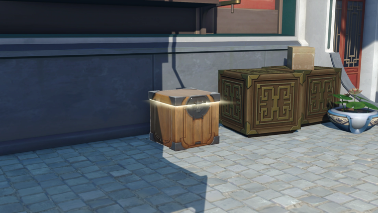
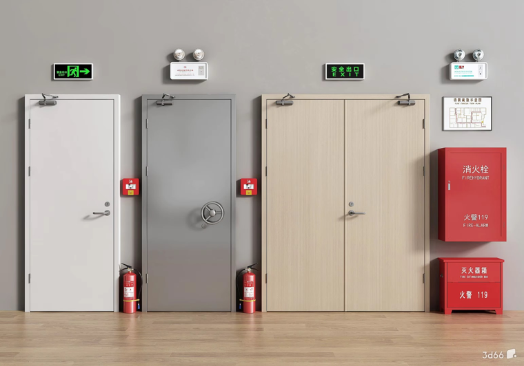
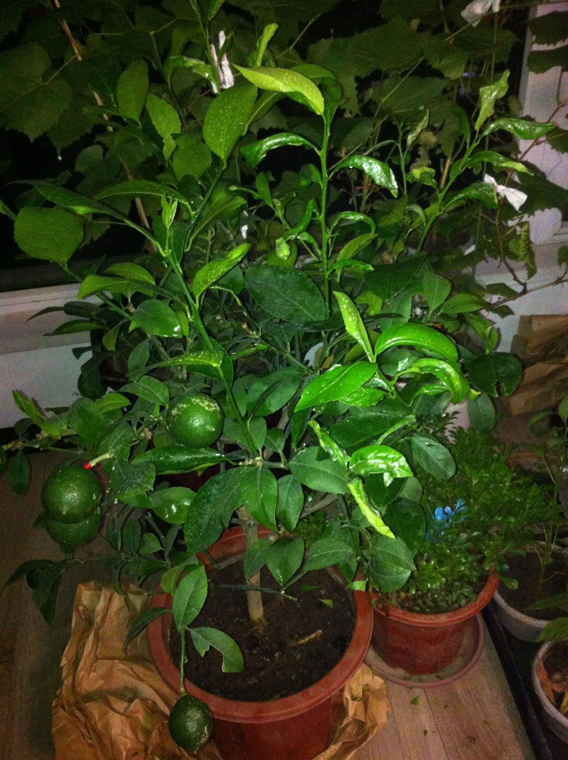
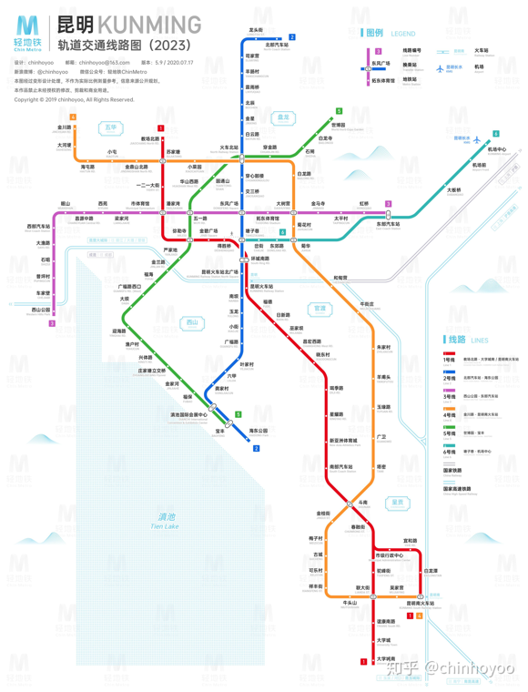
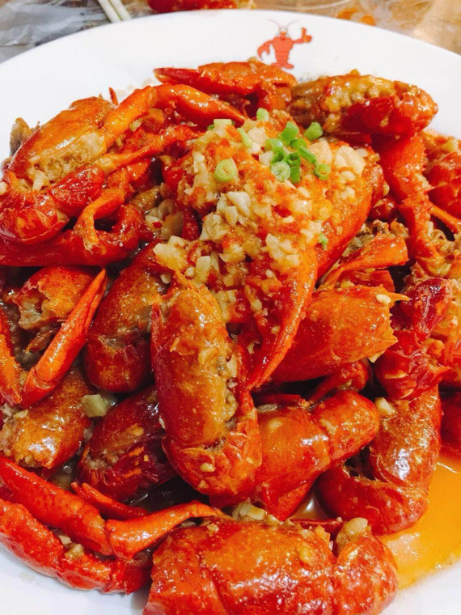

# 标注抽样预览 · 全字段版（edit-source-image-5）

> 模型输出 12 组字段全展开；底部 decision 与 retrieval_tags 五组为**代码派生**（写表时生成，非模型输出）。
> 图片为同目录 PNG，VS Code 用 Ctrl+Shift+V 预览本文件即可见图。

## 案例 1｜high（→ decision=keep） `0aea71bd17933908`

| 字段 | 值 |
| --- | --- |
| caption | 3D渲染的庭院角落，地面铺设石砖，右侧放置有装饰华丽的木箱、纸箱及一盆荷花，左侧为建筑墙体。 |
| representation | render |
| scene_groups | ['庭院', '建筑角落'] |
| view_tags | ['平视', '中景'] |
| issues | [] |

**reason（判定理由）**：图像为清晰的3D渲染场景，地面平整且光照明确。右侧大型木箱顶部提供了明确的水平承载面，且已有纸箱作为尺度参照，适合添加小型装饰物或道具。地面区域空间开阔，适合添加落地摆件。关键接触关系（如物体底部与箱顶或地面的接触）清晰可见，易于检查。
### 区域1
- **location**：右侧大型雕花木箱的顶部平面
- **content**：平整的木质表面，带有金色装饰边框，右后角已放置一个棕色纸箱。
- **space**：箱顶大部分区域空置，仅右后角被纸箱占据，剩余空间足以容纳一个与纸箱体积相当或略小的物体。
- **occlusion**：无遮挡，箱顶完全可见，前缘轮廓清晰。
- **anchor_tags**：['木箱顶面', '纸箱']
- **physical_conditions**：['水平承载面', '定向侧光']
- **limitations**：['受限于箱顶面积，仅适合小型物体']
- **合适对象（add_candidates[1].object_types）**：**['小型盆栽', '装饰摆件']** ← 建议新增的对象类型
  - fit_reason：箱顶提供了稳固的水平支撑，且与庭院环境中的荷花盆风格协调，适合放置小型装饰性物体。
  - observability：物体底部与箱顶的接触线、物体整体轮廓及受光面均清晰可见。
  - relations[支撑接触]：证据「箱顶表面平整且水平，纸箱底部与其接触。」 → 要求「新增物体底部需完全接触箱顶表面，不悬浮。」
  - relations[相对尺度]：证据「已有纸箱提供了明确的体积参照。」 → 要求「新增物体高度和体积应与纸箱相当或略小，避免遮挡箱顶过多。」
### 区域2
- **location**：前景中央偏左的石砖地面
- **content**：平整的灰色石砖地面，位于发光木箱前方，无其他物体。
- **space**：开阔的地面区域，空间充足，可容纳中等大小的落地物体。
- **occlusion**：无遮挡，地面纹理清晰。
- **anchor_tags**：['石砖地面']
- **physical_conditions**：['水平地面', '可见阴影投射']
- **limitations**：[]
- **合适对象（add_candidates[1].object_types）**：**['石灯笼', '装饰石球']** ← 建议新增的对象类型
  - fit_reason：地面空间开阔，适合放置庭院常见的落地装饰物，且能利用现有光照产生自然阴影。
  - observability：物体底部接触点、整体形态及投射在地面的阴影均可见。
  - relations[支撑接触]：证据「地面平整，周围物体（如木箱）均直接放置于地面。」 → 要求「物体底部需稳固接触地面。」
  - relations[前后遮挡]：证据「该区域位于发光木箱前方。」 → 要求「新增物体不应完全遮挡后方木箱的关键特征。」
**派生 retrieval_tags**：scenes=['庭院', '建筑角落'] ｜ anchors=[] ｜ relations=[] ｜ physical=[] ｜ object_types=[]

## 案例 2｜high（→ decision=keep） `3c2bf420c03bc02b`

| 字段 | 值 |
| --- | --- |
| caption | 室内消防设备展示墙，包含三扇不同材质的门、安全出口指示牌、应急照明灯、消火栓箱及灭火器箱。 |
| representation | render |
| scene_groups | ['室内走廊', '消防展示区'] |
| view_tags | ['平视', '全景'] |
| issues | [] |

**reason（判定理由）**：图像为清晰的室内渲染图，展示了消防设备展示墙。右侧墙面在疏散图与消火栓箱之间有明显的垂直空位，且具备平整的墙面作为承载结构。该区域与现有的消防标识、箱体在功能上高度一致，适合添加壁挂式消防设备（如灭火器或报警按钮），且添加后的接触关系和相对尺度可清晰检查。
### 区域1
- **location**：右侧墙面，位于白色疏散示意图下方与红色消火栓箱上方之间的灰色区域。
- **content**：平整的灰色墙面，无遮挡，上方有白色边框的疏散示意图，下方是红色消火栓箱。
- **space**：垂直方向有约40-50厘米的净空，水平方向宽度与上方疏散图相当，适合安装小型壁挂设备。
- **occlusion**：无遮挡，该区域完全可见。
- **anchor_tags**：['墙面', '疏散示意图', '消火栓箱']
- **physical_conditions**：['平整垂直表面', '均匀漫射光']
- **limitations**：['仅限壁挂式设备，不适合放置落地物体。']
- **合适对象（add_candidates[1].object_types）**：**['壁挂式灭火器', '手动报警按钮']** ← 建议新增的对象类型
  - fit_reason：该区域位于消防设备集中展示区，墙面平整，且上下均有同类消防设备，新增壁挂式消防设备符合场景功能逻辑。
  - observability：设备正面轮廓、与墙面的接触关系以及与上下设备的相对位置均清晰可见。
  - relations[支撑接触]：证据「墙面平整且垂直，上方疏散图与下方消火栓箱均通过支架或底座固定于墙面。」 → 要求「新增设备背部或支架应紧贴墙面，不悬浮。」
  - relations[相对尺度]：证据「上方疏散示意图和下方消火栓箱提供了明确的尺寸参照。」 → 要求「新增设备尺寸应小于消火栓箱，与疏散图宽度相当或略小。」
**派生 retrieval_tags**：scenes=['室内走廊', '消防展示区'] ｜ anchors=[] ｜ relations=[] ｜ physical=[] ｜ object_types=[]

## 案例 3｜medium（→ decision=keep） `a12142ae50cc78ad`

| 字段 | 值 |
| --- | --- |
| caption | 夜间室内木质台面上摆放着几盆绿植，主体为一株结有青果的柑橘类盆栽，右侧有一盆小型多肉植物。 |
| representation | photo |
| scene_groups | ['室内阳台', '家庭园艺'] |
| view_tags | ['平视', '近景'] |
| issues | ['夜间拍摄导致噪点较多', '光线昏暗，部分背景细节不可见'] |

**reason（判定理由）**：图像为夜间室内盆栽场景，光照较暗且噪点较多，但主要承载结构（木质台面）和参照物（现有花盆）清晰可见。右侧台面存在明确的空位，且具备支撑条件，适合添加小型盆栽或园艺工具，关键接触关系可检查。
### 区域1
- **location**：画面右下角，多肉盆栽右侧的木质台面区域
- **content**：可见浅棕色木质台面，表面平整，右侧边缘有黑色托盘或容器边缘，上方有少量散落的枯叶。
- **space**：台面空余部分约占画面右下角1/4，宽度足以容纳一个小型花盆或园艺工具，高度受限于台面边缘。
- **occlusion**：右侧边缘被黑色物体遮挡，上方有植物枝叶垂下，限制了新增对象的高度和右侧可见范围。
- **anchor_tags**：['木质台面', '多肉盆栽']
- **physical_conditions**：['夜间人工照明', '木质表面']
- **limitations**：['夜间光线较暗，细节噪点较多', '上方枝叶遮挡可能影响高个物体的添加']
- **合适对象（add_candidates[1].object_types）**：**['小型盆栽', '多肉植物']** ← 建议新增的对象类型
  - fit_reason：该区域为现有盆栽群的延伸位置，木质台面提供稳固支撑，且与周围绿植环境风格一致。
  - observability：花盆底部与台面的接触线、花盆前缘轮廓及植物整体形态可见。
  - relations[支撑接触]：证据「木质台面水平且平整，旁边多肉盆栽底部直接接触台面。」 → 要求「新增花盆底部需完全接触台面，保持水平稳定。」
  - relations[相对尺度]：证据「旁边多肉盆栽高度约为台面宽度的1/3，叶片茂密。」 → 要求「新增对象高度不宜超过旁边多肉盆栽，避免遮挡主体柑橘盆栽。」
**派生 retrieval_tags**：scenes=['室内阳台', '家庭园艺'] ｜ anchors=[] ｜ relations=[] ｜ physical=[] ｜ object_types=[]

## 案例 4｜medium（→ decision=keep） `9754be5c2121f786`

| 字段 | 值 |
| --- | --- |
| caption | 昆明轨道交通线路图，展示了多条地铁线路、站点、换乘站及周边地标（如滇池、火车站、机场）的分布。 |
| representation | diagram |
| scene_groups | ['城市地图', '轨道交通'] |
| view_tags | ['俯视', '全景'] |
| issues | [] |

**reason（判定理由）**：图像为昆明轨道交通线路图，属于示意图。图中存在明确的空白区域（如滇池水域、图例右侧空白），且具备清晰的地理参照（如滇池、火车站、机场）。在这些区域添加地标、景点或交通设施图标，符合地图的语义逻辑，且位置、尺度和遮挡关系（如不遮挡线路）均可从当前视角检查。
### 区域1
- **location**：画面左下方的滇池水域区域
- **content**：浅蓝色填充的水域，标有“滇池 Tien Lake”字样，周围有绿色和蓝色线路环绕。
- **space**：水域内部有较大的空白区域，适合添加与水域相关的图标或地标。
- **occlusion**：无遮挡，视野开阔。
- **anchor_tags**：['滇池', '水域']
- **physical_conditions**：['浅蓝色背景', '地理参照']
- **limitations**：['需避免遮挡“滇池”文字标签']
- **合适对象（add_candidates[1].object_types）**：**['游船', '岛屿']** ← 建议新增的对象类型
  - fit_reason：滇池是昆明著名景点，添加游船或岛屿图标符合地理环境，且能丰富地图信息。
  - observability：图标完全可见，位置关系清晰。
  - relations[位置关系]：证据「水域区域广阔，且标有名称。」 → 要求「图标应位于水域内部，不跨越边界。」
  - relations[相对尺度]：证据「周围有站点和道路作为参照。」 → 要求「图标大小应与周围地标（如西山公园）协调。」
### 区域2
- **location**：画面右侧图例下方的空白区域
- **content**：白色背景，位于“线路 LINES”图例下方，无其他内容。
- **space**：垂直方向的长条空白区域，适合添加补充说明或图标。
- **occlusion**：无遮挡。
- **anchor_tags**：['图例', '空白背景']
- **physical_conditions**：['白色背景', '垂直空间']
- **limitations**：['需保持与图例风格一致']
- **合适对象（add_candidates[1].object_types）**：**['景点图标', '说明文字']** ← 建议新增的对象类型
  - fit_reason：该区域通常用于补充图例或说明，添加景点图标或文字符合地图排版习惯。
  - observability：内容完全可见，排版关系清晰。
  - relations[排版关系]：证据「上方有图例列表，下方有水印。」 → 要求「新增内容应与上方图例对齐，不干扰水印。」
**派生 retrieval_tags**：scenes=['城市地图', '轨道交通'] ｜ anchors=[] ｜ relations=[] ｜ physical=[] ｜ object_types=[]

## 案例 5｜low（→ decision=keep） `32f7beffed4a848e`

| 字段 | 值 |
| --- | --- |
| caption | 白色圆盘盛满红亮的小龙虾，表面撒有蒜末和葱花，盘沿可见少量汤汁。 |
| representation | photo |
| scene_groups | ['餐桌', '美食'] |
| view_tags | ['俯视', '近景'] |
| issues | [] |

**reason（判定理由）**：图像为近景特写，主要空间被堆叠的小龙虾占据，仅盘沿有少量可见空间。虽然可以添加装饰性配料，但缺乏明确的承载结构（如层板、桌面），且新增对象极易与主体混淆或遮挡关键细节，可检查性受限。
### 区域1
- **location**：画面左上角及右上角的白色盘沿区域
- **content**：白色陶瓷盘边缘，表面光滑，可见红色小龙虾图案装饰，周围有少量汤汁痕迹。
- **space**：盘沿呈弧形分布，宽度有限，仅能容纳极小体积的物体，且空间不连续。
- **occlusion**：大部分盘沿被堆叠的小龙虾遮挡，仅边缘部分可见，新增对象极易被主体遮挡。
- **anchor_tags**：['盘沿', '陶瓷表面']
- **physical_conditions**：['光滑表面', '可见汤汁']
- **limitations**：['空间极小，仅限微小装饰物', '易被主体遮挡', '需避免与汤汁混合']
- **合适对象（add_candidates[1].object_types）**：**['香菜叶', '装饰性葱花']** ← 建议新增的对象类型
  - fit_reason：作为菜肴的点缀，符合美食摄影的常见构图，体积微小，可放置在盘沿空白处而不破坏主体。
  - observability：可检查叶片是否接触盘沿，以及是否遮挡了盘沿的红色图案。
  - relations[支撑接触]：证据「盘沿为水平或微倾斜的硬质表面，可见白色陶瓷材质。」 → 要求「叶片需平铺或轻触盘沿，不可悬浮。」
  - relations[相对尺度]：证据「参照旁边的小龙虾钳子，盘沿宽度仅能容纳几厘米宽的物体。」 → 要求「新增物体尺寸需极小，不遮挡小龙虾主体。」
**派生 retrieval_tags**：scenes=['餐桌', '美食'] ｜ anchors=[] ｜ relations=[] ｜ physical=[] ｜ object_types=[]

## 案例 6｜unsuitable（→ decision=reject） `8985829643794dc5`

| 字段 | 值 |
| --- | --- |
| caption | 浙江卫视《天赐的声音》EP04节目宣传海报，红橙色调背景上垂直排列了七组歌手照片及对应的歌曲名称。 |
| representation | collage |
| scene_groups | ['平面设计', '宣传海报'] |
| view_tags | ['平面', '全景'] |
| issues | ['非物理空间场景，无三维深度', '平面排版布局，无物理承载面'] |

**reason（判定理由）**：图像为平面设计的节目宣传海报，非三维空间场景。画面由文字、图形和照片拼贴构成，缺乏物理承载结构（如地面、桌面）和空间深度。虽然存在背景留白，但新增对象无法建立物理接触、重力或遮挡关系，且会破坏海报的排版逻辑，因此判定为不适用。
- （unsuitable：无可添加区域，regions 为空——合规）
**派生 retrieval_tags**：scenes=['平面设计', '宣传海报'] ｜ anchors=[] ｜ relations=[] ｜ physical=[] ｜ object_types=[]
