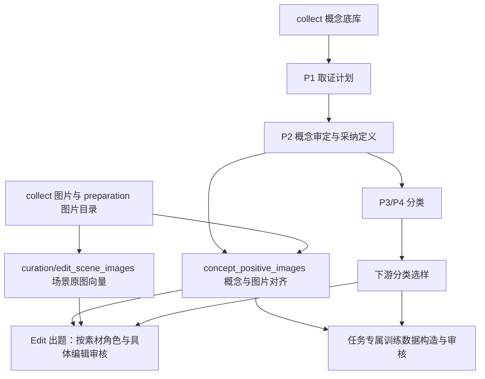

# 数据与 pipeline 按生产职责归属

公共表示可复用的消费契约，不要求独立的工作区顶层 `datasets/`。数据放在拥有其生产规则的模块，固定发布继续用版本引用。目录迁移不补算语义结果，也不把历史导入表改称已经审定的概念库。

| 数据／流程 | 归属与用途 |
| --- | --- |
| 概念底库与历史 JSON | `collect/datasets/concepts.lance` 与 `concepts.json`，去掉 master 文件名；历史导入、合并所得，没有额外准备逻辑。`collect/concepts.py` 读取固定 release |
| P1/P2、P3/P4 | `preparation/concepts/`，概念审定与分类；其采纳快照独立于历史 master |
| 共用概念正例图 | `preparation/concept_positive_images/`，审核固定概念定义与图片是否对齐，不裁定训练或某道题的适用性 |
| `articles.lance` | `preparation/articles/datasets/` |
| `images.lance` | `preparation/images/catalog/datasets/`；仅迁位置，历史列和判断保留 |
| `qid_images.lance`、`qid_concepts.lance` | 各自 `preparation/qid_images/datasets/`、`preparation/qid_concepts/datasets/` |
| 文档索引和对象 | `preparation/datasets/documents/{library,objects}/`；存量登记与在线取证共享同一库，由平台 DocumentLibrary 提供机制。导入代码归 `collect/wiki_documents`，旧资产路径保留兼容链接，历史登记表和版本留原位 |
| Edit 可检索原图 | `curation/edit_scene_images/`，对固定场景候选生产 WeMM 图片向量；2026-10-03 替换旧 add 标注流程 |
| T2I 训练样本、Edit 训练图对 | `curation/t2i_training_samples/`、`curation/edit_training_pairs/` |
| 旧概念配图审核 | 2026-10-03 已退役并删除原目录；历史证据归 `curation/archive/legacy_concept_images_20261003/`，共享记录契约归 `preparation/images/catalog/operators/records.py` |
| 数据集和发布登记 | 工作区 `_demiflow/registry/{datasets,releases}.lance`，属于平台控制信息 |

上表中 demiwtg 模块的完整路径均以共同工作区的 `demiwtg/` 开头。

职责关系如下；箭头表示依赖方向，不表示已经串成自动执行 DAG。

正例对齐接在 P2 的采纳定义之后，与 P3/P4 分类并列。Edit 的背景原图或待纠错图可能有意不匹配目标概念，不能强制先过正例图审核。下游按自身任务定义需要的标注、提示词和接受条件。公共中性 caption/richness 流程退役，不再新建一套目的不清晰的公共标注。

## 迁移记录

- 图片模块、Edit 场景数据和训练历史已迁移；回执为 `_demiflow/curation_ownership_20261002/result.json`。场景调用表原有外部软链接已用逐文件 SHA 校验的实体副本替换，原 `/root/demiflow_calls_local/` 副本保留。
- 文章、图片目录、QID 两表及 registry 已迁移；每表控制文件同行迁移，回执为 `_demiflow/dataset_ownership_20261002/core.json`。
- 按用户要求等待原 P1/P2 进程退出、运行锁释放并核查没有文档文件句柄后，已完成概念底库改名与文档库搬迁；`master.json`、`documents.json`、`finish.json` 回执 complete。工作区根 `datasets/` 已移除。进程退出不表示 P1/P2 的业务审核成功或完成，本次不修改其结果。
- 旧固定表引用通过 `_demiflow/lance_locations.json` 精确解析。旧 SQLite、离线输入和文档对象引用通过 `_demiflow/artifact_locations.json` 精确解析；不修改冻结回执、行内容、原请求或版本。普通工具直接读 Lance 时须使用新路径，平台引用解析支持旧身份。
- 每次同文件系统移动核对全部文件 inode、大小、mtime，表头行数、schema 和全部版本号；迁移脚本不注册新的业务 release。
- 补清理工作区根 `collect/datasets/`：独有的历史 `taxonomy_nodes.lance`、`taxonomy_edges.lance` 及两份 JSONL 已归并到 `demiwtg/collect/datasets/`；`taxonomy_tree.json` 经 SHA256 核对与项目内副本完全一致后删除重复件。外层 `collect/` 已为空并移除。两表 @1、全部文件 SHA256 和 8 个历史表别名回读均核验通过，回执为 `_demiflow/dataset_ownership_20261002/root_collect_cleanup.json`。这些是历史导入分类数据，不是新 P3/P4 的采纳结果，当前代码和发布登记均无消费者。

用户最终确认：没有额外加工逻辑，不为概念底库新建 preparation pipeline。P1–P4 继续消费固定底库，产出自己的审定／分类结果；共用正例图另按 P2 采纳定义做对齐审核。

## 验证

图片模块、固定引用、SQLite／离线回放、文档库迁移的隔离测试通过。图片目录与两条 QID pipeline 的 25 项回归、registry 的 35 项回归、文档库／独立对象的 25 项回归、文章入口 5 项回放检查通过。55 项全仓布局检查中，54 项通过；现有 P1/P2 查看模块直接导入 IPython 的一项边界问题已记录在 [规范复核台账](../PIPELINE_SPEC_TODO.md)，未修改正在运行的模块。

实际数据只读核对：文章 @8（53,091 行）、图片目录 @16（2,164,671 行）、QID 图片 @1（18,437,838 行）、QID 概念 @1（10,648,274 行）及 registry 版本保持；历史概念和 QID release 可读，Edit 调用表旧固定 @46240 可读。5 份更名 notebook、9 份仅切换公共路径的 notebook 的输出和元数据逐项保持。

概念底库 head @4 及历史 @1–@3 均保留；28,525 条文档登记完整迁移，抽查 12 组冻结正文／原始对象引用可读并通过 SHA 校验，新旧 DocumentLibrary 声明均能查库。P1/P2 的判断逻辑保持，仅更新共享文档默认路径及源表读取位置解析；其冻结配置和 notebook 参数保持，源 URI 继续参与原请求身份。

隔离 P1 迁移回放验证通过：移动固定输入后，同一配置的 source_record_id、原 source 引用、离线 request_sha256 和 request_ref 均保持，未创建新的请求身份。整轮回执见工作区 `_demiflow/dataset_ownership_20261002/result.json`。
