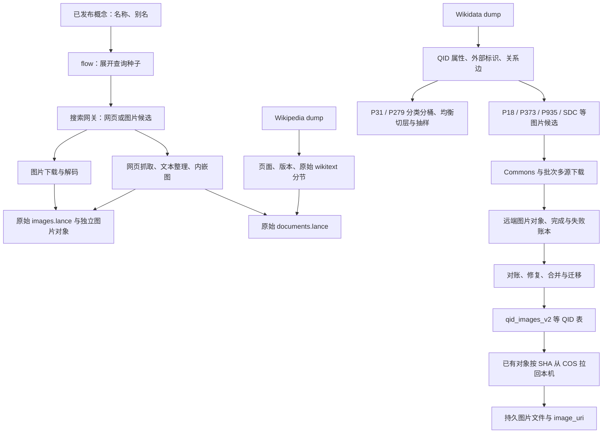

# collect 代码与数据全景：现状分析

分析日期：2026-09-30（北京时间）。本次只分析、读取固定版本数据、运行隔离测试；未修改采集实现，未启动生产下载、模型、远端部署或数据迁移。

## 1. 结论与阅读范围

`collect` 已经承载了一个采集系统的大部分业务：从概念、QID 和外部清单得到候选，抓网页和图片，解析维基数据，扩展图像关联，维护资产和账本，补采、搬运、分桶、抽样及运维。它不是一个单一下载模块。

现状是“多条业务链路 + 多代执行与存储协议 + 一部分已下沉的平台能力”。不能因为代码由某个模型编写就判断它不可靠；实际存在值得复用的机制，也存在已复现的字段断接、内容处理和失败表达问题。

本次覆盖：

- 扫描 collect 下项目代码：180 个 Python、60 个 Shell、4 个 notebook，共 244 个文件，包含测试、历史副本与归档。扫描排除数据、blobs、缓存及内嵌 SearXNG 仓库；文件系统扫描与 `rg` 结果相同。
- 内嵌 SearXNG 另识别到 7 个项目 `demi_*` 适配器，单独列入附录；未把第三方搜索引擎全部算成项目自研代码。
- 深读当前本地采集主线、网页/图片算子、入湖写端、维基解析、下载平台入口，以及主要批次、分类和修复链路的入口与关键行为。
- 对 demiflow 的网络、fetch、crawl、图像验证、队列及相关测试做对照。
- 只读检查 7 张实际 Lance 表的固定版本和行数，查看 6 条文档、3 条图片样本。
- 文件存在、文档称其现役、当前源码可调用、远端确实正在运行，是不同证据。本次未核验远端各机器的部署版本及进程，因此不把历史注释中的“正在运行”当成当前运行事实。

附录列出全部文件，是目录级盘点；不表示每个运维脚本都已逐行审计。

## 2. 整体业务地图



图中后半部分概括历史生产链路，不表示今天运行一个入口就会自动完成所有关联、合并和发布。部分历史迁移代码在 collect 外的 `tools/lake_migration/`，部分一次性脚本和产物已经归档。

## 3. 各部分实际实现了什么

| 业务部分 | 主要代码 | 输入 → 操作 → 输出 | 现状判断 |
| --- | --- | --- | --- |
| 概念驱动在线采集 | `flow.py`、`concepts.py`、`operators/concepts.py` | 固定 master release → 名称/别名查询种子 → 图片和文本两分支 | README 指定的当前本地入口；没有统一的 `config → run_pipeline` 形式 |
| 搜索与源适配 | `operators/search.py`、`operators/text_engines.py`、`webgate/` | 查询 → SearXNG → URL、标题、摘要、图片档位和来源 | 图片主路由实际只注册 SearXNG；旧直连引擎类仍留在文件里 |
| 网页采集 | `operators/page.py` | 候选网页 → robots 检查 / Wikipedia API / 浏览器 → Markdown、段落、内嵌图、摘要降级 | 既做获取，也做内容筛选和材料等级降级 |
| 图片采集 | `operators/download.py`、`operators/commons.py` | URL 档位或 Commons 文件名 → 字节、格式、尺寸、SHA、来源 | 普通在线链与 Commons 链的校验和存储方式并不完全相同 |
| Wikipedia 页面导入 | `flow_kb.py`、`operators/wiki_dump.py` | 压缩 dump → XML 流式读页 → 版本、分节、链接、图片线索 → 文档表 | 当前本地入口；分节文本仍是原始 wikitext |
| 维基文档旧合流 | `flow_docs.py`、`operators/wiki_clean.py` | 页面分片 + page_id/QID 映射 → 清洗 → Markdown 文件和 JSONL 文档账本 | 与当前 `flow_kb` 的文档入湖并存的旧协议，不能混称同一流程 |
| QID 元数据与关系 | `flow_wikidata.py`、`operators/wikidata.py`、`p31/`、`qid_edges/` 中的抽取器 | dump → 属性、外部 ID、P31/P279 等关系 | 已超出下载职责；部分是全量离线处理和历史批次脚本 |
| 图片候选扩展 | `tools/`、`sdc_fetch/manifest_stages.py`、`batch2/cut_lists.py` | 页面图片、图像属性、图库、depicts、外部 ID → 待下载任务清单 | 决定哪些实体关联哪些候选，是业务逻辑 |
| 大规模图像采集 | `flow_images.py`、`flow_images_batch.py`、`sdc_fetch/`、`batch2/` | 分片任务 → 元数据/API/原图下载 → blobs、COS 和账本 | 多代 worker/队列并存；需按实际部署分别认定使用状态 |
| 已有对象下载 | `download/` | 固定图片表里的 SHA、大小、COS 位置 → 本地持久文件 | 已有独立平台入口，也保留完成批次的旧 worker 和运维脚本 |
| 缺失资产恢复与搬运 | `backfill.py`、`image_backfill/` | 已知 URL/SHA/失败清单 → 补采、跨桶搬运、回收与镜像 | 包含运行副本、探针、事故修复和删除工具，不能整体当通用下载库 |
| 审计与账本 | `audit/`、`cos_ledger_20260926/`、相关 handoff 文档 | 库表/清单 × 对象目录 → 缺失、HTML 混入、哈希与解码检查、终账 | 审计和纠错链；有些路径主要是数据/记录而非可复用代码 |
| 分类分桶与抽样 | `p31/p31_make_map.py`、`qid_edges/balance_cut*.py`、`make_sample.py` | 关系图 → 主类、桶、均衡类目、样本清单 | 采样策略和业务分类，不等于科学分类事实 |
| 运维、观察与历史规划 | 根目录监控脚本、`ops/`、`preview.py`、`source_plan.py` | 部署/日志/覆盖率 → 重启、巡检、报表、查看或分支选源建议 | 有明显历史运行环境依赖；部分与当前主线已断接 |
| 入湖与读取适配 | `ingestion.py`、`materials.py`、`material_schema.py`、`material_writer.py`、`assets.py`、两个 import 入口 | 各种来源材料 → 统一实体/来源 → 固定版本表及对象引用 | 是当前数据消费最重要的收口边界 |

### 3.1 名称种子在线链：flow.py

入口：[flow.py](/yzp/zhaozy/yangzepeng/0905/demiwtg/collect/flow.py:13)。

1. 解析一个已发布概念 release，读取固定版本的 `name/aliases/carriers`。
2. `ConceptSeedStage` 机械展开原名与别名，根据是否含中文设置查询语言；当前主线不调用模型生成种子。
3. 图片分支：搜索 → 候选图片 URL 档位 → 下载、Pillow 解码 → 发布独立对象 → 图片表按 SHA 合并概念和来源。
4. 文本分支：搜索 → 词面相关性打分 → 页面获取 → 段落和内嵌图片 → 文档表。
5. 图片分支与文本分支在 `run` 内依次执行；每个分支内部有异步并发。

注意两个当前接线问题：入口没有读取 taxonomy，因而搜索算子的 taxonomy 领域路由在这个入口拿不到实际路径；入口也没有给 `TextSearchStage` 的 `aliases_by_name` 传入映射，见后面的复现。

### 3.2 搜索网关与旧引擎

`operators/search.py` 有 Wikimedia、Baidu、AniList、MAL、Pixiv、Bing、Yandex 等类，但当前注册元组只启用 `SearxngEngine`。不能从类的数量推断当前同时调用多少搜索源。

图片搜索还支持上游名称归一、按领域添加搜索前缀、有限翻页、候选档位、源级限流。文本搜索使用 `SearxngGeneralEngine`，然后按标题/别名/英文词重叠/域名规则排序与过滤。

`webgate/` 管本地 SearXNG 启停、探活与部署样板。内嵌仓库还有 Baidu、Huaban、Toutiao、Pixiv、iNaturalist、360 百科、Wikipedia 搜索的 7 个 `demi_*` 适配器。其实际启用情况仍取决于部署配置，本次没有用配置文件的存在代替运行核验。

### 3.3 网页获取已经包含浏览器与降级链

入口算子：[page.py](/yzp/zhaozy/yangzepeng/0905/demiwtg/collect/operators/page.py:211)。

- 普通允许抓取的页面：Wikipedia 链接尝试 API 提取；否则用 demiflow 的 `PageCrawler`，底层为 Crawl4AI 浏览器。
- robots 拒绝时：尝试 Wayback 材料，再尝试搜索摘要。
- 浏览器无结果、正文质量门不通过等情况下，也可能返回搜索摘要。
- 摘要足够长时形成 `body='snippet'` 的文档行；完整页和存档分别有 `full/wayback` 标记。
- 正文被切成 passages；筛掉链接密集块及部分图片 URL；内嵌图下载失败时保留文本、丢弃该图。
- 多种失败或过滤最终返回 `None`。旧流执行器会丢弃这一行或只计认缺数量，未形成逐请求持久化的完整失败记录。

当前新概念审核里的基础 HTTP 抓取尚未复用这些能力。旧链已有浏览器，不能说整个项目缺浏览器；但旧链的降级和内容处理契约也不能不加检查地直接用于概念取证。

### 3.4 page、document、Wikipedia dump 的区别

“page”在历史代码里至少有两种含义：抓取网页形成的 Markdown 文件，以及 Wikipedia dump 中的一个页面版本。后者保存 page_id、revision_id、重定向、分节、分类、链接和图片线索。

当前 `documents.lance` 将这些来源统一为文档实体，但没有把它们变成同一种内容格式：

- 普通 web 行主要使用 `text`；
- wiki dump 行主要使用 `sections[*].text`，其中可能包含原始 wikitext；
- QID 不一定存在。页面 ID、语言和 QID 的关联是另外的事情。

`flow_kb.py` 现在直接把解析结果交给文档写端；旧 `flow_docs.py` 则额外做 wikitext 清洗、要求有 QID、过滤重定向/消歧义/过短内容，然后落 pages 文件与 qid_docs 清单。两条路线的筛选与产物不同。

### 3.5 QID、外部标识和图片关系

这一部分把数据源的实体关联转换成候选清单：

- P18：实体主图文件指针；P373：Commons 分类指针。
- `extract_embed.py`：从页面语料的 images 中抽文件名。
- `extract_tier1.py`：从图像属性抽出 QID、属性、角色、文件名；`expand_p935.py` 展开图库页面。
- `extract_tier2.py` 与 `filter_sitelinks.py`：扩展成员集外的图像候选，并检查页面关联。
- SDC：通过 Commons 的结构化 depicts 关系、文件映射、元数据、配额和已有集合得到下载清单。
- batch2：从不同外部数据源的候选/桥接清单下载，例如 iNaturalist、Smithsonian、Met、Open Images；另有 DF20、PlantNet、PubChem 等融合脚本。

这里的实体关联、图片可下载、内容哈希一致、图像确实描述目标概念，是四个不同判断。下载流程没有统一完成最后一个语义判断。

### 3.6 远端批次与本地已有对象下载

远端批次通常先产生对象和 JSONL/压缩清单，再对账合并，最后经过明确导入/迁移成为当前表。不能把远端队列或 manifest 自动视为 preparation 可消费的正式表。

`download/platform_pipeline.py` 的任务比较明确：输入已有图片记录的 SHA、预期字节数和多个 COS 位置；下载时流式哈希、长度校验、原子发布；已有文件先复验内容；调度和恢复交给 demiflow 的 SQLiteQueue/worker。它保证的是“拿回指定字节”，不重新判定这些字节是否为某物种的正确图片。

`download/worker.py`、`ctl.py`、`autoscale.py` 等旧批次实现仍在；README 明确新任务使用独立平台队列。此次没有运行旧 worker 或修改生产队列，测试仅使用临时队列。

### 3.7 分类、采样代码也在 collect 内

[p31_make_map.py](/yzp/zhaozy/yangzepeng/0905/demiwtg/collect/p31/p31_make_map.py:53) 使用单个主类记录，沿 P279 向上查找预设桶；有深度/访问上限、人类白名单和同层优先级。

`qid_edges/balance_cut3/4/5.py` 的目的包括控制每个组的规模。v5 会使用职业、分类单元、宗派、行政区等辅助关系；仍超限时进行人为分段。这种分段满足样本规模约束，不应解释成自然成立的视觉类别或生物分类单元。

因此，一条 QID 本身有来源，不代表附带 bucket/class/采样组也是无争议的知识事实。应分开保存来源属性和本项目派生的分组。

### 3.8 运维、事故恢复和历史代码

`image_backfill/` 文件最多，兼有补图、短命 curl/pycurl 传输、出口速率、worker 部署、看门狗、代理探测、COS 传输、123pan 镜像、失败清单修复和清理工具。`fleet_running_20260920/` 是运行副本快照；不能因为和外层相似就删除。

`audit/` 检查对象目录和账本一致性、HTML 错误页混入、长度、哈希和解码；不是正常概念审核模块。

`source_plan.py` 是历史 GLM 分支选源器，包含自己的 prompt、模型调用和 JSON 缓存。在本次搜索到的 collect Python/Shell 调用方中没有找到接入当前主线的调用。当前 `flow.py` 没有调用它。源码由 GLM 编写与运行时调用 GLM 必须区分。

根目录 `supervise.py`、`patrol.py`、`source_health.py` 等大量依赖旧 manifest、机器名和目录布局。它们可以解释历史运行方式，但不能仅凭文件名认定已适配当前 Lance 链。

### 3.9 配置、数据和交接记录也影响行为

`operators/domain_sources.json` 是领域到搜索源的业务配置；`webgate/settings.yml.example` 是搜索网关部署样板。它们虽不计入 Python/Shell/notebook 数量，仍是需要与代码一起管理的输入。

`datasets/` 是采集层表；`download/blobs/` 是已交付的持久图片文件；`records/`、`cos_ledger_20260926/`、`redownload_20260926/`、`_ext_tables_backup_20260924/` 等含历史记录、账本、补采和备份。`batch5/` 在本次代码扫描中未发现上述三类代码，不能只因目录名就认定另有一条完整可执行 pipeline。

`MEMORY.md`、`LEDGER_COORDINATION.md`、handoff 和 finalize 文档承载了不少版本、部署和账本口径。它们需要与实际产物核对，不能直接代替可执行规范，也不能当临时垃圾统一清理。

## 4. demiflow 已经沉淀了哪些能力

| 已有模块 | 已实现的机制 | 尚需注意的边界 |
| --- | --- | --- |
| `collect/search.py` | 引擎协议、注册、K 上限、分派和进程内遥测 | 结果是宽松 dict/list；没有统一逐查询结果状态和持久记录 |
| `collect/net.py` | 源级速率与并发闸门、连接池、代理、HTTP/网络错误分类、有界重试 | 部分参数是模块全局值；源策略在 import 时注册，进程内任务可能相互影响 |
| `collect/fetch.py` | 候选 URL 轮转、字节上限、总超时、哈希、verify 钩子 | 超限/verify 失败直接停止；总超时最后可能归为确定性失败；瞬态耗尽不继续下个候选 |
| `collect/crawl.py` | Crawl4AI 封装、浏览器生命周期、Markdown 和图片提取、定量重建浏览器 | 多种失败统一返回 None；未提供统一响应体/版本/失败信息；默认 UA 仍含项目标识 |
| `collect/images.py` | Pillow 解码、实际尺寸、格式/MIME/扩展名 | 处理图像技术有效性，不判断图片与概念的语义关系 |
| `collect/store.py`、`resume.py` | 原子写、追加清单、按调用方 key 去重、done-set 恢复 | 老 JSONL 协议；原子写有特殊文件系统回退，不能泛称所有后端具有相同提交保证 |
| `collect/exec_curl.py`、`fleet.py` | curl 传输、节流机制、出口身份、部署/巡检 | 与 async HTTP 是另一条执行路线，尚未共用一个结果契约 |
| `collect/cosio.py`、`cosqueue.py`、`queue_runner.py` | 对象存取、批任务认领/释放/完成、多机消费 | 批算子正常返回可记整批完成；行级死信的语义仍由业务负责 |
| `collect/sqlite_queue.py`、`embedded_worker.py` | 本机任务持久化、租约/身份/心跳、预算、验证后 done、恢复、命名池 | 更明确的新能力；不自动等同于旧 COS 批队列的完成语义 |
| `collect/network_config.py` | 显式网络/代理配置、环境读取 | 新平台样板使用它，旧链仍有自己的网络配置甚至导入时清理代理环境 |
| `collect/relay.py`、`pan123.py`、`supervisor.py` | 交付、中转、镜像、进程守护相关机制 | 需要与现有业务侧同类代码区分版本及调用关系 |
| `objects`、`lance`、`data` | 独立对象 URI/SHA、版本表、事务/写入、数据流执行 | 公共机制已经存在，collect 仍负责业务字段、关联与发布决策 |

可复用基础比新概念模块的简易抓取丰富。真正缺的是统一的任务输入、结果状态、材料等级、来源版本、重跑与预算契约，以及清楚的业务接入方式；不是从零再写一遍所有 HTTP、浏览器和队列代码。

## 5. 当前真实表：各自是什么

本次读取固定版本元数据。行数不代表所有资源均可读、已下载、已审核或独立实体数。

| 位置 | 固定版本 | 行数 | 含义 |
| --- | ---: | ---: | --- |
| `collect/datasets/documents.lance` | 4 | 22,279,894 | 多来源、多正文版本的原始文档，含 web text 与 wiki sections |
| `collect/datasets/images.lance` | 8 | 2,164,671 | 原始概念图池，按 SHA 保存元数据、概念关联、来源、image_uri |
| `collect/datasets/qid_concepts_fat.lance` | 8 | 7,826,266 | QID 与中英文页面、P18/P373 等源属性 |
| `collect/datasets/qid_concept_xref.lance` | 26 | 25,475,205 | QID—属性—外部标识记录，带迁移来源 |
| `collect/datasets/qid_edges.lance` | 127 | 253,636,173 | QID—关系属性—目标 QID 边 |
| `collect/datasets/qid_images_v2.lance` | 11 | 18,437,871 | QID 图像账本，含多 QID、原 URL、变体与 COS 位置、可空 image_uri |
| 工作区 `datasets/qid_sub_100k_bucket_v1_images.lance` | 5 | 490,575 | 选定子集的图片与 selected_qids、独立 URI |

`images.lance` 与 `qid_images_v2.lance` 是不同采集谱系，不能直接相加当唯一图片总数；公共 `datasets/images.lance` 又是 preparation 管理的公共样本层。

当前文档表只有 document_id 和 concepts 的索引。若后续大量按 `(language,page_id)` 关联 QID 文档，应评估索引或显式关联计划，避免逐概念扫描 2,200 多万行。

## 6. 已验证的边界问题

### 6.1 正确别名命中可能被当前文本链误删

离线调用真实 `ConceptSeedStage` 与 `TextSearchStage`，只替换网络结果：原名 `天牛`，别名 `longhorn beetle`，搜索返回标题 `Longhorn beetle` 的 Wikipedia 候选。

- 种子确实发出了英文查询。
- 当前入口没有传 `aliases_by_name`，相关性评分只拿到中文原名。
- 没有别名时得分 8，低于 18 阈值，输出为 None。
- 同一候选在提供别名时得分 75。

这是字段接线与规则共同导致的可复现漏召回，不是模型判断差异。

### 6.2 长段落的后半部分被删除

`extract_passages` 对超过 900 字符的段落寻找中间句号，然后只保留前半段；没有把后半段继续输出。

离线 case：输入 1,219 字符，输出 passages 共 616 字符；末尾“关键限定”消失。**当前 `collected_document` 的 text 仍保存原完整文本**，所以不能说所有落表正文都被截断；受影响的是段落处理及其内嵌图、后续使用 passages 的链路。

### 6.3 搜索摘要会成为 available 文档，但材料等级不在顶层

真实 `_snippet_row → collected_document` 转换得到：`document_type=web`、`content_status=available`、`sections=[]`。`body=snippet` 保存在来源的 `attributes_json`。

这一标记在新写端没有被完全丢弃，已有测试覆盖它；但只按 available 取正文的消费者仍容易把摘要当完整页。历史迁移样本还存在没有 body 标记的短材料，不能据此自动补写“全文”。

### 6.4 技术失败的表达不一致

对真实 `fetch_tiers` 替换底层传输，得到：

| 场景 | 实际尝试 | 返回 |
| --- | --- | --- |
| 第一候选下载成功但 verify 拒绝，第二候选可用 | 只试第一候选 | None |
| 两候选均总超时 | 两个都试 | DeterministicError |
| 第一候选瞬态重试耗尽，第二候选可用 | 只试第一候选 | TransientExhaustedError |

部分行为是现有明写且被测试锁定的策略，不应全部称为意外 bug；但这些策略不适合无条件提升为所有资源通用的标准。`PageCrawler` 又将多数抓取异常变为 None，进一步丢失失败分类。

### 6.5 下载完成有不同含义

- 在线图片链会解码图片，再写对象和元数据。
- 部分历史批次只检查 HTTP、HTML 头或图片魔数，并未采用同样的完整解码。
- 新平台已有对象下载校验预期 SHA 和长度。这能证明字节一致，不能替代最初的图像有效性与概念相关性审核。
- COS 批队列的 complete 可以包含已经记入死信的行，表示批次已处理到终态；不能解释为每张图片均下载成功。

因此需要分别看“任务终结”“资源取到”“内容可解析”“语义相关”四件事。

### 6.6 重跑、缓存和发布还没有统一

当前 `flow` 的写端会合并已有 SHA/文档身份，避免简单重复实体；但未在搜索/抓取前建立全链路的持久请求复用协议。写表幂等不等于重跑零网络请求。

有些旧恢复按 manifest 的文件名或 URL 跳过，有些按 SHA，有些新队列会复验实体内容；它们解决的问题不同。新增的获取参数、解析版本、来源版本也没有统一纳入请求身份。

当前在线算子内部直接写表，主入口只见 `map_async(DownloadStage/DocsSinkStage)`，不见显式 typed writer；`flow_kb` 的 batch 内也封装了写入。它们与项目现行 Pipeline 规范的可审查主线要求存在差距。

## 7. 真实材料样本提醒：可读不等于可用

本次顺序读取 `documents.lance@4` 的前 6 条，**不是随机抽样，不据此估计全库比例**。

| 样本 | 观察 | 结论边界 |
| --- | --- | --- |
| Magnolia 网页 | text 121,635 字符，开头有 Main menu、导航链接 | 保存了大量页面附属文字；不等于核心正文已经干净提取 |
| 侗族芦笙 | 95 字符，以 `...` 结尾，来源含搜索页面，n_passages=0 | 是需要辨别材料等级的短材料，不能当充分全文证据 |
| 大良双皮奶相关行 | 标题夹中文概念，正文为疑似无意义词串，仍标 available | 需要回溯原材料形成原因，不能直接交给事实审核当可靠知识 |
| 橄榄枝、菲律宾酸汤相关行 | 也出现相似的词串形式 | 是具体质量疑点；尚不能判定来自测试、网站噪声还是其他历史过程 |

大良双皮奶行的 document_id 为 `8179121d7fab856ba57f0709255543ec02e1c5665a0348c0d2ad265c79ac9e6e`，来源可追到 `meta/docs.jsonl` 第 7901 行记录和对应旧 pages 路径。本次未追查全量历史输入，也未删除或改标这些记录。

来源身份、哈希和迁移链能帮助追溯；不会自动把输入内容变成真实知识。

## 8. 验证记录

本次隔离验证共 71 项测试通过：

- collect 当前入湖/资产/概念来源，以及新平台下载样板：12 项。
- batch2 瞬态失败、404 死信和 Met 元数据恢复：4 项。
- demiflow fetch/search/crawl/net/images/SQLiteQueue/COSQueue：55 项。
- 另运行上文的别名、长段落、摘要及三种 fetch 行为复现；网络全部使用替身，下载样板使用本机临时 HTTP 服务。

batch2 测试首次从仓库根收集时报 `ModuleNotFoundError: b2_op`。显式补充 batch2 的 PYTHONPATH 后 4 项通过；未修改测试。它说明历史脚本/测试仍依赖工作目录和导入布局。

可复跑命令（从对应仓库运行）：

```bash
# demiwtg
../env/bin/python -m pytest -q collect/tests collect/download/tests/test_platform.py
PYTHONPATH=/yzp/zhaozy/yangzepeng/0905/demiwtg/collect/batch2:/yzp/zhaozy/yangzepeng/0905/demiwtg ../env/bin/python -m pytest -q collect/batch2/tests/test_b2_op_transient.py

# demiflow
../env/bin/python -m pytest -q tests/test_fetch.py tests/test_search.py tests/test_crawl.py tests/test_net.py tests/test_images.py tests/test_sqlite_queue.py tests/test_cosqueue.py
```

这些结果证明所测机制在隔离环境的行为，不代表全量材料质量、真实网站可达率、远端机群状态或所有历史代码已通过验收。

## 9. 对后续标准化的含义，尚未定版

已经具备从“种子”开始采集的能力：名称种子会生成查询，QID/文件名/URL/对象位置种子会进入不同获取路线。因此，在初始采集和数据流中复用同一套机制是可行方向。

需要先分清三层：

1. **业务规划与来源适配**：选择概念、展开哪些别名/QID 属性、查哪些源、接受什么粒度和材料、如何与原概念关联。留在项目业务层；科属种核验与视觉价值判断仍属于概念 pipeline。
2. **公共获取与执行机制**：HTTP/浏览器/对象读取、预算、限流、重试、解析器接入、内容引用、请求状态与复用。可以在已有 demiflow 能力上统一。
3. **业务入湖与采纳**：哪些结果进入哪张表、来源与概念如何合并、失败如何统计、什么结果可供下游采用。显式写在标准 pipeline 主线。

后续重点应是统一这三层的交接约定，再迁移选定的链路。当前不宜把整个 collect 搬进 demiflow，也不宜把新概念模块的简易下载直接当成未来公共标准。

## 附录：代码文件目录

下面按目录列出全部扫描文件。Python 简述优先取文件现有 docstring 首段；这是定位帮助，不代表注释中的“当前”“完成”“已验证”已被本次复核。没有模块说明的脚本标为需结合调用方确认。Shell 与 notebook 没有在本次执行。

### 根目录（29 个文件）

| 文件 | 定位说明 |
| --- | --- |
| [assets.py](/yzp/zhaozy/yangzepeng/0905/demiwtg/collect/assets.py) | Collection-owned adapter for image metadata and independent object URIs. |
| [audit_all.sh](/yzp/zhaozy/yangzepeng/0905/demiwtg/collect/audit_all.sh) | Shell 执行/运维脚本；可能含远端命令或副作用，未执行。 |
| [backfill.py](/yzp/zhaozy/yangzepeng/0905/demiwtg/collect/backfill.py) | 补采编排：湖侧 candidates 清单 → blob 复原（2026-09-08，湖机丢图灾后线）。 |
| [concepts.py](/yzp/zhaozy/yangzepeng/0905/demiwtg/collect/concepts.py) | Read the fixed concept table selected by a published release. |
| [fleet_report.py](/yzp/zhaozy/yangzepeng/0905/demiwtg/collect/fleet_report.py) | 舰队采集报表：所有在线源的状态总览。 |
| [flow.py](/yzp/zhaozy/yangzepeng/0905/demiwtg/collect/flow.py) | Current collection graph: fixed master release -> source operators -> Lance. |
| [flow_docs.py](/yzp/zhaozy/yangzepeng/0905/demiwtg/collect/flow_docs.py) | 合流线编排(纯声明,2026-09-10):wiki 语料素材 → 统一 docs 池。 |
| [flow_images.py](/yzp/zhaozy/yangzepeng/0905/demiwtg/collect/flow_images.py) | 配图线编排(纯声明,2026-09-10):概念 P18 → Commons 原图 → COS 图池。 |
| [flow_images_batch.py](/yzp/zhaozy/yangzepeng/0905/demiwtg/collect/flow_images_batch.py) | ④ 配图·批式采集器(正式版,2026-09-14 晋升自夜航工作区 kb_night/batch_fetch.py)。 |
| [flow_kb.py](/yzp/zhaozy/yangzepeng/0905/demiwtg/collect/flow_kb.py) | Wikipedia dump -> parser -> current Lance document table, using demiflow. |
| [flow_wikidata.py](/yzp/zhaozy/yangzepeng/0905/demiwtg/collect/flow_wikidata.py) | wikidata 线编排(纯声明,2026-09-10):truthy dump → 概念属性 → 骨干增肥。 |
| [import_base.py](/yzp/zhaozy/yangzepeng/0905/demiwtg/collect/import_base.py) | Explicit import of external JSONL documents into the current Lance table. |
| [import_materials.py](/yzp/zhaozy/yangzepeng/0905/demiwtg/collect/import_materials.py) | Explicit transport ingestion into entity tables (never a runtime file fallback). |
| [ingestion.py](/yzp/zhaozy/yangzepeng/0905/demiwtg/collect/ingestion.py) | Business conversion from collector results to the current material entities. |
| [material_schema.py](/yzp/zhaozy/yangzepeng/0905/demiwtg/collect/material_schema.py) | Raw image/document entities owned by collection. |
| [material_writer.py](/yzp/zhaozy/yangzepeng/0905/demiwtg/collect/material_writer.py) | Batch ingestion into the authoritative image/document entity tables. |
| [materials.py](/yzp/zhaozy/yangzepeng/0905/demiwtg/collect/materials.py) | Material identities and typed source conversion shared by ingestion and migration. |
| [memory_guard.py](/yzp/zhaozy/yangzepeng/0905/demiwtg/collect/memory_guard.py) | 内存哨兵：docs 线浏览器泄漏的运行时护栏（2026-09-08 宕机复盘产物）。 |
| [ops_watch.py](/yzp/zhaozy/yangzepeng/0905/demiwtg/collect/ops_watch.py) | 采集护航监控：三机周期采样 + 异常记档（性能/反爬分析数据源）。 |
| [patrol.py](/yzp/zhaozy/yangzepeng/0905/demiwtg/collect/patrol.py) | docs 质量巡检（45 分钟轮训）：健康快照 + docs 抽样质量画像 → telemetry/。 |
| [preview.py](/yzp/zhaozy/yangzepeng/0905/demiwtg/collect/preview.py) | 采集湖预览：概念列表 → 概念详情（图墙/原图/知识文档）→ 文档正文。 |
| [pull_range.py](/yzp/zhaozy/yangzepeng/0905/demiwtg/collect/pull_range.py) | r 机上运行: COS Range GET -> stdout. argv: key start end |
| [relay_pull.py](/yzp/zhaozy/yangzepeng/0905/demiwtg/collect/relay_pull.py) | SG COS 轻资产拉回调度器:多机 Range 分块并行,断点续传,组装校验 |
| [run_phase2b.sh](/yzp/zhaozy/yangzepeng/0905/demiwtg/collect/run_phase2b.sh) | Shell 执行/运维脚本；可能含远端命令或副作用，未执行。 |
| [schemas.py](/yzp/zhaozy/yangzepeng/0905/demiwtg/collect/schemas.py) | Project business schemas; field types preserve existing Lance contracts. |
| [source_health.py](/yzp/zhaozy/yangzepeng/0905/demiwtg/collect/source_health.py) | 源健康度报告 v3：折源终态后上游引擎的健康口径。 |
| [source_plan.py](/yzp/zhaozy/yangzepeng/0905/demiwtg/collect/source_plan.py) | collect_v2 分支粒度 LLM 选源（2026-08-29 拍板：运行时动态决策按分支分组， |
| [starvation_report.py](/yzp/zhaozy/yangzepeng/0905/demiwtg/collect/starvation_report.py) | 饥饿检测报告：聚合各机配额盘点 + 概念覆盖 → 饥饿概念清单。 |
| [supervise.py](/yzp/zhaozy/yangzepeng/0905/demiwtg/collect/supervise.py) | flow 守护：托管 flow 子进程（单进程或分片多进程），停摆自动重启 |

### analysis（1 个文件）

| 文件 | 定位说明 |
| --- | --- |
| [analysis/quality.ipynb](/yzp/zhaozy/yangzepeng/0905/demiwtg/collect/analysis/quality.ipynb) | Notebook：分析、查看或实验入口；未执行，未清理输出。 |

### archive_docs（16 个文件）

| 文件 | 定位说明 |
| --- | --- |
| [archive_docs/analysis__quality.ipynb](/yzp/zhaozy/yangzepeng/0905/demiwtg/collect/archive_docs/analysis__quality.ipynb) | Notebook：分析、查看或实验入口；未执行，未清理输出。 |
| [archive_docs/batch4_code/b4_op.py](/yzp/zhaozy/yangzepeng/0905/demiwtg/collect/archive_docs/batch4_code/b4_op.py) | 第 4 批图源算子：TMDB（影视）+ GBIF（生物多样性）。 |
| [archive_docs/batch4_code/cut_b4_queues.py](/yzp/zhaozy/yangzepeng/0905/demiwtg/collect/archive_docs/batch4_code/cut_b4_queues.py) | 从 Wikidata 桥表切 B4 任务队列（queue-b4-tmdb / queue-b4-gbif）。 |
| [archive_docs/batch4_code/deploy_b4_fleet.sh](/yzp/zhaozy/yangzepeng/0905/demiwtg/collect/archive_docs/batch4_code/deploy_b4_fleet.sh) | Shell 执行/运维脚本；可能含远端命令或副作用，未执行。 |
| [archive_docs/batch4_code/gbif_dl_pipeline.py](/yzp/zhaozy/yangzepeng/0905/demiwtg/collect/archive_docs/batch4_code/gbif_dl_pipeline.py) | GBIF download(DWCA)落湖后的处理管线:解析 → P846 过滤 → 每物种≤N 图 → 切队列。 |
| [archive_docs/batch4_code/gbif_dl_poll.py](/yzp/zhaozy/yangzepeng/0905/demiwtg/collect/archive_docs/batch4_code/gbif_dl_poll.py) | 轮询 GBIF download 状态;SUCCEEDED 时给出下载链接。 |
| [archive_docs/batch4_code/gbif_dl_submit.py](/yzp/zhaozy/yangzepeng/0905/demiwtg/collect/archive_docs/batch4_code/gbif_dl_submit.py) | 提交 GBIF occurrence download(全站带图记录,DWCA 格式含 multimedia.txt)。 |
| [archive_docs/batch4_code/launch_one_b4.sh](/yzp/zhaozy/yangzepeng/0905/demiwtg/collect/archive_docs/batch4_code/launch_one_b4.sh) | Shell 执行/运维脚本；可能含远端命令或副作用，未执行。 |
| [archive_docs/wave2/wave2.py](/yzp/zhaozy/yangzepeng/0905/demiwtg/collect/archive_docs/wave2/wave2.py) | 未提供模块级说明；定义：_lm_epoch、coalesce_wh、lic_rank、norm_ext、iter_gz、log、jdump |
| [archive_docs/wave2/wave2_c1.py](/yzp/zhaozy/yangzepeng/0905/demiwtg/collect/archive_docs/wave2/wave2_c1.py) | 未提供模块级说明；定义：iter_gz、md5、log、step1_rewrite、step2_publish、_html_magic、step3_delete_blobs |
| [archive_docs/wave2/wave2_c1fix.py](/yzp/zhaozy/yangzepeng/0905/demiwtg/collect/archive_docs/wave2/wave2_c1fix.py) | 未提供模块级说明；定义：md5、log |
| [archive_docs/wave2/wave2_c2.py](/yzp/zhaozy/yangzepeng/0905/demiwtg/collect/archive_docs/wave2/wave2_c2.py) | 未提供模块级说明；定义：log、html_magic、main |
| [archive_docs/wave2/wave2_publish.py](/yzp/zhaozy/yangzepeng/0905/demiwtg/collect/archive_docs/wave2/wave2_publish.py) | 未提供模块级说明；定义：md5、count_lines、step |
| [archive_docs/wave2/wave2_pull.py](/yzp/zhaozy/yangzepeng/0905/demiwtg/collect/archive_docs/wave2/wave2_pull.py) | 未提供模块级说明；定义：主要在顶层执行，需结合调用方确认 |
| [archive_docs/wave2/wave2_verify.py](/yzp/zhaozy/yangzepeng/0905/demiwtg/collect/archive_docs/wave2/wave2_verify.py) | 未提供模块级说明；定义：iter_gz、log、g1、g2、g3 |
| [archive_docs/wave2/wh_accept.py](/yzp/zhaozy/yangzepeng/0905/demiwtg/collect/archive_docs/wave2/wh_accept.py) | 未提供模块级说明；定义：iter_gz |

### audit（17 个文件）

| 文件 | 定位说明 |
| --- | --- |
| [audit/audit_all.sh](/yzp/zhaozy/yangzepeng/0905/demiwtg/collect/audit/audit_all.sh) | Shell 执行/运维脚本；可能含远端命令或副作用，未执行。 |
| [audit/audit_blob_magic.py](/yzp/zhaozy/yangzepeng/0905/demiwtg/collect/audit/audit_blob_magic.py) | 全量审计 kb/blobs: 逐行扫 qid_images 账本, 按 blob 魔数分类, |
| [audit/audit_join1.py](/yzp/zhaozy/yangzepeng/0905/demiwtg/collect/audit/audit_join1.py) | 审计联合第一步(2026-09-17): 本地账本 × COS inventory 对账。 |
| [audit/audit_join2.py](/yzp/zhaozy/yangzepeng/0905/demiwtg/collect/audit/audit_join2.py) | 审计联合第二步(2026-09-17): 嗅探结果 × 账本 → 精确污染行清单+汇总报告。 |
| [audit/cos_deepcheck.py](/yzp/zhaozy/yangzepeng/0905/demiwtg/collect/audit/cos_deepcheck.py) | 内容完整性抽样(2026-09-17): 匿名全量 GET 重算 sha256 对账本, + |
| [audit/cos_inventory.py](/yzp/zhaozy/yangzepeng/0905/demiwtg/collect/audit/cos_inventory.py) | COS 直连 inventory: 匿名 list-type=2 翻页列出 kb/blobs 全部对象键+大小, |
| [audit/cos_sniff.py](/yzp/zhaozy/yangzepeng/0905/demiwtg/collect/audit/cos_sniff.py) | COS Range-GET 魔数嗅探: 对候选 blob 键取前 2KB, 分类内容并提取 |
| [audit/fleet/audit_join2_shard.py](/yzp/zhaozy/yangzepeng/0905/demiwtg/collect/audit/fleet/audit_join2_shard.py) | 审计联合第二步·分片版(2026-09-17, r 舰队分布式): 单片嗅探结果 × 全账本。 |
| [audit/fleet/finish3.sh](/yzp/zhaozy/yangzepeng/0905/demiwtg/collect/audit/fleet/finish3.sh) | Shell 执行/运维脚本；可能含远端命令或副作用，未执行。 |
| [audit/fleet/join2_node.sh](/yzp/zhaozy/yangzepeng/0905/demiwtg/collect/audit/fleet/join2_node.sh) | Shell 执行/运维脚本；可能含远端命令或副作用，未执行。 |
| [audit/fleet/merge_audit.py](/yzp/zhaozy/yangzepeng/0905/demiwtg/collect/audit/fleet/merge_audit.py) | 合并 8 片 join2 分片产物 → 与单机版一致的终局清单+终报(2026-09-17)。 |
| [audit/fleet/push_out.sh](/yzp/zhaozy/yangzepeng/0905/demiwtg/collect/audit/fleet/push_out.sh) | Shell 执行/运维脚本；可能含远端命令或副作用，未执行。 |
| [audit/fleet/push_shard.sh](/yzp/zhaozy/yangzepeng/0905/demiwtg/collect/audit/fleet/push_shard.sh) | Shell 执行/运维脚本；可能含远端命令或副作用，未执行。 |
| [audit/fleet/split_push.sh](/yzp/zhaozy/yangzepeng/0905/demiwtg/collect/audit/fleet/split_push.sh) | Shell 执行/运维脚本；可能含远端命令或副作用，未执行。 |
| [audit/fleet/stream_cos.py](/yzp/zhaozy/yangzepeng/0905/demiwtg/collect/audit/fleet/stream_cos.py) | 未提供模块级说明；定义：creds、sig、call、main |
| [audit/fleet/topup_prep.py](/yzp/zhaozy/yangzepeng/0905/demiwtg/collect/audit/fleet/topup_prep.py) | 盲区补嗅准备: 找出 cand_small 中从未被嗅探覆盖的 rel。 |
| [audit/fleet/topup_run.sh](/yzp/zhaozy/yangzepeng/0905/demiwtg/collect/audit/fleet/topup_run.sh) | Shell 执行/运维脚本；可能含远端命令或副作用，未执行。 |

### batch2（24 个文件）

| 文件 | 定位说明 |
| --- | --- |
| [batch2/audit_file.py](/yzp/zhaozy/yangzepeng/0905/demiwtg/collect/batch2/audit_file.py) | 未提供模块级说明；定义：主要在顶层执行，需结合调用方确认 |
| [batch2/b2_op.py](/yzp/zhaozy/yangzepeng/0905/demiwtg/collect/batch2/b2_op.py) | 第 2 批四源下载算子（业务层，消费 demiflow 平台机制）。 |
| [batch2/b2_op_oi2.py](/yzp/zhaozy/yangzepeng/0905/demiwtg/collect/batch2/b2_op_oi2.py) | 第 2 批四源下载算子（业务层，消费 demiflow 平台机制）。 |
| [batch2/b2_op_oi2p.py](/yzp/zhaozy/yangzepeng/0905/demiwtg/collect/batch2/b2_op_oi2p.py) | 第 2 批四源下载算子（业务层，消费 demiflow 平台机制）。 |
| [batch2/b2_op_oi2q.py](/yzp/zhaozy/yangzepeng/0905/demiwtg/collect/batch2/b2_op_oi2q.py) | 第 2 批四源下载算子（业务层，消费 demiflow 平台机制）。 |
| [batch2/b2_op_oi2r.py](/yzp/zhaozy/yangzepeng/0905/demiwtg/collect/batch2/b2_op_oi2r.py) | 第 2 批四源下载算子（业务层，消费 demiflow 平台机制）。 |
| [batch2/b2_watchdog.py](/yzp/zhaozy/yangzepeng/0905/demiwtg/collect/batch2/b2_watchdog.py) | B2 慢行看门狗（湖侧常驻）：TransientFetchError 毒行自动摘除 + 超龄认领回收。 |
| [batch2/cos_cat.py](/yzp/zhaozy/yangzepeng/0905/demiwtg/collect/batch2/cos_cat.py) | 未提供模块级说明；定义：creds、stream_object |
| [batch2/cos_head_check.py](/yzp/zhaozy/yangzepeng/0905/demiwtg/collect/batch2/cos_head_check.py) | 未提供模块级说明；定义：head_len |
| [batch2/cut_lists.py](/yzp/zhaozy/yangzepeng/0905/demiwtg/collect/batch2/cut_lists.py) | 第 2 批候选清单切批上 COS 队列（对齐第 1 批布局，结果暂存 COS）。 |
| [batch2/deploy_b2.sh](/yzp/zhaozy/yangzepeng/0905/demiwtg/collect/batch2/deploy_b2.sh) | Shell 执行/运维脚本；可能含远端命令或副作用，未执行。 |
| [batch2/df20_full.sh](/yzp/zhaozy/yangzepeng/0905/demiwtg/collect/batch2/df20_full.sh) | Shell 执行/运维脚本；可能含远端命令或副作用，未执行。 |
| [batch2/fetch_generic.py](/yzp/zhaozy/yangzepeng/0905/demiwtg/collect/batch2/fetch_generic.py) | 未提供模块级说明；定义：creds、sig、call、head_len、upload、gen_and_hash、fetch_one |
| [batch2/fuse_df20.py](/yzp/zhaozy/yangzepeng/0905/demiwtg/collect/batch2/fuse_df20.py) | 未提供模块级说明；定义：creds、sig、_conn、call、put_simple、head_len、upload |
| [batch2/fuse_plantnet.py](/yzp/zhaozy/yangzepeng/0905/demiwtg/collect/batch2/fuse_plantnet.py) | 未提供模块级说明；定义：main |
| [batch2/fuse_pubchem.py](/yzp/zhaozy/yangzepeng/0905/demiwtg/collect/batch2/fuse_pubchem.py) | 未提供模块级说明；定义：主要在顶层执行，需结合调用方确认 |
| [batch2/inat_extract.sh](/yzp/zhaozy/yangzepeng/0905/demiwtg/collect/batch2/inat_extract.sh) | Shell 执行/运维脚本；可能含远端命令或副作用，未执行。 |
| [batch2/inat_meta.sh](/yzp/zhaozy/yangzepeng/0905/demiwtg/collect/batch2/inat_meta.sh) | Shell 执行/运维脚本；可能含远端命令或副作用，未执行。 |
| [batch2/launch_b2.sh](/yzp/zhaozy/yangzepeng/0905/demiwtg/collect/batch2/launch_b2.sh) | Shell 执行/运维脚本；可能含远端命令或副作用，未执行。 |
| [batch2/launch_one_b2.sh](/yzp/zhaozy/yangzepeng/0905/demiwtg/collect/batch2/launch_one_b2.sh) | Shell 执行/运维脚本；可能含远端命令或副作用，未执行。 |
| [batch2/launch_xref4.sh](/yzp/zhaozy/yangzepeng/0905/demiwtg/collect/batch2/launch_xref4.sh) | Shell 执行/运维脚本；可能含远端命令或副作用，未执行。 |
| [batch2/link_bio.py](/yzp/zhaozy/yangzepeng/0905/demiwtg/collect/batch2/link_bio.py) | 未提供模块级说明；定义：load_xref、load_concepts、main |
| [batch2/met_fetch.py](/yzp/zhaozy/yangzepeng/0905/demiwtg/collect/batch2/met_fetch.py) | 未提供模块级说明；定义：creds、sig、call、head_len、upload、met_api_image、work |
| [batch2/tests/test_b2_op_transient.py](/yzp/zhaozy/yangzepeng/0905/demiwtg/collect/batch2/tests/test_b2_op_transient.py) | R5 验收：瞬态下载失败回队列重试，Met 失败不缓存为空。 |

### download（15 个文件）

| 文件 | 定位说明 |
| --- | --- |
| [download/autoscale.py](/yzp/zhaozy/yangzepeng/0905/demiwtg/collect/download/autoscale.py) | 自动扩缩器：贴着代理出口上限走（2026-09-27；28 日晨加池化）。 |
| [download/build_queue.py](/yzp/zhaozy/yangzepeng/0905/demiwtg/collect/download/build_queue.py) | 队列构建：lance 图片表 → queue.db（幂等，重跑不丢已完成状态）。 |
| [download/ceiling_check.py](/yzp/zhaozy/yangzepeng/0905/demiwtg/collect/download/ceiling_check.py) | 贴顶校验器：每次运行=一次「是否贴着上限」的判定与主动干预。 |
| [download/ceiling_guard.py](/yzp/zhaozy/yangzepeng/0905/demiwtg/collect/download/ceiling_guard.py) | 贴顶守护：把双池 worker 钉在各自上限，保证永远贴着代理天花板跑。 |
| [download/common.py](/yzp/zhaozy/yangzepeng/0905/demiwtg/collect/download/common.py) | 下载线共用件：路径/队列 schema/流量类映射/账本与心跳工具（2026-09-27）。 |
| [download/ctl.py](/yzp/zhaozy/yangzepeng/0905/demiwtg/collect/download/ctl.py) | 下载线控制台：扩容/看板/停机/回收/调帽/复活死信。 |
| [download/escort.py](/yzp/zhaozy/yangzepeng/0905/demiwtg/collect/download/escort.py) | 护航巡检一键脚本：checkpoint + 进度 + autoscaler 决策 + 失败增量 + 抽查。 |
| [download/escort_selfheal.sh](/yzp/zhaozy/yangzepeng/0905/demiwtg/collect/download/escort_selfheal.sh) | Shell 执行/运维脚本；可能含远端命令或副作用，未执行。 |
| [download/finalize_audit.py](/yzp/zhaozy/yangzepeng/0905/demiwtg/collect/download/finalize_audit.py) | 收工全量审计：下载完成后跑一次，产出最终对账报告。 |
| [download/platform_pipeline.py](/yzp/zhaozy/yangzepeng/0905/demiwtg/collect/download/platform_pipeline.py) | 五桶下载的任务源和内容校验；队列、worker、命名池、护航由 demiflow 提供。 |
| [download/preview.ipynb](/yzp/zhaozy/yangzepeng/0905/demiwtg/collect/download/preview.ipynb) | Notebook：分析、查看或实验入口；未执行，未清理输出。 |
| [download/snapshot.sh](/yzp/zhaozy/yangzepeng/0905/demiwtg/collect/download/snapshot.sh) | Shell 执行/运维脚本；可能含远端命令或副作用，未执行。 |
| [download/tests/selftest.py](/yzp/zhaozy/yangzepeng/0905/demiwtg/collect/download/tests/selftest.py) | 离线端到端自测：本地 HTTP 假桶跑通 全链路（无需 COS 凭证/网络）。 |
| [download/tests/test_platform.py](/yzp/zhaozy/yangzepeng/0905/demiwtg/collect/download/tests/test_platform.py) | 未提供模块级说明；定义：test_platform_download_fallback_fastpath_and_no_false_done |
| [download/worker.py](/yzp/zhaozy/yangzepeng/0905/demiwtg/collect/download/worker.py) | 下载 worker：SQLite 认领 → COS 签名流式 GET → sha256 闸门 → 内容寻址落盘。 |

### image_backfill（79 个文件）

| 文件 | 定位说明 |
| --- | --- |
| [image_backfill/ab_referer.py](/yzp/zhaozy/yangzepeng/0905/demiwtg/collect/image_backfill/ab_referer.py) | 未提供模块级说明；定义：run |
| [image_backfill/assign_uas.py](/yzp/zhaozy/yangzepeng/0905/demiwtg/collect/image_backfill/assign_uas.py) | 诚实 UA 中央分配：每个出口（代理 IP / r 机直连）绑定唯一清单条目。 |
| [image_backfill/backfill.py](/yzp/zhaozy/yangzepeng/0905/demiwtg/collect/image_backfill/backfill.py) | 补采编排：湖侧 candidates 清单 → blob 复原（2026-09-08，湖机丢图灾后线）。 |
| [image_backfill/batch1_deploy.py](/yzp/zhaozy/yangzepeng/0905/demiwtg/collect/image_backfill/batch1_deploy.py) | 第 1 批 81-worker 顶配部署器（python 版，替代 bash 启动器的 stdin/引号坑）。 |
| [image_backfill/batch1_launch.sh](/yzp/zhaozy/yangzepeng/0905/demiwtg/collect/image_backfill/batch1_launch.sh) | Shell 执行/运维脚本；可能含远端命令或副作用，未执行。 |
| [image_backfill/batch1_launch_full.sh](/yzp/zhaozy/yangzepeng/0905/demiwtg/collect/image_backfill/batch1_launch_full.sh) | Shell 执行/运维脚本；可能含远端命令或副作用，未执行。 |
| [image_backfill/collect_fleet.sh](/yzp/zhaozy/yangzepeng/0905/demiwtg/collect/image_backfill/collect_fleet.sh) | Shell 执行/运维脚本；可能含远端命令或副作用，未执行。 |
| [image_backfill/cos123_relay.py](/yzp/zhaozy/yangzepeng/0905/demiwtg/collect/image_backfill/cos123_relay.py) | cn1 侧 123pan 消费 daemon：GZ 桶 pan123-relay/ 队列 → 123pan 镜像树。 |
| [image_backfill/cos_housekeep.py](/yzp/zhaozy/yangzepeng/0905/demiwtg/collect/image_backfill/cos_housekeep.py) | sg 机上执行：① 文档服务端复制到 docs/ ② 删除运维目录+脏树。幂等可重跑。 |
| [image_backfill/cos_list.py](/yzp/zhaozy/yangzepeng/0905/demiwtg/collect/image_backfill/cos_list.py) | COS 桶列举：按 delimiter 出目录结构（顶层 + 二层），可指定 prefix 深挖。 |
| [image_backfill/cos_probe.py](/yzp/zhaozy/yangzepeng/0905/demiwtg/collect/image_backfill/cos_probe.py) | COS 写能力探针：PUT/HEAD/DELETE 一个临时 key，验证凭据与签名。 |
| [image_backfill/cos_relay_push.py](/yzp/zhaozy/yangzepeng/0905/demiwtg/collect/image_backfill/cos_relay_push.py) | sg 端 123pan 中继推送器（常驻流式管线）。 |
| [image_backfill/cos_stock_upload.py](/yzp/zhaozy/yangzepeng/0905/demiwtg/collect/image_backfill/cos_stock_upload.py) | r 机存量 blob → COS 直传（回收 370GB 的替代路径）。 |
| [image_backfill/cos_util.py](/yzp/zhaozy/yangzepeng/0905/demiwtg/collect/image_backfill/cos_util.py) | COS 对象读写（纯标准库，供 fleet_curl / 存量直传共用）。 |
| [image_backfill/del_keys_exact.py](/yzp/zhaozy/yangzepeng/0905/demiwtg/collect/image_backfill/del_keys_exact.py) | 按清单逐 key DELETE（幂等：204=删 404=本无），绝不做前缀删除。 |
| [image_backfill/deploy28.py](/yzp/zhaozy/yangzepeng/0905/demiwtg/collect/image_backfill/deploy28.py) | 28 个子段代表 IP × 每段一个 worker 部署（避免段内互踩）。 |
| [image_backfill/deploy61.sh](/yzp/zhaozy/yangzepeng/0905/demiwtg/collect/image_backfill/deploy61.sh) | Shell 执行/运维脚本；可能含远端命令或副作用，未执行。 |
| [image_backfill/deploy_all.py](/yzp/zhaozy/yangzepeng/0905/demiwtg/collect/image_backfill/deploy_all.py) | 61 出口全量部署：读 proxies/master_final.txt + 体检排除表， |
| [image_backfill/domestic_watchdog.sh](/yzp/zhaozy/yangzepeng/0905/demiwtg/collect/image_backfill/domestic_watchdog.sh) | Shell 执行/运维脚本；可能含远端命令或副作用，未执行。 |
| [image_backfill/fleet_curl.py](/yzp/zhaozy/yangzepeng/0905/demiwtg/collect/image_backfill/fleet_curl.py) | Fleet curl 版补图下载器（2026-09-17）。 |
| [image_backfill/fleet_curl_watchdog.sh](/yzp/zhaozy/yangzepeng/0905/demiwtg/collect/image_backfill/fleet_curl_watchdog.sh) | Shell 执行/运维脚本；可能含远端命令或副作用，未执行。 |
| [image_backfill/fleet_dl.py](/yzp/zhaozy/yangzepeng/0905/demiwtg/collect/image_backfill/fleet_dl.py) | Fleet 单文件补图下载器（2026-09-16，r1-r20+pipeline-b/c/d 用）。 |
| [image_backfill/fleet_launch.sh](/yzp/zhaozy/yangzepeng/0905/demiwtg/collect/image_backfill/fleet_launch.sh) | Shell 执行/运维脚本；可能含远端命令或副作用，未执行。 |
| [image_backfill/fleet_monitor.py](/yzp/zhaozy/yangzepeng/0905/demiwtg/collect/image_backfill/fleet_monitor.py) | fleet 下载速率持续监控。 |
| [image_backfill/fleet_pending_all.py](/yzp/zhaozy/yangzepeng/0905/demiwtg/collect/image_backfill/fleet_pending_all.py) | 在 fleet 机上：停所有 fleet 进程，汇总所有 run 的 done/dead， |
| [image_backfill/fleet_running_20260920/cos_stock_upload.py](/yzp/zhaozy/yangzepeng/0905/demiwtg/collect/image_backfill/fleet_running_20260920/cos_stock_upload.py) | r 机存量 blob → COS 直传（回收 370GB 的替代路径）。 |
| [image_backfill/fleet_running_20260920/cos_util.py](/yzp/zhaozy/yangzepeng/0905/demiwtg/collect/image_backfill/fleet_running_20260920/cos_util.py) | COS 对象读写（纯标准库，供 fleet_curl / 存量直传共用）。 |
| [image_backfill/fleet_running_20260920/fleet_curl.py](/yzp/zhaozy/yangzepeng/0905/demiwtg/collect/image_backfill/fleet_running_20260920/fleet_curl.py) | Fleet curl 版补图下载器（2026-09-17）。 |
| [image_backfill/fleet_running_20260920/fleet_curl_watchdog.sh](/yzp/zhaozy/yangzepeng/0905/demiwtg/collect/image_backfill/fleet_running_20260920/fleet_curl_watchdog.sh) | Shell 执行/运维脚本；可能含远端命令或副作用，未执行。 |
| [image_backfill/fleet_running_20260920/fleet_dl.py](/yzp/zhaozy/yangzepeng/0905/demiwtg/collect/image_backfill/fleet_running_20260920/fleet_dl.py) | Fleet 单文件补图下载器（2026-09-16，r1-r20+pipeline-b/c/d 用）。 |
| [image_backfill/fleet_running_20260920/fleet_pending_all.py](/yzp/zhaozy/yangzepeng/0905/demiwtg/collect/image_backfill/fleet_running_20260920/fleet_pending_all.py) | 在 fleet 机上：停所有 fleet 进程，汇总所有 run 的 done/dead， |
| [image_backfill/fleet_running_20260920/fleet_single_restore.sh](/yzp/zhaozy/yangzepeng/0905/demiwtg/collect/image_backfill/fleet_running_20260920/fleet_single_restore.sh) | Shell 执行/运维脚本；可能含远端命令或副作用，未执行。 |
| [image_backfill/fleet_running_20260920/kb_backfill.py](/yzp/zhaozy/yangzepeng/0905/demiwtg/collect/image_backfill/fleet_running_20260920/kb_backfill.py) | kb 图池第 1 批重收执行器（2026-09-18，复用夜间验证链路）。 |
| [image_backfill/fleet_running_20260920/kb_rate.py](/yzp/zhaozy/yangzepeng/0905/demiwtg/collect/image_backfill/fleet_running_20260920/kb_rate.py) | Thread-safe request admission; a throttle immediately pauses all lanes. |
| [image_backfill/fleet_running_20260920/kb_transport.py](/yzp/zhaozy/yangzepeng/0905/demiwtg/collect/image_backfill/fleet_running_20260920/kb_transport.py) | Synchronous libcurl sessions: one reusable connection pool per download lane. |
| [image_backfill/fleet_running_20260920/launch_one.sh](/yzp/zhaozy/yangzepeng/0905/demiwtg/collect/image_backfill/fleet_running_20260920/launch_one.sh) | Shell 执行/运维脚本；可能含远端命令或副作用，未执行。 |
| [image_backfill/fleet_running_20260920/make_pending.py](/yzp/zhaozy/yangzepeng/0905/demiwtg/collect/image_backfill/fleet_running_20260920/make_pending.py) | 在 fleet 机上生成本分片未完成行清单 pending_<n>.jsonl。用法: python3 make_pending.py <n> |
| [image_backfill/fleet_running_20260920/queue_worker.py](/yzp/zhaozy/yangzepeng/0905/demiwtg/collect/image_backfill/fleet_running_20260920/queue_worker.py) | COS 队列 worker：循环认领 batch → 跑 kb_backfill → 标记 done。 |
| [image_backfill/fleet_running_20260920/test_kb_backfill.py](/yzp/zhaozy/yangzepeng/0905/demiwtg/collect/image_backfill/fleet_running_20260920/test_kb_backfill.py) | 未提供模块级说明；定义：Clock、GovernorTests、TransportTests、PipelineTests |
| [image_backfill/fleet_single_restore.sh](/yzp/zhaozy/yangzepeng/0905/demiwtg/collect/image_backfill/fleet_single_restore.sh) | Shell 执行/运维脚本；可能含远端命令或副作用，未执行。 |
| [image_backfill/guardian.sh](/yzp/zhaozy/yangzepeng/0905/demiwtg/collect/image_backfill/guardian.sh) | Shell 执行/运维脚本；可能含远端命令或副作用，未执行。 |
| [image_backfill/guardian_v4.sh](/yzp/zhaozy/yangzepeng/0905/demiwtg/collect/image_backfill/guardian_v4.sh) | Shell 执行/运维脚本；可能含远端命令或副作用，未执行。 |
| [image_backfill/guardian_v5.sh](/yzp/zhaozy/yangzepeng/0905/demiwtg/collect/image_backfill/guardian_v5.sh) | Shell 执行/运维脚本；可能含远端命令或副作用，未执行。 |
| [image_backfill/guardian_v6.sh](/yzp/zhaozy/yangzepeng/0905/demiwtg/collect/image_backfill/guardian_v6.sh) | Shell 执行/运维脚本；可能含远端命令或副作用，未执行。 |
| [image_backfill/guardian_v7.sh](/yzp/zhaozy/yangzepeng/0905/demiwtg/collect/image_backfill/guardian_v7.sh) | Shell 执行/运维脚本；可能含远端命令或副作用，未执行。 |
| [image_backfill/gz_purge.py](/yzp/zhaozy/yangzepeng/0905/demiwtg/collect/image_backfill/gz_purge.py) | cn1 侧：清空 GZ 中转桶指定前缀（cos-internal 免费），list→DELETE 循环直到空。 |
| [image_backfill/gz_stream.py](/yzp/zhaozy/yangzepeng/0905/demiwtg/collect/image_backfill/gz_stream.py) | cn1 侧：从广州 COS 内网读对象，tar 流写 stdout（不落盘）。stdin 传 job JSON。 |
| [image_backfill/h2test.py](/yzp/zhaozy/yangzepeng/0905/demiwtg/collect/image_backfill/h2test.py) | 未提供模块级说明；定义：arm、main |
| [image_backfill/import_blobs.py](/yzp/zhaozy/yangzepeng/0905/demiwtg/collect/image_backfill/import_blobs.py) | 回收导入：本地暂存的 blob 树 → 权威 blobs/（SHA 复验 + 原子写）。 |
| [image_backfill/ip_recovery.sh](/yzp/zhaozy/yangzepeng/0905/demiwtg/collect/image_backfill/ip_recovery.sh) | Shell 执行/运维脚本；可能含远端命令或副作用，未执行。 |
| [image_backfill/kb_backfill.py](/yzp/zhaozy/yangzepeng/0905/demiwtg/collect/image_backfill/kb_backfill.py) | kb 图池第 1 批重收执行器（2026-09-18，复用夜间验证链路）。 |
| [image_backfill/kb_health.py](/yzp/zhaozy/yangzepeng/0905/demiwtg/collect/image_backfill/kb_health.py) | Current fleet health, including host overrides for workers migrated to r hosts. |
| [image_backfill/kb_orchestrate.py](/yzp/zhaozy/yangzepeng/0905/demiwtg/collect/image_backfill/kb_orchestrate.py) | kb 批次采集编排入口（2026-09-18）—— demiflow 编排示范。 |
| [image_backfill/kb_rate.py](/yzp/zhaozy/yangzepeng/0905/demiwtg/collect/image_backfill/kb_rate.py) | Thread-safe request admission; a throttle immediately pauses all lanes. |
| [image_backfill/kb_transport.py](/yzp/zhaozy/yangzepeng/0905/demiwtg/collect/image_backfill/kb_transport.py) | Synchronous libcurl sessions: one reusable connection pool per download lane. |
| [image_backfill/launch_one.sh](/yzp/zhaozy/yangzepeng/0905/demiwtg/collect/image_backfill/launch_one.sh) | Shell 执行/运维脚本；可能含远端命令或副作用，未执行。 |
| [image_backfill/launch_one_b3.sh](/yzp/zhaozy/yangzepeng/0905/demiwtg/collect/image_backfill/launch_one_b3.sh) | Shell 执行/运维脚本；可能含远端命令或副作用，未执行。 |
| [image_backfill/make_pending.py](/yzp/zhaozy/yangzepeng/0905/demiwtg/collect/image_backfill/make_pending.py) | 在 fleet 机上生成本分片未完成行清单 pending_<n>.jsonl。用法: python3 make_pending.py <n> |
| [image_backfill/operators/download.py](/yzp/zhaozy/yangzepeng/0905/demiwtg/collect/image_backfill/operators/download.py) | data_pipeline 下载算子：候选行 → 图像行（引用化，2026-09-04·D1）。 |
| [image_backfill/operators/search.py](/yzp/zhaozy/yangzepeng/0905/demiwtg/collect/image_backfill/operators/search.py) | collect_v2 检索算子：输入 (种子, 源) → 输出有界有序候选列表。 |
| [image_backfill/pan123.py](/yzp/zhaozy/yangzepeng/0905/demiwtg/collect/image_backfill/pan123.py) | 123云盘开放平台上传/下载工具 |
| [image_backfill/proxybench.py](/yzp/zhaozy/yangzepeng/0905/demiwtg/collect/image_backfill/proxybench.py) | 未提供模块级说明；定义：主要在顶层执行，需结合调用方确认 |
| [image_backfill/proxycheck.py](/yzp/zhaozy/yangzepeng/0905/demiwtg/collect/image_backfill/proxycheck.py) | 未提供模块级说明；定义：主要在顶层执行，需结合调用方确认 |
| [image_backfill/px_recovery_watch.sh](/yzp/zhaozy/yangzepeng/0905/demiwtg/collect/image_backfill/px_recovery_watch.sh) | Shell 执行/运维脚本；可能含远端命令或副作用，未执行。 |
| [image_backfill/quality_probe.py](/yzp/zhaozy/yangzepeng/0905/demiwtg/collect/image_backfill/quality_probe.py) | 下载质量抽检：对 done 账本样本做 COS 公共 Range-GET， |
| [image_backfill/queue_guard.py](/yzp/zhaozy/yangzepeng/0905/demiwtg/collect/image_backfill/queue_guard.py) | 第 1 批队列护航：快照 + 假完成审计回收 + 超龄认领回收（cron 周期跑）。 |
| [image_backfill/queue_worker.py](/yzp/zhaozy/yangzepeng/0905/demiwtg/collect/image_backfill/queue_worker.py) | COS 队列 worker：循环认领 batch → 跑 kb_backfill → 标记 done。 |
| [image_backfill/r9_pull.py](/yzp/zhaozy/yangzepeng/0905/demiwtg/collect/image_backfill/r9_pull.py) | 在 r9 上执行：从 COS 拉取 7 片切片 + seed_v6，校验 md5，建 7 个 manifest。幂等可重跑。 |
| [image_backfill/rebuild_fleet.py](/yzp/zhaozy/yangzepeng/0905/demiwtg/collect/image_backfill/rebuild_fleet.py) | Restore 116 shards, honoring checkpointed host moves in hub/worker_hosts.json. |
| [image_backfill/relay_a.py](/yzp/zhaozy/yangzepeng/0905/demiwtg/collect/image_backfill/relay_a.py) | sg 中继 Phase A：SG COS → 广州 COS（对象级拷贝，HEAD 跳过已传，ETag=md5 校验）。 |
| [image_backfill/relay_b2.py](/yzp/zhaozy/yangzepeng/0905/demiwtg/collect/image_backfill/relay_b2.py) | Phase B v2：3 并行 worker，各自批量走 cn1 内网免费链路，断点续传。 |
| [image_backfill/repair_ledger.py](/yzp/zhaozy/yangzepeng/0905/demiwtg/collect/image_backfill/repair_ledger.py) | 未提供模块级说明；定义：主要在顶层执行，需结合调用方确认 |
| [image_backfill/run_pan_consume.sh](/yzp/zhaozy/yangzepeng/0905/demiwtg/collect/image_backfill/run_pan_consume.sh) | Shell 执行/运维脚本；可能含远端命令或副作用，未执行。 |
| [image_backfill/run_pan_relay.sh](/yzp/zhaozy/yangzepeng/0905/demiwtg/collect/image_backfill/run_pan_relay.sh) | Shell 执行/运维脚本；可能含远端命令或副作用，未执行。 |
| [image_backfill/sample_review/review.ipynb](/yzp/zhaozy/yangzepeng/0905/demiwtg/collect/image_backfill/sample_review/review.ipynb) | Notebook：分析、查看或实验入口；未执行，未清理输出。 |
| [image_backfill/snap_collect.py](/yzp/zhaozy/yangzepeng/0905/demiwtg/collect/image_backfill/snap_collect.py) | 在 r 机上跑：扫描全部 run_kb_w*/manifest.jsonl， |
| [image_backfill/test_cos123_relay_consume.py](/yzp/zhaozy/yangzepeng/0905/demiwtg/collect/image_backfill/test_cos123_relay_consume.py) | R3 验收：123pan 中继按代（边车 md5/size）判定消费单元，不再按路径永久去重。 |
| [image_backfill/test_kb_backfill.py](/yzp/zhaozy/yangzepeng/0905/demiwtg/collect/image_backfill/test_kb_backfill.py) | 未提供模块级说明；定义：Clock、GovernorTests、TransportTests、PipelineTests |
| [image_backfill/tests/test_cos123_relay_consume.py](/yzp/zhaozy/yangzepeng/0905/demiwtg/collect/image_backfill/tests/test_cos123_relay_consume.py) | R3 验收：123pan 中继按代（边车 md5/size）判定消费单元，不再按路径永久去重。 |

### operators（9 个文件）

| 文件 | 定位说明 |
| --- | --- |
| [operators/commons.py](/yzp/zhaozy/yangzepeng/0905/demiwtg/collect/operators/commons.py) | kb 线 Phase 3 算子(2026-09-10):概念 P18 主图 → Commons 原图回池。 |
| [operators/concepts.py](/yzp/zhaozy/yangzepeng/0905/demiwtg/collect/operators/concepts.py) | Expand canonical master concepts into collection queries, without a model call. |
| [operators/download.py](/yzp/zhaozy/yangzepeng/0905/demiwtg/collect/operators/download.py) | Download verified pixels directly into the single raw image table. |
| [operators/page.py](/yzp/zhaozy/yangzepeng/0905/demiwtg/collect/operators/page.py) | Fetch and select web material; persist images and documents in Lance. |
| [operators/search.py](/yzp/zhaozy/yangzepeng/0905/demiwtg/collect/operators/search.py) | collect_v2 检索算子：输入 (种子, 源) → 输出有界有序候选列表。 |
| [operators/text_engines.py](/yzp/zhaozy/yangzepeng/0905/demiwtg/collect/operators/text_engines.py) | data_pipeline 文本引擎 + 文本检索算子（docs 线，2026-09-06 落地）。 |
| [operators/wiki_clean.py](/yzp/zhaozy/yangzepeng/0905/demiwtg/collect/operators/wiki_clean.py) | kb 线合流算子(2026-09-10):wiki 正文素材 → 统一 docs 池。 |
| [operators/wiki_dump.py](/yzp/zhaozy/yangzepeng/0905/demiwtg/collect/operators/wiki_dump.py) | kb 线 Wikipedia dump 解析算子：dump 页行 → 页面记录行（2026-09-08）。 |
| [operators/wikidata.py](/yzp/zhaozy/yangzepeng/0905/demiwtg/collect/operators/wikidata.py) | kb 线 Phase 2 后半算子(2026-09-10):维基数据精简文件 → 概念属性。 |

### ops（1 个文件）

| 文件 | 定位说明 |
| --- | --- |
| [ops/launch_shards.sh](/yzp/zhaozy/yangzepeng/0905/demiwtg/collect/ops/launch_shards.sh) | Shell 执行/运维脚本；可能含远端命令或副作用，未执行。 |

### p31（13 个文件）

| 文件 | 定位说明 |
| --- | --- |
| [p31/check_main_class.py](/yzp/zhaozy/yangzepeng/0905/demiwtg/collect/p31/check_main_class.py) | 抽样核验:p31_qid_bucket_map 的主类 vs Wikidata API 真值(首 P31) |
| [p31/fetch_labels.py](/yzp/zhaozy/yangzepeng/0905/demiwtg/collect/p31/fetch_labels.py) | Wikidata API 标签补齐(curl 版):top 类 + 桶表 → p31_labels.tsv (qid       en      zh) |
| [p31/fetch_more_labels.py](/yzp/zhaozy/yangzepeng/0905/demiwtg/collect/p31/fetch_more_labels.py) | 补齐 human_candidates.tsv 388 个候选的标签,输出带标签清单 |
| [p31/p279_chain.sh](/yzp/zhaozy/yangzepeng/0905/demiwtg/collect/p31/p279_chain.sh) | Shell 执行/运维脚本；可能含远端命令或副作用，未执行。 |
| [p31/p279_labels_extract.py](/yzp/zhaozy/yangzepeng/0905/demiwtg/collect/p31/p279_labels_extract.py) | 未提供模块级说明；定义：_val_after、_labels、worker |
| [p31/p31_chain.sh](/yzp/zhaozy/yangzepeng/0905/demiwtg/collect/p31/p31_chain.sh) | Shell 执行/运维脚本；可能含远端命令或副作用，未执行。 |
| [p31/p31_debug.py](/yzp/zhaozy/yangzepeng/0905/demiwtg/collect/p31/p31_debug.py) | 调试:从指定类出发沿 P279 找到桶 QID 的一条具体路径,定位上卷异常 |
| [p31/p31_extract.py](/yzp/zhaozy/yangzepeng/0905/demiwtg/collect/p31/p31_extract.py) | 未提供模块级说明；定义：worker |
| [p31/p31_join.py](/yzp/zhaozy/yangzepeng/0905/demiwtg/collect/p31/p31_join.py) | 未提供模块级说明；定义：主要在顶层执行，需结合调用方确认 |
| [p31/p31_make_map.py](/yzp/zhaozy/yangzepeng/0905/demiwtg/collect/p31/p31_make_map.py) | qid→桶 全量映射(独立于 rollup,复用其白名单上卷逻辑) |
| [p31/p31_rollup.py](/yzp/zhaozy/yangzepeng/0905/demiwtg/collect/p31/p31_rollup.py) | 未提供模块级说明；定义：lab、assign |
| [p31/p31_to_p279_driver.sh](/yzp/zhaozy/yangzepeng/0905/demiwtg/collect/p31/p31_to_p279_driver.sh) | Shell 执行/运维脚本；可能含远端命令或副作用，未执行。 |
| [p31/sgx_pull_wd.py](/yzp/zhaozy/yangzepeng/0905/demiwtg/collect/p31/sgx_pull_wd.py) | 未提供模块级说明；定义：sk |

### qid_edges（12 个文件）

| 文件 | 定位说明 |
| --- | --- |
| [qid_edges/balance_cut3.py](/yzp/zhaozy/yangzepeng/0905/demiwtg/collect/qid_edges/balance_cut3.py) | 均衡切层 v3:最近桶多源 BFS 向下建树(与 32 桶分布同口径),再递归切层 |
| [qid_edges/balance_cut4.py](/yzp/zhaozy/yangzepeng/0905/demiwtg/collect/qid_edges/balance_cut4.py) | 均衡切层 v4:v3 树切 + 超限类目谓词瀑布(P106/P171/P140/P131/P136) |
| [qid_edges/balance_cut5.py](/yzp/zhaozy/yangzepeng/0905/demiwtg/collect/qid_edges/balance_cut5.py) | 均衡切层 v5 = v3 树切 + 递归谓词瀑布(P106/P171/P140/P131/P136) |
| [qid_edges/class_size_stats.py](/yzp/zhaozy/yangzepeng/0905/demiwtg/collect/qid_edges/class_size_stats.py) | 未提供模块级说明；定义：pct |
| [qid_edges/fix_labels4.py](/yzp/zhaozy/yangzepeng/0905/demiwtg/collect/qid_edges/fix_labels4.py) | 未提供模块级说明；定义：unesc |
| [qid_edges/make_sample.py](/yzp/zhaozy/yangzepeng/0905/demiwtg/collect/qid_edges/make_sample.py) | 1M 实体均衡抽样清单:5千档语义并类(≥200合格) × 水填配额281, seed=42 |
| [qid_edges/qid_edges_chain.sh](/yzp/zhaozy/yangzepeng/0905/demiwtg/collect/qid_edges/qid_edges_chain.sh) | Shell 执行/运维脚本；可能含远端命令或副作用，未执行。 |
| [qid_edges/qid_edges_ext2_chain.sh](/yzp/zhaozy/yangzepeng/0905/demiwtg/collect/qid_edges/qid_edges_ext2_chain.sh) | Shell 执行/运维脚本；可能含远端命令或副作用，未执行。 |
| [qid_edges/qid_edges_extract.py](/yzp/zhaozy/yangzepeng/0905/demiwtg/collect/qid_edges/qid_edges_extract.py) | 未提供模块级说明；定义：_pred_ids、_val_after、_labels、worker |
| [qid_edges/qid_edges_upload.py](/yzp/zhaozy/yangzepeng/0905/demiwtg/collect/qid_edges/qid_edges_upload.py) | qid_edges 产物上传 COS:gz + md5 + put_smart(>256MB 自动分片) + HEAD 核验 |
| [qid_edges/qid_edges_upload_driver.sh](/yzp/zhaozy/yangzepeng/0905/demiwtg/collect/qid_edges/qid_edges_upload_driver.sh) | Shell 执行/运维脚本；可能含远端命令或副作用，未执行。 |
| [qid_edges/rebuild_cats.py](/yzp/zhaozy/yangzepeng/0905/demiwtg/collect/qid_edges/rebuild_cats.py) | 从完整 qid_cut_map 重建类目表(修 writer bug 的产物,无需重跑) |

### sdc_fetch（12 个文件）

| 文件 | 定位说明 |
| --- | --- |
| [sdc_fetch/extract_image.py](/yzp/zhaozy/yangzepeng/0905/demiwtg/collect/sdc_fetch/extract_image.py) | SDC fetch ①-b: Commons image 表预筛抽取器(跑在 pipeline-b)。v2 |
| [sdc_fetch/fleet_relaunch.sh](/yzp/zhaozy/yangzepeng/0905/demiwtg/collect/sdc_fetch/fleet_relaunch.sh) | Shell 执行/运维脚本；可能含远端命令或副作用，未执行。 |
| [sdc_fetch/fleet_stop.sh](/yzp/zhaozy/yangzepeng/0905/demiwtg/collect/sdc_fetch/fleet_stop.sh) | Shell 执行/运维脚本；可能含远端命令或副作用，未执行。 |
| [sdc_fetch/hist_ledger_stats.py](/yzp/zhaozy/yangzepeng/0905/demiwtg/collect/sdc_fetch/hist_ledger_stats.py) | 验证历史 882 万图的真实获取层级与体积分布(qid_images 账本) + 模拟本批清单方案成本。 |
| [sdc_fetch/manifest_stages.py](/yzp/zhaozy/yangzepeng/0905/demiwtg/collect/sdc_fetch/manifest_stages.py) | SDC fetch ①-a: 清单生成各阶段(跑在 r1,3GB 内存安全设计)。 |
| [sdc_fetch/resume2_s5.sh](/yzp/zhaozy/yangzepeng/0905/demiwtg/collect/sdc_fetch/resume2_s5.sh) | Shell 执行/运维脚本；可能含远端命令或副作用，未执行。 |
| [sdc_fetch/resume3_s6.sh](/yzp/zhaozy/yangzepeng/0905/demiwtg/collect/sdc_fetch/resume3_s6.sh) | Shell 执行/运维脚本；可能含远端命令或副作用，未执行。 |
| [sdc_fetch/resume_manifest.sh](/yzp/zhaozy/yangzepeng/0905/demiwtg/collect/sdc_fetch/resume_manifest.sh) | Shell 执行/运维脚本；可能含远端命令或副作用，未执行。 |
| [sdc_fetch/run_extract.sh](/yzp/zhaozy/yangzepeng/0905/demiwtg/collect/sdc_fetch/run_extract.sh) | Shell 执行/运维脚本；可能含远端命令或副作用，未执行。 |
| [sdc_fetch/run_fetch.sh](/yzp/zhaozy/yangzepeng/0905/demiwtg/collect/sdc_fetch/run_fetch.sh) | Shell 执行/运维脚本；可能含远端命令或副作用，未执行。 |
| [sdc_fetch/run_manifest.sh](/yzp/zhaozy/yangzepeng/0905/demiwtg/collect/sdc_fetch/run_manifest.sh) | Shell 执行/运维脚本；可能含远端命令或副作用，未执行。 |
| [sdc_fetch/sdc_fetch_fleet.py](/yzp/zhaozy/yangzepeng/0905/demiwtg/collect/sdc_fetch/sdc_fetch_fleet.py) | SDC ② 机群下载器: fetch_list 分片 → MD5路径URL 下载 → sha256 blob(cosfs) → 双落账本。 |

### smokes（4 个文件）

| 文件 | 定位说明 |
| --- | --- |
| [smokes/docs.py](/yzp/zhaozy/yangzepeng/0905/demiwtg/collect/smokes/docs.py) | docs 线最小冒烟：文本引擎检索→页面图文一体抽取→内嵌图下载→docs 落盘。 |
| [smokes/download_guard.py](/yzp/zhaozy/yangzepeng/0905/demiwtg/collect/smokes/download_guard.py) | download() 守门修复最小冒烟(2026-09-17): 429 重试/429 用尽/404 直弃/ |
| [smokes/search.py](/yzp/zhaozy/yangzepeng/0905/demiwtg/collect/smokes/search.py) | collect_v2/search.py 最小冒烟：SearchStage 全 mock 端到端（引擎网络 |
| [smokes/searxng.py](/yzp/zhaozy/yangzepeng/0905/demiwtg/collect/smokes/searxng.py) | collect_v2/search.py SearxngEngine 最小冒烟：dict 结果契约、参数对位、 |

### tests（3 个文件）

| 文件 | 定位说明 |
| --- | --- |
| [tests/test_assets.py](/yzp/zhaozy/yangzepeng/0905/demiwtg/collect/tests/test_assets.py) | Collection-owned object reads and publication; source snapshots and content integrity. |
| [tests/test_concepts.py](/yzp/zhaozy/yangzepeng/0905/demiwtg/collect/tests/test_concepts.py) | Published concept inputs do not require taxonomy tables or follow table head. |
| [tests/test_lance_collection.py](/yzp/zhaozy/yangzepeng/0905/demiwtg/collect/tests/test_lance_collection.py) | Collection boundaries exercised without external services. |

### tools（5 个文件）

| 文件 | 定位说明 |
| --- | --- |
| [tools/expand_p935.py](/yzp/zhaozy/yangzepeng/0905/demiwtg/collect/tools/expand_p935.py) | P935 图库页展开:批量 API 拉文件列表(+图注),输出 (qid, filename[, caption])。 |
| [tools/extract_embed.py](/yzp/zhaozy/yangzepeng/0905/demiwtg/collect/tools/extract_embed.py) | 嵌入图清单抽取器:扫语料分片的 images 字段,输出本机唯一文件清单。 |
| [tools/extract_tier1.py](/yzp/zhaozy/yangzepeng/0905/demiwtg/collect/tools/extract_tier1.py) | 档1补充图提取器:流式重放 truthy 拼接流,一次抽出全部图像资产引用。 |
| [tools/extract_tier2.py](/yzp/zhaozy/yangzepeng/0905/demiwtg/collect/tools/extract_tier2.py) | 档2提取器:流式重放 truthy,抽出"概念集之外"的 P18 图像引用。 |
| [tools/filter_sitelinks.py](/yzp/zhaozy/yangzepeng/0905/demiwtg/collect/tools/filter_sitelinks.py) | sitelink 过滤器(档2):批量查 Wikidata,保留"至少有一个语言维基页面"的实体。 |

### webgate（4 个文件）

| 文件 | 定位说明 |
| --- | --- |
| [webgate/guard.py](/yzp/zhaozy/yangzepeng/0905/demiwtg/collect/webgate/guard.py) | webgate 看门狗：searxng 端口探活，挂了自动 start.sh 重拉（2026-09-07）。 |
| [webgate/smoke.sh](/yzp/zhaozy/yangzepeng/0905/demiwtg/collect/webgate/smoke.sh) | Shell 执行/运维脚本；可能含远端命令或副作用，未执行。 |
| [webgate/start.sh](/yzp/zhaozy/yangzepeng/0905/demiwtg/collect/webgate/start.sh) | Shell 执行/运维脚本；可能含远端命令或副作用，未执行。 |
| [webgate/stop.sh](/yzp/zhaozy/yangzepeng/0905/demiwtg/collect/webgate/stop.sh) | Shell 执行/运维脚本；可能含远端命令或副作用，未执行。 |

### 内嵌 SearXNG 中的项目适配器（另计 7 个）

- [demi_360baike.py](/yzp/zhaozy/yangzepeng/0905/demiwtg/collect/webgate/searxng/searx/engines/demi_360baike.py)：demiwtg 源：360 百科站内搜索（baike.so.com/search）。
- [demi_baidu.py](/yzp/zhaozy/yangzepeng/0905/demiwtg/collect/webgate/searxng/searx/engines/demi_baidu.py)：demiwtg 中文源：百度图片 acjson 接口（自 operators/search.py BaiduEngine 移植）。
- [demi_huaban.py](/yzp/zhaozy/yangzepeng/0905/demiwtg/collect/webgate/searxng/searx/engines/demi_huaban.py)：demiwtg 中文源：花瓣 api.huaban.com/search JSON 接口（自 HuabanApiEngine 移植）。
- [demi_inaturalist.py](/yzp/zhaozy/yangzepeng/0905/demiwtg/collect/webgate/searxng/searx/engines/demi_inaturalist.py)：demiwtg 源：iNaturalist 观测照片（官方开放 API，免 key）。
- [demi_pixiv.py](/yzp/zhaozy/yangzepeng/0905/demiwtg/collect/webgate/searxng/searx/engines/demi_pixiv.py)：demiwtg 源：Pixiv 搜索 ajax 接口（自 PixivEngine 移植，无需登录，必须带站内 Referer）。
- [demi_toutiao.py](/yzp/zhaozy/yangzepeng/0905/demiwtg/collect/webgate/searxng/searx/engines/demi_toutiao.py)：demiwtg 中文源：今日头条搜索全文本图链抽取（自 ToutiaoEngine 移植）。
- [demi_wikisearch.py](/yzp/zhaozy/yangzepeng/0905/demiwtg/collect/webgate/searxng/searx/engines/demi_wikisearch.py)：demiwtg 源：Wikipedia 关键词检索（自 operators/text_engines.py WikiEntityEngine 移植）。
