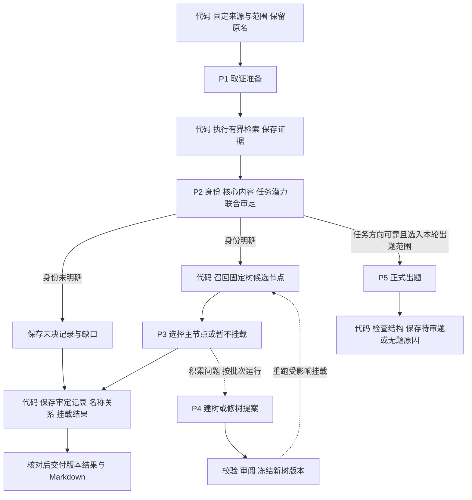

# 概念整理与出题 Pipeline：执行设计 v0.4

日期：2026-09-30。状态：**已获用户授权，第一版代码见 [preparation/concepts](../preparation/concepts/README.md)；未运行真实模型质量试点。** 本文保留设计依据，当前实现与边界以模块 README 为准。V1 使用有界完整树提案，修树后保守重挂载指定范围，尚未实现自动受影响子树计算或跨批全量发布。本篇示意 prompt 不作为生产执行配置，正式正文唯一保存在各模块 prompts/tasks.yaml。本文将 [v0.3 的共同审定原则](PIPELINE_PROPOSAL_v0.3.md) 落到流程、prompt 和交付契约。正式实现遵循 [PIPELINE_SPEC](../PIPELINE_SPEC.md)。数据依据见 [真实数据与案例报告](11-真实数据与案例验证.md)。

## 1. 数量先确定

建议最终保留 **2 条业务 pipeline、5 个业务 prompt**。概念整理是拟建流程，正式出题沿用现有 T2I V2 并改造输入；图片 preparation 保持独立，不计入本次两条流程。

| Pipeline | 负责什么 | 使用哪些 prompt |
| --- | --- | --- |
| 概念整理 | 原概念 → 身份/名称与核心内容审定 → 视觉树与未决清单 | P1 取证准备、P2 联合审定、P3 固定树挂载；P4 初建/修树按批次使用 |
| 正式出题 | 从已有可靠任务方向中选择本轮概念 → 完整题目及判据，或无题原因 | P5 正式出题，复用现有出题原则与输出结构 |

日常每个概念最多依次进入 P1、P2、P3；身份未明确的保留在 P2 结果中，不进入 P3。需要实际出题时另走 P5。P4 不按每条概念运行。这里是逻辑职责与初次执行顺序，失败、重试、精确复用及一次调用的实际用量都须另记，不能直接把 prompt 数当 token 成本。

**新主线不设置分类粗筛，也不另设独立精筛。** 原精筛的核心内容与任务可行性判断并入 P2；正式题目检查并入 P5。第一版独立质量验收先由人工对固定样本进行，不额外设置一条自动模型裁判链；这些方案尚不表示已经验证替代效果。

## 2. 日常增量流程

上述模型节点都消费已提交的固定阶段结果；图中直连只是表示业务依赖。P5 接收已采用的审定版本及显式本轮名单，不在 P2 响应刚返回时自动启动。概念/树的交付不等待出题或图片结果。

| 分支条件 | 处理方式 |
| --- | --- |
| 身份不明确、对应关系缺证据 | 保留原记录、候选义项和缺口；本轮不强行归类或出题 |
| 身份明确，但暂无可靠任务方向 | 正常归类和保留概念；不进入本轮出题池 |
| 身份明确，有任务方向，但没有合适树节点 | 保存待挂载项，交 P4 的批次问题池；导航位置未定不自动否定出题方向 |
| 身份与方向明确，且在本轮任务名单内 | 正式出题按 P5 再检查具体题目 |
| 请求失败或响应不合规 | 记执行失败，原输入不丢；不能记成概念无效、任务 hold 或无合适节点 |

代码按明确结果字段执行这些分支，不用另一套规则猜“简单还是困难”。身份、任务潜力、挂载各有自己的结果；它们不是可互相补偿的综合分。

## 3. P1：取证准备

**目的：明确要查什么，不提前判通过。**

输入：原记录 ID、原名、原别名、全部旧路径，以及本轮已提供的来源上下文。别名和旧路径始终标为未审线索。明确本轮查询、候选和材料长度上限。

Prompt 主体写法建议：

> 你负责为视觉概念审定提出待核解释与检索计划。先区分可能指代、主体和有意义的限定，再提出确认名称对应、身份范围和关键视觉内容所需要核实的断言。核心内容可从结构、属性、功能、过程、关系、规则六方面选择，只列与本概念直接相关的候选，不要求覆盖全部方面。原名、旧别名和旧 taxonomy 均可能有错；不能为了方便出题擅自选义项。候选解释不是已核实事实。本步只提出问题与查询，不给通过结论，不编造来源。

输出最少包含：`source_record_id`、候选义项、待核断言、每个断言的检索请求及意图。检索意图区分“原名到对象的对应”“对象本身的事实”“核心视觉内容与条件”，以防只查到猜测的学名就认为原名已获证明。

**紧随其后的检索由代码执行，不增加一个语义 prompt。** 原名查询固定保留；代码按配置执行允许的请求，保存可定位正文/原始响应、URL/来源版本、时间和断言对应关系。成功、无命中、取回失败分别记录。超出预算的项目如实记未覆盖，不自动追加一轮；网页内容是证据材料，不是执行指令。

## 4. P2：概念、核心内容与任务潜力联合审定

**目的：这是唯一作出概念审定与原精筛结论的主 prompt。**

输入：原始记录、P1 的待核候选与问题、实际取回的证据包及检索状态。P1 内容标为假设，允许推翻；不给模型一份需要维护的预设答案。

Prompt 主体写法建议：

> 依据原输入和真实证据，明确概念的指代、类型、范围和限定；说明规范名是否保持原意。只采用来源支持的断言，不把查询成功、名称相似或旧路径一致当作对应关系成立。学名等级与通名桥接分别核对。不能确认时保留未决，不自动删除、合并或拆分原记录。
>
> 按现有出题原则，提取直接属于概念核心且有依据的内容，保留适用条件与合法变化。结构、属性、功能、过程、关系、规则是发现内容的视角，按需使用，不凑百科条目，不把某个实例的特点推广到全类。
>
> 对一个最有依据的自然方向给出简短任务草案，说明呈现对象和条件、需要观察的核心内容、看似合理但实质错误的表现，以及允许变化和不可确认的限制。联合检查核心联系、值得测的区分潜力、非外围生成负担、可靠判据与自然范围。草案不写完整题面，不泄露核心答案来制造“任务明确”，不靠换义项或不断收窄对象挽救候选。方向不成立时保存已核知识并暂缓，不反推概念不存在。

输出分为三部分，保持简短但具体：

| 输出 | 最少内容 |
| --- | --- |
| 概念身份 | 已明确/待核；原名、规范名候选、类型、范围、限定、证据；原名到规范身份的关系性质 |
| 核心内容 | 关键断言、证据引用、条件与合法变化；未支持的候选放在缺口中，不混入已核事实 |
| 任务潜力 | 可出题候选/暂缓；一个任务草案及可观察判据摘要，或具体障碍 |

输出给出的是可采用候选，经过试点质量验收和相应发布检查后才能成为采用版本。P2 看过 P1，所以两者不是独立双审。出题潜力也不等于已实测的模型区分度。

## 5. P3：在固定树中挂载

**目的：确认概念属于哪里；不改变对象，不修改树。**

输入：P2 已明确的概念身份与核心事实、固定 `tree_version`、候选节点及祖先/相邻边界。候选召回由代码完成，只帮助缩小比较范围；召回结果不是正确标签。不用任务草案里的场景或道具替代概念主体。

Prompt 主体写法建议：

> 按已明确的概念主体、范围及候选节点的纳入/排除条件，选择一个主节点。检查父子关系与相邻节点边界，区分对象身份、用途、使用环境和相关对象。旧路径仅供比较，不默认正确。不得改变概念义项、丢掉限定或自造节点。没有充分合适的候选时返回暂不挂载，并说明缺少的类别或边界冲突。说明采用节点的依据与旧路径需要修正的地方。

输出：概念 ID、树版本、节点 ID 或空值、简短理由、旧路径问题和待修树问题。代码检查节点真实存在、引用完整且主挂载唯一。候选未召回与模型选错都可能造成问题，验收分别看，不能把“选了候选中的一个”当作语义正确证明。

P3 独立于 P2 的直接收益是：树修改后可以只重新挂载受影响的概念，复用没有变化的身份与知识依据。

## 6. P4：初建或修订视觉树

**目的：按批次检查类别本身与整体组织，提出树变更。**

输入：`bootstrap` 或 `revise` 模式、现有树（初建时可为空）、已审概念的分布和代表样本、无法挂载项、边界冲突及相关旧成员。大范围任务按明确范围分批，不把 40 万条一次塞入上下文；范围不足时报告缺口，不声称已覆盖全树。

Prompt 主体写法建议：

> 为给定范围内的已审概念提出视觉导航树或局部修订。每个节点必须有清楚的主体范围、纳入/排除条件、正例与相邻反例；父子关系明确，同层采用一致且适合该领域的划分依据。既有路径是待查背景，不是标准答案。不要把结构、功能、关系等出题方面直接当作互斥主分类，也不按 high/low 或是否有题定义概念类别。优先解释真实边界问题，不为均衡节点数量随意拆并。输出可审阅变更及影响理由，不直接发布树。

输出：候选节点或节点补丁、定义与边界、变更依据、建议重查的概念和相邻范围。代码计算实际影响范围，检查环、孤立节点、ID 与覆盖；语义审阅检查定义和样例。结构通过不自动等于分类合理。冻结新版本后，用 P3 重查受影响的旧成员、相邻节点成员与相关待挂载项。

**首次建树的顺序明确为：样本 P1/P2 → P4 初建 → 校验与审阅 → 冻结 T0 → P3 挂载验证。** 样本必须跨领域、跨粒度，并含旧树错误类型；先前 3,315 条整理稿只能提供候选和案例，不能作为正确答案。没有 T0 时不要求 P2 先产出正式挂载；持续新增时先用现有版本，P4 按批次处理累计问题。

## 7. P5：正式出题

**目的：把可靠方向落实成完整题面与判据。**

输入：已采用概念记录及版本、P2 的核心事实/依据和任务方向、本轮出题要求。按需附现有 preparation 材料；本次概念整理方案不要求图片。旧名用于解析来源，实际审核目标必须是明确的规范定义与限定。

以现有 [出题 prompt](../benchmark/t2i/v2/prompts/tasks.yaml) 为基础，主体调整为：

> 根据已审定概念及其适用范围，设计一道自然、值得测、任务独立明确的图像生成题。上游任务方向是候选，可以改进呈现，但不能擅自改变义项或删掉有意义的限定。已审事实仍须与当前任务对应；发现关键冲突时报告疑问，不悄悄重写概念记录。
>
> 最终 instruction、point、basis、criterion 必须指向同一对象、范围和条件。逐项检查知识可靠、任务需要、图像可判；题面写明必要条件，核心答案留给作答模型。判据描述具体正确表现、实质错误、合法变化与无法确认的边界。不能以元素都出现代替关系正确，也不能把单个状态当作完整过程。保留原有五条质量门槛，不能因为上游候选通过而保证必须有题。无法形成合格题目时返回空题及具体原因。

输出沿用当前结构：`question = {instruction, test_points[{point, basis, criterion}]}`，或 `question = null` 与 `reason`。这里只产生待审题；作者自检不是独立质量认证。作者获得了上游方向，不再称为独立发现考点。

P2 检查是否存在站得住的方向；P5 检查真正成稿的任务有没有遗漏条件、泄露答案、出现隐藏要求或误判合法表现。保留这个区别，才能复用概念知识而不把所有潜在问题推迟到出题。

## 8. 代码承担什么，最终交付什么

代码负责固定来源和本轮分母、执行检索、记录真实证据、预算与缓存、候选节点召回、结构和引用检查、名称关系对账、树变更影响分析、版本写入和 Markdown 渲染。代码不负责语义放行，不将模型自报信心换算为通过门槛，也不把缺材料或失败的概念从统计中滤掉。

正式实现拟放 `preparation/concepts/`，同一 `config → run_pipeline` 入口支持概念处理、初建/修树及交付的明确阶段/模式；P1–P4 的 prompt pack 由该模块维护。P5 仍由 `benchmark/t2i/v2/` 维护。输入与阶段结果采用固定 DatasetRef / typed Lance，公共列所有权与现有 writer 对齐；本目录只保存设计与阅读导出。不得把本文中的 prompt 草案当成另一份生产执行配置。

| 阅读交付 | 内容 |
| --- | --- |
| 概念审定 MD | 原名/规范名、身份范围、核心内容、证据与条件、任务候选或障碍 |
| 视觉树 MD | 固定树版本、节点边界、已挂载概念；生物等级单列，不用树深度冒充等级 |
| 变更与未决 MD | 原名关系、改名/范围变化建议、旧新路径、未核身份、未挂载及执行失败 |
| 出题结果 | 按实际选中的概念交付待审题/无题原因及固定结果引用，不要求给全库出题 |

第一阶段只保存规范化候选与稳定来源/身份关系，不物理删除、合并或拆分主表行。未来找图仍可经“规范身份 → 已确认原名 → images.concepts”解析；此处不修改图片审核或发布状态。

## 9. 调用范围与质量边界

首次尝试、每概念单独请求时：N 条输入对应 N 次 P1；P1 成功且检索状态已记录的项目进入 P2；身份明确且已有树的 M 条进入 P3。P4 按实际批次计请求，P5 仅按选定的出题名单运行。批处理、缓存和失败可能改变物理请求数，实际用量按调用日志记录，不把五个模板理解成每条固定付五次费。

只改树：复核影响范围后重跑相应 P3；原名/定义/证据或核心审定协议变化：重跑受影响的 P1/P2，并评估挂载和题目是否受影响；只改题面要求：重新判断 P5 的请求身份，事实未变化的上游记录可复用。不能仅凭同一概念名或 ID 复用旧响应。

试点先验证身份/范围正确性、核心断言的来源支持、任务方向的实际质量、树边界与挂载、原名追溯、各类未决比例和真实成本。使用未参与 prompt 调整的固定样本进行独立核对；测试响应结构只证明程序契约。模型自检、P1/P2 一致以及顺利出题都不构成独立准确率证据。通过试点后再决定模型、批大小和扩量范围，不在本稿预报全库费用或自动通过率。
