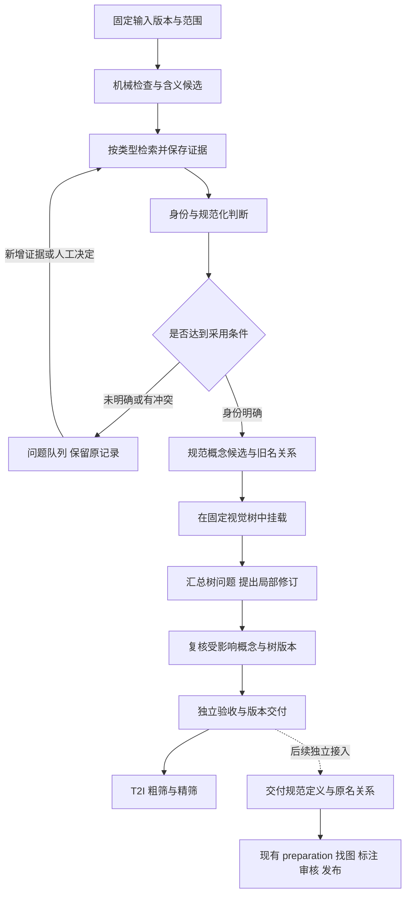

# 概念清洗与视觉分类 Pipeline：讨论稿 v0.1

日期：2026-09-30。状态：**基于真实数据与小规模案例验证的设计提案，待共同讨论定版，尚未实现生产流程。**

**当前讨论入口已更新为 [v0.3](PIPELINE_PROPOSAL_v0.3.md)。** 本稿保留研究细节及 preparation 代码核对；其中 P1/P2/P3 的规则与模型语义分流已被后续统一审核方案替代，不再作为第一版实现建议。

2026-09-30 讨论修订：按用户提出的“先不考虑图片”，核对现有 preparation 的 prompt、载荷构造、复审与发布代码后，将图片审核移出本流程的必经阶段、验收和预算；保留名称与定义交接契约。核对结果见第 8 节。其余未定策略仍是讨论稿。

工程实现必须遵守 [仓库 PIPELINE_SPEC](../PIPELINE_SPEC.md)。已有保全和追溯约束见 [分类重建规范 v1.3](TAXONOMY_REBUILD_SPEC.md)；本稿提出进一步的业务设计与待定选择，不把建议默认为已批准。事实依据见 [真实数据与案例验证](11-真实数据与案例验证.md)，其中明确区分全量统计、目的性案例、随机抽样初读与外部查证。

## 1. 推荐方案与本版边界

建议建设一条有两个核心任务的流程：**先明确概念的身份、含义和依据，再维护视觉树并安排位置。** 旧名与旧图追溯贯穿全程；图像审核和 T2I 筛选继续由已有流程负责。

本期不依赖图片表、图片可读性或图片匹配结果才能完成概念/树交付，也不批量读取图片或调用视觉审核。必须保留原记录、原名、规范身份、含义和定义版本，供现有 preparation 以后接入；这项关系保全不需要先审一遍图片。

第一版的重点是交付可审阅的概念决定与树变更，不直接批量覆盖 40 万名称。先用真实样本证明“改得对、找得回、未决项不丢”，再扩大范围。

本轮实测迫使方案保留以下区分：

| 不能混为一件事 | 数据依据 | 设计决定 |
| --- | --- | --- |
| 名称唯一 / 身份唯一 | name 全部唯一，但 33,283 个别名字符串被多记录共用 | 名称只作历史关联键，等价关系另审 |
| 名称合法 / 具体物种 | 天牛是宽类群；雄鸟、指名亚种依赖不同程度的上下文 | 粒度独立记录，不为“到种”强改原意 |
| 学名命中 / 采用分类地位 | Mentha canadensis 在本次 COL XR 与 Kew 中处理不同 | 保存来源及不同断言，再按明确策略采用 |
| 概念成立 / 图像匹配 | Axe 品牌木制棒球棒有依据，名下样图却是斧头 | 概念与图片分别判断 |
| 图像可读 / 正例可用 | 12 张样图均通过 SHA 与解码，却包含皇冠、盾牌和错义图片 | 存储检查不代替视觉审核 |
| 完成处理 / 可正式采用 | 部分名称即使查过仍缺上下文或一手证据 | 完成、未决、采用状态分别报告 |

不建设第二棵“知识库分类树”。这里的对象类型、学名、定义和依据，是保证视觉分类及图片复用不出错所需的最小身份信息。

## 2. 最关键的业务定义：究竟审核什么

### 2.1 概念不必都是现实中的单一实体

至少需要支持以下输入形态，而不能统一要求“查到唯一百科条目”：

| 形态 | 真实数据示例 | 要核实的内容 |
| --- | --- | --- |
| 命名实体 / 命名类群 | 猎空、Forest Fox、天牛 | 具体指代、名称关系、来源身份、适用范围 |
| 通用类别 | 剪刀、小区活动室 | 定义是否明确，边界能否说明；不要求唯一实例 |
| 带限定的概念 | 普通翠鸟雄鸟、白色牦牛 | 主体身份以及性别、颜色、阶段等限定是否保留 |
| 部件 / 状态 / 动作 | 脸部轮廓、猫耳菊花茎分叉、冲洗伤口 | 描述的对象、关系、条件；避免只取主体词 |
| 品牌产品类别 / 型号 | L'Oréal Paris Conditioner、兰博基尼Aventador | 类别、系列、版本、单一型号分别是什么 |
| 组合场景描述 | 河边野餐、星罗棋布的帐篷 | 组合是否明确、自洽；不凭缺少百科条目判虚假 |
| 虚构角色 / 自由虚构场景 | 猎空、时间扭曲峡谷 | 前者核查作品身份，后者标明是描述性场景，不冒充现实地名 |
| 抽象 / 关系知识 | 国际经济法学、Newton Scale | 定义与范围；视觉载体和评测价值另判 |

**成立性不是简单的真/假标签。** 推荐至少分开记录：

- `execution_status`：是否处理成功、失败、预算未覆盖；这是技术状态。
- `resolution_status`：含义明确、存在多义、上下文缺失；这是身份解释状态。
- `evidence_status`：已有支持、证据不足、来源冲突、存在反证；这是依据状态。
- `concept_kind / referent_kind / qualifiers`：对象类型、现实/虚构/抽象属性以及限定条件。
- `adoption_status`：候选、可采用、待复核、退役；这是当前版本的业务决定。

字段枚举在实现时收敛，不能把其中某一维度压成另一个。技术超时不能算“概念不存在”；非物种不能算无效；来源冲突也不等于没有对象。

### 2.2 同一原记录可能已经混入不同原意

`白虎`、`幽灵`是多义/混合输入的实际例子；`雄鸟`的 60 条路径则可能涉及上下文被压掉。源记录继续保留，允许产生多个**候选义项**，但不立即制造多个已核验概念。

本期恢复顺序为：原采集上下文或叶子来源 → 可核查正文和名称资料；仍无法恢复的保留未决，不强制转入图片审核。以后 preparation 的独立图像观察可反馈问题，但旧路径和旧图片不能相互印证后就当外部事实。原始信息已经丢失时允许永久保留“原意未能恢复”。

例如，不根据“雄鸟”挂在 60 个鸟类路径下就补造 60 个新名称；只有恢复到某一具体来源指向某物种时，才建立相应带性别概念，并单独决定哪些旧图属于它。

## 3. 总体数据流



本流程的完成点是概念、名称关系和视觉树的版本交付，不等待图片结果。虚线之后是后续接入：使用现有 preparation，先补名称/定义适配，再按需要开展图片处理。T2I 的具体用图任务若要求图片通过，由那个任务检查相应结果，不回头阻塞概念/树发布。

第一次建树和持续更新共用身份规则，但采用不同树工作方式：第一次基于跨领域样本设计骨架；以后先挂到已发布版本，积累无法容纳和边界冲突的问题，再批量修订。

## 4. 阶段契约：哪些交给代码，哪些需要模型

| 阶段 | 主要工作与输出 | 需要模型吗 | 放行与异常处理 |
| --- | --- | --- | --- |
| P0 固定与体检 | 概念来源引用、完整输入名单、schema、旧路径/别名统计 | 否 | 配置、来源、主键错误在调用前失败；不要求图片表输入 |
| P1 解析与候选 | 可能的对象类型、主体、限定、同义/多义候选 | 规则处理明确形式；语义难例可用模型 | 不在此阶段宣布“真实”或合并；原路径标为低信任上下文 |
| P2 证据检索 | 外部 ID、名称用法、正文片段、支持/冲突断言 | 查询以代码为主；模型可建议检索词 | 查询失败、无命中、命中上位类、冲突分别记录 |
| P3 成立性与规范化 | 实际含义、证据支持范围、规范名建议、关系类型、待核问题 | 结构化规则可放行部分项目；模型处理需要综合判断的项目 | 结论引用真实已取回的证据 ID；没有依据不补造 |
| P4 身份决定 | 保留、改名候选、同义候选、义项拆分建议，以及定义版本 | 代码校验；高影响决定需证据复核 | 不执行模糊相似度自动合并；MVP 不物理合并或拆行 |
| P5 视觉挂载 | 固定树的候选节点、主节点、属性、理由和未挂载状态 | 检索/规则加有边界的模型选择 | 找不到合适节点可拒绝选择；不能逐行自由造父类 |
| P6 树修订 | 新节点/改定义/拆并节点/迁移的变更提案 | 模型可提议，代码算影响，审阅后采纳 | 受影响旧概念重新检查；变更前后均可查看 |
| P7 名称与定义交接 | 原记录/原名、规范身份、已确认名称关系、定义/限定及版本 | 否；复用 P3/P4 决定 | 原名不丢、关系无悬空；不查图、不产出图片通过状态 |
| P8 验收与发布 | 主键对账、证据与关系检查、独立样本评价、Markdown、固定结果引用 | 结构验证不需模型；语义验收不能用自评替代 | 写表成功且发布条件达到后登记采用版本 |

不为每一阶段强制安排一次 LLM。也不承诺某个固定比例可以免模型；自动路线的覆盖与错误率要由试点决定。

## 5. 证据核验：按对象类型选择依据

### 5.1 生物名称需要两段证据

第一段证明“原名称/通名指向哪个分类对象”；第二段查该对象在指定来源中的名称、等级、接受状态与外部 ID。仅把模型猜出的拉丁名查到，不能证明第一段成立。

推荐保存的最小信息：`source_namespace`、来源清单/发布版本、查询内容、原始响应引用、抓取时间、名称用法 ID、名称用法 rank/status、接受对象 ID/rank、中文/通名桥接依据，以及采用或暂缓理由。

已实测的规则：

- Cerambycidae 的科级命中可支持宽类群，不能升级为具体种。
- Alcedo atthis 的种身份与“雄鸟”限定分开；分类数据库不会替图片确认性别。
- 同名查询返回 SYNONYM 时保留原名称用法与接受对象两条信息；不能只取 usage.rank。
- 像 Mentha canadensis 的来源分歧必须保存。建议植物优先按选定的专业分类来源形成采用口径，冲突留标记；具体来源策略待讨论。
- 没命中可能因为拼写、语言、覆盖或新分类，并非“AI 编造”的充分证据。

GBIF 当前支持不同 taxonomy，必须显式选择匹配来源；实施时采用官方接口并保存真实响应，避免不同默认口径混用。[GBIF 官方说明](https://techdocs.gbif.org/en/data-processing/taxonomy-interpretation)。IPNI 的命名信息与 POWO 的接受状态职责不同，不能把“名称发表过”等同“当前接受种”。[IPNI FAQ](https://www.ipni.org/faq)。NCBI 自身也提示不能把它作为分类命名的唯一权威；它可作为具体查询来源之一。[NCBI Taxonomy](https://www.ncbi.nlm.nih.gov/Taxonomy/Browser/wwwtax.cgi)。

### 5.2 其他对象采用自己的身份标准

器具/产品优先查制造者或专业机构资料，区分品牌、产品类别、系列与型号；角色/作品查作品方或馆藏，保留作品版本；地点查地理或管理机构资料，核对实体类型和范围；通用类别与动作核查定义与条件，不要求都拥有外部唯一 ID。

对组合描述，审核限定是否自洽、有意义且不偷换主体。可以成立为描述性视觉目标，但不能伪装成已有命名物种、地名或型号。此类是否全部进入主树，是第 13 节的待定事项。

### 5.3 证据保存与检索成本

同一来源、相同查询与参数可复用已保存的响应。对同一植物在多个限定概念中出现的情况，复用主体身份依据，分别审核限定与图片关系。文献或接口发生变化时创建新证据版本，不改写旧判断所依据的内容。

默认只收集当前决定需要的定义和关键边界，不先为 40 万概念写长百科。对检索设置查询数、文档长度、超时和来源范围预算；用完预算记“本轮证据不足”，不把无限追查藏在一次模型调用里。

旧生成文本、旧树、下载关键词和无出处模型知识只能作为线索。检索页面的正文按资料处理，不执行其中的指令；只允许模型引用实际取回的证据 ID。引用真实页面也不自动保证推论成立，验收还要检查来源是否支持具体断言。

## 6. 名称、身份、定义：推荐怎样落地

### 6.1 一期推荐保留 name 作为兼容键

目前图片、文章与若干下游都按 name/concept 字符串关联。推荐第一阶段保留公共 `name`，将规范名称放在新增的 `canonical_name` 或本轮结果视图中，并建立稳定概念 ID 与来源关系。用户看到的树可显示“规范名（原名：…）”。

这是一种渐进接入选择，不是说旧名永远不能改。等消费者能通过稳定 ID 与解析关系工作后，再决定是否迁移 name；不能在只有前端显示更新时就宣称所有下游已支持新身份。

未明确的来源行先使用稳定 `source_record_id` 跟踪；已确认的规范概念使用 `concept_id`。来源 ID 标识“这条输入”，不承诺它对应唯一真实对象；概念 ID 标识已明确的语义身份。两种 ID 不能混用，也不由可变显示名或分类路径重算。

**一期发现同义和拆分只登记候选，不物理删并主表行。** 这样不必在首次建体系时同时完成全库去重、全消费者改造和图片重标。需要在阅读视图聚合时，必须明确采用哪一版已确认关系、保留全部来源，并分别统计来源行数与规范身份数。

### 6.2 关系类型与定义版本

| 决定 | 同一身份吗 | 需要保留什么 |
| --- | --- | --- |
| 拼写、译名、同义表述修正 | 有依据时是 | 原名、新名、范围不变的依据 |
| 确认两个来源同义 | 可以对应同一规范身份 | 每个来源记录和关系证据；MVP 不物理合并 |
| 范围缩小/扩大、错指对象修正 | 不能自动算同一身份 | 原定义、新定义与变更类型，必要时建立新身份 |
| 一名多义拆分 | 对应多个候选身份 | 未决源行、候选义项、后来采纳的关系；图片逐项消歧 |
| 知识措辞更新 | 可保持身份 | 描述版本、变动的事实与影响范围 |
| 分类移动/节点改名 | 保持身份 | 树版本、旧新节点、受影响的下游输入 |

精确等价、近似相关、上下位必须分开；向量相似和共享别名都只能召回候选，不能通过连通分量把一大串概念自动合并。这个区分与 SKOS 对概念、标签及不同关系的分离一致；本项目借鉴语义区分，不要求额外建设 RDF/OWL 系统。[W3C SKOS](https://www.w3.org/TR/skos-reference/)。

## 7. 视觉树怎样建立与持续调整

### 7.1 主树定位

这是便于视觉对象浏览、采集与任务组织的导航树，**不是保证能凭外观区分每个叶子的分类器，也不是生物分类树的翻版**。每个已采用概念有一个主挂载；其他用途、地点、原材料和文化联系作为属性或带类型的关联。

例如，剪刀不因用于实验室就变成场景；丹翠雨林不因涉及生态就变成动物；普通翠鸟雄鸟不因保留性别限定就另造一个物种。

一期建议沿用三层导航的阅读习惯，但重新验证类目定义与覆盖，不把现有 16/108/352 个节点当定额。生物科学等级单独存，不靠把导航加深来冒充定种。复杂分支若确实需要变深，应作为一次明确的树版本与消费者接口变更，不在逐行处理时随意追加层级。

### 7.2 每个节点必须有边界

树节点最少包含稳定 node_id、parent_id、名称、层级、纳入/排除条件、划分依据、正例、相邻反例和版本。只存“名称＋父名称”无法可靠处理新概念。

对不同大域允许不同的适当划分，但同一组兄弟节点应主要采用同一个依据。身份与用途交叉时有明确优先规则；容量不均衡仅触发检查，不能为了节点大小相等而拆出不自然的分类。

第一次没有可用新树时，先从已明确概念中选跨领域、跨粒度的样本，结合全量名称分布提出骨架；语义近邻仅帮助找代表项与边界项。逐个节点写定义和相邻反例，再用未参与节点设计的概念尝试挂载，修正遗漏后冻结首个 T0。现有 3,315 条整理稿可以提供候选节点和难例，不能直接当验收答案。此后 P5 才开始批量使用固定树，P6 处理新增边界问题。

### 7.3 挂载与修树分开

逐概念先检索固定树中的少量候选，模型只在这些节点及“无合适节点”之间选择；保留所见候选列表。候选漏召回与候选内误选分别评估，不能用强制选最近节点掩盖新领域。

未容纳项按含义聚集形成变更建议：新增节点、细化边界、合并重叠节点或移动父类。每条提案附真实概念、冲突原因、受影响旧概念、旧新路径差异和验收结果。冻结新树之前，逐行流程继续使用旧版本或停在未挂载状态。

受影响范围不仅是改动节点的已有成员：分拆/改定义还要检查相邻节点、已拒绝项及可能被新节点吸引的近邻。近邻检索不是完整性证明；定期用未参与设计的样本检查漏迁移和过度迁移。

## 8. preparation 核对：图片审核可复用，本期只交接概念

### 8.1 已核对的实际能力

**现有 preparation 可以承担原方案中的概念—图片相关性与身份审核，不需要在概念清洗中再建设一套。** 本结论来自正式入口、prompt、输入构造与发布逻辑的核对，不是仅凭模块名称推测。

| 已有模块 | 实际判断与结果 | 不能据此推出什么 |
| --- | --- | --- |
| [annotation](../preparation/images/annotation/README.md) | 中性描述只看图；`score_concept` 看实际图片、名称、别名及可选知识，输出 `match_status`、`kb_match`、`identity`、`focus` | `consistent` 或高分不等于审核发布；也没有查证概念名称在外部世界是否成立 |
| [review](../preparation/images/review/README.md) | 区分目标本体、相关活动、仅文字提及、同名异义、无关和不确定；输出 `keep / pending / exclude`。初审 keep 的图片需独立复审也 keep；复审缺失或不通过转 pending | 两模型通过不是人工认证；相关背景可保留，不等于可直接作为目标识别正例 |
| [catalog](../preparation/images/catalog/README.md) | 维护 SHA/URI、可用性、尺寸等图片目录信息 | 能读取、哈希正确不证明内容匹配 |

关键源码位置：[annotation 匹配 prompt](../preparation/images/annotation/prompts/tasks.yaml)、[review 关系与细粒度身份 prompt](../preparation/images/review/prompts/tasks.yaml)、[输入构造与复审合并](../preparation/images/review/operators/images.py)、[审核结果发布](../preparation/images/review/operators/publication.py)。

review prompt 已明确：只能确认上位类别或近似外观、不能确认所要求的具体物种/对象时，必须 pending；卡片标题不能证明配图正确；通用药材切片不能仅因名称相近就认定来自指定植物种。`related_activity` 也必须支持与指定对象的关系，不能拿“同属、同类”代替。

代码将审核记录保存到 `concept_assessments`，并派生 `published_concepts`；具体关系在 `identity_relation`，支持范围在 `visual_support`。下游若需要目标本体正例，至少还需核对这些字段及任务所需特征，不能只检查名称在 `published_concepts` 中。review 本身不负责未提供的训练/评测任务适用性。

当前 annotation 默认模型为 `qwen3.8-27b`；review 的策略校验限定初审 `qwen3.8-27b`、复审 `gemma-4-31b-it`，均通过配置的模型服务调用，不是在 pipeline 中调用本次 Codex 会话。历史运行实际采用什么模型，仍以其固定请求记录为准。

### 8.2 两条流程分别解决什么

概念清洗回答“**普通翠鸟雄鸟指什么，物种和雄性限定有什么依据？**”；图片审核回答“**这张图能否支持它是普通翠鸟，而且是雄性？**”。前者在本期完成，后者留给现有 preparation。图片看起来像某类鸟，既不能证明一个可疑名称有效，也不能替概念选择丢失的原意。

此前 12 张图片检查只是用来发现设计边界的个案研究，并未核对它们是否属于当前 review 的已发布结果；不能据此认定已有 preparation 错误放行。此次也未测量现有审核的全库覆盖率或准确率。

### 8.3 后续接入需要补的是概念输入适配

现有能力可复用，但“清洗后的概念已经自动接入”尚不成立：

1. **旧名负责找回资产，规范定义负责解释审核目标。** 保留“规范身份 → 已确认来源/原名 → images.concepts → SHA/URI”。本期只交付前半段关系；后续图片流程按固定版本找图、按 SHA 去重并保留命中来源。此前 Axe 案例经原名找回 10 张，证明关系方法可行，不证明图片匹配。
2. **提供可信的身份说明。** annotation 已支持 `{concept, knowledge_text}` 的固定知识来源，但当前按名称关联，并直接使用主表 aliases；它尚不会读取拟议的稳定 ID、已审别名与定义版本。review 的 `BatchImageSelection` 已支持 `image_identity_definitions['legacy:<原名>']` 或 `concept_record`；应把规范名、对象类型、定义、学名/外部 ID（适用时）、性别/阶段等限定适配成实际身份说明，保留外部版本绑定。不是让图片模型从原来的混杂别名中自行猜测。
3. **图片资产复用与旧判断复用分开。** annotation 的关系 ID 绑定名称、别名/知识摘要、图片输入及协议；review 复用也检查原定义和请求绑定。含义或实际输入变化，不能仅靠改名搬运旧通过结论。若需补审已描述的图，不能使用会把整张图排除的 `skip_annotated_images=True`；按现有单独概念评分模式和明确范围接入。

这些是以后接入的适配要求，本轮未修改现有 preparation、未写公共表、未启动模型，也不把适配完成当作本期清洗与建树的前置条件。

### 8.4 本次验证范围

已运行现有 [复审测试](../preparation/images/review/tests/test_confirm_images.py)、[标注身份与校验测试](../preparation/images/annotation/tests/test_annotation_units.py)，以及 [发布契约测试](../preparation/images/review/tests/test_visual_publication_contracts.py) 中的 `test_incomplete_visual_review_cannot_publish` 和 `test_v2_nested_limitations_do_not_require_legacy_duplicate`，共 **16 项通过**。覆盖复审分歧/失败不放行、原判断不进入独立复审 prompt、显式定义进入载荷、知识变化改变请求身份、不完整发布结果不放行等行为。

测试使用隔离数据与模拟响应，没有额外模型调用；它们验证程序契约，不证明模型能可靠区分全部物种。是否需要提高图片审核质量，后续应在 preparation 自己的真实评测中判断，不在本流程再重复审核。

## 9. 逻辑数据结构与唯一维护方

以下是建议契约，具体 Arrow schema 在定版后实现；不要求每一行都建设新的公共主表。

| 记录 | 一行代表什么 | 必要关系 |
| --- | --- | --- |
| 输入快照 | 一条来源记录 | 固定 URI/version、来源键、原名、全部原路径、别名、批次 |
| 证据 | 一次来源查询或一条可定位断言 | 来源/版本/时间、查询、响应引用、所支持与不支持的判断 |
| 概念决定 | 一条来源在本轮的最终解释或未决结果 | 状态、类型、定义、限定、证据、模型/人工决定来源 |
| 身份关系 | 来源与规范身份的一条候选或已确认关系 | 等价/修正/拆分等类型、版本、依据、被替代关系 |
| 树节点与变更提案 | 一个节点或一次变更 | node_id、父节点、定义、正反例、tree_version、影响范围 |
| 挂载结果 | 一个规范概念在固定树中的主位置或未决状态 | concept_id、node_id、候选、理由、范围/树版本 |
| 下游概念交接 | 一个规范身份及其来源名称关系 | 稳定身份、原名/规范名、已审别名、定义/限定及版本；本期不展开 SHA |
| 运行与发布摘要 | 一个本轮阶段/发布状态 | 完整分母、各状态计数、已提交结果引用、模型用量与错误 |

公共概念与已发布挂载仍以 `master_concepts.lance` 为唯一权威，不恢复已退役的独立 concept_taxonomy 权威表。候选挂载、证据与审核表是版本结果，不是另一套可以独立修改的当前主数据。

collect 负责输入来源，概念清洗负责采用的定义/名称/身份与树变更；图片各模块继续维护自己拥有的列。连续新增的旧分类输入必须先进入待审核范围，不能由采集直接并入已审定主路径、再把旧树污染回新树。具体公共列所有权在实现前与现有 writer 对齐。

概念—SHA 候选关系、图片分数、审核和发布记录由后续 preparation 维护，不是本期清洗的必需结果表。

## 10. 模型与 prompt：先比协议，再选型号

本轮没有比较多个生产模型，不能根据聊天中的个案表现指定“某模型足以处理全库”。已有 fine_screening 的模型对照针对 T2I keep/hold，也不能转用为概念核验成绩。

建议只设置三个必要的语义任务，初期可由同一模型执行，但保存不同协议与结果：

| 任务 | 实际输入 | 关键输出 | 不应承担什么 |
| --- | --- | --- | --- |
| 含义解析 | 原名、必要上下文、原别名的未审标记 | 主体、类型、限定、候选义项、缺失信息 | 不自行宣布证据充分、不替用户选一个方便的义项 |
| 证据判断与规范化 | 候选义项、实际检索证据及冲突 | 支持范围、规范名建议、关系类型、未决项和证据 ID | 不编 URL/学名/型号，不把所有资料拼成无边界长描述 |
| 固定树挂载 | 已明确概念、节点定义和相邻反例 | 一个主节点或无法挂载、理由 | 不改概念含义、不生成自由路径字符串 |

模型输出后代码检查 ID 完整性、允许枚举、实际证据引用、限定是否丢失、名称关系和等级是否矛盾。代码能发现结构和契约错误，不能因此证明全部语义正确。

复核模型若看过初审理由，叫“有依据的复核”，不能叫独立盲审。用于比较协议/模型的独立判断应读取同一原输入与证据，不读取另一模型答案。模型间一致率只作为诊断，不能代替外部证据和人工核对。

正式 prompt 固定在未来模块的 YAML pack；本文描述输入输出与规则，不另存一套可执行 prompt 副本。每次修改绑定实际正文、响应 schema、模型/部署和证据摘要，原生日志保留完整请求与响应。

## 11. 质量与成本如何得到可信结论

### 11.1 已有证据能支撑什么

已完成的全量扫描可以支撑规模、关联与异常分布的判断；6 次学名请求和 12 张图片可以检验具体规则是否遗漏实际情况。它们不能估计全库准确率、模型自动处理比例或 token 单价下的总费用。

下一步建议先做小规模、端到端的影子试点：从本报告问题类型中选一批回归项，再加入独立随机样本和新领域样本。正式评价集在调整 prompt 和树之前锁定，不能一边看答案调规则、一边用同一批数据证明质量提高。

样本分为“方案开发”“阈值/策略校准”“锁定验收”；近同义记录、同一来源的变体和共享主体的简单改写尽量按组分配，避免近重复泄漏。目的性难例用于检查失败方式，随机样本用于估计覆盖和误差，二者分开报告。

### 11.2 至少分开量这些指标

| 指标 | 分母与用途 |
| --- | --- |
| 来源保全 | 全部本轮来源 ID；要求无丢失、无静默改原文 |
| 明确身份覆盖率 | 全部本轮输入；未决和失败不从分母移走 |
| 自动采用精度 | 经独立核对的自动采用样本；尤其看错误合并、错误缩小范围 |
| 不当否定率 | 经核实成立却被系统判无效/退役的样本；避免伤害罕见概念 |
| 名称/等级核验正确性 | 需要该项核验且有独立参考的项目；主体等级与限定分别看 |
| 树候选召回 / 挂载正确性 | 分别检查正确节点是否出现、出现后是否选对；宽泛上级命中不冒充叶级正确 |
| 名称关系保全 | 全部本轮来源 ID / 原名；确认关系可追溯，未决关系不伪装成同义，图像接入后再核对资产集合 |
| 实际成本 | 每新增有效概念决定、每采用概念与每次树修订的真实用量及人工时间 |
| 增量稳定性 | 未受影响概念的身份是否稳定、树变更影响多少项、哪些项重新付费 |

图片可判率、错图接受率及每张合格图片的成本由 preparation 单独评估，不作为本期验收条件。采用门槛不能由模型自报 confidence 直接确定。误合并与错误缩小概念范围比暂缓更难修复，建议优先约束错误采用，再提高覆盖率；具体质量目标和人工投入待讨论。

若希望用“抽样零错误”支持误差上界，应按目标决定样本量。例如独立同分布的自动采用样本中，零错误时单侧 95% 上界为 `1 - 0.05^(1/n)`：n=600 约为 0.5%，n=3,000 约为 0.1%。这只是抽样条件成立时的统计说明；不是当前已达到的准确率，也不自动保证每个稀有领域。样本相关、选择偏差或参考答案有误时不能直接套用。

### 11.3 预算模型

本期成本按约 38.5 万条概念及树维护估算。此前统计的约 216 万图片资产、约 290 万历史概念图关联元素不进入本期模型调用量；以后需要用图时，由 preparation 按实际范围另设预算。

建议按节点记录并估算：

```text
本期费用 = 概念判断与树维护各模型节点真实输入/输出用量费用
       + 检索/数据库与向量计算费用
       + 失败重试费用 + 人工核对投入

全量预估 = 按真实领域与问题类型加权的试点单位成本
         × 对应待处理量
         + 稀有/未覆盖问题的明确预算余量
```

目前没有新的生产请求用量实测，不填“只用 10% 大模型”“总共多少元/几小时”等数字。先测不同路线的覆盖、重试、平均及尾部用量。批处理是否省钱要同时看错配/漏项率和重试代价；疑难项通常应与容易项分开试验，但具体批大小不先拍定。

可确定的省成本方向是：同一证据不重复抓取；相同主体的事实复用但限定分别判断；树定义按版本共享；只重算真正受输入、证据或规则变化影响的记录。图片侧复用留给 preparation。不能靠相信弱旧树或把未知都判通过来省预算。

## 12. 工程落地与发布安全

### 12.1 单一正式入口，复用已有模块

建议正式实现放在 `preparation/concepts/`，一个 `concepts_pipeline.config(...) → run_pipeline(config)`，配同入口 notebook、operators、prompts、tests 和 README；目录为拟议位置，尚未创建。

阶段结果用明确 schema 的 Lance，主线可见固定读表、筛选、关联、模型调用、校验和写表。`through` 可控制停在候选或完整影子结果；发布是该入口的明确阶段，不另起 JSON/脚本框架。现有 taxonomy-rebuild 继续保存设计、冻结稿与 Markdown 导出。

本体处理不重建图片标注系统，不把已有源码里偏离统一规范的历史实现当作新实现模板。跨流程以正式入口和固定结果引用交接；现有跨 pipeline 编排能力的待办不在这里假定已经完成。

### 12.2 配置至少显式暴露

固定概念输入/证据/旧树引用、本轮范围、领域来源策略、是否允许命名修正、是否只登记拆并候选、模型与部署版本、各节点请求预算、检索预算、并发/超时、树版本、采用策略和目标写入模式。不要求配置图片来源；默认先生成候选，不在打开 notebook 查看时运行模型或写公共表。

`concept_id`、定义版本、证据版本、tree_version 与图片审核协议分别保存。模型缓存按实际输入和配置判断，不能仅按概念 ID；只变运行名/并发通常不应重新推理，图片未变而概念定义改变时不能假装旧关系评审仍是同一请求。

### 12.3 迁移顺序

1. **影子结果。** 对固定主表做候选清洗、身份关系、树与下游概念交接结果，公共表保持原状，检查与旧流程差异；不展开或审核图片。
2. **兼容读取。** 逐一改造消费者以接收规范名/定义及稳定身份，同时保留历史名关联；先验证名称变更、未决、空结果和旧图保全。
3. **明确发布。** 审阅候选补丁，只修改负责列；使用期望版本与冲突检测。多表结果全部提交并核对后，登记一个绑定固定引用的发布，再切换下游。
4. **逐步扩展。** 在通过质量门槛的领域扩大覆盖，其他领域继续候选状态。后续是否物理合并/拆分主表另作明确迁移。

Lance 多表写入不应被宣称为天然的跨表原子事务。写表失败不能登记成功；不能让消费者读到“新名字配旧解析关系”的半套结果。回退采用发布引用切回旧版本，不能 overwrite 主表来抹掉别的流程后来写入的内容。

### 12.4 必要验收案例

本期至少覆盖：改名后来源身份和原名仍可追溯、同义候选保留全部来源、错别名不自动合并、范围缩小不能写成等价改名、失去父类的雄鸟不补造物种、宽类群不升级到种、分类来源冲突不静默覆盖、技术失败不填业务否决、没有图片输入也能交付概念/树、树修订只改变应变内容、发布冲突不覆盖其他 writer、相同请求复用与内容变化不误复用。

以后接 preparation 时，再增加非空改名查图、同义图片集合去重、范围缩小不继承旧通过、缺图不丢概念等交接验收。原有真实查图回放作为研究证据保留，不演变成本期逐概念查图任务。

先用隔离表和模拟响应验证数据契约，再运行真实小样本测质量与成本。结构测试通过不等于模型质量通过，模型小样本通过不等于全量吞吐通过。

## 13. 建议共同讨论的决定

本轮已收敛的范围：**先做概念清洗与视觉树；图片相关性/身份审核交给现有 preparation，本期只保留名称和定义交接。** 以下策略仍待讨论。

| 决定 | 本版推荐 | 为什么还需要讨论 |
| --- | --- | --- |
| 宽类、角色、属性和组合场景是否保留 | 都保留来源；成立的宽类/复合目标可纳入，纯任务化描述单独标形态 | 随机样本里这类输入真实存在；若只收物种/具名实体会大幅改变用户概念集合 |
| 第一阶段允许改到什么程度 | 展示规范名、保留旧 name；拆并先登记候选 | 降低断图和下游不兼容风险，代价是过渡期同时显示原名和规范名 |
| 生物来源冲突怎样采用 | 按领域指定主参考口径并保留其他断言；冲突项不默认全自动通过 | 实测已经有种/亚种差异，需要统一可解释的采用规则 |
| 主树深度与多归属 | 先一条主路径、三层阅读；其他关系作属性，深度变化另发版本 | 与既有交付和粗筛接近，同时避免把科学等级硬塞进三层 |
| 质量与覆盖如何取舍 | 对错误身份合并、错误范围修正从严，允许明确的待定池 | 自动采用率和人工量不能同时凭空保证，需要试点实测 |
| 先验证多大范围、用什么模型 | 先做端到端影子试点和独立验收，再根据实测选模型与批大小 | 当前没有概念清洗协议的模型效果和 token 账单 |

这些是待定设计，不是本轮要求逐项批准的操作清单。建议先讨论第一、第二项，明确“最终概念库允许是什么、第一阶段怎么修改它”，再据此确定试点范围与质量目标。

## 14. 下一版怎样推进

v0.1 的产物是本稿、实际数据报告和可追溯研究证据。v0.2 应根据讨论明确概念纳入与命名策略，并把尚未确定的字段、来源优先级、质量门槛和影子试点范围收敛成可执行契约。端到端试点后再形成 v0.3，附真实请求用量、独立验收、失败案例与接口迁移结果。

最终定版必须能够回答：每条输入发生了什么；依据是什么；名字改变后旧图在哪里；哪些概念尚未明确；树为何变化；哪些结果值得正式采用；重跑和持续输入会重做哪些工作。单独得到一棵看起来整齐的树，不算完成这些目标。
