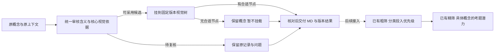

# 概念清洗与视觉分类 Pipeline：收敛版 v0.2

日期：2026-09-30。状态：**讨论提案，尚未实现、未运行新的模型试点。** 工程实现遵循 [PIPELINE_SPEC](../PIPELINE_SPEC.md)。本稿替代 [v0.1](PIPELINE_PROPOSAL_v0.1.md) 的阶段划分与语义分流建议；真实数据依据仍见 [案例报告](11-真实数据与案例验证.md)。

**当前讨论入口为 [v0.3](PIPELINE_PROPOSAL_v0.3.md)。** 对照完整出题 prompt 后，新版不再默认串联粗筛、精筛，而建议共享概念身份、核心内容与任务可行性审定，分别服务视觉树和正式出题。本稿保留此前收敛过程。

这次收敛的原因：v0.1 的“规则处理明确形式、模型处理难例”和“结构化规则放行部分项目”没有可验证的分流边界。规则误把难例当容易项，会绕过必要判断；不断增加例外又会使流程难以维护。第一版先取消这种优化，建立统一、可测的基线。

讨论补充：本流程服务视觉理解与生成，审核时同时考虑概念本身与核心视觉内容，避免演变成泛百科清洗。视觉依据在同一审核单元中取证和归纳；粗筛、精筛负责投入优先级与具体考题潜力，不新增一套重复的选题筛选。具体边界见第 1.1 节。

## 1. 主流程只保留三步

1. **审核概念与视觉依据。** 解释指代、核实依据、保留限定，提出规范名称；同时归纳有依据的核心视觉内容、表现条件与无法凭图确认的部分。概念结论仍只有“可采用候选”或“待复核”，视觉依据不足单独说明，不反推概念不存在。
2. **安排位置。** 对含义明确的可采用候选使用固定树；没有合适节点或尚不明确视觉载体就暂不挂载，不为每条输入现场造父类。成立的概念保留，精筛 hold 不使其身份或归类自动失效。
3. **核对交付。** 保存原名关系、证据、分类结果与未决清单，输出可读 Markdown。候选经过验收后才成为采用版本。

图片不进入这三步。现有 preparation 承担图片相关性与身份审核；本流程保留原名、规范身份和定义版本供其后续接入。已核对的能力与 16 项离线测试见 [v0.1 第 8 节](PIPELINE_PROPOSAL_v0.1.md#8-preparation-核对图片审核可复用本期只交接概念)。

### 1.1 概念本身与视觉用途共同约束审核

不能只问“它存在吗”，还要问“它的重要内容有哪些能通过图像表现和判断”。这里的视觉内容包括外形、部件、结构、作用关系、过程和图式，不局限于普通照片中的外观。

| 位置 | 负责回答什么 | 不承担什么 |
| --- | --- | --- |
| 本流程的统一审核 | 这个概念指什么；有哪些有依据的核心视觉内容；成立条件、合法变化和不可观察的限制是什么 | 不为每条写百科，不承诺有视觉内容就适合出题 |
| 已有粗筛 | 按分类与代表样例判断后续筛选投入的 high / medium / low | 不认证类内每个概念成立，也不宣布整类通过 |
| 已有精筛 | 对具体概念判断是否已有自然、值得测、事实可靠且能判分的方向，给 keep / hold | 不把 hold 解释为概念虚假，也不把预期区分潜力当实测模型差距 |

本期每条结果增加一段简短的、绑定证据的“核心视觉依据”，回答三个问题：**核心内容是什么；需要什么条件或表现形式才能观察；哪些限定或身份仍不能由图像确认。** 没有依据的部分明确留空或记缺口，不为了填满字段强造一个考点。

例如，“剪刀”可从器具定义进一步整理刀刃、转轴及剪切时的作用关系；是否能据此构成有区分潜力的任务留给精筛。“普通翠鸟雄鸟”需保留主体物种和雄性限定，再核查哪些视觉依据能支持这些限定；只有普通鸟类外形不能替代完整目标。“天牛”作为科级概念可以成立，但共有特征与某一成员的特征需要区分，不因其未到种就一律排除。

事实成立性与任务价值分别保存：可画、冷门或具体到种都不能补偿身份缺证据；成立且可见也不自动等于值得考。即使暂时没有可靠视觉方向，原记录和已核实含义也继续保留。虚构角色或抽象关系同样按自身范围检查，不能用“是否现实物种”或“能否拍成照片”一刀切。

此次核对依据是 [粗筛 prompt](../benchmark/t2i/coarse_screening/prompts/tasks.yaml)、[精筛 prompt](../benchmark/t2i/fine_screening/prompts/tasks.yaml) 与 [批量精筛 prompt](../benchmark/t2i/fine_screening/prompts/tasks_batch.yaml)。现有精筛强调核心内容、区分潜力、避免外围生成负担、可靠判据和自然范围，并要求具体任务能在不泄露核心答案的条件下成立。上游据此聚焦取证，但不复制整套精筛再作一次 keep / hold。

接入仍需实现：当前 [精筛输入构造](../benchmark/t2i/fine_screening/t2i_fine_screening_pipeline.py) 主要投影 `name/taxonomy`，可选参考来自文章或已发布图片描述；不会自动读取拟议的规范定义与视觉依据。以后应显式交付已核事实、条件和证据，不把上游“值得出题”的评价当作精筛的事实依据。现有流程与历史结果本轮未改。

## 2. 原 P1/P2 怎么办：合成一个固定审核单元

每条合法输入都走相同的逻辑调用顺序，不判断“简单就免模型”“熟悉就免取证”：

| 顺序 | 谁做 | 固定职责 |
| --- | --- | --- |
| A. 提出待核解释 | 模型 | 读取原名及必要上下文，提出对象、限定、可能义项及其核心视觉内容的待核断言和检索请求；此时不能宣布通过 |
| B. 取回证据 | 代码与检索工具 | 在统一预算内取回身份/定义及核心视觉断言的依据，保存实际正文/数据库响应、来源和失败状态；原名检索始终保留，不只查模型猜的学名或型号 |
| C. 根据证据审定 | 模型 | 判断对应关系、定义及限定是否有支持，给出可采用候选或待复核；同时归纳已支持的核心视觉内容、适用条件和缺口，各自引用证据，不在此作 benchmark keep / hold |

原路径与旧别名始终标为未审上下文，不能把旧树、候选解释和检索命中相互印证后就当外部依据。C 可以推翻 A，不要求维护先前猜测。C 读取了 A，因此不是独立质量验收。

**第一版固定到此结束。** 检索次数、文档长度及模型输入/输出上限在试点配置中预先设定；本轮不根据“难不难”自动追加搜索、换模型或循环自修。正常取证后身份/定义仍缺充分支持就待复核；身份明确但视觉依据不足时，分别保留身份结论与视觉缺口。以后补到新材料，可以明确开启下一轮，而不是让一次请求无限追查。

视觉依据沿用 A/B/C，不增加独立模型阶段，也不要求读取图片。检索与输出目标增加可能提高单条 token 用量；仍需试点测量，不能宣称“没有新增调用阶段就没有新增成本”。

查询失败、模型超时、输出格式错误另记“执行失败”，不伪装成证据不足或业务否决；全部原输入继续出现在交付对账中。保存过且实际输入相同的证据/请求可以精确复用，这是计算复用，不是语义免审。

## 3. 规则与模型的边界明确到职责

| 代码可以判断 | 必须留给语义审核 |
| --- | --- |
| 输入字段存在、类型正确，来源记录能定位 | 名称指什么，旧别名是否等价 |
| 查询是否执行、响应是否可读 | 查到的条目是否就是原概念 |
| 引用的证据 ID 是否真的存在 | 证据是否支持该断言、是否存在歧义或反证 |
| 数据库原文的等级字段是什么 | 该数据库对象能否对应原名，来源冲突怎样影响结论 |
| 输出枚举、主键、关系引用是否合法 | 能否改名、改名是否偷换范围、应该挂在哪个节点 |

代码不需要“发现规则不能处理再交模型”，因为语义决定从一开始就全部交给模型。格式合法、API 命中、字符串相等、旧路径一致都没有语义放行权。

P2 也不设置“普通概念走规则、专业概念再查证”的分流。生物库、词典、制造商页面是不同证据来源，最终都回到同一个 C 步判断。工具能执行查询不代表工具替我们证明了名称对应；学名命中尤其不能代替原中文/英文名称到该学名的桥接证据。

## 4. 剩下的语义边界不能假装消失

“证据足够吗、概念明确吗”仍需判断，无法靠缩减步骤变成纯规则。建议 C 使用一个共同门槛：原概念的指代与范围可以明确说明；有实际证据支持其关键身份/定义；有意义的限定得到保留；没有影响当前决定的未解决歧义、反证或来源冲突。缺一项就说明缺什么，进入待复核。

不同对象允许不同形式的支持：通用器具可用可靠定义，物种身份需要名称对应和分类依据，带性别的概念核实其主体与限定含义，不要求在这里找一张雄性照片。这里核实的是概念的含义，不要求全部概念都是具体物种或唯一实例，也不承诺组合描述必须有同名百科条目。

第一版不给模型自动删行、物理合并、拆成多个正式概念的权限。它可以提出这些建议，原记录始终保留；规范名作为展示候选，旧名继续作为兼容关联键。因此即使判断出错，也能检查和修订，不会直接丢掉旧来源与图片关系。

若试点中某类对象持续无法按这一门槛达成稳定判断，先保留该类为未决并集中讨论纳入标准；不临时给每条概念加一套例外。

## 5. 用已查过的真实案例检查出口

以下是基于已有研究的设计回放，不是新协议的模型成绩：

| 实际概念 | 统一流程应该怎样处理 |
| --- | --- |
| 天牛 | 名称桥接和科级依据支持宽类群；允许科级概念成立，不强迫变成某一个种 |
| Java Temple Bird | 候选学名可以查到，但原英文名的对应证据仍不足；待复核，不因 API 成功放行 |
| 薄荷 | 原名、别名与上下文混有不同指向，部分候选分类来源还存在分歧；保留原记录与问题，不挑一个学名强行统一 |
| 雄鸟 | 通用“雄性鸟类”可以有明确含义，但不足以恢复某个具体物种的原意；不沿 60 条旧路径补造 60 个物种概念 |
| Axe木棒 | 外部品牌资料和棒球语境支持一个规范名候选；仍需审查是否保留原意，记录原名关系；不据此宣布旧图片已匹配 |

这些情况都使用同一处理单元和少量出口，无需为“科级词、少见英文名、多路径、品牌词”各建一条 pipeline。

## 6. 树也先限制变化方式

第一次先用已明确的多样性样本提出一棵有节点定义与边界的树，经审阅冻结 T0；旧树只提供待查线索。之后模型只在固定树的候选节点与“无合适节点”之间选择。

新增输入先挂 T0；遇到无法容纳的概念保留待挂载。需要调整时，由一次明确的批次修树提出变更、核对受影响概念，再发布 T1。第一版不设自动扩树、自动拆并节点、达到某数量就强制修树等规则，也不要求待定项全部消失才可交付本轮清单。

## 7. 怎样证明它可用，再考虑省 token

先把这套统一协议作为基线，在开发样本上收敛说明，再用没有参与调规则的样本独立核对。至少分别检查：含义是否理解正确、证据是否支持结论、规范名是否改变范围、视觉内容是否属于概念核心且保留限定、观察条件与缺口是否如实、分类位置是否正确、多少项目待复核。既有案例用于找漏洞，不能充当无偏的全库准确率。与粗筛/精筛接入后，再单独评估是否改善选题质量，不拿概念核验通过率替代它。

基线每个新输入是两次概念语义调用和一次有上限的取证批次；可采用候选另有一次固定树挂载调用。先测真实请求长度、检索用量、失败与待复核比例，再估算约 38.5 万条的总费用。目前没有这套协议的生产账单，不承诺费用或吞吐。

暂不引入弱强模型分流、语义规则免审、自动多轮升级。以后若独立测评证明某一类机械处理与统一基线效果相当，再用它替代对应工作；不能先假设大多数概念很简单、据此跳过核验。

本版优先要验证的是一个问题：**相同的输入与证据契约，能否稳定地产生正确、可追溯的概念决定，并把不确定情况留在可检查的清单中？** 全量接入、成本优化和更复杂的自动修树建立在这个结果之上。
