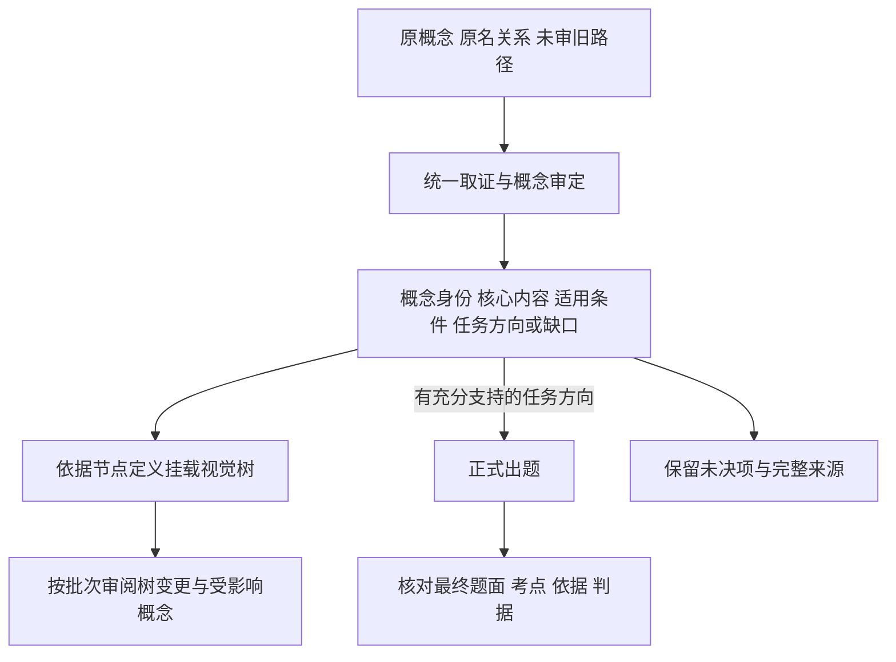

# 概念审定与视觉树：以出题原则为基础的方案 v0.3

日期：2026-09-30。状态：**待讨论提案；已对照现役 prompt 与输入/输出代码，未实施生产改造，未运行新的模型试点。** 工程实现遵循 [PIPELINE_SPEC](../PIPELINE_SPEC.md)。本稿替代 [v0.2](PIPELINE_PROPOSAL_v0.2.md) 中继续串联粗筛、精筛的建议；名称保全、统一语义审核、固定树版本与暂不处理图片的约束延续。

本稿的原则已展开为 [执行设计 v0.4](PIPELINE_DESIGN_v0.4.md)：明确两条业务 pipeline、五个 prompt 的输入输出与主指令，以及初建、增量和修树的执行顺序。实现讨论以 v0.4 为入口。

## 1. 这次真正需要统一的是什么

建议以现有出题 prompt 对概念核心内容的定义为基础，补足概念身份、知识依据与分类核验，形成一份可复用的**概念审定记录**。视觉树和正式出题都使用这份记录。

粗筛不列为新方案的必经环节；精筛中的概念理解、核心内容与选题潜力判断并入这次审定，不再另串一次相同判断。正式出题仍检查具体题面的成立性。此处讨论的是未来职责整合，不删除或停用现有 pipeline，不改历史结果。

这仍然对应两个核心工作：审定概念、维护视觉树。图中的正式出题是消费者，不要求先出一道完整题才能保存成立的概念。树挂载未定也不等于对象身份未定；只要任务所需身份与知识已经明确，不能因为导航位置未定便推断题目必然无法成立。

## 2. 实际出题 prompt 已经有什么，缺什么

核对对象为 [T2I V2 prompt](../benchmark/t2i/v2/prompts/tasks.yaml) `t2i-v2-independent-materials-6`、[README](../benchmark/t2i/v2/README.md)、[实际输入与响应校验](../benchmark/t2i/v2/operators/authoring.py)，并对照 [精筛单概念协议](../benchmark/t2i/fine_screening/prompts/tasks.yaml) 与 [批协议](../benchmark/t2i/fine_screening/prompts/tasks_batch.yaml)。

| 已有内容 | 可以直接继承的原则 | 需要补足的部分 |
| --- | --- | --- |
| 输入段处理完整 taxonomy 和歧义，分类不是事实证明 | 原路径仅为线索，不擅自选一个方便出题的义项 | 逐条保存含义、规范名、证据与未决原因；不能只在无题原因中留下身份问题 |
| 第三节用六个方面发现概念核心内容 | 特征与结构、属性与状态、功能与机制、过程与变化、关系与组织、规则与约定 | 形成有依据且可复用的核心断言；六方面按需选择，不要求每个概念填六栏 |
| 五条质量门槛约束核心联系、区分潜力、生成负担、可靠判据、自然范围 | 不能只因为存在、可画、冷门或具体到种就值得出题 | 在概念审定中留下一个站得住的任务方向或明确缺口，承接原精筛职责 |
| 最终题目联合检查知识可靠、任务需要、图像可判 | 条件、事实与视觉判据必须对应同一任务 | 概念层面先用简短任务例子检查可行性；具体题面成稿后仍需重新核对 |
| 输出只有题目及 point/basis/criterion，或空题原因 | 保留具体依据和可观察边界 | 增加独立于题目的概念记录及分类决定；无题不丢概念，题目成功不自动认证分类 |

因此，“原出题完全没有考虑身份”不准确；它已经做局部的消歧与范围检查。但它没有承担全库概念核验、改名关系维护或树节点审定，其程序校验也明确只检查响应结构、不做语义审题。强 prompt 中写了规则，不代表已有结果已经满足全部规则。

还有一个真实的接口缺口：当前 V2 主要接收 `concept / taxonomy / references`，从精筛来源选样时只带名称和路径，明确不传精筛理由与候选方向。新方案若要复用概念审定，必须显式接入审定记录；不能只新增一张表就宣称出题已经使用了它。

## 3. 一份审定记录要让人看懂四件事

| 内容 | 要交付什么 |
| --- | --- |
| **对象是什么** | 原记录/原名、规范名候选、明确义项、对象类型和范围、必要限定、身份依据。生物分类等级按证据记录；不知道就保留未知 |
| **核心内容是什么** | 与当前概念直接相关、实际有支持的关键事实，以及适用条件和合法变化；说明为何属于当前对象，不写泛百科，也不要求特征独有 |
| **怎样通过图像考察** | 一个简短任务方向：要呈现什么，在什么条件下观察，何种看似合理的表现会违反核心内容，哪些变化仍合法；不足时记录障碍 |
| **怎样归类** | 对照固定节点定义得到主位置或待挂载结论，说明主体与父类关系；保留原路径与修改理由。没有可用树时先积累已审概念，用于首版树设计 |

它们是同一份结果的几个部分，不是四轮独立筛选。身份、出题潜力和挂载状态分别记录，不能只用一个 keep / hold 压扁。例如“概念成立、暂无可靠任务方向、可以归类”是合法结果。

从 v0.2 继承统一的“提出待核解释 → 有界取证 → 依据证据审定”执行方式；代码只检查格式、来源、引用和范围完整性，不增加“容易项规则免审”的分流。树挂载使用固定节点及其边界，不能让审定模型逐条改整棵树。业务合并不等于强制将检索、语义判断和树修订塞进一次无上限模型调用。

## 4. 核心断言、可观察表现和一道题要连起来

只写“结构丰富、视觉特征鲜明”太空泛；只列“形状、颜色、产地”也不能说明核心。每条采用的内容都要能沿下面的关系解释：

**给定概念及范围 → 关键事实与依据 → 适用条件 → 图像中的可观察表现 → 正确、实质错误与合法变化。**

原精筛的工作可以在这里完成：为一个自然方向写一个简短任务例子，用它检查这条关系能否成立。无需生成完整题面、多个变体或完整评分表，也不要求证明所有可能的方向都不存在。当前方向仍有关键缺口，就保存已有知识并暂缓选题。

例子来自现有出题 prompt：对原概念“剪刀”，选择“普通手动剪刀正在剪纸”的任务范围，可以检查剪刀与纸张的作用关系和已剪开部分的衔接。这样的任务比“剪刀有结构和功能”更能暴露知识与可观察性缺口。

但选用了“普通手动剪刀”这个任务范围，**不意味着可以把主表中的“剪刀”自动改名或缩小为“普通手动剪刀”**。任务条件属于该任务；通用概念和子类型的关系必须保留。也不能因为剪纸需要纸，就把剪刀归到纸制品下。

同样，核实某个种存在，不代表已找到能从图像确认该种与性别的依据；确认某种结构关系为真，也不代表任何题目都必须画出它。证据不足与表现错误不能混为一谈。

上述是沿用已有 prompt 的方法示例，没有新增专业事实核验或模型质量成绩。

## 5. “分类成立”需要补两层检查

**概念与节点的关系是否成立。** 用已明确的主体、范围与节点纳入条件判断，而不是看词语相似或能否一起出现在画面里。“大提琴演奏者”的主体是人物角色，大提琴是相关器物；演奏关系可以成为核心内容，但不能把该人物概念直接当作乐器。原数据把“剪刀”挂入不同使用环境，也需要区分工具身份与场景关联。

**节点本身的划分是否合理。** 节点要有稳定含义、纳入/排除条件和相邻反例；父子关系清楚，同层划分原则尽量一致。不能因为一批概念能塞进某个名字，就宣布类别成立。首版树从已审定的多样性概念设计；已有树按明确批次修订，并核对受影响旧成员与相邻类别。

视觉导航树不存在唯一外部权威答案，成立性要结合已约定的组织原则检查；生物分类身份则可以依指定分类来源核验。节点层数不代表科、属、种，二者分别保存。

出题的六个方面也不能直接变成六个互斥主分类。剪刀同时有结构、功能和作用关系；这六个方面帮助理解它，主路径仍按工具身份安排。否则只是把旧树混杂换成另一种混杂。

## 6. 用真实数据问题检查这套共同逻辑

以下引用 [真实案例报告](11-真实数据与案例验证.md)，是设计回放，不是新协议跑出的通过率。

| 原概念及已知问题 | 新方案应产生什么决定 |
| --- | --- |
| 天牛：已有名称桥接与科级资料 | 宽类群可以成立；只采用类群范围支持的核心内容，不把某一种的特点升为全科标准；不因没到种排除 |
| 普通翠鸟雄鸟：主体种与雄性限定分开 | 核实完整范围，视觉依据也必须保留限定；若暂时只支持普通鸟类表现，不能靠放宽题目掩盖缺口 |
| Java Temple Bird：候选学名命中，但名称桥接未完成 | 保留候选与缺证据原因；不能先借候选物种知识设计好题，再反过来宣布原名成立 |
| 薄荷：多义、混杂别名与分类来源分歧 | 原输入先保留未决，不能为了挑容易画的叶片或加工品而暗选义项；明确范围后再讨论核心内容 |
| 大提琴演奏者：旧路径含人物与声音 | 先明确人物角色；研究人物与乐器的核心关系，按人物主体安排主路径，不因考点涉及乐器就改成乐器概念 |
| 剪刀：多条环境/用途路径 | 以工具身份归类，使用环境另存关系；任务可以选择自然的子类型与条件，但不能覆盖通用概念定义 |

## 7. 怎样避免又扩成一条长流程

第一版建议只实施共同审定与视觉树维护。概念成立后没有任务方向，继续留在概念库；有方向的交正式出题。粗筛从新主线移除，独立精筛先由共同审定中的任务可行性判断承接；是否确实能取代现有精筛，需要试点比较，不能凭规则相似宣布效果相当。

正式出题只围绕最终题目继续完成不可省略的检查：题面是否交代必要条件、是否泄露待考答案、判据是否适用于这道题、合理画法能否观察核心内容。已审事实在内容和版本相同时可复用，不能让作者把上游判断当绝对正确；发现新冲突进入问题队列，不由一次出题悄悄重写主数据。

共同审定的任务方向传给作者后，正式出题属于有上游依据的设计，不再声称作者独立发现方向。用于质量验收的审阅者应独立核对原概念、证据及实际题目，不能只检查作者是否赞同上游。检索与模型预算继续有界，事实待核、任务暂缓、挂载未定、执行失败分别统计。

下一步验证应比较同一批固定样本上的“现有精筛＋出题”与“共同审定＋出题”：采用相同出题预算与评价标准，核对身份/范围错误、核心内容与判据质量、分类边界、有效题目产出、待定数量及真实用量。现有历史结果仅在输入与协议相符时作可比参照；开发案例与独立评价样本分开。当前无新增实测，不估计节省比例，也不宣布已可以全量替代。

原名关系和定义版本继续保全，已有图片及审核不自动改写。图片相关性、资产可读性和发布仍归 preparation；本期不读取图片、不运行图片审核。名称映射、固定版本、失败保留与工程入口沿用此前约束，不再为这些横向要求各增加一轮模型决策。
